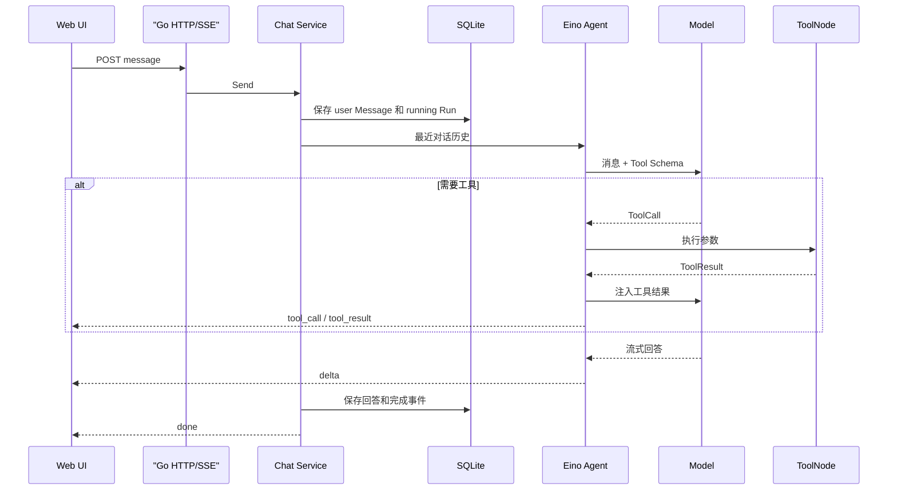

# Zora

用 Go 和 Eino 构建的可观察 Agent 项目。

Zora 的目标不是只提供一个聊天页面，而是逐步实现 Agent 产品的核心工程能力：工具调用、执行审计、向量知识库、长期记忆、多 Agent、人工审批和办公连接器。

当前版本：**V0.1 Agent Core**。

## 当前能力

| 能力 | 状态 | 说明 |
|---|---|---|
| 流式对话 | 已完成 | SSE 增量回复、停止生成、超时取消 |
| ReAct Agent | 已完成 | Eino ChatModelAgent、工具循环、最大迭代 |
| 模型接入 | 已完成 | 本地 Mock、OpenAI-compatible、通义千问 |
| 工具系统 | 已完成 | 时间、计算器、项目状态三个只读工具 |
| 对话管理 | 已完成 | 创建、列表、自动标题、重命名、删除 |
| 持久化 | 已完成 | SQLite 保存 Conversation、Message、AgentRun |
| 执行审计 | 已完成 | ToolCall、ToolResult、完成、失败和取消事件 |
| Web UI | 已完成 | 内嵌响应式页面，不需要 Node.js 部署 |
| 向量知识库 | V0.2 | PostgreSQL + pgvector、混合检索、引用和评估 |
| 长期记忆 | V0.3 | Semantic/Episodic Memory、合并、过期和用户控制 |
| 多 Agent | V0.4 | Supervisor、专业 Agent、预算和对照评估 |
| 办公助手 | V0.5 | MCP、文件/邮件/日历、审批和审计 |

规划中的能力不会以空接口冒充“已完成”。详细进度见 [Roadmap](docs/roadmap.md)。

## 项目特点

- **Go 原生 Agent Runtime**：核心服务、并发、流式传输和持久化均使用 Go。
- **框架复用、业务自研**：Eino 负责 ReAct、Tool 和模型事件；会话、Run、审计及后续 RAG/Memory 机制由项目控制。
- **Mock 不绕过 Agent**：无密钥模式仍经过 Eino ChatModelAgent 和 ToolNode，可稳定测试完整链路。
- **用户历史与内部轨迹分离**：Message 用于对话上下文，RunEvent 用于调试和审计。
- **明确的终态语义**：每次请求最终进入 completed、failed 或 cancelled。
- **工具安全优先**：显式 allowlist；计算器不使用 eval、Shell 或代码执行。
- **单二进制运行**：SQLite 和前端资源均包含在本地部署方案中。
- **为面试深度设计**：可以讨论框架隔离、流式 ToolCall、并发、取消、RAG 评估、Memory 生命周期和 Multi-Agent 收益。

## 快速开始

### 环境要求

- Go 1.26 或更高版本
- 可选：Docker
- 接真实模型时需要相应 API Key

### 使用本地 Mock 模型

```bash
make run
```

打开 [http://localhost:8080](http://localhost:8080)。默认不需要 API Key。

可以尝试：

```text
现在上海几点？
帮我计算 (128 + 72) * 3.5
介绍一下这个项目现在有哪些功能
```

数据默认保存到：

```text
./data/zora.db
```

## 接入通义千问

Zora 使用 OpenAI-compatible 模型协议：

```bash
ZORA_MODEL_PROVIDER=openai \
ZORA_MODEL=qwen-plus \
ZORA_API_KEY=你的_DashScope_API_Key \
ZORA_BASE_URL=https://dashscope.aliyuncs.com/compatible-mode/v1 \
make run
```

也可以替换 `ZORA_BASE_URL` 和 `ZORA_MODEL`，连接其他兼容 Tool Calling 的模型。

注意：

- 不要将 API Key 写入源码或提交到 Git；
- 所选模型需要支持 Tool Calling；
- 自定义 System Prompt 中如果包含 Eino 模板占位符语法，需要正确转义花括号。

## 配置

| 环境变量 | 默认值 | 说明 |
|---|---|---|
| `ZORA_ADDR` | `:8080` | HTTP 监听地址 |
| `ZORA_DATA_DIR` | `./data` | SQLite 数据目录 |
| `ZORA_MODEL_PROVIDER` | `mock` | `mock` 或 `openai` |
| `ZORA_MODEL` | `qwen-plus` | 真实模型名称 |
| `ZORA_API_KEY` | 空 | openai 模式必填 |
| `ZORA_BASE_URL` | 空 | OpenAI-compatible API 地址 |
| `ZORA_SYSTEM_PROMPT` | 内置中文指令 | Agent 系统指令 |
| `ZORA_REQUEST_TIMEOUT` | `90s` | 单次 Agent 请求超时 |
| `ZORA_MAX_ITERATIONS` | `8` | ReAct 最大迭代，范围 1–50 |

配置模板见 [.env.example](.env.example)。项目不会自动读取 `.env`；生产环境应通过容器、Secret 或部署平台注入环境变量。

## Docker

构建并运行本地 Mock 模式：

```bash
docker build -t zora:dev .
docker run --rm \
  -p 8080:8080 \
  -v zora-data:/app/data \
  zora:dev
```

运行通义千问：

```bash
docker run --rm \
  -p 8080:8080 \
  -v zora-data:/app/data \
  -e ZORA_MODEL_PROVIDER=openai \
  -e ZORA_MODEL=qwen-plus \
  -e ZORA_API_KEY=你的_DashScope_API_Key \
  -e ZORA_BASE_URL=https://dashscope.aliyuncs.com/compatible-mode/v1 \
  zora:dev
```

## 核心执行链



## API 概览

| Method | Path | 作用 |
|---|---|---|
| `GET` | `/api/health` | 健康检查 |
| `GET` | `/api/info` | 版本、模型和能力 |
| `GET` | `/api/conversations` | 对话列表 |
| `POST` | `/api/conversations` | 创建对话 |
| `PATCH` | `/api/conversations/{id}` | 重命名对话 |
| `DELETE` | `/api/conversations/{id}` | 删除对话及关联数据 |
| `GET` | `/api/conversations/{id}/messages` | 查询消息历史 |
| `POST` | `/api/conversations/{id}/messages` | 发送消息并接收 SSE |
| `GET` | `/api/runs/{id}/events` | 查询持久执行事件 |

SSE 事件：`start`、`tool_call`、`tool_result`、`delta`、`done`、`error`。

完整请求、响应和事件契约见 [项目技术文档](docs/technical-design.md)。

## 项目结构

```text
cmd/zora/                  程序入口、依赖组装和优雅关闭
internal/config/           环境配置与启动校验
internal/domain/           Conversation、Message、Run、Event
internal/id/               随机业务 ID
internal/agentruntime/     Eino Runtime、模型适配和事件转换
internal/agenttools/       只读工具和安全计算器
internal/chat/             会话用例、并发控制和 Run 生命周期
internal/store/            可替换的持久化接口
internal/store/sqlite/     V0.1 SQLite 实现
internal/httpapi/          REST、SSE 和内嵌 Web UI
docs/                      分析、技术设计、架构和 Roadmap
```

## 开发与验证

```bash
# 单元和集成测试
make test

# 静态分析
make vet

# 格式化、测试和静态分析
make check

# 并发竞态检测
go test -race ./internal/...

# 验证无 CGO 构建
CGO_ENABLED=0 go build ./cmd/zora
```

当前测试覆盖：

- 计算器优先级、括号、一元运算、非法表达式和除零；
- Mock 模型通过 Eino 完成 ToolCall → ToolResult → Answer；
- SQLite Conversation/Message 生命周期和级联删除；
- HTTP 创建对话和 SSE 工具调用链；
- 根页面、静态资源和 SPA 路由回退。

## 文档导航

- [项目分析文档](docs/project-analysis.md)：业务目标、业务模型、数据模型、技术架构、项目亮点和风险。
- [项目技术文档](docs/technical-design.md)：核心流程、包设计、配置、接口、SSE、并发、安全、测试和扩展方案。
- [架构说明](docs/architecture.md)：当前边界及 RAG、Memory、Multi-Agent 接入点的简版说明。
- [Roadmap](docs/roadmap.md)：各版本任务、状态和验收条件。

## 常见问题

### 为什么默认使用 Mock？

为了让项目在没有 API Key 时仍能运行和测试。Mock 实现的是 Eino 模型接口，工具调用仍经过真实 Agent 链路。

### 为什么 V0.1 使用 SQLite？

它能提供零运维体验，适合个人开发和项目演示。V0.2 知识库会增加 PostgreSQL + pgvector，并保留相同 Store 业务语义。

### 为什么不立即实现多 Agent？

单 Agent 的工具链、评估和可观察性是多 Agent 的基础。项目会在能够量化多 Agent 的质量收益、成本和延迟后再保留该方案。

### 为什么工具结果没有全部写进下一轮历史？

工具内部轨迹保存在 RunEvent，主 Message 只保存用户可见历史，防止上下文快速膨胀。未来会通过摘要和长期记忆补充早期信息。

### 如何清空本地数据？

停止服务后删除 `ZORA_DATA_DIR` 中的 `zora.db`。该操作不可恢复，请先备份需要保留的对话。

## Roadmap

- V0.1：Agent Core——已完成
- V0.2：向量知识库与 RAG——下一里程碑
- V0.3：长期记忆
- V0.4：多 Agent
- V0.5：MCP 办公助手

详见 [docs/roadmap.md](docs/roadmap.md)。

## License

本项目暂未指定开源许可证。公开发布前应根据使用和分发目标选择许可证。
