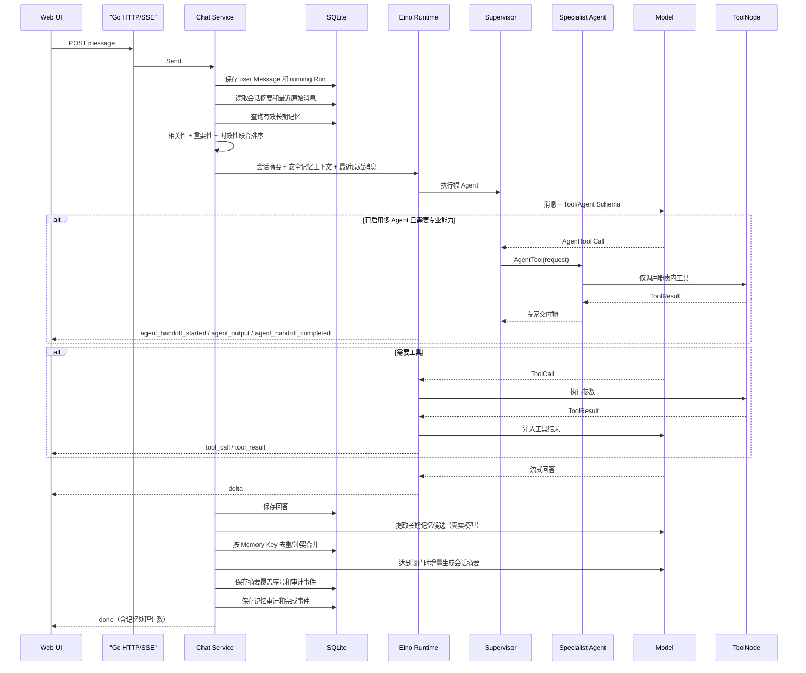

# Zora

用 Go 和 Eino 构建的可观察 Agent 项目。

Zora 的目标不是只提供一个聊天页面，而是逐步实现 Agent 产品的核心工程能力：工具调用、执行审计、向量知识库、长期记忆、多 Agent、人工审批和办公连接器。

当前版本：**V0.6 Agent 可靠性与可观测性**。V0.1–V0.4 主链路已完成，V0.5 已交付 MCP 办公连接器、可恢复 Operation、Microsoft OAuth/Secret 和读写身份隔离；真实 Microsoft 租户验收因暂不申请租户而延期，不阻塞主线。V0.6 新增模型调用与真实 Token Usage 审计、首字延迟、工具耗时、Run 聚合 API 和 Web 运行监控。

## 当前能力

| 能力 | 状态 | 说明 |
|---|---|---|
| 流式对话 | 已完成 | SSE 增量回复、停止生成、超时取消 |
| ReAct Agent | 已完成 | Eino ChatModelAgent、工具循环、最大迭代 |
| 模型接入 | 已完成 | 本地 Mock、OpenAI-compatible、通义千问 |
| 多模型选择 | 已完成 | 环境变量安全注册多个模型，Web 按消息切换，Run 记录实际模型；密钥不进入浏览器 |
| 工具系统 | 已完成 | 三个内置只读工具、知识库工具和两个内部草稿工具；MCP 工具通过 Server 名称空间与本地白名单动态追加 |
| 对话管理 | 已完成 | 创建、列表、自动标题、重命名、删除 |
| 持久化 | 已完成 | SQLite 或 PostgreSQL 保存 Conversation、Message、AgentRun 和 RunEvent |
| 执行审计 | 已完成 | ToolCall、ToolResult、完成、失败和取消事件 |
| Agent 运行指标 | 已完成 | 模型调用次数、Provider 真实 Token Usage、TTFT、工具/交接耗时和整轮耗时；缺失 Usage 时明确标注而不估算 |
| 运行监控面板 | 已完成 | 最近 50 次 Run 的状态、模型、延迟、Token、工具和多 Agent 交接统计 |
| Web UI | 已完成 | 内嵌响应式页面，不需要 Node.js 部署 |
| 知识库 MVP | 已完成 | TXT/Markdown/PDF 文本层、哈希去重、版本链、递归重叠分块、Embedding、向量 + BM25/RRF、引用 |
| RAG 检索与答案评测 | 已完成 | 对比三路召回，并通过真实 Agent 链路评估事实覆盖、有效引用覆盖和引用忠实度 |
| PostgreSQL 向量库 | 已实现 | pgx 连接池、幂等迁移、pgvector HNSW、PostgreSQL FTS、RRF 候选融合 |
| 知识库权限与版本 | 已完成 | 服务端可信主体、private/public 过滤、最新版检索、删除最新版自动回退；尚无完整登录/租户系统 |
| 长期记忆底座 | 已完成 | Semantic/Episodic Schema、重要性、来源、过期时间、SQLite/PostgreSQL 和用户 CRUD |
| 自动记忆写入 | 已完成 | 真实模型结构化提取、本地规则提取、Memory Key 去重/冲突合并、人工修正保护和 Run 审计 |
| 记忆召回与注入 | 已完成 | 词项相关性 + 重要性 + 时效性联合评分、Top-K 安全上下文和 Run 审计 |
| 会话摘要与上下文压缩 | 已完成 | 阈值触发、增量摘要、最近消息窗口、安全上下文注入、双数据库持久化和审计 |
| 记忆 A/B 评估 | 已完成 | 隔离数据库、完整 Chat 链路 Control/Treatment、召回率、错误注入、事实覆盖、延迟和质量门禁 |
| 多 Agent 路由与协作 | 已完成 | 可选 Supervisor、Research/Document/Writer Agent、上下文隔离、串行依赖与并行独立任务 |
| 多 Agent 生产治理 | 已完成 | 按根 Run 隔离的交接/并行预算、专家超时与有限重试、取消传播、父子 Run 和人工审批 |
| 单/多 Agent 对照评测 | 已完成 | 7 题真实 Chat/RunEvent 链路，对比答案质量、调用次数代理和延迟比例 |
| MCP Client | 已完成 | 官方 Go SDK v1.7.0、stdio 子进程、工具发现、Eino 适配、超时/输出上限与生命周期关闭 |
| 文件办公连接器 | 已完成 | 目录沙箱、只读列表/UTF-8 读取、隐藏路径/越界/符号链接逃逸防护 |
| Microsoft 邮件/日历连接器 | 已完成 | Graph REST + MCP，支持邮件搜索/详情和日历窗口查询/详情；只返回摘要和元数据 |
| 邮件/日程草稿预览 | 已完成 | 结构化校验、SQLite/PostgreSQL 持久化、Run 来源追踪、重试幂等、REST API 和 Web 草稿箱 |
| 草稿人工确认 | 已完成 | `draft → pending_confirmation → approved/rejected`、数据库 CAS、不可变迁移审计、REST 和 Web 一次性决策 |
| Office Operation 执行内核 | 已完成 | 每份 approved 草稿唯一任务、稳定幂等键、执行租约、失败重试、启动恢复、双审计、REST/Web 状态展示 |
| Microsoft Graph 写执行器 | 已实现、默认关闭 | 已批准邮件采用“远端草稿检查点 → 发送”，日程使用固定 transactionId；写工具不暴露给模型 |
| OAuth 与 Secret | 已完成 | client credentials `/.default`、Secret/Token 文件、缓存与提前刷新、401 单次重试和错误脱敏 |
| 真实租户上线准备 | 外部资源延期 | reader/writer 双服务主体和 Exchange Application RBAC Runbook 已完成；取得测试租户后再做在线验收 |

规划中的能力不会以空接口冒充“已完成”。详细进度见 [Roadmap](docs/roadmap.md)。

## 项目特点

- **Go 原生 Agent Runtime**：核心服务、并发、流式传输和持久化均使用 Go。
- **框架复用、业务自研**：Eino 负责 ReAct、Tool 和模型事件；会话、Run、审计及后续 RAG/Memory 机制由项目控制。
- **Mock 不绕过 Agent**：无密钥模式仍经过 Eino ChatModelAgent 和 ToolNode，可稳定测试完整链路。
- **RAG 召回可解释**：同时保留向量相似度、BM25 得分和 RRF 融合结果，每条证据可追溯到文档和字符区间。
- **知识版本与 ACL 进入检索层**：相同 owner + 文档名形成版本组，默认只召回最新版；private/public 在列表、版本读取和候选 SQL 中统一过滤，客户端不能伪造 owner。
- **检索效果可回归**：固定评测集在隔离数据库中重建语料，分别测量 vector、keyword 和 hybrid，避免算法升级只凭主观体验。
- **双存储后端**：SQLite 保留零依赖精确扫描；PostgreSQL 将向量和全文候选召回下推数据库，HTTP 与 Agent Tool 契约保持不变。
- **Embedding 可替换**：默认 Hash Embedding 零密钥运行；生产可切换 OpenAI-compatible Embedding。
- **用户历史与内部轨迹分离**：Message 用于对话上下文，RunEvent 用于调试和审计。
- **指标来自真实执行链路**：每次 Assistant 模型调用记录 `model_call_completed`；Token 只采用 Provider 返回值，首字和工具耗时从持久化事件重建，Mock 未上报时明确显示缺失。
- **长期记忆不是消息向量库**：Memory 拥有独立类型、稳定 Key、来源、重要性和过期时间；候选只在回答成功后提取，同 Key 冲突执行合并，人工修正不会被自动覆盖。
- **召回可解释、可关闭**：轻量词项相关性与重要性、时效性联合评分，并用最低主题相关性阻止弱词面重合被重要性抬高；RunEvent 只记录 ID 和分数组件。
- **记忆收益可回归**：固定数据集让同一问题分别通过关闭/开启召回的完整 Chat 链路，门禁预期召回、错误注入、事实覆盖增益和答案污染，而不是只评估检索函数。
- **长对话不会只靠截断**：较早消息增量压缩进 `conversation_summaries`，最近窗口保留原文；摘要读取或生成失败时自动退化为最近消息，不推翻正常回答。
- **多 Agent 不是角色 Prompt 展示**：Supervisor 通过 Eino AgentTool 调用研究、文档和写作专家；专家只收到结构化 request，底层工具按职责隔离，协作开始/输出/完成均进入 RunEvent。
- **专家路由与收益可回归**：固定 7 题覆盖单专家、串行依赖、并行任务、直接回答和硬负例；同题运行单 Agent Control 与多 Agent Treatment，门禁质量增益、调用次数代理和延迟比例。
- **多 Agent 有执行保险丝**：交接次数、并行度、专家超时和重试都按根 Run 隔离；专业 Agent 另存子 Run，失败和取消有明确终态。
- **高影响请求先审批**：审批记录持久化，SSE 在 `approval_required` 后等待 Web 决策，通过后恢复原 Run，拒绝或超时进入明确终态。
- **MCP 不是无边界插件系统**：仅连接配置中的 stdio Server；只有同时命中本地 `allowed_tools` 且声明 `readOnlyHint` 的工具才能注册，公开名称增加 Server 前缀。
- **连接器凭据与主进程隔离**：MCP 子进程默认不继承任何环境变量，只透传 `pass_env`；模型 Key、Embedding Key 和数据库 DSN 被配置层显式拒绝。
- **读写 OAuth 身份隔离**：普通 Agent 连接器与 OfficeExecutor 使用不同环境变量前缀、Entra 应用和 Secret；client secret 内容只由 Microsoft 子进程从文件读取，主进程只传路径。
- **外部办公内容按不可信数据处理**：邮件、日历和外部文件的正文不能改变系统规则，也不能触发其中嵌入的链接、权限请求或工具指令。
- **草稿不等于执行**：`preview_*` 工具只在 Zora 内部保存不可执行快照；同一 Run 的相同参数按内容哈希幂等复用，回答必须明确“尚未发送/创建”。
- **确认不等于执行**：草稿批准后还要显式创建 Operation 并点击执行；默认未配置写执行器，系统不会把 approved 或 pending 表述为已经发送。
- **外部执行可恢复且不假完成**：Operation 使用稳定幂等键、数据库租约和重试次数；邮件先创建 Graph 远端草稿并原子保存不可变 ID，检查点成功后才发送；日程使用稳定 transactionId。执行器必须返回可核验远端引用，否则任务只能进入 failed。
- **写工具不交给模型**：Graph 写工具只存在于专用 MCP 执行会话，普通 MCP Bridge 仍只接受 readOnly 工具；主 Agent 只能创建内部预览，不能自行发送邮件或创建日程。
- **明确的终态语义**：根 Run 最终进入 completed、failed、cancelled 或 rejected。
- **工具安全优先**：显式 allowlist；计算器不使用 eval、Shell 或代码执行。
- **单二进制运行**：SQLite 和前端资源均包含在本地部署方案中。
- **为面试深度设计**：可以讨论框架隔离、流式 ToolCall、并发、取消、RAG 评估、Memory 生命周期和 Multi-Agent 收益。

## 快速开始

### 环境要求

- Go 1.26 或更高版本
- 可选：Docker
- 接真实模型时需要相应 API Key

### 使用本地 Mock 模型

```bash
make run
```

打开 [http://localhost:8088](http://localhost:8088)。默认不需要 API Key。

侧边栏“长期记忆”可维护 `semantic`（稳定事实/偏好）和 `episodic`（经历/事件）记忆，并设置重要性及可选过期时间。默认开启自动候选提取：本地 Mock 只识别明确的“记住”、个人资料和稳定偏好；真实模型使用严格中文 JSON Prompt 提取。自动记忆会关联来源会话/消息，同一 `memory_key` 的新值会合并，用户手动修改后自动流程不再覆盖。

可以用本地 Mock 验证：

```text
我的主要编程语言是 Go。
我的主要编程语言是 Java。
我以后希望你用中文回答。
```

前两句话最终只保留一个“主要编程语言”记忆，值更新为 Java。继续询问“我的主要编程语言是什么？”，系统会按相关性、重要性和时效性召回该记忆并注入模型上下文，本地 Mock 会确定性回答 Java。

默认每当未摘要历史达到 20 条消息时，Zora 会把较早部分增量合并为会话摘要，并保留最近 12 条原始消息。完整消息不会从数据库删除；可通过 `GET /api/conversations/{id}/summary` 查看当前摘要覆盖范围。本地 Mock 使用确定性规则便于测试，真实 Provider 使用同一 Chat Model 通过独立中文结构化 Prompt 生成摘要。

运行长期记忆 A/B 基准：

```bash
make eval-memory
```

命令在临时 SQLite 中写入 `evals/memory.json` 的固定记忆，同一问题交替运行关闭召回的 Control 和开启召回的 Treatment，并从真实 RunEvent 读取实际注入的 Memory ID。默认 5 题包含个人资料、交互偏好、项目经历，以及“Go 并发模型”这种相似主题硬负例；门禁未达标时命令返回非零状态。

### 启用多 Agent

多 Agent 会增加模型调用次数，因此默认关闭。通过环境变量显式启用：

```bash
ZORA_MULTI_AGENT_ENABLED=true make run
```

启用后，Supervisor 会把任务交给研究、文档或写作专家。复合办公任务可以先由文档专家检索证据，再交给写作专家整理：

```text
帮我计算 (128 + 72) * 3.5
帮我写一封会议延期通知
根据我上传的文档，写一份项目发布通知
```

Web 对话中会显示“协作：研究专家/文档专家/写作专家”轨迹。运行固定路由基准：

```bash
make eval-agents
```

独立任务可以并行交接，例如“同时计算 6*7，并写一条结果通知”；文档取证再写作仍保持串行。默认 `risky` 审批模式会在“发送给、发布到、删除、部署到”等高影响请求前显示审批卡片，批准后原 SSE 继续执行。

评测命令使用隔离 SQLite 和真实 `chat.Send → Eino AgentTool → RunEvent` 链路。默认 7 题基线路由准确率 1、意外专家调用率 0、答案完成率 1；单 Agent Control 质量 0.785714，多 Agent Treatment 质量 1，质量增益 0.214286，调用次数代理比 2。耗时比例随机器波动，报告会输出并按宽松上限门禁；真实模型仍应使用业务样本和真实 Token Usage 重新验证。

可以尝试：

```text
现在上海几点？
帮我计算 (128 + 72) * 3.5
介绍一下这个项目现在有哪些功能
```

### 启用 MCP 只读文件连接器

先构建随项目提供的文件 MCP Server：

```bash
make build-mcp-files
```

然后只授权一个专门的办公资料目录。示例中的路径必须替换为本机绝对路径：

```bash
ZORA_MCP_ENABLED=true \
ZORA_MCP_FILES_ROOT=/absolute/path/to/office-files \
ZORA_MCP_SERVERS_JSON='[{"name":"files","command":"./bin/zora-mcp-files","args":[],"allowed_tools":["list_files","read_text_file"],"pass_env":["PATH","TMPDIR","ZORA_MCP_FILES_ROOT"]}]' \
make run
```

本地 Mock 和真实模型都走同一个 MCP Client → stdio → MCP Server → Eino Tool 链路。可以询问：

```text
列出文件
读取文件 `项目周报.md`
读取文件 `docs/发布计划.md`
```

工具实际公开为 `mcp_files_list_files` 和 `mcp_files_read_text_file`，调用与结果继续记录为现有 `tool_call` / `tool_result` RunEvent。文件 Server 不跟随符号链接、拒绝绝对路径和 `..` 越界、隐藏路径、非 UTF-8 内容及超过 2 MiB 的文件。不要把用户主目录或包含密钥的源码目录作为授权根目录。

### 启用 Microsoft Graph 邮件/日历只读连接器

先构建连接器：

```bash
make build-mcp-microsoft
```

生产推荐使用 Microsoft Entra client credentials。连接器从 Secret 文件读取 client secret，以 `https://graph.microsoft.com/.default` 获取并缓存 access token，在到期前刷新；应用身份必须指定明确用户 ID。reader 应用只授予 `Mail.Read` 与 `Calendars.Read`，并使用 Exchange Application RBAC 收敛到专用邮箱。

```bash
ZORA_MCP_ENABLED=true \
ZORA_MCP_MICROSOFT_TENANT_ID='<tenant-id>' \
ZORA_MCP_MICROSOFT_CLIENT_ID='<reader-client-id>' \
ZORA_MCP_MICROSOFT_CLIENT_SECRET_FILE='/run/secrets/zora-reader-client-secret' \
ZORA_MCP_MICROSOFT_USER_ID='zora-test@example.com' \
ZORA_MCP_SERVERS_JSON='[{"name":"microsoft","command":"./bin/zora-mcp-microsoft","args":[],"allowed_tools":["search_emails","get_email","list_calendar_events","get_calendar_event"],"pass_env":["PATH","TMPDIR","ZORA_MCP_MICROSOFT_TENANT_ID","ZORA_MCP_MICROSOFT_CLIENT_ID","ZORA_MCP_MICROSOFT_CLIENT_SECRET_FILE","ZORA_MCP_MICROSOFT_USER_ID"]}]' \
make run
```

可以询问：

```text
帮我查最近邮件
搜索邮件“项目发布”
查看本周日程
我的会议安排是什么？
```

四个只读工具实际公开为 `mcp_microsoft_search_emails`、`mcp_microsoft_get_email`、`mcp_microsoft_list_calendar_events` 和 `mcp_microsoft_get_calendar_event`。默认邮件查询最多扫描最近 50 封并在本地按关键词过滤；默认日历窗口为未来 7 天，单次最长 93 天。邮件只返回正文摘要，不下载完整 HTML 和附件；所有外部内容都会附带不可信数据提示。只读子进程默认根本不注册写工具，MCP Bridge 仍会二次拒绝任何非只读声明。

### 创建和查看办公草稿

草稿能力默认启用，不需要 Microsoft Token。单 Agent 会直接调用草稿工具；启用多 Agent 后，Writer Agent 独占这两个工具。可以用本地 Mock 验证：

```text
起草邮件，收件人 dev@example.com，主题：发布通知；正文：项目将在周五发布。
创建日程，主题：发布评审；开始：2026-08-20T10:00:00+08:00；结束：2026-08-20T11:00:00+08:00；参与人 dev@example.com
```

邮件地址会被解析、去重并规范化；邮件主题最多 200 字符，正文最多 20,000 字符。日程开始/结束时间必须是带时区的 RFC3339，结束时间必须更晚，单次持续时间最多 31 天。每份草稿关联可信的 `conversation_id` 和 `source_run_id`，模型无法自行伪造；同一 Run 用相同参数重试时返回原草稿，不会重复创建。

侧边栏“办公草稿”展示全部状态。`draft` 可以删除或提交人工确认；`pending_confirmation` 只能被批准或拒绝一次。批准后需要点击“准备执行任务”，系统为该草稿创建唯一 Operation 和稳定幂等键；重复准备返回原任务。默认运行配置未接入真实 Graph 写执行器，因此页面只显示“任务已持久化、执行器未配置”，不会出现执行按钮，也不会产生外部副作用。

执行器接入后，Operation 按 `pending → executing → completed/failed` 迁移。领取任务时写入租约和重试次数；失败可复用原幂等键重试；进程启动会把过期 `executing` 恢复为 `failed`。执行器必须保证同一幂等键可安全重放，并返回非空远端引用，才能标记 completed。

### 显式启用 Microsoft Graph 写执行器

先执行 `make build-mcp-microsoft`。writer 使用独立 Entra 应用和 Secret，仅授予 `Mail.ReadWrite`、`Mail.Send` 和 `Calendars.ReadWrite`，再通过 Exchange Application RBAC 收敛到专用邮箱。完整管理员配置与负向验收见 [Microsoft Entra 部署 Runbook](docs/microsoft-entra-deployment.md)。

```bash
ZORA_OFFICE_EXECUTOR=microsoft_graph \
ZORA_OFFICE_EXECUTOR_COMMAND=./bin/zora-mcp-microsoft \
ZORA_OFFICE_MICROSOFT_TENANT_ID='<tenant-id>' \
ZORA_OFFICE_MICROSOFT_CLIENT_ID='<writer-client-id>' \
ZORA_OFFICE_MICROSOFT_CLIENT_SECRET_FILE='/run/secrets/zora-writer-client-secret' \
ZORA_OFFICE_MICROSOFT_USER_ID='zora-test@example.com' \
ZORA_OFFICE_MICROSOFT_WRITE_ENABLED=true \
make run
```

启用后，Web 执行按钮才会出现。邮件执行先调用 Graph 创建草稿，随后把不可变邮件 ID 写入 `office_operations.external_reference` 和审计事件；只有该事务成功后才调用发送。发送失败或进程重启时复用同一远端草稿，并先核对 `isDraft`，避免重复发送。日程从 Operation 幂等键派生固定 UUID 作为 `transactionId`，重试时不创建第二个事件。默认 `disabled` 模式以及本地 Mock 都不会伪造外部成功。

点击侧边栏的“知识库”可上传 UTF-8 编码的 `.txt` / `.md` / `.markdown`，或带文本层的 `.pdf` 文件（单文件最大 5 MiB，当前不含 OCR），并选择“仅自己”或“所有用户”。同一主体使用相同显示名再次上传会生成新版本；列表和问答只使用最新版，删除最新版后恢复上一版本。上传后可以询问：

```text
根据我上传的文档，项目的发布日期和上线要求是什么？
```

本地 Mock 会展示确定性的证据摘要和 `[README.md#0]` 形式引用，工具 Trace 中可查看完整检索结果；配置真实 Chat Model 后，模型会根据证据组织回答并标注文档名与分块编号。

运行内置 RAG 检索基准：

```bash
make eval-rag
```

命令会在临时 SQLite 数据库中摄取 `evals/knowledge.json`，不会修改在线知识库。报告先给出三种检索模式的 Recall@K、MRR、命中率、平均延迟和逐题排名，再通过与线上相同的 Eino Runtime 和 `knowledge_search` 生成答案，计算事实覆盖率、有效引用覆盖率和引用忠实度；任一门禁未达标都会返回非零退出码。

默认 Hash Embedding + Mock 基线的 4 个问题达到 Recall@3=1、MRR=1，答案三项指标均为 1。答案评测采用数据集中显式标注的事实/证据锚点，是零密钥、可重复的工程基线；它不能替代真实模型语义评测或人工抽检。当前检索小样本下三种模式仍然打平，因此尚不能据此声称混合召回优于单路。

数据默认保存到：

```text
./data/zora.db
```

### 使用 PostgreSQL + pgvector

直接启动 PostgreSQL 和 Zora：

```bash
docker compose up --build
```

也可以只启动数据库，再从本机运行 Go 服务：

```bash
make postgres-up
make run-postgres
```

PostgreSQL 模式使用 HNSW 余弦向量索引和 GIN 全文索引生成两路候选，`knowledge.Service` 继续执行 RRF，保证与 SQLite 使用相同的融合规则。首次启动会执行幂等建表；多实例迁移通过 advisory lock 串行化。

修改 `ZORA_EMBEDDING_DIMENSIONS` 后，现有 `vector(N)` 列不会被静默改写。服务会在启动时拒绝维度不一致的数据库，需要先迁移或重建知识索引。

## 配置多个模型并自由切换

`ZORA_MODELS_JSON` 可以注册最多 20 个模型配置，Web 顶部选择器会把 `model_id` 随每条消息发送。JSON 只能引用保存密钥的环境变量名，禁止内嵌 API Key。未配置该变量时，原有 `ZORA_MODEL_PROVIDER` 等单模型配置继续生效。

DeepSeek V4 默认开启思考模式；当前 Zora 的 OpenAI-compatible 工具链尚未持久化并回传 `reasoning_content`，因此下面配置显式关闭思考模式，避免工具调用后的下一轮请求返回 400：

```bash
export DEEPSEEK_API_KEY='替换为轮换后的新 Key'
export ZORA_DEFAULT_MODEL_ID='deepseek-flash'
export ZORA_MODELS_JSON='[{"id":"local-mock","name":"本地 Mock","provider":"mock"},{"id":"deepseek-flash","name":"DeepSeek V4 Flash","provider":"openai","model":"deepseek-v4-flash","base_url":"https://api.deepseek.com","api_key_env":"DEEPSEEK_API_KEY","extra_fields":{"thinking":{"type":"disabled"}}},{"id":"deepseek-pro","name":"DeepSeek V4 Pro","provider":"openai","model":"deepseek-v4-pro","base_url":"https://api.deepseek.com","api_key_env":"DEEPSEEK_API_KEY","extra_fields":{"thinking":{"type":"disabled"}}}]'
make run
```

模型选择作用于当前消息的 Agent Runtime，实际模型名会写入 AgentRun。自动记忆提取和会话摘要固定使用服务端默认模型，避免一次请求意外产生多套后台模型费用。浏览器只保存模型 ID，不接触 API Key。

## 接入通义千问

Zora 使用 OpenAI-compatible 模型协议：

```bash
ZORA_MODEL_PROVIDER=openai \
ZORA_MODEL=qwen-plus \
ZORA_API_KEY=你的_DashScope_API_Key \
ZORA_BASE_URL=https://dashscope.aliyuncs.com/compatible-mode/v1 \
make run
```

也可以替换 `ZORA_BASE_URL` 和 `ZORA_MODEL`，连接其他兼容 Tool Calling 的模型。

注意：

- 不要将 API Key 写入源码或提交到 Git；
- 所选模型需要支持 Tool Calling；
- 自定义 System Prompt 中如果包含 Eino 模板占位符语法，需要正确转义花括号。

如果需要真实语义检索，再增加：

```bash
ZORA_EMBEDDING_PROVIDER=openai \
ZORA_EMBEDDING_MODEL=text-embedding-v4 \
ZORA_EMBEDDING_DIMENSIONS=1024 \
make run
```

Embedding 配置默认复用上面的 DashScope Key 和 BaseURL，也可通过 `ZORA_EMBEDDING_API_KEY` / `ZORA_EMBEDDING_BASE_URL` 单独指定。

## 配置

| 环境变量 | 默认值 | 说明 |
|---|---|---|
| `ZORA_ADDR` | `:8088` | HTTP 监听地址 |
| `ZORA_DATA_DIR` | `./data` | SQLite 数据目录 |
| `ZORA_STORE_PROVIDER` | `sqlite` | `sqlite` 或 `postgres` |
| `ZORA_POSTGRES_DSN` | 空 | postgres 模式必填的连接串 |
| `ZORA_POSTGRES_MAX_CONNS` | `10` | PostgreSQL 连接池上限，范围 1–100 |
| `ZORA_MODEL_PROVIDER` | `mock` | `mock` 或 `openai` |
| `ZORA_MODEL` | `qwen-plus` | 真实模型名称 |
| `ZORA_API_KEY` | 空 | openai 模式必填 |
| `ZORA_BASE_URL` | 空 | OpenAI-compatible API 地址 |
| `ZORA_MODELS_JSON` | 空 | 可选多模型 JSON；每项包含 id/name/provider/model/base_url/api_key_env/extra_fields，配置后覆盖单模型入口 |
| `ZORA_DEFAULT_MODEL_ID` | 第一项 | 默认 Agent、记忆提取和摘要使用的模型配置 ID |
| `ZORA_SYSTEM_PROMPT` | 内置中文指令 | Agent 系统指令 |
| `ZORA_REQUEST_TIMEOUT` | `90s` | 单次 Agent 请求超时 |
| `ZORA_MAX_ITERATIONS` | `8` | ReAct 最大迭代，范围 1–50 |
| `ZORA_MULTI_AGENT_ENABLED` | `false` | 是否启用 Supervisor 与三个专业 Agent；默认关闭以控制成本 |
| `ZORA_MULTI_AGENT_MAX_HANDOFFS` | `6` | 单轮最多专业 Agent 交接次数，范围 1–20 |
| `ZORA_MULTI_AGENT_MAX_PARALLEL` | `3` | 单轮专业 Agent 最大并行数，范围 1–10 |
| `ZORA_MULTI_AGENT_SPECIALIST_TIMEOUT` | `30s` | 每次专业 Agent 调用的独立超时 |
| `ZORA_MULTI_AGENT_RETRY_COUNT` | `1` | 专业 Agent 失败后的重试次数，范围 0–3 |
| `ZORA_MULTI_AGENT_APPROVAL_MODE` | `risky` | `off`、`risky` 或 `all`；仅启用多 Agent 时接入审批闸门 |
| `ZORA_MULTI_AGENT_APPROVAL_TIMEOUT` | `60s` | 等待人工审批的最长时间 |
| `ZORA_EMBEDDING_PROVIDER` | `hash` | `hash` 或 `openai` |
| `ZORA_EMBEDDING_MODEL` | `text-embedding-v4` | 真实 Embedding 模型名 |
| `ZORA_EMBEDDING_API_KEY` | 复用 `ZORA_API_KEY` | Embedding 独立密钥 |
| `ZORA_EMBEDDING_BASE_URL` | 复用 `ZORA_BASE_URL` | Embedding API 的 v1 根地址 |
| `ZORA_EMBEDDING_DIMENSIONS` | hash: `384`；openai: `1024` | 向量维度，变更后需重建旧索引 |
| `ZORA_KNOWLEDGE_CHUNK_SIZE` | `800` | 每个分块的 Unicode 字符上限 |
| `ZORA_KNOWLEDGE_CHUNK_OVERLAP` | `120` | 相邻分块重叠字符数 |
| `ZORA_KNOWLEDGE_PRINCIPAL_ID` | `local-user` | 单用户部署的服务端可信知识库主体；不能由上传表单覆盖 |
| `ZORA_MEMORY_AUTO_CAPTURE` | `true` | 成功回答后是否自动提取并合并长期记忆 |
| `ZORA_MEMORY_MAX_CANDIDATES` | `3` | 单轮最多候选数，范围 1–10 |
| `ZORA_MEMORY_RECALL_ENABLED` | `true` | 是否在回答前召回并注入相关记忆，可独立关闭做 A/B |
| `ZORA_MEMORY_RECALL_LIMIT` | `5` | 单轮最多注入的记忆数，范围 1–20 |
| `ZORA_MEMORY_RECALL_MIN_SCORE` | `0.25` | 相关性、重要性、时效性联合分数门槛 |
| `ZORA_SUMMARY_ENABLED` | `true` | 是否启用增量会话摘要和上下文压缩 |
| `ZORA_SUMMARY_TRIGGER_MESSAGES` | `20` | 未摘要消息触发阈值，范围 4–500 |
| `ZORA_SUMMARY_KEEP_RECENT` | `12` | 始终保留原文的最近消息数，至少 2 且小于触发阈值 |
| `ZORA_SUMMARY_MAX_RUNES` | `4000` | 单份摘要最大 Unicode 字符数，范围 500–20000 |
| `ZORA_MCP_ENABLED` | `false` | 是否启动并连接配置的 MCP stdio Server |
| `ZORA_MCP_SERVERS_JSON` | 空 | Server JSON 数组；每项含 name/command/args/allowed_tools/pass_env |
| `ZORA_MCP_CONNECT_TIMEOUT` | `10s` | 单个 Server 启动、握手和工具发现超时 |
| `ZORA_MCP_CALL_TIMEOUT` | `20s` | 单次 MCP 工具调用超时 |
| `ZORA_MCP_MAX_OUTPUT_RUNES` | `12000` | MCP 结果注入模型的字符上限，范围 1000–100000 |
| `ZORA_MCP_FILES_ROOT` | 空 | 内置文件 MCP Server 的授权根目录；由 `pass_env` 单独透传 |
| `ZORA_MCP_MICROSOFT_ACCESS_TOKEN` | 空 | Microsoft Graph 短期访问令牌；只透传给 Microsoft MCP 子进程 |
| `ZORA_MCP_MICROSOFT_ACCESS_TOKEN_FILE` | 空 | 可轮换短期令牌文件；与直接令牌、OAuth 模式互斥 |
| `ZORA_MCP_MICROSOFT_TENANT_ID` | 空 | reader Entra 租户 ID；OAuth 模式必填 |
| `ZORA_MCP_MICROSOFT_CLIENT_ID` | 空 | reader Entra 应用 Client ID；OAuth 模式必填 |
| `ZORA_MCP_MICROSOFT_CLIENT_SECRET_FILE` | 空 | reader client secret 文件路径；内容只由子进程读取 |
| `ZORA_MCP_MICROSOFT_OAUTH_SCOPE` | Graph `/.default` | 固定 Graph 应用身份 scope，不允许任意 scope |
| `ZORA_MCP_MICROSOFT_BASE_URL` | `https://graph.microsoft.com/v1.0` | Graph API 根地址；测试时仅允许本机 HTTP |
| `ZORA_MCP_MICROSOFT_USER_ID` | `me` | 委托令牌使用 `me`；应用令牌填写明确用户 ID |
| `ZORA_MCP_MICROSOFT_WRITE_ENABLED` | `false` | reader 必须保持 false；默认不注册写工具 |
| `ZORA_OFFICE_EXECUTOR` | `disabled` | `disabled` 或 `microsoft_graph`；真实写操作必须显式启用 |
| `ZORA_OFFICE_EXECUTOR_COMMAND` | 空 | 启用 Graph 写执行器时必填，例如 `./bin/zora-mcp-microsoft` |
| `ZORA_OFFICE_EXECUTOR_ARGS_JSON` | 空数组 | 执行器子进程参数 JSON 数组；命令与参数均不经过 Shell |
| `ZORA_OFFICE_MICROSOFT_*` | 空 | writer 独立 tenant/client/secret-file/user 配置，字段后缀与 reader 相同 |
| `ZORA_OFFICE_MICROSOFT_WRITE_ENABLED` | `false` | Graph 执行器启用时必须同时显式设为 true |

配置模板见 [.env.example](.env.example)。本地开发可执行 `cp .env.example .env.local`，然后只在 `.env.local` 中填写真实密钥；该文件已被 Git 忽略。`make run` 会优先加载 `.env.local`，其次加载 `.env`；直接执行 `go run ./cmd/zora` 不会自动加载文件。生产环境仍应通过容器、Secret 或部署平台注入环境变量。

## Docker

推荐的 PostgreSQL + pgvector 方式：

```bash
docker compose up --build
```

Compose 使用 `pgvector/pgvector:0.8.6-pg16-bookworm`，数据库从宿主机映射到 `54328`，Zora 仍监听 `8088`。

镜像同时包含 `/usr/local/bin/zora-mcp-files` 和 `/usr/local/bin/zora-mcp-microsoft`。容器内启用连接器时，请在 `ZORA_MCP_SERVERS_JSON` 中使用这两个绝对路径，并仅透传所需环境变量；文件连接器还需要单独挂载授权目录。

构建并运行本地 Mock 模式：

```bash
docker build -t zora:dev .
docker run --rm \
  -p 8088:8088 \
  -v zora-data:/app/data \
  zora:dev
```

运行通义千问：

```bash
docker run --rm \
  -p 8088:8088 \
  -v zora-data:/app/data \
  -e ZORA_MODEL_PROVIDER=openai \
  -e ZORA_MODEL=qwen-plus \
  -e ZORA_API_KEY=你的_DashScope_API_Key \
  -e ZORA_BASE_URL=https://dashscope.aliyuncs.com/compatible-mode/v1 \
  zora:dev
```

## 核心执行链



## API 概览

| Method | Path | 作用 |
|---|---|---|
| `GET` | `/api/health` | 健康检查 |
| `GET` | `/api/info` | 版本、模型和能力 |
| `GET` | `/api/conversations` | 对话列表 |
| `POST` | `/api/conversations` | 创建对话 |
| `PATCH` | `/api/conversations/{id}` | 重命名对话 |
| `DELETE` | `/api/conversations/{id}` | 删除对话及关联数据 |
| `GET` | `/api/conversations/{id}/messages` | 查询消息历史 |
| `GET` | `/api/conversations/{id}/summary` | 查询当前增量会话摘要及覆盖范围 |
| `POST` | `/api/conversations/{id}/messages` | 发送 `content` 和可选 `model_id`，并接收 SSE |
| `GET` | `/api/runs?limit=20` | 查询最近 Run 及聚合后的延迟、Token、工具和 Agent 交接指标，最多 100 条 |
| `GET` | `/api/runs/{id}/metrics` | 查询单个 Run 与可重建运行指标 |
| `GET` | `/api/runs/{id}/events` | 查询持久执行事件 |
| `GET` | `/api/runs/{id}/children` | 查询根 Run 下的专业 Agent 子 Run、状态和输出摘要 |
| `GET` | `/api/approvals` | 审批开启时查询记录，可通过 `status` 和 `limit` 筛选 |
| `POST` | `/api/approvals/{id}/decision` | 审批开启时提交 `approved` 或 `rejected` 决定并恢复等待中的 Run |
| `GET` | `/api/knowledge/documents` | 查询已索引文档 |
| `POST` | `/api/knowledge/documents` | multipart 上传 TXT/Markdown/PDF，设置 private/public 并同步索引 |
| `GET` | `/api/knowledge/documents/{id}/versions` | 查询当前主体可见的文档版本链 |
| `DELETE` | `/api/knowledge/documents/{id}` | owner 删除指定版本；若为最新版则恢复上一版 |
| `POST` | `/api/knowledge/search` | 执行向量 + BM25/RRF 混合检索 |
| `GET` | `/api/memories` | 查询长期记忆，可按类型筛选并选择是否包含已过期项 |
| `POST` | `/api/memories` | 手动创建 Semantic/Episodic 记忆 |
| `POST` | `/api/memories/recall` | 调试记忆联合召回，返回总分及分数组件 |
| `GET` | `/api/memories/{id}` | 查询单条长期记忆及来源 |
| `PUT` | `/api/memories/{id}` | 完整更新内容、类型、重要性和过期时间 |
| `DELETE` | `/api/memories/{id}` | 用户删除长期记忆 |
| `GET` | `/api/office/drafts` | 查询办公草稿，可按 `kind`、`status` 和 `limit` 筛选 |
| `GET` | `/api/office/drafts/{id}` | 查询单份邮件/日程草稿预览及来源 Run |
| `DELETE` | `/api/office/drafts/{id}` | 删除仍处于 `draft` 状态的草稿 |
| `POST` | `/api/office/drafts/{id}/confirmation` | 原子提交草稿进入 `pending_confirmation` |
| `POST` | `/api/office/drafts/{id}/decision` | 对等待确认的草稿提交一次 `approved` 或 `rejected` 决定 |
| `GET` | `/api/office/drafts/{id}/events` | 查询按时间排序的草稿状态迁移审计记录 |
| `POST` | `/api/office/drafts/{id}/operation` | 为 approved 草稿幂等创建唯一持久化执行任务，不产生外部副作用 |
| `GET` | `/api/office/operations` | 查询执行任务，可按 `draft_id`、`status` 和 `limit` 筛选 |
| `GET` | `/api/office/operations/{id}` | 查询任务状态、重试次数、租约、错误和远端引用 |
| `GET` | `/api/office/operations/{id}/events` | 查询追加式执行审计记录 |
| `POST` | `/api/office/operations/{id}/execute` | 通过已配置的幂等写执行器领取并执行任务；未配置时返回 503 且不改变任务 |

SSE 事件：`start`、`approval_required`、`approval_approved/rejected/expired`、`tool_call`、`tool_result`、`agent_handoff_started`、`agent_output`、`agent_handoff_completed`、`delta`、`done`、`error`。交接事件包含 `child_run_id`；`agent_output` 只显示在协作 Trace，不拼入最终回答。`done.metrics` 返回整轮耗时、TTFT、模型/工具/交接次数和 Provider Token Usage 完整性；内部 `model_call_completed`、`first_token` 只写 RunEvent，不制造额外 SSE 噪声。开启自动记忆时，`done.memory` 返回候选、新增、更新和跳过数量；本轮触发摘要时，`done.summary` 返回覆盖序号、消息数和字符数。候选、召回及摘要正文都不会复制进 SSE 或 RunEvent。

完整请求、响应和事件契约见 [项目技术文档](docs/technical-design.md)。

## 项目结构

```text
cmd/zora/                  服务入口、依赖组装和优雅关闭
cmd/zora-eval/             隔离运行固定 RAG 检索与答案评测
cmd/zora-memory-eval/      隔离运行长期记忆有/无 A/B 评测
cmd/zora-agent-eval/       隔离运行多 Agent 路由与协作评测
cmd/zora-mcp-files/        只读文件 MCP stdio Server 入口
cmd/zora-mcp-microsoft/    Microsoft Graph 邮件/日历只读 MCP Server 入口
evals/                     可版本化的 RAG/Memory/Multi-Agent 数据、锚点与阈值
testdata/knowledge/         可直接上传的手工测试知识文档
internal/config/           环境配置与启动校验
internal/domain/           Conversation、Message、Run、Event
internal/observability/    RunEvent 指标聚合、Token 完整性和耗时计算
internal/id/               随机业务 ID
internal/agentruntime/     Eino Runtime、模型适配和事件转换
internal/agentseval/       专家路由与单/多 Agent 质量、成本代理、耗时对照门禁
internal/agenttools/       只读工具和安全计算器
internal/approval/         人工审批策略、等待/恢复和持久化契约
internal/knowledge/        文档分块、Embedding、混合检索和 Agent Tool
internal/rageval/          检索指标、答案引用/忠实度指标和门禁
internal/memory/           Semantic/Episodic 模型、提取、Consolidation、联合召回和用户 CRUD
internal/memoryeval/       长期记忆 Control/Treatment 指标、报告和质量门禁
internal/mcpbridge/        官方 MCP Client、工具发现、白名单和 Eino Tool 适配
internal/mcpfiles/         文件目录沙箱、列表/读取工具和安全边界
internal/mcpmicrosoft/     Graph HTTP 适配、邮件/日历只读工具和外部内容标记
internal/office/           邮件/日程草稿模型、校验、幂等持久化、人工确认和 Agent 工具
internal/summary/          增量摘要策略、Model/Rule 摘要器和持久化契约
internal/chat/             会话用例、并发控制和 Run 生命周期
internal/store/            可替换的持久化接口
internal/store/sqlite/     对话与知识库的 SQLite 实现
internal/store/postgres/   pgx、pgvector HNSW、PostgreSQL FTS 和迁移
internal/httpapi/          REST、SSE 和内嵌 Web UI
docs/                      分析、技术设计、架构和 Roadmap
```

## 开发与验证

```bash
# 单元和集成测试
make test

# 静态分析
make vet

# 固定 RAG 检索与答案评测
make eval-rag

# 长期记忆有/无 A/B 评测
make eval-memory

# 多 Agent 路由与协作评测
make eval-agents

# 启动 pgvector 并执行真实数据库集成测试
make postgres-up
make test-postgres

# 格式化、测试和静态分析
make check

# 并发竞态检测
go test -race ./internal/...

# 验证无 CGO 构建
CGO_ENABLED=0 go build ./cmd/zora
```

当前测试覆盖：

- 计算器优先级、括号、一元运算、非法表达式和除零；
- Mock 模型通过 Eino 完成 ToolCall → ToolResult → Answer；
- SQLite Conversation/Message 生命周期和级联删除；
- PostgreSQL Store 契约、向量维度、FTS 词项和可选真实数据库生命周期测试；
- HTTP 创建对话和 SSE 工具调用链；
- 根页面、静态资源和 SPA 路由回退；
- Unicode 分块边界、重叠与原文字符偏移；
- Hash Embedding 可复现性和 OpenAI-compatible Embedding 批处理；
- 文档入库、哈希去重、混合检索、引用和级联删除；
- 向量、关键词、混合三种检索模式及固定集 Recall@K/MRR 计算；
- HTTP multipart 上传、知识检索与删除。
- 增量摘要阈值、最近窗口、序号间隔、结构化模型输出、敏感信息过滤和安全上下文注入；
- SQLite 摘要 Upsert/级联删除、PostgreSQL Schema，以及 HTTP 摘要查询和 Mock 端到端回忆。
- 长期记忆 A/B 数据集校验、Control/Treatment 指标、错误召回与答案污染反例、RunEvent 召回 ID 解析和完整 CLI 基线。
- Supervisor/AgentTool 串行与并行交接、执行预算/超时/重试/取消、子 Run、人工审批等待与恢复，以及 7 题单/多 Agent 对照 CLI 基线。
- MCP in-memory 端到端握手、工具发现/调用、白名单缺失失败、环境变量隔离，以及文件遍历/隐藏路径/符号链接逃逸防护；
- Microsoft Graph 请求鉴权、查询时间窗、本地关键词过滤、默认只读工具集、OAuth 缓存/刷新、Secret 文件轮换、401 重试、错误脱敏和 Agent 中文结果整理。
- 邮件/日程草稿参数校验、可信 Run 来源、内容哈希幂等、双数据库生命周期、Agent/Writer 路由、REST API、Web 草稿箱和一次性人工确认状态机。
- Provider Token Usage 透传、Mock 缺失标记、TTFT/工具耗时事件、SQLite/PostgreSQL Run 查询、聚合 API、SSE 指标和 Web 监控入口。
- 多模型配置校验、密钥环境变量引用、请求级模型选择、Run 实际模型审计和 Web 选择器。

## 文档导航

- [项目分析文档](docs/project-analysis.md)：业务目标、业务模型、数据模型、技术架构、项目亮点和风险。
- [项目技术文档](docs/technical-design.md)：核心流程、包设计、配置、接口、SSE、并发、安全、测试和扩展方案。
- [架构说明](docs/architecture.md)：当前边界及 RAG、Memory、Multi-Agent 接入点的简版说明。
- [Roadmap](docs/roadmap.md)：各版本任务、状态和验收条件。
- [Microsoft Entra 部署 Runbook](docs/microsoft-entra-deployment.md)：双应用、最小权限、Secret 和真实租户验收步骤。
- [手工测试指南](docs/manual-test-guide.md)：多模型、RAG、记忆、多 Agent、安全和可观测性测试用例。
- [星舟计划测试资料](testdata/knowledge/星舟计划测试资料.md)：可直接上传到知识库的冲突事实与 Prompt Injection 测试语料。
- [调试与上线资源清单](docs/resource-preparation.md)：真实模型、Embedding、数据库、Microsoft 365 等资源的必要性、获取顺序和成本边界。

## 常见问题

### 为什么默认使用 Mock？

为了让项目在没有 API Key 时仍能运行和测试。Mock 实现的是 Eino 模型接口，工具调用仍经过真实 Agent 链路。

### 为什么默认仍使用 SQLite？

它提供零运维体验，适合演示和本地开发。需要更大的数据规模或多连接服务时，可将 `ZORA_STORE_PROVIDER` 改为 `postgres`；向量 HNSW 和全文候选召回会下推 PostgreSQL，而上层 Service、Tool 和 HTTP API 不变。

### 为什么多 Agent 默认关闭？

V0.4 已实现 Supervisor、专业 Agent、执行治理和 Control/Treatment 对照。当前 Mock 小样本中质量从 0.785714 提升到 1，但调用次数代理增加到 2 倍，这不足以证明真实模型场景普遍划算。默认关闭可以避免意外成本；使用 `ZORA_MULTI_AGENT_ENABLED=true` 显式开启，并通过 `make eval-agents` 在自己的业务集上复验。

### 为什么工具结果没有全部写进下一轮历史？

工具内部轨迹保存在 RunEvent，主 Message 只保存用户可见历史。长对话会把较早消息增量合并为摘要，同时保留最近原文；相关长期记忆按当前问题单独召回，因此不需要把全部工具轨迹反复发送给模型。

### 如何清空本地数据？

停止服务后删除 `ZORA_DATA_DIR` 中的 `zora.db`。该操作不可恢复，请先备份需要保留的对话。

## Roadmap

- V0.1：Agent Core——已完成
- V0.2：向量知识库与 RAG——工程清单已完成；真实语义样本仍需证明混合召回收益
- V0.3：长期记忆——Schema、双存储、用户 CRUD、自动写入、Consolidation、召回注入、会话摘要和 A/B 门禁已完成
- V0.4：多 Agent——Supervisor、专业 Agent、并行/执行治理、父子 Run、人工审批和单/多 Agent 对照已完成
- V0.5：MCP 办公助手——OAuth/Secret 与最小权限 Runbook 已完成；等待真实 Microsoft 测试租户在线验收
- V0.6：可靠性与可观测性——真实 Token Usage、TTFT、工具/Agent 交接耗时、Run 聚合 API 和 Web 监控已完成

详见 [docs/roadmap.md](docs/roadmap.md)。

## License

本项目暂未指定开源许可证。公开发布前应根据使用和分发目标选择许可证。
