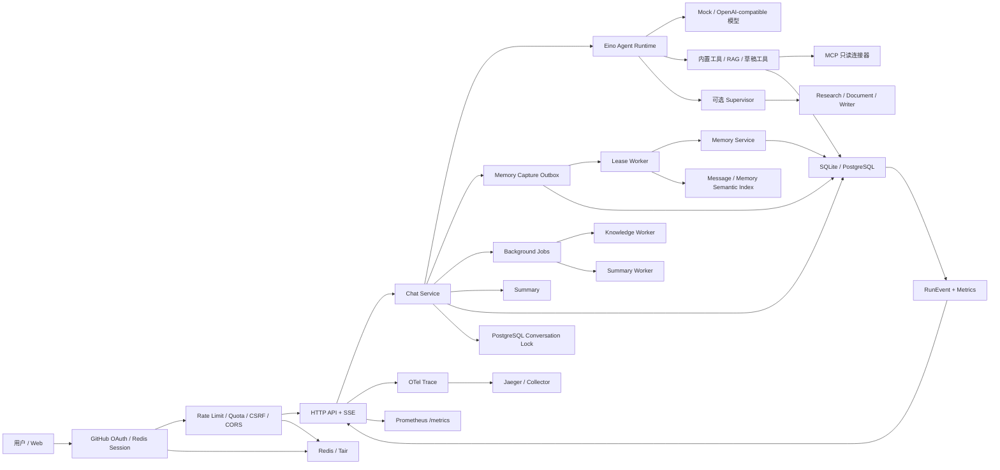
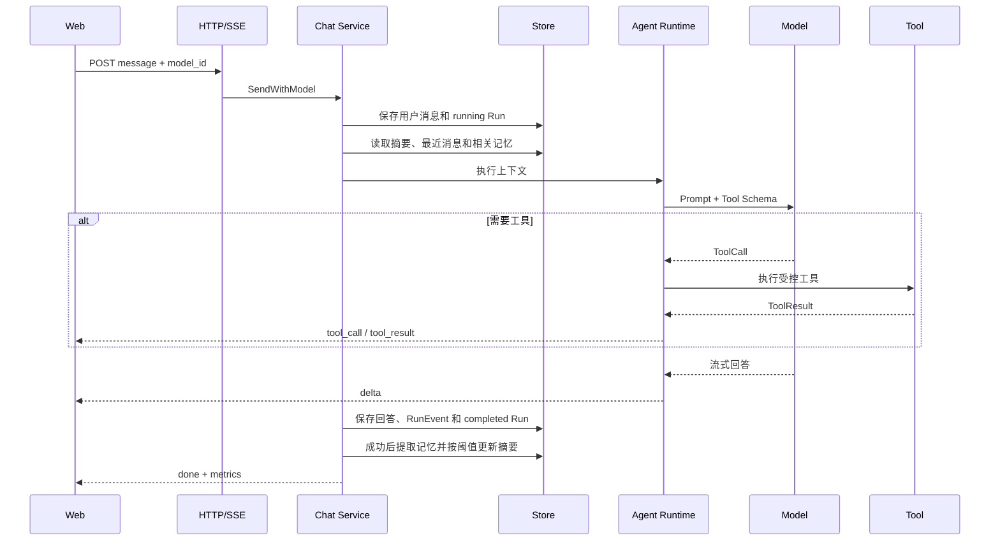

# Zora

Zora 是一个使用 Go 与 Eino 实现的可观察 Agent 工作台：支持流式对话、工具调用、知识库、长期记忆、多 Agent 协作、人工审批、办公草稿和运行审计。

这个项目的重点不是复刻一个聊天页面，而是实践 Agent 产品从“模型能回答”走向“系统可控制、可追踪、可评估、可扩展”的核心工程问题。

> 当前版本：V0.12（多用户、多副本上线准备版）。GitHub OAuth + PKCE、Redis 服务端会话、租户数据隔离、Redis 分布式限流、PostgreSQL 跨副本会话锁和阿里云 ACK 部署模板已完成；真实阿里云资源、域名、HTTPS 与双账号 staging 验收仍需执行。

## 为什么做 Zora

普通 LLM 对话应用通常只有 Prompt、模型请求和消息展示。真正的 Agent 产品还需要解决：

- 模型如何安全调用工具，而不是获得无限制执行权限；
- 文档、历史消息和长期记忆如何进入上下文；
- 多 Agent 是否真的产生收益，如何限制成本和并发；
- 工具调用、模型耗时、Token 和失败原因如何追踪；
- “生成邮件草稿”和“真的发送邮件”如何建立可靠的安全边界；
- 没有 API Key 时，怎样仍能测试完整 Agent 链路。

Zora 围绕这些问题实现了一套可以本地运行、阅读和继续扩展的工程化参考。

## 核心能力

| 领域 | 已实现能力 |
|---|---|
| Agent Core | Eino ReAct、流式输出、ToolCall、取消、超时、会话级并发控制 |
| 多模型 | OpenAI-compatible Provider、Mock、环境变量注册多个模型、Web 按请求切换 |
| 知识库 | TXT/Markdown/PDF 异步摄取、版本、ACL、分块、Embedding、向量与关键词混合检索、引用 |
| 长期记忆 | Semantic/Episodic、自动提取、同 Key 合并、人工修正保护、词项/向量联合召回、过期时间、Outbox 异步捕获与失败重试 |
| 上下文管理 | 跨会话消息语义召回、异步增量摘要、最近消息窗口、记忆/消息/摘要安全注入 |
| 多 Agent | Supervisor、Research/Document/Writer、串并行交接、预算、超时、重试、父子 Run |
| 人工审批 | 高影响意图识别、持久化审批、SSE 等待与恢复、拒绝和超时终态 |
| MCP | 官方 Go SDK、stdio Server、工具白名单、只读声明校验、环境变量最小透传 |
| 办公助手 | 邮件/日程草稿、草稿箱、一次性确认、持久化 Operation、租约、幂等与恢复 |
| 可观察性 | RunEvent、TTFT、真实 Token Usage、Web 运行监控、OTel Trace、Prometheus 指标 |
| 身份与租户 | GitHub OAuth authorization code + PKCE、Redis 服务端 Session、稳定 GitHub ID、tenant/principal 全链路隔离 |
| API 安全 | Redis/本地 IP 令牌桶、PostgreSQL/SQLite 每日配额、双提交 CSRF、精确 CORS、可信代理、受保护 `/metrics` |
| Secret 管理 | 模型、Embedding、PostgreSQL、Redis、GitHub、监控凭据支持权限收敛的 `_FILE` 注入，禁止双重配置 |
| 数据层 | SQLite 零依赖单用户模式；PostgreSQL + pgvector + FTS 多用户生产模式 |
| 多副本 | Redis Session/限流、PostgreSQL advisory conversation lock、跨 Pod 审批轮询、租约 Worker、readiness、PDB/HPA/滚动升级模板 |
| 评测 | RAG、Memory A/B、单/多 Agent Control/Treatment 固定数据集与质量门禁 |

详细实现分析见[项目亮点全面分析](docs/project-highlights.md)，面试准备见[项目分析文档](docs/project-analysis.md)。

## 系统架构



主要边界：

- Eino 管理模型、ReAct 与 Tool 调度；Zora 管理业务状态、数据、审计、安全和评测。
- `Message` 保存用户可见历史；`AgentRun` 保存一次执行终态；`RunEvent` 保存内部不可变轨迹；`memory_capture_jobs` 保存回答后的可恢复增强任务。
- Agent 只能生成内部草稿。外部写操作必须经过确认、Operation 和专用执行器。
- SQLite 强调零依赖体验；PostgreSQL 将向量和全文候选召回下推数据库。

## 快速开始

### 环境要求

- Go 1.26 或更高版本；
- 可选：Docker 与 Docker Compose；
- 接入真实模型时，需要对应平台的 API Key；
- 使用真实语义知识库时，还需要 Embedding API 或本地 Embedding 服务。

### 1. 无 API Key 启动

默认使用 Mock 模型和 SQLite，但仍经过真实 Eino Agent 与工具链。

```bash
git clone https://github.com/zora-DD/zora.git
cd zora
make run
```

打开 [http://localhost:8088](http://localhost:8088)。

可以立即测试：

```text
现在上海几点？
计算 (128 + 72) * 3.5
记住我的主要编程语言是 Go
我的主要编程语言是什么？
```

### 2. 安全接入 LLM 与 Embedding

复制本地配置文件：

```bash
cp .env.example .env.local
```

`.env.local` 已被 Git 忽略。不要把真实 Key、实际 AI 配置写入 `.env.example`、源码、Compose 或 ConfigMap。

推荐把模型列表和 Embedding 参数放到仓库外的 AI 配置文件。项目提供不含真实信息的模板：

```bash
mkdir -p .runtime .secrets
cp deploy/aliyun/swas/ai-config.template.json .runtime/ai-config.json
# 用编辑器替换 .runtime/ai-config.json 中的 CHANGE_ME，再收紧权限。
chmod 600 .runtime/ai-config.json
```

AI 配置文件只能保存模型元数据和 `api_key_env` 引用，不能出现 `api_key`。真实 Key 分别写入被 Git 忽略的文件并设为 `0600`，然后在 `.env.local` 中只配置路径：

```bash
ZORA_AI_CONFIG_FILE=.runtime/ai-config.json
ZORA_LLM_API_KEY_FILE=.secrets/llm_api_key
ZORA_EMBEDDING_API_KEY_FILE=.secrets/embedding_api_key
```

服务启动时会检查配置文件是普通文件、最大 64 KiB 且没有 group/other 权限；未知字段、内联 Key、配置文件与旧模型环境变量混用都会直接拒绝启动。修改配置后需要重启或滚动重启 Zora。Embedding 模型、维度或归一化策略变化还必须重建对应向量索引，不能直接热切换。

生产部署推荐把密钥挂载为 `0400` 或 `0600` 的普通文件：

```bash
ZORA_API_KEY_FILE=/run/secrets/zora_model_api_key
ZORA_EMBEDDING_API_KEY_FILE=/run/secrets/zora_embedding_api_key
ZORA_POSTGRES_DSN_FILE=/run/secrets/zora_postgres_dsn
```

直接值与对应的 `_FILE` 不能同时设置。多模型 `api_key_env` 自动支持同名 `_FILE`，例如配置 `ZORA_LLM_API_KEY_FILE` 后，AI 配置仍填写 `"api_key_env":"ZORA_LLM_API_KEY"`。

为了兼容旧部署，未设置 `ZORA_AI_CONFIG_FILE` 时仍支持单模型环境变量：

```bash
ZORA_MODEL_PROVIDER=openai
ZORA_MODEL=deepseek-chat
ZORA_API_KEY='替换为你自己的新 Key'
ZORA_BASE_URL=https://api.deepseek.com
```

启动后可在 Web 顶部切换模型：

```bash
make run
```

服务端只允许选择启动时注册的模型 ID，不接受浏览器提交任意模型地址或 Key，也不会把 Key 返回给浏览器。

### 3. 上传知识文档

1. 点击左侧“知识库”；
2. 上传 UTF-8 TXT、Markdown 或带文本层的 PDF；
3. 选择“仅自己”或“所有人”；
4. 上传完成后在对话中明确提出“根据我上传的文档……”；
5. 展开 `knowledge_search` 轨迹可查看检索过程，回答中应包含文档引用。

项目提供了测试资料：

- [星舟计划测试资料](testdata/knowledge/星舟计划测试资料.md)
- [手工测试指南](docs/manual-test-guide.md)

默认 Hash Embedding 只适合验证链路，不具备真实语义效果。真实 RAG 应在 `ZORA_AI_CONFIG_FILE` 的 `embedding` 对象中配置 OpenAI-compatible Embedding：

```json
{
  "provider": "openai",
  "model": "你的向量模型名称",
  "base_url": "https://你的服务地址/v1",
  "dimensions": 1024,
  "api_key_env": "ZORA_EMBEDDING_API_KEY"
}
```

更换 Embedding 模型或维度后需要重建旧知识索引。

### 4. 启用多 Agent

```bash
ZORA_MULTI_AGENT_ENABLED=true make run
```

启用后：

- Research Agent 负责计算、时间等研究工具；
- Document Agent 负责知识库和只读 MCP 内容；
- Writer Agent 负责邮件、日程等草稿；
- Supervisor 负责拆解、路由和最终汇总。

示例：

```text
根据星舟计划文档核对发布条件，然后起草一封发给 ops@example.com 的内部通知。只保存草稿，不要发送。
```

草稿生成后，点击左侧“办公草稿”查看。多 Agent 会增加调用次数和延迟，因此默认关闭。

### 5. 使用 PostgreSQL + pgvector

```bash
docker compose up -d postgres
make run-postgres
```

PostgreSQL 模式使用：

- pgvector HNSW 做向量候选召回；
- PostgreSQL FTS + GIN 做关键词候选召回；
- Service 层使用 RRF 融合两路名次；
- 启动时校验数据库向量维度，阻止错误模型静默混用。

运行真实数据库集成测试：

```bash
make test-postgres
```

### 6. Docker 启动

完整 PostgreSQL 方案：

```bash
docker compose up --build
```

SQLite Mock 方案：

```bash
docker build -t zora:dev .
docker run --rm -p 8088:8088 -v zora-data:/app/data zora:dev
```

### 7. 启用 Jaeger 与 Prometheus

先启动本地可观察性组件：

```bash
make observability-up
```

在 `.env.local` 中开启导出，然后启动 Zora：

```bash
ZORA_OTEL_ENABLED=true
OTEL_EXPORTER_OTLP_ENDPOINT=http://localhost:4318
ZORA_PROMETHEUS_ENABLED=true
ZORA_OTEL_SAMPLE_RATIO=1
```

```bash
make run
```

- Jaeger Trace：[http://localhost:16686](http://localhost:16686)
- Prometheus：[http://localhost:9090](http://localhost:9090)
- 原始指标：[http://localhost:8088/metrics](http://localhost:8088/metrics)

一次 Agent 请求会形成 `HTTP → agent.run → gen_ai.chat / tool.* → embedding.generate` 父子链路；异步捕获通过持久化 `traceparent` 把后续 `memory.capture` Span 接回原 Run。SSE `start` 事件会返回 `trace_id` 和 `span_id`，便于从产品 Run 定位 Trace。详细说明见[第二阶段：OTel 与 Prometheus](docs/phase-2-observability.md)和[第三阶段：Memory Capture Outbox](docs/phase-3-memory-outbox.md)。

### 8. GitHub 登录与阿里云部署

本地验证 GitHub 登录需要 PostgreSQL、Redis 和一个回调为 `http://localhost:8088/api/auth/callback` 的 GitHub OAuth App：

```bash
ZORA_AUTH_ENABLED=true \
ZORA_GITHUB_OAUTH_CLIENT_ID='你的 Client ID' \
ZORA_GITHUB_OAUTH_CLIENT_SECRET='你的 Client Secret' \
docker compose up --build
```

生产环境必须使用 HTTPS、Secure Cookie、RDS PostgreSQL、Tair/Redis 和至少两个应用副本。仓库提供 ACK Kustomize、ALB Ingress、PDB/HPA、Secret 与 PodMonitor 模板；由于 GitHub Callback 和可信证书都依赖稳定域名，没有域名时只能完成代码与部署准备，不能宣称公网生产已上线。完整购买顺序、GitHub 配置、部署和负向验收见[阿里云生产部署 Runbook](docs/aliyun-deployment.md)。

## Web 功能入口

| 入口 | 用途 |
|---|---|
| 新建对话 | 创建独立 Conversation |
| 知识库 | 上传、查看版本和删除文档 |
| 长期记忆 | 查看、添加、编辑和删除记忆 |
| 办公草稿 | 查看邮件/日程草稿、提交确认、批准或拒绝、准备 Operation |
| 运行监控 | 查看最近 Run 的状态、耗时、TTFT、Token 和工具/Agent 次数 |
| 顶部模型选择器 | 在服务端已注册的模型之间按请求切换 |
| 登录状态 | production 未登录时展示 GitHub 登录页；本地模式在侧栏明确标记“GitHub 登录未启用” |

回答中的工具卡片可以展开，查看工具参数与结果。停止按钮会取消当前 HTTP 请求并把 Run 标记为 `cancelled`。

## 核心流程



## 常用配置

完整模板见 [.env.example](.env.example)，配置设计见[项目技术文档](docs/technical-design.md)。

| 配置 | 默认值 | 作用 |
|---|---|---|
| `ZORA_ADDR` | `:8088` | HTTP 监听地址 |
| `ZORA_DATA_DIR` | `./data` | SQLite 数据目录 |
| `ZORA_STORE_PROVIDER` | `sqlite` | `sqlite` 或 `postgres` |
| `ZORA_REDIS_URL` / `_FILE` | 空 | Redis/Tair URL；登录与多副本必填 |
| `ZORA_REPLICA_COUNT` | `1` | 大于 1 时强制校验 PostgreSQL + Redis；production 至少为 2 |
| `ZORA_AUTH_ENABLED` | `false` | 是否启用 GitHub OAuth 多用户登录 |
| `ZORA_GITHUB_OAUTH_*` | 空 | Client ID、Secret 与精确回调地址 |
| `ZORA_AI_CONFIG_FILE` | 空 | 仓库外 AI 配置文件；启用后覆盖并排斥旧模型/Embedding 元数据环境变量 |
| `ZORA_MODEL_PROVIDER` | `mock` | `mock` 或 `openai` |
| `ZORA_MODELS_JSON` | 空 | 多模型注册表，最多 20 项 |
| `ZORA_DEFAULT_MODEL_ID` | 第一项 | 默认模型配置 ID |
| `ZORA_REQUEST_TIMEOUT` | `90s` | 单次 Agent 请求总超时 |
| `ZORA_MAX_ITERATIONS` | `8` | ReAct 最大迭代次数 |
| `ZORA_MULTI_AGENT_ENABLED` | `false` | 是否启用 Supervisor 与专业 Agent |
| `ZORA_EMBEDDING_PROVIDER` | `hash` | `hash` 或 `openai` |
| `ZORA_MEMORY_AUTO_CAPTURE` | `true` | 成功回答后自动提取长期记忆 |
| `ZORA_MEMORY_RECALL_ENABLED` | `true` | 回答前召回相关记忆 |
| `ZORA_MEMORY_WORKER_MAX_ATTEMPTS` | `5` | 异步捕获最大尝试次数 |
| `ZORA_MEMORY_WORKER_TASK_TIMEOUT` | 跟随请求超时 | 单个捕获任务的超时上限 |
| `ZORA_SUMMARY_ENABLED` | `true` | 启用增量会话摘要 |
| `ZORA_MCP_ENABLED` | `false` | 启用配置的 MCP Server |
| `ZORA_OFFICE_EXECUTOR` | `disabled` | 外部办公写执行器，默认禁用 |
| `ZORA_OTEL_ENABLED` | `false` | 是否通过 OTLP/HTTP 导出 Trace |
| `OTEL_EXPORTER_OTLP_ENDPOINT` | `http://localhost:4318` | Collector 或 Jaeger OTLP/HTTP 地址 |
| `ZORA_OTEL_SAMPLE_RATIO` | `1` | 根 Trace 采样率，范围 0–1 |
| `ZORA_PROMETHEUS_ENABLED` | `false` | 是否暴露 `GET /metrics` |
| `ZORA_METRICS_TOKEN` / `_FILE` | 空 | `/metrics` Bearer Token；production 必填且至少 32 字符 |

本地 `make run` 优先加载 `.env.local`，其次加载 `.env`。直接执行 `go run ./cmd/zora` 不会自动读取环境文件。

## MCP 与办公能力

仓库包含两个 MCP Server：

- `zora-mcp-files`：授权目录内的只读文件列表和 UTF-8 文本读取；
- `zora-mcp-microsoft`：Microsoft Graph 邮件/日历只读查询，以及专用写身份下的邮件/日程执行。

构建：

```bash
make build-mcp-connectors
```

普通 MCP Bridge 只接收同时满足以下条件的工具：

1. Server 已在本地配置；
2. 工具名在 `allowed_tools`；
3. MCP Tool 声明 `readOnlyHint=true`；
4. 子进程只获得 `pass_env` 明确列出的变量。

外部写操作不属于普通 MCP 工具链。完整的 Microsoft Entra 双身份、最小权限和部署步骤见 [Microsoft Entra 部署 Runbook](docs/microsoft-entra-deployment.md)。

## API 概览

| 资源 | 主要接口 |
|---|---|
| 身份 | `GET /api/auth/status`、`GET /api/auth/login`、`GET /api/auth/callback`、`GET /api/auth/me`、`POST /api/auth/logout` |
| 运行信息与安全 | `GET /api/health`、`GET /api/ready`、`GET /api/info`、`GET /api/security/csrf` |
| Prometheus | `GET /metrics`（仅启用指标时注册） |
| 对话 | `/api/conversations`、`/api/conversations/{id}/messages` |
| Run | `/api/runs`、`/api/runs/{id}/events`、`/api/runs/{id}/metrics` |
| 审批 | `/api/approvals`、`/api/approvals/{id}/decision` |
| 知识库 | `/api/knowledge/documents`、`/api/knowledge/search` |
| 长期记忆 | `/api/memories`、`/api/memories/recall` |
| 语义索引 | `/api/semantic/messages/search`、`/api/semantic/reindex` |
| 后台任务 | `/api/background/jobs`、`/api/background/jobs/{id}`、`/api/background/jobs/{id}/retry` |
| 记忆捕获任务 | `/api/memory-capture/jobs`、`/api/memory-capture/jobs/{id}` |
| 会话摘要 | `/api/conversations/{id}/summary` |
| 办公草稿 | `/api/office/drafts`、`/api/office/drafts/{id}/decision` |
| 办公任务 | `/api/office/operations`、`/api/office/operations/{id}/execute` |

消息接口通过 SSE 返回 `start`、`tool_call`、`tool_result`、`agent_handoff_*`、`delta`、`done` 和 `error` 等事件。完整契约见[项目技术文档](docs/technical-design.md)。

## 项目目录结构设计

```text
zora/
├── cmd/                         # 可执行程序入口，只负责配置读取和依赖组装
│   ├── zora/                    # Agent HTTP 服务主入口
│   ├── zora-eval/               # RAG 检索与答案质量评测
│   ├── zora-memory-eval/        # 长期记忆 Control/Treatment 评测
│   ├── zora-agent-eval/         # 单 Agent / 多 Agent 对照评测
│   ├── zora-mcp-files/          # 本地授权文件 MCP Server
│   └── zora-mcp-microsoft/      # Microsoft Graph MCP Server
├── internal/                    # 不对仓库外暴露的核心实现
│   ├── config/                  # 环境变量、外置 AI 配置、默认值与严格校验
│   ├── secrets/                 # 0400/0600 Secret 与安全运行时文件加载
│   ├── authn/                   # GitHub OAuth、PKCE 与 Redis 服务端会话
│   ├── identity/                # 可信 principal/tenant 请求上下文
│   ├── security/                # 限流、配额、CORS 与 CSRF
│   ├── domain/                  # Conversation、Message、Run 等共享领域对象
│   ├── id/                      # 业务 ID 生成
│   ├── httpapi/                 # REST/SSE Handler 与内嵌 Web 静态资源
│   │   └── web/                 # 原生 HTML、CSS、JavaScript 前端
│   ├── chat/                    # 对话用例、上下文装配和 Run 生命周期编排
│   ├── agentruntime/            # Eino Runtime、ReAct、多模型和多 Agent 调度
│   ├── agenttools/              # 计算器、时间、项目状态等内置工具
│   ├── knowledge/               # 文档解析、分块、Embedding、检索与引用
│   ├── memory/                  # 长期记忆提取、合并、召回及 Outbox Worker
│   ├── summary/                 # 增量摘要与长上下文压缩
│   ├── approval/                # Human-in-the-loop 审批状态机
│   ├── office/                  # 办公草稿、确认、Operation 与幂等执行
│   ├── mcpbridge/               # MCP Client、安全过滤和办公执行适配
│   ├── mcpfiles/                # 文件 MCP Server 的协议实现
│   ├── mcpmicrosoft/            # Graph 认证、邮件和日历 MCP 工具实现
│   ├── observability/           # RunEvent 聚合、OTel Trace 与 Prometheus 指标
│   ├── store/                   # Conversation、Message、Run 等共享持久化契约
│   │   ├── sqlite/              # 本地零依赖实现和精确向量扫描
│   │   └── postgres/            # PostgreSQL、pgvector、FTS 与生产实现
│   ├── rageval/                 # RAG 指标计算与答案忠实度评测
│   ├── memoryeval/              # 长期记忆评测模型
│   └── agentseval/              # 多 Agent 路由与质量对照评测
├── evals/                       # 可版本化的固定评测数据集
├── testdata/                    # 手工测试和上传示例资料
├── docs/                        # 架构、技术设计、分析、部署和测试文档
├── deploy/                      # Prometheus 规则与阿里云 ACK/ALB 部署模板
├── scripts/                     # staging 负向验收脚本
├── data/                        # 本地运行数据和评测报告，不提交 Git
├── .runtime/                    # 实际 AI 模型/Embedding 配置，不提交 Git
├── .secrets/                    # API Key、OAuth 与数据库 Secret，不提交 Git
├── Dockerfile                   # 服务镜像构建
├── compose.yaml                 # PostgreSQL、Jaeger 与 Prometheus 本地环境
├── Makefile                     # 开发、构建和评测统一入口
├── .env.example                 # 无敏感信息的配置模板
├── go.mod                       # Go 模块与直接依赖声明
└── README.md
```

目录划分遵循以下原则：

1. **入口与实现分离**：`cmd/` 不承载业务规则，只创建配置、数据库、Runtime 和 HTTP Server；核心代码放在 `internal/`，防止被外部 Go 模块误引用。
2. **按业务能力聚合**：知识库、记忆、审批和办公能力分别拥有自己的 Service、类型与测试，避免按 Controller、Service、DAO 形成横向大目录。
3. **依赖指向抽象**：`chat` 使用 `internal/store` 的共享接口，知识库、记忆等模块在各自包内声明最小 Store 接口；入口将这些接口组合为 `applicationStore`，再注入 SQLite 或 PostgreSQL 实现。
4. **协议边界隔离**：HTTP、SSE、MCP 和 Microsoft Graph 的协议转换留在边界模块中，Agent Runtime 与核心业务不直接依赖具体传输协议。
5. **评测属于工程代码**：评测逻辑放在 `internal/*eval`，固定数据放在 `evals/`，命令入口放在 `cmd/`，从而让质量门槛可以自动执行和版本化。
6. **运行数据不进入源码**：`data/`、`.runtime/`、`.secrets/`、`.env.local` 和构建产物只存在于本机；实际 AI 配置与真实 API Key 不写入源码、示例配置或评测报告。

主要依赖方向如下：

```text
cmd/zora
   ├──组装──> httpapi ──> chat ──> agentruntime
   │                       ├──> memory queue / summary / approval / observability
   │                       └──> store（共享接口）
   ├──组装──> knowledge / memory service + capture worker / summary / approval / office
   ├──注册工具──> agenttools / knowledge tool / office tool / mcpbridge adapter
   ├──埋点──> observability ──> OTLP/HTTP + /metrics
   └──注入──> applicationStore
                   ├── sqlite
                   └── postgres

mcpbridge ──stdio/JSON-RPC──> 独立 MCP Server 进程
```

新增普通业务能力时，优先在 `internal/<capability>` 内完成领域类型、Service 和单元测试，再由 `chat` 编排并通过 `httpapi` 暴露；新增独立进程或评测工具时，才在 `cmd/` 下增加入口。这样可以控制入口层复杂度，也便于后续把单体服务拆成 Worker 或独立服务。

## 开发与验证

```bash
make test          # 全量 Go 测试
make vet           # 静态分析
make check         # 格式化、测试和静态分析
make eval-rag      # RAG 检索与答案引用评测
make eval-rag-real # 加载本地真实 Embedding，运行 64 题纯检索基线
make eval-memory   # 长期记忆 Control/Treatment A/B
make eval-agents   # 单 Agent / 多 Agent 对照评测
make observability-up   # 启动 Jaeger 与 Prometheus
make observability-down # 停止 Jaeger 与 Prometheus
```

推荐在修改并发和状态机后额外执行：

```bash
go test -race ./internal/...
CGO_ENABLED=0 go build ./cmd/zora
```

## 当前限制

- GitHub 登录已经支持真实多用户，但当前“一名 GitHub 用户就是一个租户”，尚无组织共享租户、邀请、RBAC 和管理员后台；
- Hash Embedding 仅用于本地链路测试，不能代表生产语义检索；
- SQLite 检索采用进程内精确扫描，不适合大规模知识库；
- PDF 只支持文本层，不包含 OCR；
- 消息和长期记忆已使用独立向量索引，但尚未建立专门的离线召回数据集与重排模型；
- 多 Agent 收益只在固定小样本中验证，真实业务必须重新评测；
- Microsoft Graph 真实写链路等待测试租户验收；
- OTel 支持 OTLP 出口且已有 Prometheus 告警规则模板，但真实 ARMS/Collector、Dashboard 和告警送达尚未验收；
- 多副本共享状态与会话锁已完成，真实 ACK Pod 故障、滚动升级和双账号隔离仍需 staging 演练；
- 租户隔离目前依赖应用查询条件，没有 PostgreSQL RLS 作为第二道防线；数据库迁移仍是启动时内嵌 DDL。

这些限制不会包装成“已完成能力”。详细优先级见[项目分析文档](docs/project-analysis.md)和 [Roadmap](docs/roadmap.md)。

## 文档导航

| 文档 | 用途 |
|---|---|
| [项目亮点全面分析](docs/project-highlights.md) | 按业务问题、关键代码、实现方式和选型理由深入研究亮点 |
| [项目分析文档](docs/project-analysis.md) | 定位、业务/数据模型、架构、缺陷、口述稿、追问与简历表达 |
| [项目技术文档](docs/technical-design.md) | 包设计、核心流程、配置、API、SSE、并发、安全与扩展 |
| [面试问题总结](docs/interview-questions.md) | 按模块记录实际提出的问题、面试简答、源码级详解和关键代码位置 |
| [架构说明](docs/architecture.md) | 当前架构边界的简版说明 |
| [手工测试指南](docs/manual-test-guide.md) | 基础对话、RAG、Memory、多 Agent、安全和监控测试 |
| [资源准备清单](docs/resource-preparation.md) | 模型、Embedding、数据库和 Microsoft 365 资源说明 |
| [真实 Embedding 与 RAG 基线](docs/phase-1-real-embedding.md) | 第一阶段配置、无历史污染测试、64 题评测和指标记录 |
| [OTel 与 Prometheus](docs/phase-2-observability.md) | 第二阶段 Trace/Metric 链路、启动方式、指标和排障 |
| [Memory Capture Outbox](docs/phase-3-memory-outbox.md) | 第三阶段事务入队、租约领取、退避重试、状态 API 与 Trace 续接 |
| [后台任务异步化](docs/phase-4-background-jobs.md) | 文档摄取、会话摘要、租约 Worker、失败重投与运维 API |
| [阿里云生产部署 Runbook](docs/aliyun-deployment.md) | 域名与资源购买顺序、ACK/RDS/Tair、GitHub OAuth、HTTPS、备份和 staging 验收 |
| [阿里云轻量服务器 staging 指南](docs/staging-single-server.md) | 低成本 staging 的单机容器编排、资源作用、Secret 管理和验收边界 |
| [Roadmap](docs/roadmap.md) | 版本状态和验收条件 |

## License

本项目暂未指定开源许可证。公开发布或允许他人分发前，需要选择并补充合适的许可证。
