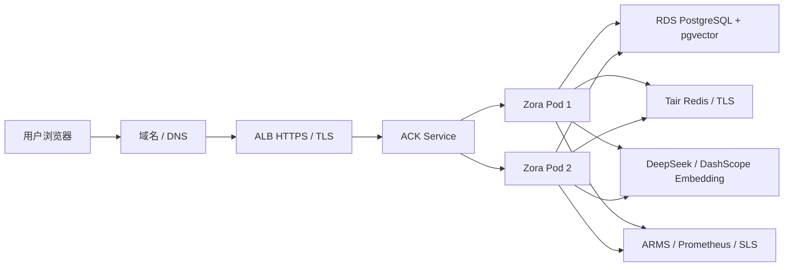

# 阿里云生产部署 Runbook

本文面向“尚未购买云资源、需要 GitHub 登录、至少两个应用副本”的 Zora 首次上线。仓库已提供应用代码与 Kubernetes 模板，但不会把未购买的云资源描述为已完成。

## 1. 当前结论与硬阻塞

推荐首个生产环境部署到阿里云中国香港地域，使用 ACK 托管/Serverless Kubernetes、ALB、RDS PostgreSQL、Tair Redis 与 ACR。应用固定运行至少 2 个副本。

当前不能完成公网正式上线，原因是还没有域名和云资源：

1. GitHub OAuth 的回调地址必须提前固定，并与 OAuth App 配置完全一致；
2. `Secure` 登录 Cookie 与可信 HTTPS 需要证书；普通公网 IP 不适合作为正式证书和长期回调地址；
3. 中国内地服务器绑定网站域名通常需要 ICP 备案。首版放中国香港可免去内地 ICP 上线等待，但网络延迟、跨境链路和价格需要实测；
4. RDS、Tair、ACK/节点、ALB、公网流量、日志/监控都可能产生费用，不能仅购买一台 ECS 就宣称实现了多副本和高可用。

因此，正确顺序是：购买域名 → 选择地域 → 建 VPC 与托管依赖 → 创建 GitHub OAuth App → 部署 staging → 负向验证 → 切换生产。

## 2. 推荐资源清单

| 资源 | 最低用途 | 是否通常付费 | 首版建议 |
|---|---|---:|---|
| 域名 + DNS | HTTPS、稳定 GitHub Callback | 是 | 必须先准备；如 `zora.example.com` |
| ACK 托管版或 Serverless Kubernetes | 运行 2 个 Zora Pod、滚动升级/HPA | 是 | 学习项目可先看 Serverless 与小规格节点总价 |
| ACR | 保存版本化容器镜像 | 有免费/付费层级 | 与 ACK 同地域 |
| ALB | HTTPS 入口、健康检查、转发 | 是 | 只暴露 443，80 跳转 443 |
| RDS PostgreSQL | 多用户业务数据、pgvector、配额、任务和锁 | 是 | PostgreSQL 16，先确认实例支持 `vector` |
| Tair/Redis | OAuth state、服务端 Session、跨副本令牌桶 | 是 | VPC 私网、TLS、密码认证 |
| 证书管理服务 | TLS 证书 | 有免费/付费选项 | 证书绑定实际域名 |
| ARMS/托管 Prometheus/SLS | Trace、Metrics、日志与告警 | 视用量 | staging 可先开低采样率并设置预算告警 |
| KMS/Secrets Manager | Secret 托管与轮换 | 视用量 | 首版至少用 Kubernetes Secret + 严格 RBAC，随后接 CSI |

购买前在阿里云价格计算器分别估算香港和离你用户更近的地域；为账号设置月度预算、80%/100% 阈值和异常费用告警。预算告警不是自动停机开关。

## 3. 生产架构



多副本成立的关键不是 Deployment 写了 `replicas: 2`，而是所有跨请求状态都已迁出进程：

- GitHub OAuth 临时 state 与登录会话保存在 Redis，任意 Pod 都能接回调；
- IP 令牌桶由 Redis Lua 原子执行；每日配额保存在 PostgreSQL；
- 对话、记忆、知识库、草稿、Run 和后台任务全部在 PostgreSQL；
- 同一会话并发 Agent Run 使用 PostgreSQL session advisory lock；
- 人工审批使用 PostgreSQL 终态轮询兜底，确认请求落到其他 Pod 也能唤醒原 Run；
- 文档摄取、摘要和记忆任务通过租约与 `SKIP LOCKED` 被多个 Worker 安全竞争；
- `/api/ready` 同时探测 PostgreSQL 与 Redis，失败的 Pod 不再接收新请求。

## 4. 账号与网络准备

1. 为阿里云主账号开启 MFA，日常操作创建 RAM 用户/角色，不直接使用主账号 AccessKey；
2. 选择中国香港地域，创建一个 VPC 和至少两个可用区的交换机；
3. 如果使用节点型 ACK，至少准备两个可调度节点；模板要求首批 Pod 分散到两个 hostname，单节点集群第二个副本会保持 Pending；
4. RDS、Tair 和 ACK 放在同一 VPC，只允许 ACK 安全组/白名单访问数据库端口；
5. RDS/Tair 不开公网地址；运维访问通过受控跳板、VPN 或 ACK 内临时运维 Pod；
6. ALB 是唯一公网入口：443 提供业务流量，若需要 HTTP 自动跳转则同时开放 80 且只允许 301/308 跳到 HTTPS；应用 Service、RDS 与 Tair 均不直接暴露公网；
7. 先创建 staging 子域名，例如 `zora-staging.example.com`，验证通过后再使用生产子域名。

## 5. RDS PostgreSQL

创建数据库与最小权限账号后，先确认扩展可用：

```sql
CREATE DATABASE zora;
-- 连接 zora 数据库后执行；若应用账号无扩展权限，由高权限初始化账号执行一次。
CREATE EXTENSION IF NOT EXISTS vector;
SELECT extversion FROM pg_extension WHERE extname = 'vector';
```

生产 DSN 使用 TLS；能配置 RDS CA 时优先使用 `verify-full`，下面的 `require` 仅表示最低加密门槛：

```text
postgres://zora_app:密码@内网地址:5432/zora?sslmode=require
```

不要把 DSN 放入 ConfigMap 或镜像。部署模板通过 `ZORA_POSTGRES_DSN_FILE` 从内存 Secret 卷读取。连接池上限是“单 Pod 上限”，HPA 最大 6 个副本时需保证 `6 × ZORA_POSTGRES_MAX_CONNS` 不超过 RDS 可用连接预算，并预留迁移、监控和运维连接。

首版建议使用全新的 RDS 数据库。旧 SQLite 文件不会自动迁入 PostgreSQL；旧 PostgreSQL 数据会保留为 `local/local-user` 范围，也不会自动归属任意 GitHub 用户。若要带历史数据上线，必须先写一次性迁移并由用户确认目标 GitHub 数字 ID，不能直接修改 owner 字段猜测归属。

备份要求：开启自动备份/PITR；至少每季度在隔离实例做一次恢复演练，记录 RPO、RTO、恢复后的 schema version 与抽样数据校验。只有“能恢复”才算备份有效。

## 6. Tair/Redis

创建私网实例，开启 TLS 和密码认证，连接地址以控制台实际值为准：

```text
rediss://:密码@内网地址:6379/0
```

Redis 只保存短生命周期 OAuth state、登录 session 与限流桶，不是业务事实源。配置持久化与高可用仍有价值，但 Redis 丢失的预期后果应是“用户重新登录、限流状态重置”，不能导致 PostgreSQL 业务数据丢失。

## 7. GitHub OAuth 登录

在 GitHub Developer Settings 创建 OAuth App：

- Homepage URL：`https://你的域名`
- Authorization callback URL：`https://你的域名/api/auth/callback`
- Zora 不请求额外 scope，只调用 `/user` 获取公开身份；
- Client ID 放 ConfigMap；Client Secret 只放 Secret Manager/Kubernetes Secret；
- GitHub `login` 可修改，Zora 使用不可变数字 `id` 生成 `principal_id=github:<id>` 与 `tenant_id=github-user:<id>`。

GitHub OAuth App 只有一个 callback URL。staging 与 production 使用不同域名时，应创建两个 OAuth App，并分别注入 Client ID/Secret，不能在同一个 App 上来回改回调地址。

登录流程使用 OAuth authorization code、state 一次性消费和 PKCE S256。GitHub access token 只在回调内用于读取身份，不写入数据库、Redis、浏览器或日志；浏览器只持有随机 `HttpOnly; Secure; SameSite=Lax` Session Cookie。

一个 GitHub 用户当前对应一个独立租户。这实现了真实多用户隔离，但还没有组织共享租户、成员邀请、角色/RBAC 和管理员后台；这些属于后续 SaaS 能力，不能与“多用户登录”混为一谈。

## 8. 构建与部署

先创建 ACR 仓库并登录，然后使用不可变版本标签：

```bash
docker build -t registry.cn-hongkong.aliyuncs.com/你的命名空间/zora:v0.12.0 .
docker push registry.cn-hongkong.aliyuncs.com/你的命名空间/zora:v0.12.0
```

复制模板到一个不提交 Git 的临时目录，替换全部 `CHANGE_ME`：

```bash
kubectl apply -f deploy/aliyun/k8s/base/namespace.yaml
kubectl apply -f /安全临时目录/zora-secrets.yaml
kubectl apply -k deploy/aliyun/k8s/base
kubectl diff -f /安全临时目录/zora-albconfig.yaml
kubectl apply -f /安全临时目录/zora-albconfig.yaml
kubectl apply -f /安全临时目录/zora-ingress.yaml
```

部署前必须修改：

- `configmap.yaml` 的 Client ID、OAuth 回调域名、ALB 后端连接实际来源的 vSwitch CIDR；不要为了省事信任 `0.0.0.0/0` 或整个超大内网网段。production 启动校验会拒绝空网段、`/0`、单副本、弱 metrics token、无密码明文 Redis 和关闭日配额；
- `deployment.yaml` 的 ACR 镜像；
- Secret 模板中的 RDS、Tair、GitHub、DeepSeek、Embedding 和 metrics 凭据；
- Ingress 的域名、TLS Secret 与集群实际 `IngressClass`；
- `albconfig.template.yaml` 的两个可用区 vSwitch；监听 request/idle timeout 已设为 120 秒，高于默认 Agent 超时，并显式转发 `X-Forwarded-Proto`；
- 如果启用 ARMS/OTel，设置真实 OTLP Endpoint 并把 `ZORA_OTEL_ENABLED` 改为 `true`。

检查：

```bash
kubectl -n zora rollout status deployment/zora
kubectl -n zora get pods,svc,ingress,hpa,pdb
kubectl -n zora logs deployment/zora --tail=100
curl -fsS https://你的域名/api/ready
```

## 9. HTTPS、请求边界与监控

- ALB 强制 HTTP 跳 HTTPS，证书域名与 GitHub Callback 域名一致；
- 限制请求体，知识上传接口至少允许当前 6 MiB 上限，其他 API 可更小；
- ALB idle/request timeout 必须大于 Zora 的 SSE/Agent 请求超时，否则长回答会被入口提前切断；ALB 使用 `/api/ready` 健康检查，并为终止中的 Pod 保留 120 秒连接排空。应用收到 SIGTERM 后按请求超时预算排空，最长等待 110 秒；
- 访问日志不得记录 Cookie、Authorization、CSRF Token、模型 Key、Prompt 或文档正文；
- `/metrics` 虽由 Bearer Token 保护，仍建议只允许监控网络访问；
- 应用指标告警模板位于 `deploy/prometheus/alerts.yml`，阈值需要按流量与预算调整；
- OTel 生产环境通过 Collector/ARMS 出口，禁止把 Prompt、回答、文档内容作为 Span Attribute。

## 10. staging 负向验证

基础无登录测试：

```bash
BASE_URL=https://zora-staging.example.com ./scripts/verify-staging.sh
```

浏览器完成 GitHub 登录后，可用 DevTools 导出仅供临时验证的 Cookie Jar，再验证 CSRF 写请求。Cookie 文件必须放安全临时目录，用完立即销毁：

```bash
BASE_URL=https://zora-staging.example.com \
AUTH_COOKIE_JAR=/安全临时目录/zora-cookie.txt \
METRICS_TOKEN='临时从 Secret Manager 获取' \
./scripts/verify-staging.sh
```

还必须人工完成：

1. 将限流临时降到 `1 RPS / burst 2`，并发请求确认返回 429；恢复配置；
2. 将某测试用户配额调小，确认超额返回 429、UTC 次日自然重置；禁止直接改生产用量表做演示；
3. 删除一个 Pod，持续刷新页面并发起新对话，确认 Session 不丢且同会话不会出现两个并发 Run；
4. 同时上传多份文档，确认每个 Job 仅完成一次且失败可重投；
5. 使用第二个 GitHub 账号登录，确认不能读到第一个账号的对话、记忆、私有文档和草稿；
6. 配置非法 Origin、缺少/错误 CSRF、错误 metrics token、权限为 `0644` 的 Secret，确认系统明确拒绝；
7. 轮换 GitHub/模型/Embedding/metrics Secret，执行滚动更新，旧 Pod 排空后再撤销旧凭据；
8. 做一次 RDS 备份恢复演练，不能只看控制台“备份成功”。

## 11. Secret 轮换

Kubernetes Secret 文件更新不会让已经加载到内存的配置自动生效。标准流程：创建新版本 Secret → 更新挂载 → `kubectl rollout restart deployment/zora` → 等待 readiness 和旧 Pod 排空 → 验证新凭据 → 撤销旧凭据。数据库密码轮换要允许新旧凭据短时重叠，避免滚动期间一半 Pod 失联。

长期建议使用阿里云 KMS/Secrets Manager + Secrets Store CSI Driver，并让 ACK Workload Identity/RAM Role 只读指定 Secret；不要把长期 AccessKey 放在 Kubernetes Secret 中。

## 12. 上线判定

满足以下条件才能把状态从“代码准备完成”改为“已上线”：

- [ ] 域名、DNS、HTTPS 证书与 GitHub Callback 全部生效；
- [ ] ACK 至少两个 Ready Pod，分布在不同节点，滚动升级 `maxUnavailable=0`；
- [ ] RDS/Tair 仅私网可达，TLS 与最小权限账号已启用；
- [ ] 两个 GitHub 账号完成租户隔离验收；
- [ ] CORS、CSRF、401、403、429、配额、错误 Secret 的负向测试通过；
- [ ] `/metrics` 受监控身份保护，告警能实际送达；
- [ ] 数据库恢复演练、Secret 轮换与 Pod 故障演练完成；
- [ ] 阿里云预算与模型 API 余额/异常用量告警生效；
- [ ] 日志、Trace 和错误响应中没有 Secret 与用户正文泄漏。

## 13. 官方参考

- [GitHub OAuth Web application flow](https://docs.github.com/en/apps/oauth-apps/building-oauth-apps/authorizing-oauth-apps)
- [GitHub OAuth App 安全最佳实践](https://docs.github.com/en/apps/oauth-apps/building-oauth-apps/best-practices-for-creating-an-oauth-app)
- [ACK ALB Ingress Controller 与 AlbConfig](https://help.aliyun.com/en/ack/serverless-kubernetes/user-guide/alb-ingress-overview)
- [ALB Ingress HTTPS 证书配置](https://help.aliyun.com/en/ack/serverless-kubernetes/user-guide/use-an-alb-ingress-to-configure-certificates-for-an-https-listener-1)
- [ALB Ingress 高级配置与 HTTPS 重定向](https://help.aliyun.com/en/ack/ack-managed-and-ack-dedicated/user-guide/advanced-alb-ingress-configurations)
- [RDS PostgreSQL 支持的扩展](https://help.aliyun.com/en/rds/apsaradb-rds-for-postgresql/extensions-supported-by-apsaradb-rds-for-postgresql)
- [RDS PostgreSQL pgvector 使用指南](https://help.aliyun.com/en/rds/apsaradb-rds-for-postgresql/pgvector-use-guide)
- [RDS PostgreSQL 备份与恢复](https://help.aliyun.com/en/rds/apsaradb-rds-for-postgresql/backup-and-restoration-4)
- [Tair/Redis 安全白皮书](https://help.aliyun.com/en/redis/security-whitepaper)
- [阿里云预算管理](https://help.aliyun.com/en/user-center/how-to-manage-a-budget)
- [ICP备案申请概述](https://help.aliyun.com/en/icp-filing/basic-icp-service/user-guide/icp-filing-application-overview)
