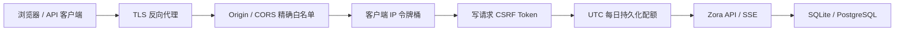

# 部署前 API 安全与 Secret 管理

本文对应 Zora V0.11。目标不是替代公网入口的 WAF、TLS 或身份平台，而是在应用内部建立一条可验证的最低安全边界。

## 1. 请求经过的安全链



处理顺序有明确含义：非法跨源请求最先拒绝；限流削减瞬时攻击；CSRF 在扣减业务配额前校验；配额通过数据库原子语句检查并扣减。`/api/health` 和 `/api/security/csrf` 不消耗业务配额。

## 2. 限流与每日配额

```bash
ZORA_RATE_LIMIT_ENABLED=true
ZORA_RATE_LIMIT_REQUESTS_PER_SECOND=10
ZORA_RATE_LIMIT_BURST=20
ZORA_DAILY_REQUEST_QUOTA=10000
ZORA_DAILY_CHAT_QUOTA=500
ZORA_DAILY_UPLOAD_BYTES_QUOTA=104857600
```

- 令牌桶按客户端 IP 工作，适合保护单实例的瞬时资源；多副本时仍应在网关增加统一限流。
- 每日配额保存到 `api_usage_daily`，以 UTC 自然日和 `principal + client IP + resource` 隔离，重启不会清零。
- PostgreSQL 通过 `INSERT ... ON CONFLICT ... WHERE` 原子扣减；SQLite 使用单连接和同等条件更新。
- `0` 表示不限制。命中限制返回 `429`、中文错误、`Retry-After` 和 `X-RateLimit-*`。
- 上传配额按 HTTP 请求体字节扣减；无法预知长度的 chunked 上传按接口最大请求体预占。

当前仍是单用户部署，主体来自服务端 `ZORA_KNOWLEDGE_PRINCIPAL_ID`。部署给多位真实用户之前，必须接入登录/JWT，并把 principal 改为认证后的稳定用户或租户 ID，不能继续依赖 IP 作为身份。

## 3. CSRF 与 CORS

```bash
ZORA_CSRF_ENABLED=true
ZORA_COOKIE_SECURE=true
ZORA_CORS_ALLOWED_ORIGINS=https://zora.example.com,https://admin.example.com
```

Web 首次写请求前调用 `GET /api/security/csrf`。服务端生成 256 bit 随机 Token，同时返回 JSON 和 `HttpOnly; SameSite=Strict` Cookie；前端只把 JSON Token 保存在内存，并在 POST/PUT/PATCH/DELETE 的 `X-CSRF-Token` 中回传。Token 不写入 localStorage。

CORS 不支持 `*`。没有 `Origin` 的服务端客户端可以访问；有 `Origin` 时，只允许当前同源或显式白名单。跨源访问会返回精确的 `Access-Control-Allow-Origin` 并带 `Vary: Origin`。

HTTPS 生产环境必须设置 `ZORA_COOKIE_SECURE=true`。应用本身不终止 TLS，推荐在 Caddy、Nginx、Ingress 或云负载均衡器完成 TLS。

## 4. 可信反向代理

默认忽略 `X-Forwarded-For` 与 `X-Forwarded-Proto`，防止客户端伪造地址绕过限流或同源判断。只有直连地址落在以下 CIDR 时才接受代理头：

```bash
ZORA_TRUSTED_PROXY_CIDRS=10.0.0.0/8,192.168.0.0/16
```

这里必须填写实际代理出口网段，不要为了省事配置 `0.0.0.0/0`。代理应覆盖并清理来自公网的 Forwarded Header。

## 5. Secret 文件注入

以下核心敏感值同时支持直接环境变量与 `_FILE`：

| 直接变量 | Secret 文件变量 |
|---|---|
| `ZORA_API_KEY` | `ZORA_API_KEY_FILE` |
| `ZORA_EMBEDDING_API_KEY` | `ZORA_EMBEDDING_API_KEY_FILE` |
| `ZORA_POSTGRES_DSN` | `ZORA_POSTGRES_DSN_FILE` |
| 任意模型 `api_key_env`，如 `DEEPSEEK_API_KEY` | 自动识别 `DEEPSEEK_API_KEY_FILE` |

规则：

1. 同一 Secret 的直接值和文件不能同时配置，避免轮换时读取来源不明确；
2. 文件必须是普通文件、非空且不超过 64 KiB；
3. Unix 权限不能向 group/other 开放，使用 `0400` 或 `0600`；
4. Key 不进入模型配置 JSON、API 响应、RunEvent 或启动日志；
5. Kubernetes/Docker/云 Secret 应以文件挂载，并由运行 Zora 的 UID 持有。

## 6. API 客户端调试

启用 CSRF 后，非浏览器写请求也需要先取 Cookie 与 Token：

```bash
curl -sS -c /tmp/zora-cookie http://localhost:8088/api/security/csrf
curl -sS -b /tmp/zora-cookie \
  -H 'Content-Type: application/json' \
  -H 'X-CSRF-Token: 将上一步 JSON 中的 token 填在这里' \
  -d '{"title":"部署验证"}' \
  http://localhost:8088/api/conversations
```

不要把 Cookie 文件或 Token 提交到仓库。

## 7. 上线前仍必须完成

- 在入口启用 HTTPS、请求体上限、连接超时和访问日志脱敏；
- 接入真实身份认证（JWT/OIDC）、principal 与 tenant_id，隔离多用户数据；
- 多副本部署把瞬时限流迁移到网关/Redis，并升级当前进程内会话锁；
- 将 `/metrics` 限制在内网或监控身份下；
- 配置数据库备份、Secret 轮换和异常费用告警；
- 使用 staging 环境做 CORS、CSRF、429、配额重置与 Secret 权限的负向验证。
