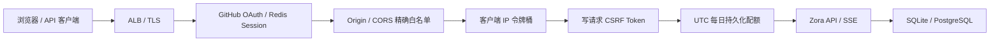

# 部署前 API 安全与 Secret 管理

本文对应 Zora V0.12。目标不是替代公网入口的 WAF 与 TLS，而是在应用内部建立一条可验证的多用户、多副本安全边界。阿里云完整操作顺序见[阿里云生产部署 Runbook](aliyun-deployment.md)。

## 1. 请求经过的安全链



处理顺序有明确含义：非法跨源请求最先拒绝；限流削减瞬时攻击；CSRF 在扣减业务配额前校验；配额通过数据库原子语句检查并扣减。`/api/health` 和 `/api/security/csrf` 不消耗业务配额。

## 2. 限流与每日配额

```bash
ZORA_RATE_LIMIT_ENABLED=true
ZORA_RATE_LIMIT_REQUESTS_PER_SECOND=10
ZORA_RATE_LIMIT_BURST=20
ZORA_DAILY_REQUEST_QUOTA=10000
ZORA_DAILY_CHAT_QUOTA=500
ZORA_DAILY_UPLOAD_BYTES_QUOTA=104857600
```

- 令牌桶按客户端 IP 工作；配置 Redis/Tair 后由 Lua 原子执行，多个副本共享同一状态。入口仍建议增加更粗粒度 WAF/网关限流。
- 每日配额保存到 `api_usage_daily`。登录模式按可信 `tenant + principal + resource` 隔离，本地模式才退回 `principal + client IP`，重启不会清零。
- PostgreSQL 通过 `INSERT ... ON CONFLICT ... WHERE` 原子扣减；SQLite 使用单连接和同等条件更新。
- `0` 表示不限制。命中限制返回 `429`、中文错误、`Retry-After` 和 `X-RateLimit-*`。
- 上传配额按 HTTP 请求体字节扣减；无法预知长度的 chunked 上传按接口最大请求体预占。

启用 GitHub 登录后，应用使用 GitHub 稳定数字 ID 生成可信 principal/tenant；客户端 Header 不能覆盖身份。未启用登录时仍是本地单用户模式。

## 3. CSRF 与 CORS

```bash
ZORA_CSRF_ENABLED=true
ZORA_COOKIE_SECURE=true
ZORA_CORS_ALLOWED_ORIGINS=https://zora.example.com,https://admin.example.com
```

Web 首次写请求前调用 `GET /api/security/csrf`。服务端生成 256 bit 随机 Token，同时返回 JSON 和 `HttpOnly; SameSite=Strict` Cookie；前端只把 JSON Token 保存在内存，并在 POST/PUT/PATCH/DELETE 的 `X-CSRF-Token` 中回传。Token 不写入 localStorage。OAuth 登录、回调和 CSRF Token 接口也受 IP 令牌桶保护，只有 liveness/readiness 探针绕过业务限流。

CORS 不支持 `*`。没有 `Origin` 的服务端客户端可以访问；有 `Origin` 时，只允许当前同源或显式白名单。跨源访问会返回精确的 `Access-Control-Allow-Origin` 并带 `Vary: Origin`。

HTTPS 生产环境必须设置 `ZORA_COOKIE_SECURE=true`。应用本身不终止 TLS，推荐在 Caddy、Nginx、Ingress 或云负载均衡器完成 TLS。
服务端仅在直接 TLS 或可信代理声明 HTTPS 时返回 HSTS，同时统一设置 CSP、`frame-ancestors 'none'`、`X-Frame-Options: DENY`、Referrer Policy 和最小 Permissions Policy；本地 HTTP 不发送 HSTS，避免污染开发域名。

## 4. 可信反向代理

默认忽略 `X-Forwarded-For` 与 `X-Forwarded-Proto`，防止客户端伪造地址绕过限流或同源判断。只有直连地址落在以下 CIDR 时才接受代理头：

```bash
ZORA_TRUSTED_PROXY_CIDRS=10.20.1.0/24
```

这里必须填写实际代理出口网段，不要为了省事配置 `0.0.0.0/0` 或整个 VPC 大网段。代理应覆盖并清理来自公网的 Forwarded Header；production 启动校验会拒绝空值和 `/0`。

## 5. Secret 文件注入

以下核心敏感值同时支持直接环境变量与 `_FILE`：

| 直接变量 | Secret 文件变量 |
|---|---|
| `ZORA_API_KEY` | `ZORA_API_KEY_FILE` |
| `ZORA_EMBEDDING_API_KEY` | `ZORA_EMBEDDING_API_KEY_FILE` |
| `ZORA_POSTGRES_DSN` | `ZORA_POSTGRES_DSN_FILE` |
| `ZORA_REDIS_URL` | `ZORA_REDIS_URL_FILE` |
| `ZORA_GITHUB_OAUTH_CLIENT_SECRET` | `ZORA_GITHUB_OAUTH_CLIENT_SECRET_FILE` |
| `ZORA_METRICS_TOKEN` | `ZORA_METRICS_TOKEN_FILE` |
| 任意模型 `api_key_env`，如 `ZORA_LLM_API_KEY` | 自动识别 `ZORA_LLM_API_KEY_FILE` |

规则：

1. 同一 Secret 的直接值和文件不能同时配置，避免轮换时读取来源不明确；
2. 文件必须是普通文件、非空且不超过 64 KiB；
3. Unix 权限不能向 group/other 开放，使用 `0400` 或 `0600`；
4. Key 不进入模型配置 JSON、API 响应、RunEvent 或启动日志；
5. Kubernetes/Docker/云 Secret 应以文件挂载，并由运行 Zora 的 UID 持有。

LLM/Embedding 的模型名、供应商地址、维度等部署元数据可进一步放入 `ZORA_AI_CONFIG_FILE`。该文件与 Secret 使用相同的普通文件、64 KiB 和 0400/0600 权限约束，但内部只能保存 `api_key_env` 引用。配置文件与旧模型环境变量不能同时启用，防止最终来源不明确；修改后通过重启或滚动重启原子生效。

production 还会要求 metrics token 至少 32 字符，Redis/Tair 使用带密码的 `rediss://`，避免弱凭据或明文连接误上线。

## 6. API 客户端调试

启用 CSRF 后，非浏览器写请求也需要先取 Cookie 与 Token：

```bash
curl -sS -c /tmp/zora-cookie http://localhost:8088/api/security/csrf
curl -sS -b /tmp/zora-cookie \
  -H 'Content-Type: application/json' \
  -H 'X-CSRF-Token: 将上一步 JSON 中的 token 填在这里' \
  -d '{"title":"部署验证"}' \
  http://localhost:8088/api/conversations
```

不要把 Cookie 文件或 Token 提交到仓库。

## 7. 已完成与云侧待验收

应用代码已完成 GitHub OAuth + PKCE、Redis 服务端 Session、tenant/principal 查询隔离、Redis 分布式令牌桶、PostgreSQL 跨副本会话锁、Bearer 保护的 `/metrics` 与依赖感知 `/api/ready`。

仍需在真实阿里云 staging 完成 HTTPS/ALB、RDS 备份恢复、Tair TLS、Secret 轮换、费用告警，以及 CORS、CSRF、429、配额重置和双账号隔离的负向验证。这些是外部环境验收，仓库内测试不能替代。
