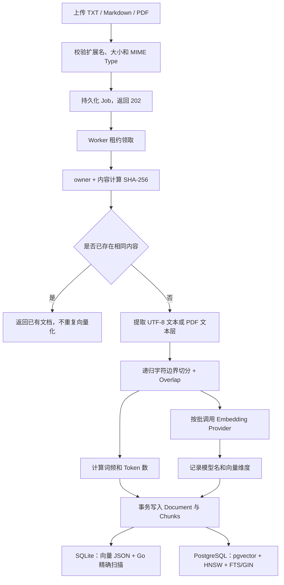
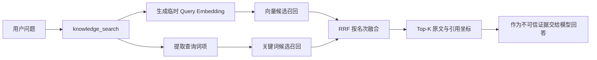
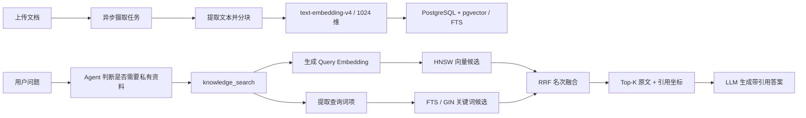
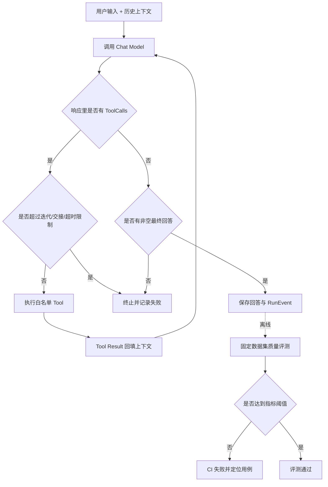

# 面试问题总结

本文只记录项目开发和复习过程中实际提出过的问题，不为了凑数量补充假想题。问题按向量检索、RAG、ReAct、多 Agent、长期记忆、可靠性等模块逐步归档；某个模块还没有实际问题时，不预先创建空题目。

每道题包含“面试简答”和“结合 Zora 的详细解释”。前者用于面试现场快速作答，后者用于理解代码和应对追问。

## 一、向量检索

### 1. 现在是怎么切分文档和存储向量的？流程？

#### 面试简答

Zora 当前采用持久化异步摄取流程。用户上传 TXT、Markdown 或带文本层的 PDF 后，HTTP 层先校验并把文件写入 `knowledge_ingestion` Job，立即返回 202。独立 Worker 领取任务后按 `owner + 文件内容` 计算 SHA-256 去重并提取纯文本。文本按 Unicode 字符切分，默认每块最多 800 个字符、相邻块重叠 120 个字符；切分时依次优先选择 Markdown 标题、段落、换行、句末和空格，实在找不到边界才硬切。

每个分块批量调用 Embedding Provider 生成向量，同时计算关键词词频。最后在一个数据库事务中写入文档元数据和全部分块。SQLite 将向量序列化为 JSON 文本，检索时在 Go 进程内做精确余弦计算；PostgreSQL 使用 `pgvector vector(n)` 保存向量，并建立 HNSW 索引，同时用 FTS/GIN 支持关键词召回。

#### 完整流程



具体分为以下步骤：

1. **接收与校验文件**

   HTTP 层接收 `multipart/form-data` 的 `file` 字段，仅允许 `.txt`、`.md`、`.markdown` 和 `.pdf`，单文件最大 5 MiB，然后创建持久化摄取任务。内容哈希吸收入队重试，Worker 成功后清空任务中的原文件 Payload。

2. **内容去重与权限隔离**

   系统使用 `SHA-256(principalID + 分隔符 + 原始内容)` 生成 `content_hash`。把 owner 放进哈希命名空间，是为了避免不同用户上传相同私有文件时互相感知去重结果。命中相同内容后不会再次分块和调用 Embedding API；但会检查旧文档的模型名和维度是否与当前配置一致。

3. **文本提取**

   TXT 和 Markdown 要求是合法 UTF-8，直接读取文本；PDF 只提取已有文本层，当前不支持 OCR。若 PDF 没有可提取文本，会返回明确错误，而不是创建空索引。

4. **按 Unicode 字符分块**

   默认配置为：

   ```text
   ZORA_KNOWLEDGE_CHUNK_SIZE=800
   ZORA_KNOWLEDGE_CHUNK_OVERLAP=120
   ```

   这里按 `rune` 而不是字节计数，避免 UTF-8 中文字符被从中间截断。每次在区间后半段向前寻找边界，优先级依次为：

   ```text
   Markdown 标题 → 空行/段落 → 换行 → 中英文句末 → 空白 → 硬切
   ```

   相邻块保留 120 个字符的重叠，降低关键信息刚好落在边界两侧导致召回失败的概率。每个 Chunk 同时保存 `ordinal`、`start_rune` 和 `end_rune`，用于回答中的原文定位和引用。

5. **生成检索特征**

   所有分块文本交给统一的 `Embedder` 接口。真实 `text-embedding-v4` 通过 OpenAI-compatible `/embeddings` 接口调用，当前每批最多发送 10 个分块；返回结果会校验数量、顺序和维度，并做 L2 归一化。系统还为每块计算词频和 Token 数，为 BM25/FTS 关键词检索提供数据。

6. **事务写入**

   `knowledge_documents` 保存文档级信息，包括 owner、可见性、版本、是否最新版、Embedding 模型和维度；`knowledge_chunks` 保存原文、引用坐标、向量和关键词特征。文档元数据与全部 Chunk 在同一事务中提交，避免出现“文档存在但只写入一部分向量”的中间状态。

7. **不同存储后端的物理形式**

   | 后端 | 向量保存方式 | 向量检索方式 | 适用场景 |
   |---|---|---|---|
   | SQLite | `[]float64` 序列化为 JSON 文本 | 读取最多 10,000 个可见最新版 Chunk，在 Go 内做精确余弦计算 | 本地开发、演示、测试 |
   | PostgreSQL | `pgvector vector(n)` | HNSW + cosine distance，在数据库侧召回前 50 个候选 | 数据量更大、生产化部署 |

需要注意：SQLite 模式虽然保存了向量并支持向量检索，但严格来说不是专用“向量数据库”；真正使用 pgvector 索引的是 PostgreSQL 模式。

#### 关键代码位置

| 代码 | 作用 |
|---|---|
| [`internal/httpapi/server.go`](../internal/httpapi/server.go) 的 `uploadKnowledgeDocument` | 接收和校验上传文件 |
| [`internal/knowledge/service.go`](../internal/knowledge/service.go) 的 `Ingest` | 去重、解析、分块、向量化和持久化总流程 |
| [`internal/knowledge/chunker.go`](../internal/knowledge/chunker.go) 的 `ChunkText` | Unicode、递归边界和 Overlap 分块 |
| [`internal/knowledge/embedder.go`](../internal/knowledge/embedder.go) | Hash/真实 Embedding 统一接口与批量请求 |
| [`internal/store/sqlite/sqlite.go`](../internal/store/sqlite/sqlite.go) 的 `CreateDocument` | SQLite 文档与向量事务写入 |
| [`internal/store/postgres/knowledge.go`](../internal/store/postgres/knowledge.go) 的 `CreateDocument` | PostgreSQL + pgvector 写入 |
| [`internal/store/postgres/schema.go`](../internal/store/postgres/schema.go) | `vector(n)`、HNSW 和 FTS/GIN 表结构 |

---

### 2. 读写向量库的时机分别是什么？如何区分文档向量和普通对话过程中存储的向量？有区分吗？

#### 面试简答

现在有三套物理隔离的索引：知识库分块在 `knowledge_chunks`，普通消息在 `message_embeddings`，长期记忆在 `memory_embeddings`。原始业务表 `messages` 和 `memories` 仍是真实数据源，向量表只是可以重建的派生索引。三套索引都显式记录 Embedding 模型、维度；消息和记忆还记录 `index_version`，因此不会把生命周期和召回目标不同的数据混在一个无类型集合里。

文档向量在摄取时写入；每轮对话成功后，持久化 Capture Worker 批量写入用户与助手消息向量；长期记忆在手工创建、修改或自动合并时与业务记录同事务写入向量。读取时，RAG 查询文档索引，跨会话历史只查询其他会话的用户消息，Memory 则用“词项或向量相关性 + 重要性 + 时效性”召回。查询向量只在当前请求中使用，不落库。

#### 向量写入时机

| 场景 | 是否写持久化向量 | 说明 |
|---|---:|---|
| 上传一份新知识库文档 | 异步写 | HTTP 返回 Job；Worker 解析分块后生成全部 Chunk 向量并事务写入 |
| 上传内容完全相同的文档 | 否 | 命中 `content_hash` 去重，直接返回已有文档 |
| 上传同名但内容不同的文档 | 是 | 创建新版本，新 Chunk 使用当前 Embedding 重新生成 |
| 服务启动 | 否 | 当前不会在启动时自动重建全部索引 |
| 普通用户/助手消息落库 | 异步写 | 回答与 Capture Job 原子提交，Worker 批量更新 `message_embeddings` |
| 自动提取或手工维护长期记忆 | 是 | `memories` 与 `memory_embeddings` 同事务创建或更新 |
| RAG 离线评测 | 是，但仅写临时库 | 每次在隔离临时数据库中重新摄取固定语料，评测结束后删除 |
| 历史数据重建 | 是 | `POST /api/semantic/reindex` 从原始消息和记忆幂等重建派生索引 |

更换 Embedding 模型或维度后，旧向量不能与新向量直接比较。文档记录 `embedding_model` 和 `embedding_dimensions`，Chunk 记录 `embedding_model`，并由实际向量长度或 PostgreSQL `vector(n)` 列约束维度。发现不一致时系统返回 `ErrEmbeddingMismatch`，要求重建或重新上传，而不是静默混用两个向量空间。

#### 向量读取时机

文档向量读取入口有两个：

1. 用户直接调用 `POST /api/knowledge/search`；
2. Agent 判断问题涉及上传文档，调用 `knowledge_search` 工具。

线上默认采用 Hybrid 检索：



- **Vector/Hybrid 模式**：为当前查询生成一个临时向量，再与已保存的文档 Chunk 向量比较；该 Query Embedding 生命周期只到本次请求结束。
- **Keyword 模式**：只使用词项和 BM25/FTS，不生成也不读取查询向量。
- **SQLite**：读取通过 ACL 和 `is_latest` 过滤后的 Chunk 及其向量，在 Go 内计算余弦相似度。
- **PostgreSQL**：把 Query Embedding 作为 SQL 参数传给 pgvector，数据库利用 HNSW 返回向量候选；关键词候选由 FTS/GIN 返回，再由 Service 使用 RRF 融合。

消息和记忆读取发生在 Chat 调用模型之前：消息检索排除当前会话并只回灌用户原话，避免把旧助手回答当成新事实；记忆检索用向量补充原有词项相关性。两类正文都编码为“不可信背景数据”的独立 System Message，RunEvent 只记录 ID 和分数，不复制正文。

#### 文档、对话和记忆的数据边界

| 数据 | 表 | 当前是否包含向量 | 用途 |
|---|---|---:|---|
| 知识库文档元数据 | `knowledge_documents` | 否，只记录模型名和维度 | 版本、ACL、去重和索引兼容性 |
| 文档分块 | `knowledge_chunks` | 是 | RAG 向量/关键词召回与引用 |
| 普通对话 | `messages` + `message_embeddings` | 是，派生表独立存储 | 当前会话原文、跨会话用户历史语义召回 |
| 会话摘要 | `conversation_summaries` | 否 | 长上下文压缩 |
| 长期记忆 | `memories` + `memory_embeddings` | 是，派生表独立存储 | 词项/向量、重要性和时效性联合召回 |
| 查询向量 | 不落表 | 临时变量 | 当前一次 Vector/Hybrid 检索 |

因此区分不是靠调用方临时传一个容易漏掉的 `vector_type`，而是靠**不同表、外键、Store 方法和检索入口**共同保证。切换模型、维度或索引版本时，查询只命中完全匹配的向量空间；历史数据可从原始实体重建。

#### 关键代码位置

| 代码 | 作用 |
|---|---|
| [`internal/knowledge/service.go`](../internal/knowledge/service.go) 的 `SearchWithMode` | 决定何时生成 Query Embedding，以及 SQLite/PostgreSQL 两条读取路径 |
| [`internal/knowledge/tool.go`](../internal/knowledge/tool.go) | 将默认 Hybrid 检索注册成 `knowledge_search` Agent 工具 |
| [`internal/store/sqlite/sqlite.go`](../internal/store/sqlite/sqlite.go) 的 `ListChunks` | 读取可见最新版 Chunk，在应用层精确扫描 |
| [`internal/store/postgres/knowledge.go`](../internal/store/postgres/knowledge.go) 的 `SearchCandidates` | pgvector 和 FTS 候选召回 |
| [`internal/semantic/service.go`](../internal/semantic/service.go) | 消息/记忆向量化、语义查询与历史重建 |
| [`internal/store/sqlite/semantic.go`](../internal/store/sqlite/semantic.go) | SQLite 两套索引的精确扫描实现 |
| [`internal/store/postgres/semantic.go`](../internal/store/postgres/semantic.go) | PostgreSQL 两套 pgvector 查询实现 |
| [`internal/memory/retriever.go`](../internal/memory/retriever.go) | 词项/向量相关性、重要性和时效性联合召回 |
| [`internal/memory/capture_worker.go`](../internal/memory/capture_worker.go) | 回答后批量写入消息向量 |

---

## 二、RAG

### 1. 你这个项目中 RAG 现在是怎么实现的？用的什么向量模型，用的什么数据库？

#### 面试简答

Zora 现在实现的是一套 **Agent 工具驱动的 Hybrid RAG**，不是每轮对话都固定检索。文档上传后由后台 Worker 提取文本，按默认 800 个 Unicode 字符、120 个字符重叠进行分块，再用 OpenAI-compatible Embedding 接口批量向量化。当前真实配置使用 `text-embedding-v4`，向量维度是 1024。

在线问答时，Agent 判断问题涉及用户上传的资料后调用 `knowledge_search`。系统用同一个 Embedding 模型生成查询向量，同时提取关键词；在 PostgreSQL 中分别用 pgvector 的 HNSW 做余弦向量召回、用 FTS + GIN 做关键词召回，两路各取最多 50 个候选，再在 Service 层用 RRF 按名次融合，默认返回前 5 个证据分块。证据包含文档名、分块编号和原文坐标，模型基于这些证据生成带引用的答案。

数据库的生产方案是 **PostgreSQL + pgvector**：`knowledge_documents` 保存文档、版本和权限元数据，`knowledge_chunks` 保存原文、`vector(1024)` 向量与全文检索字段。项目同时保留 SQLite 作为本地开发和测试后端；SQLite 把向量保存为 JSON，并在 Go 进程内做精确余弦和 BM25 计算，所以它不是专用向量数据库。

#### 详细实现



1. **离线摄取**

   HTTP 层接收 TXT、Markdown 或带文本层的 PDF，校验后创建持久化 `knowledge_ingestion` Job 并立即返回 202。Worker 按 `owner + 文件内容` 计算 SHA-256 去重，提取纯文本后做递归字符边界分块。默认 Chunk Size 是 800、Overlap 是 120，既避免中文 UTF-8 被切坏，也减少关键信息落在分块边界上的损失。

2. **向量模型**

   当前真实配置为：

   | 配置项 | 当前值 |
   |---|---|
   | Provider 协议 | OpenAI-compatible `/embeddings` |
   | 模型 | `text-embedding-v4` |
   | 维度 | 1024 |
   | 单批大小 | 最多 10 个分块 |
   | 相似度 | L2 归一化后计算 cosine similarity |

   文档分块和查询必须使用同一个模型与维度。模型名和维度会随文档保存；发现旧索引不兼容时直接返回 `ErrEmbeddingMismatch`，要求重建索引，而不是跨向量空间比较。代码还提供确定性的 Hash Embedding，但它只用于零密钥开发和链路测试，不代表真实语义检索效果。

3. **在线召回与融合**

   线上默认使用 Hybrid 模式：查询同时走向量和关键词两路召回。PostgreSQL 侧用 `embedding <=> query_vector` 做 cosine distance 排序，HNSW 加速向量 Top-N；关键词侧使用 `tsvector`、GIN 和 `ts_rank_cd`。两路分数的量纲不同，因此不直接相加，而是使用 `RRF(k=60)` 融合名次。`knowledge_search` 默认返回 5 个结果、最多返回 8 个；当前没有单独的 Cross-Encoder Reranker。

4. **权限、版本和引用**

   SQL 候选查询只允许命中当前租户内“本人所有或公开”的最新版文档，ACL 和 `is_latest` 过滤发生在召回阶段，避免先取出越权内容再做应用层过滤。每个检索结果保留 `document_name`、`ordinal`、`start_rune`、`end_rune` 和原文，Agent 的工具说明要求最终答案引用文档名与分块编号。多 Agent 模式下则由 `document_agent` 强制调用 `knowledge_search`，Supervisor 不直接访问底层知识库工具。

5. **数据库后端**

   | 后端 | 文档向量存储 | 召回方式 | 定位 |
   |---|---|---|---|
   | PostgreSQL + pgvector | `knowledge_chunks.embedding vector(1024)` | HNSW 向量召回 + FTS/GIN 关键词召回 | 当前生产化方案 |
   | SQLite | JSON 文本 | Go 内最多扫描 10,000 个可见 Chunk，计算余弦与 BM25 | 本地开发、演示和测试 |

所以面试中如果只问“用了什么向量库”，可以回答：**生产方案使用 PostgreSQL 的 pgvector 扩展，不是单独部署 Milvus、Pinecone 之类的向量数据库；本地模式则使用 SQLite 精确扫描。**

#### 关键代码位置

| 代码 | 作用 |
|---|---|
| [`cmd/zora/main.go`](../cmd/zora/main.go) | 装配 Embedding、知识库 Service 和 `knowledge_search` 工具 |
| [`internal/knowledge/service.go`](../internal/knowledge/service.go) | 文档摄取、查询向量化、Hybrid 检索和 RRF 融合 |
| [`internal/knowledge/embedder.go`](../internal/knowledge/embedder.go) | `text-embedding-v4` 的 OpenAI-compatible 调用及 Hash 测试实现 |
| [`internal/knowledge/tool.go`](../internal/knowledge/tool.go) | 将检索注册为 Agent 工具并返回引用信息 |
| [`internal/store/postgres/knowledge.go`](../internal/store/postgres/knowledge.go) | pgvector HNSW 与 PostgreSQL FTS 候选召回 |
| [`internal/store/postgres/schema.go`](../internal/store/postgres/schema.go) | `vector(n)`、HNSW、`tsvector` 和 GIN 表结构 |
| [`internal/store/sqlite/sqlite.go`](../internal/store/sqlite/sqlite.go) | SQLite JSON 向量存储与精确扫描后端 |
| [`internal/agentruntime/multi_agent.go`](../internal/agentruntime/multi_agent.go) | 多 Agent 模式下 Document Agent 的 RAG 工具边界 |

---

## 三、评估量化

### 1. 怎么判断回答的是否有问题？是否需要下轮循环继续？是通过 Prompt 吗？

#### 面试简答

这里要区分**单次请求内的 ReAct 循环**和**回答质量评估**。

单次请求内是否继续，不是先生成答案、再用一个 Prompt 打分决定。模型本轮如果返回结构化 `ToolCalls`，Eino 就执行工具，把 Tool Result 回填上下文，再调用模型进入下一轮；模型不再调用工具并输出最终 Assistant 文本时，本次 ReAct 结束。所以 Prompt 和 Tool Description 会影响模型“该不该查工具”的判断，但真正驱动状态转换的是结构化 Tool Call，不是解析一段“继续/停止”的自然语言。

系统还有确定性的工程兜底：默认 `MaxIterations=8`，并受请求超时、Context 取消、工具/模型错误、空回答校验约束；多 Agent 另外限制交接次数、并发数和专业 Agent 超时。这些能发现执行异常和无限循环，但不能证明答案在语义上正确。

Zora 当前**没有在线 Critic/LLM Judge 自动审查最终答案并触发重答**。语义质量通过固定数据集离线评测：检查检索命中、预期事实、有效引用和证据支持度，低于阈值时评测命令返回非零状态用于 CI 门禁，而不是在用户请求中自动无限重试。开放式幻觉目前仍需要真实模型评测集、人工抽检，或者未来接入经过校准的 LLM Judge。

#### 运行时循环如何决定下一步



具体分为三层：

1. **模型决策层**

   System Prompt、Agent Instruction 和 Tool Description 告诉模型何时应该查知识库、计算、调用专业 Agent，以及证据不足时应如何回答。这一层是概率性的策略引导。例如 Document Agent 的 Prompt 明确要求先调用 `knowledge_search`，Supervisor 的 Prompt 规定私有资料必须交给 Document Agent。

2. **框架状态层**

   Eino 根据 Assistant Message 中是否存在结构化 Tool Call 决定是否进入下一轮。存在 Tool Call 就执行工具并把结果作为 Tool Message 回填；不存在 Tool Call 时，把模型文本视为最终回答。`finish_reason` 和模型 Usage 会被记录用于审计，但 Zora 没有依靠某个 Prompt 字段手写循环状态机。

3. **确定性控制与质量层**

   | 判断对象 | 当前机制 | 是否依赖 Prompt |
   |---|---|---:|
   | 是否调用工具、调用哪个工具 | 模型根据 Prompt、工具描述和上下文生成 Tool Call | 是，Prompt 影响决策 |
   | 是否进入下一轮 ReAct | 是否产生结构化 Tool Call | 否，由框架读取结构化响应 |
   | 防止无限调用 | `MaxIterations`，默认 8，允许配置 1–50 | 否 |
   | 模型/工具失败、请求取消 | Error、Context、Timeout | 否 |
   | 最终回答为空 | Runtime 返回 `Agent 未返回助手回答` | 否 |
   | 回答事实和引用是否正确 | 离线固定数据集、锚点和阈值门禁 | 否，不在当前在线循环中 |
   | 开放式语义或标注外幻觉 | 当前依赖人工抽检；可扩展校准后的 LLM Judge | 当前未实现 |

当前没有加“生成 → Critic 打分 → 重写”的在线循环，是因为 Judge 本身也可能误判，而且会增加一次或多次模型调用、延迟与费用。若后续增加，应把验证结果设计成严格结构化输出，限定重试次数，并让引用核验、Schema 校验等确定性检查优先于 LLM Judge。

#### 关键代码位置

| 代码 | 作用 |
|---|---|
| [`internal/agentruntime/runtime.go`](../internal/agentruntime/runtime.go) | 组装 Eino Agent、消费模型/工具事件并校验非空最终回答 |
| [`internal/agentruntime/multi_agent.go`](../internal/agentruntime/multi_agent.go) | Supervisor 与专业 Agent 的 Prompt、工具边界和循环上限 |
| [`internal/agentruntime/execution_control.go`](../internal/agentruntime/execution_control.go) | 多 Agent 交接、并发、超时和重试控制 |
| [`internal/config/config.go`](../internal/config/config.go) | `ZORA_MAX_ITERATIONS` 等确定性限制 |
| [`internal/rageval/answer.go`](../internal/rageval/answer.go) | 回答事实、引用和证据支持的离线检查 |

---

### 2. 你项目中量化评估的指标有哪些？

#### 面试简答

Zora 没有用一个模糊的“总分”评价所有能力，而是把指标分成四层：

- **RAG 检索层**：`Recall@K`、MRR、Hit Rate、平均检索延迟，并对比 Hybrid 相对 Vector 和 Keyword 的增益；
- **RAG 答案层**：事实覆盖率、有效引用覆盖率、引用忠实度；
- **能力 A/B 层**：Memory 的预期召回率、意外召回率、事实覆盖增益和污染率；多 Agent 的路由准确率、意外 Agent 调用率、答案完成率、质量增益、延迟比和调用次数比；
- **运行效率与成本层**：总耗时、首 Token 延迟、模型/工具调用次数与耗时、Agent 交接次数与耗时，以及 Provider 返回的 Prompt、Completion、Cached、Reasoning 和 Total Token。

评测使用版本化固定数据集，在隔离临时数据库中走和线上相同的 Service、Agent 和 Tool 链路。每个指标在数据集中配置上下限，未达门槛时 CLI 输出失败报告并以非零状态退出。当前答案质量主要使用规范化字符串锚点，优点是稳定、零额外 Judge 费用且容易定位失败；缺点是对同义表达和标注外幻觉覆盖有限。

#### RAG 检索指标

| 指标 | 定义 | 说明 |
|---|---|---|
| `Recall@K` | Top-K 中覆盖的唯一相关文档数 ÷ 标注相关文档总数 | 判断该找的证据有没有找全 |
| MRR | 第一个相关结果排名的倒数，再对问题取平均 | 越早出现相关证据，得分越高 |
| Hit Rate | Top-K 至少命中一个相关文档的问题数 ÷ 总问题数 | 适合观察“有没有命中” |
| `average_latency_ms` | 所有问题的平均检索耗时 | 不包含固定语料摄取时间 |
| Hybrid Delta | Hybrid 的 Recall/MRR 减去 Vector 或 Keyword 的结果 | 判断混合检索是否真的优于单路 |

检索评测会对同一批问题分别运行 `vector`、`keyword`、`hybrid`，最终门禁主要检查线上使用的 Hybrid Recall@K 和 MRR。

#### RAG 答案指标

| 指标 | 定义 | 主要防止的问题 |
|---|---|---|
| `fact_coverage` | 答案中出现的预期事实数 ÷ 标注事实总数 | 检索到了但回答漏掉关键事实 |
| `citation_coverage` | 带本次有效引用的已出现事实数 ÷ 已出现事实数 | 有事实却不给证据，或伪造未检索到的引用 |
| `citation_faithfulness` | 能被所引原文锚点支持的事实数 ÷ 带有效引用的事实数 | 引用了文档，但原文并不支持结论 |

有效引用必须能解析为本次 `knowledge_search` 真正返回的 `[文档名#分块编号]`，只满足引用格式但没有对应 Tool Evidence 不能得分。检索门禁和答案门禁采用逻辑与：任一层不合格，整份 RAG 报告都不通过。

#### Memory Control/Treatment 指标

| 指标 | 含义 |
|---|---|
| Memory `Recall@K` | Treatment 实际注入的预期 Memory 数 ÷ 标注预期 Memory 数 |
| `unexpected_recall_rate` | 意外 Memory 数 ÷ Treatment 召回 Memory 总数 |
| Treatment Fact Coverage | 开启 Memory 后答案覆盖预期个性化事实的比例 |
| Fact Coverage Delta | Treatment Fact Coverage − Control Fact Coverage |
| Forbidden Fact Rate | 硬负例答案中出现禁止污染事实的比例 |
| Average Latency / Overhead | Control、Treatment 平均延迟及两者差值 |

Control 完全关闭召回，Treatment 开启召回，两组都通过真实 `chat.Send → Eino Runtime → RunEvent` 链路。Control 如果出现任何 Memory Recall 也会直接失败，这能发现实验组隔离错误。

#### 单 Agent / 多 Agent 指标

| 指标 | 含义 |
|---|---|
| `route_accuracy` | 实际专业 Agent 调用序列与标注序列完全一致的问题比例 |
| `unexpected_agent_rate` | 非预期专业 Agent 调用数 ÷ 实际交接总数 |
| `answer_completion` | 非空且包含预期事实锚点的答案比例 |
| `average_latency_ms` | 多 Agent 每题平均端到端耗时 |
| `quality_gain` | Multi-Agent Treatment 答案锚点覆盖 − Single-Agent Control |
| `latency_ratio` | Treatment 平均延迟 ÷ Control 平均延迟 |
| `invocation_ratio` | Treatment 平均调用次数 ÷ Control 平均调用次数 |

这里的调用次数用“根 Agent + 专业 Agent 交接数”作为稳定成本代理，不把它伪装成真实 Token 成本；接真实 Provider 后，费用分析仍以 ResponseMeta 返回的 Token Usage 为准。

#### 线上运行与成本指标

离线质量评测之外，每个 Agent Run 还从持久化 RunEvent 聚合以下可核对指标：

| 类别 | 指标 |
|---|---|
| 延迟 | 总耗时、TTFT、模型耗时、工具总/最大耗时、Agent 交接总/最大耗时 |
| 调用 | 模型调用数、工具调用/完成数、Agent 交接/完成数、Embedding 调用和输入数 |
| Token | Prompt、Completion、Total、Cached、Reasoning Token |
| 完整性 | `usage_reported_calls`、`usage_complete`，明确标识 Provider 是否为每次调用返回 Usage |
| 后台任务 | Memory Capture 和文档摄取/摘要任务的执行次数、耗时、排队延迟与状态 |

Token 只统计 Provider 真实返回值；如果某次调用没有 Usage，就标记 `usage_complete=false`，不会按字符数估算一个看似精确的成本。Prometheus 指标使用有限的 provider、model、tool、status 等低基数标签，Prompt、正文和 Run ID 不进入 Metric Label。

#### 评测边界

当前固定锚点评测擅长发现回归、漏答、错误引用、路由错误和上下文污染，但它不能完整判断自由文本的同义改写，也不能发现所有标注之外的幻觉。因此项目把它定位为**稳定的自动化回归下限**，不是对真实回答质量的绝对证明。真实上线还需要扩充真实业务数据集、按风险分层人工抽检，并在有标注集校准后再考虑引入 LLM Judge。

#### 关键代码位置

| 代码 | 作用 |
|---|---|
| [`internal/rageval/evaluator.go`](../internal/rageval/evaluator.go) | Recall@K、MRR、Hit Rate、检索延迟和三种模式对比 |
| [`internal/rageval/answer.go`](../internal/rageval/answer.go) | 事实覆盖、有效引用覆盖和引用忠实度 |
| [`internal/memoryeval/evaluator.go`](../internal/memoryeval/evaluator.go) | Memory Control/Treatment 召回、污染、覆盖率和延迟指标 |
| [`internal/agentseval/evaluator.go`](../internal/agentseval/evaluator.go) | 多 Agent 路由指标及单/多 Agent 质量、延迟、调用比 |
| [`internal/observability/metrics.go`](../internal/observability/metrics.go) | 从 RunEvent 重建每次运行的延迟、调用和 Token 指标 |
| [`internal/observability/telemetry.go`](../internal/observability/telemetry.go) | Prometheus 指标定义与低基数导出 |
| [`cmd/zora-eval`](../cmd/zora-eval) | RAG 评测命令和联合门禁 |
| [`cmd/zora-memory-eval`](../cmd/zora-memory-eval) | Memory A/B 评测命令 |
| [`cmd/zora-agent-eval`](../cmd/zora-agent-eval) | 单 Agent / 多 Agent 对照评测命令 |
| [`evals`](../evals) | 固定语料、问题、标注事实和阈值 |
