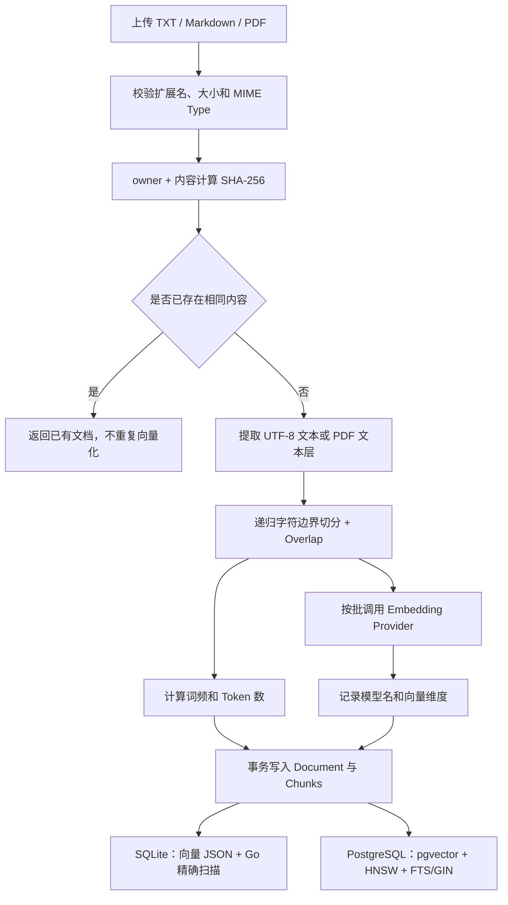
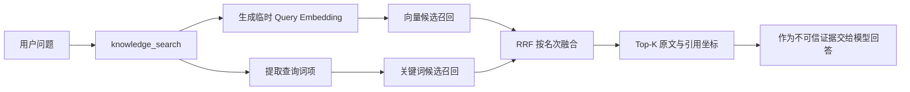

# 面试问题总结

本文只记录项目开发和复习过程中实际提出过的问题，不为了凑数量补充假想题。问题按向量检索、RAG、ReAct、多 Agent、长期记忆、可靠性等模块逐步归档；某个模块还没有实际问题时，不预先创建空题目。

每道题包含“面试简答”和“结合 Zora 的详细解释”。前者用于面试现场快速作答，后者用于理解代码和应对追问。

## 一、向量检索

### 1. 现在是怎么切分文档和存储向量的？流程？

#### 面试简答

Zora 当前采用同步摄取流程。用户上传 TXT、Markdown 或带文本层的 PDF 后，服务先校验文件并按 `owner + 文件内容` 计算 SHA-256 去重，再提取纯文本。文本按 Unicode 字符切分，默认每块最多 800 个字符、相邻块重叠 120 个字符；切分时依次优先选择 Markdown 标题、段落、换行、句末和空格，实在找不到边界才硬切。

每个分块批量调用 Embedding Provider 生成向量，同时计算关键词词频。最后在一个数据库事务中写入文档元数据和全部分块。SQLite 将向量序列化为 JSON 文本，检索时在 Go 进程内做精确余弦计算；PostgreSQL 使用 `pgvector vector(n)` 保存向量，并建立 HNSW 索引，同时用 FTS/GIN 支持关键词召回。

#### 完整流程



具体分为以下步骤：

1. **接收与校验文件**

   HTTP 层接收 `multipart/form-data` 的 `file` 字段，仅允许 `.txt`、`.md`、`.markdown` 和 `.pdf`，单文件最大 5 MiB，然后调用知识库的 `Ingest` 用例。

2. **内容去重与权限隔离**

   系统使用 `SHA-256(principalID + 分隔符 + 原始内容)` 生成 `content_hash`。把 owner 放进哈希命名空间，是为了避免不同用户上传相同私有文件时互相感知去重结果。命中相同内容后不会再次分块和调用 Embedding API；但会检查旧文档的模型名和维度是否与当前配置一致。

3. **文本提取**

   TXT 和 Markdown 要求是合法 UTF-8，直接读取文本；PDF 只提取已有文本层，当前不支持 OCR。若 PDF 没有可提取文本，会返回明确错误，而不是创建空索引。

4. **按 Unicode 字符分块**

   默认配置为：

   ```text
   ZORA_KNOWLEDGE_CHUNK_SIZE=800
   ZORA_KNOWLEDGE_CHUNK_OVERLAP=120
   ```

   这里按 `rune` 而不是字节计数，避免 UTF-8 中文字符被从中间截断。每次在区间后半段向前寻找边界，优先级依次为：

   ```text
   Markdown 标题 → 空行/段落 → 换行 → 中英文句末 → 空白 → 硬切
   ```

   相邻块保留 120 个字符的重叠，降低关键信息刚好落在边界两侧导致召回失败的概率。每个 Chunk 同时保存 `ordinal`、`start_rune` 和 `end_rune`，用于回答中的原文定位和引用。

5. **生成检索特征**

   所有分块文本交给统一的 `Embedder` 接口。真实 `text-embedding-v4` 通过 OpenAI-compatible `/embeddings` 接口调用，当前每批最多发送 10 个分块；返回结果会校验数量、顺序和维度，并做 L2 归一化。系统还为每块计算词频和 Token 数，为 BM25/FTS 关键词检索提供数据。

6. **事务写入**

   `knowledge_documents` 保存文档级信息，包括 owner、可见性、版本、是否最新版、Embedding 模型和维度；`knowledge_chunks` 保存原文、引用坐标、向量和关键词特征。文档元数据与全部 Chunk 在同一事务中提交，避免出现“文档存在但只写入一部分向量”的中间状态。

7. **不同存储后端的物理形式**

   | 后端 | 向量保存方式 | 向量检索方式 | 适用场景 |
   |---|---|---|---|
   | SQLite | `[]float64` 序列化为 JSON 文本 | 读取最多 10,000 个可见最新版 Chunk，在 Go 内做精确余弦计算 | 本地开发、演示、测试 |
   | PostgreSQL | `pgvector vector(n)` | HNSW + cosine distance，在数据库侧召回前 50 个候选 | 数据量更大、生产化部署 |

需要注意：SQLite 模式虽然保存了向量并支持向量检索，但严格来说不是专用“向量数据库”；真正使用 pgvector 索引的是 PostgreSQL 模式。

#### 关键代码位置

| 代码 | 作用 |
|---|---|
| [`internal/httpapi/server.go`](../internal/httpapi/server.go) 的 `uploadKnowledgeDocument` | 接收和校验上传文件 |
| [`internal/knowledge/service.go`](../internal/knowledge/service.go) 的 `Ingest` | 去重、解析、分块、向量化和持久化总流程 |
| [`internal/knowledge/chunker.go`](../internal/knowledge/chunker.go) 的 `ChunkText` | Unicode、递归边界和 Overlap 分块 |
| [`internal/knowledge/embedder.go`](../internal/knowledge/embedder.go) | Hash/真实 Embedding 统一接口与批量请求 |
| [`internal/store/sqlite/sqlite.go`](../internal/store/sqlite/sqlite.go) 的 `CreateDocument` | SQLite 文档与向量事务写入 |
| [`internal/store/postgres/knowledge.go`](../internal/store/postgres/knowledge.go) 的 `CreateDocument` | PostgreSQL + pgvector 写入 |
| [`internal/store/postgres/schema.go`](../internal/store/postgres/schema.go) | `vector(n)`、HNSW 和 FTS/GIN 表结构 |

---

### 2. 读写向量库的时机分别是什么？如何区分文档向量和普通对话过程中存储的向量？有区分吗？

#### 面试简答

当前项目只有知识库文档分块会持久化向量，普通对话消息和长期记忆目前都不保存向量。因此系统不是通过一个 `vector_type` 字段区分两种向量，而是通过数据模型和表边界直接隔离：文档向量在 `knowledge_chunks`，消息在 `messages`，长期记忆在 `memories`。

写向量发生在新文档摄取时；读取文档向量发生在 Agent 调用 `knowledge_search` 或 REST 搜索接口时。检索问题也会临时生成 Query Embedding，但只用于当前请求的相似度计算，不写入数据库。纯关键词检索甚至不会调用 Embedding API。

#### 向量写入时机

| 场景 | 是否写持久化向量 | 说明 |
|---|---:|---|
| 上传一份新知识库文档 | 是 | 解析并分块后，一次生成全部 Chunk 向量并事务写入 |
| 上传内容完全相同的文档 | 否 | 命中 `content_hash` 去重，直接返回已有文档 |
| 上传同名但内容不同的文档 | 是 | 创建新版本，新 Chunk 使用当前 Embedding 重新生成 |
| 服务启动 | 否 | 当前不会在启动时自动重建全部索引 |
| 普通用户/助手消息落库 | 否 | 只写 `messages`，没有 embedding 列 |
| 自动提取或手工维护长期记忆 | 否 | 当前只写结构化 `memories` 文本和元数据 |
| RAG 离线评测 | 是，但仅写临时库 | 每次在隔离临时数据库中重新摄取固定语料，评测结束后删除 |

更换 Embedding 模型或维度后，旧向量不能与新向量直接比较。文档记录 `embedding_model` 和 `embedding_dimensions`，Chunk 记录 `embedding_model`，并由实际向量长度或 PostgreSQL `vector(n)` 列约束维度。发现不一致时系统返回 `ErrEmbeddingMismatch`，要求重建或重新上传，而不是静默混用两个向量空间。

#### 向量读取时机

读取入口有两个：

1. 用户直接调用 `POST /api/knowledge/search`；
2. Agent 判断问题涉及上传文档，调用 `knowledge_search` 工具。

线上默认采用 Hybrid 检索：



- **Vector/Hybrid 模式**：为当前查询生成一个临时向量，再与已保存的文档 Chunk 向量比较；该 Query Embedding 生命周期只到本次请求结束。
- **Keyword 模式**：只使用词项和 BM25/FTS，不生成也不读取查询向量。
- **SQLite**：读取通过 ACL 和 `is_latest` 过滤后的 Chunk 及其向量，在 Go 内计算余弦相似度。
- **PostgreSQL**：把 Query Embedding 作为 SQL 参数传给 pgvector，数据库利用 HNSW 返回向量候选；关键词候选由 FTS/GIN 返回，再由 Service 使用 RRF 融合。

#### 文档、对话和记忆的数据边界

| 数据 | 表 | 当前是否包含向量 | 用途 |
|---|---|---:|---|
| 知识库文档元数据 | `knowledge_documents` | 否，只记录模型名和维度 | 版本、ACL、去重和索引兼容性 |
| 文档分块 | `knowledge_chunks` | 是 | RAG 向量/关键词召回与引用 |
| 普通对话 | `messages` | 否 | 短期对话历史和上下文 |
| 会话摘要 | `conversation_summaries` | 否 | 长上下文压缩 |
| 长期记忆 | `memories` | 否 | 当前使用词项相关性、重要性和时效性召回 |
| 查询向量 | 不落表 | 临时变量 | 当前一次 Vector/Hybrid 检索 |

所以，这个问题的准确答案是：**当前有明确的数据隔离，但不存在“文档向量与对话向量如何区分”的运行时问题，因为对话向量尚未持久化。**

如果后续把长期记忆也升级成向量召回，不建议把它直接混入 `knowledge_chunks`。更合理的做法是增加独立的 `memory_embeddings` 表或统一向量表中的强制命名空间字段，例如 `tenant_id + corpus_type + owner_id + source_id`，并在检索入口、生命周期、权限和评测上分别治理。文档知识和用户记忆的更新频率、权限、过期规则与召回目标不同，物理混存会增加误召回和越权风险。

#### 关键代码位置

| 代码 | 作用 |
|---|---|
| [`internal/knowledge/service.go`](../internal/knowledge/service.go) 的 `SearchWithMode` | 决定何时生成 Query Embedding，以及 SQLite/PostgreSQL 两条读取路径 |
| [`internal/knowledge/tool.go`](../internal/knowledge/tool.go) | 将默认 Hybrid 检索注册成 `knowledge_search` Agent 工具 |
| [`internal/store/sqlite/sqlite.go`](../internal/store/sqlite/sqlite.go) 的 `ListChunks` | 读取可见最新版 Chunk，在应用层精确扫描 |
| [`internal/store/postgres/knowledge.go`](../internal/store/postgres/knowledge.go) 的 `SearchCandidates` | pgvector 和 FTS 候选召回 |
| [`internal/store/sqlite/sqlite.go`](../internal/store/sqlite/sqlite.go) 的 Schema | 对比 `messages`、`memories` 与 `knowledge_chunks` 的数据边界 |
| [`internal/memory/retriever.go`](../internal/memory/retriever.go) | 当前长期记忆的非向量召回实现 |
