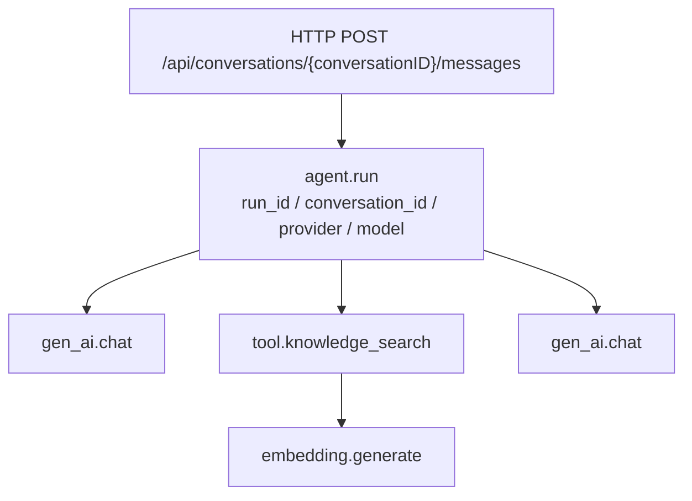

# 第二阶段：OTel Trace 与 Prometheus 指标

本阶段把 Zora 原有的产品内 Run 审计扩展为基础设施级可观察链路。目标不是只统计接口 QPS，而是让一次 Agent 请求从 HTTP 入口到 Run、模型、工具和 Embedding 共享同一个 Trace，并提供可聚合的 Prometheus 指标。

## 1. 阶段结果

- 通过 OTLP/HTTP 导出 OpenTelemetry Trace；
- 使用 W3C `traceparent` 与 `baggage` 接收上游上下文；
- 串联 `HTTP → Agent Run → 模型/工具 → Embedding`；
- 单 Agent、多 Agent 专家 Tool、内置 Tool、知识库 Tool、办公 Tool 和 MCP Tool 使用同一包装边界；
- 在 `GET /metrics` 暴露 HTTP、Run、模型、Embedding 和工具指标；
- SSE `start` 与持久化 `run_started` 事件携带 `trace_id`、`span_id`，可以从业务 Run 跳转到基础设施 Trace；
- 本地 Compose 提供 Jaeger 和 Prometheus，默认关闭，不影响 Mock + SQLite 的零依赖启动；
- 不采集 Prompt、回答正文、知识库原文、工具参数正文或 API Key。

## 2. 两层可观察性为什么同时保留

Zora 有两种不同用途的运行事实：

| 层次 | 数据 | 解决的问题 | 生命周期 |
|---|---|---|---|
| 产品审计 | `AgentRun`、`RunEvent` | 用户看到了什么、调用过哪些 Agent/Tool、最终状态是什么 | 跟随业务数据库持久化 |
| 基础设施观测 | OTel Span、Prometheus Metric | 哪一层慢、调用拓扑如何、错误集中在哪个 Provider/Tool | 由 Jaeger/Collector/Prometheus 保留策略管理 |

不能只用 Trace 替代 RunEvent：Trace 会采样和过期，不适合作为用户可见审计记录。也不能只用 RunEvent：它缺少跨服务上下文传播和时序瀑布图，不适合 SLO、告警与分布式排障。

## 3. Trace 结构



关键实现位置：

- `internal/httpapi/server.go`：HTTP Server Span、路由和状态码；`/metrics` 绕过业务中间件，避免自抓取污染；
- `internal/chat/service.go`：创建持久化 Run 后开启 `agent.run`，向 SSE/RunEvent 写入 Trace 坐标；
- `internal/observability/model.go`：在模型 `Generate` 和完整 `Stream` 生命周期记录 Span、耗时和 Provider Usage；
- `internal/observability/tool.go`：统一包装 `InvokableTool`，只记录工具名和参数字符数；
- `internal/observability/embedding.go`：包装知识库 Embedder，写入和检索都可观察；
- `internal/agentruntime/multi_agent.go`：专业 Agent 被转换为 AgentTool 后再包装，因此交接也进入 Trace；
- `cmd/zora/main.go`：创建 Telemetry，包装模型、Embedding 和各类工具并注入 HTTP/Chat。

## 4. Prometheus 指标

OTel Instrument 名称如下；Prometheus 会把点号转为下划线，并为 Counter 增加 `_total`、为秒单位增加 `_seconds`：

| OTel Instrument | 类型 | 主要标签 |
|---|---|---|
| `zora.http.server.requests` | Counter | method、route、status_code |
| `zora.http.server.duration` | Histogram | method、route、status_code |
| `zora.http.server.active_requests` | UpDownCounter | method |
| `zora.agent.runs` | Counter | run_status、provider、model |
| `zora.agent.run.duration` | Histogram | run_status、provider、model |
| `zora.gen_ai.client.calls` | Counter | provider、model、call_status |
| `zora.gen_ai.client.duration` | Histogram | provider、model、call_status |
| `zora.gen_ai.client.tokens` | Counter | provider、model、token_type |
| `zora.embedding.calls` | Counter | provider、model、call_status |
| `zora.embedding.duration` | Histogram | provider、model、call_status |
| `zora.embedding.inputs` | Counter | provider、model |
| `zora.tool.calls` | Counter | tool_name、call_status |
| `zora.tool.duration` | Histogram | tool_name、call_status |

指标标签禁止放入 `run_id`、`conversation_id` 等高基数字段；这些 ID 只进入 Trace Attribute。Token 指标只使用 Provider 返回的真实 Usage，不按字符数估算。

Prometheus 查询示例：

```promql
# 最近 5 分钟 Agent Run 速率
sum by (zora_run_status) (rate(zora_agent_runs_total[5m]))

# Agent Run P95
histogram_quantile(0.95, sum by (le) (rate(zora_agent_run_duration_seconds_bucket[5m])))

# 各工具失败速率
sum by (gen_ai_tool_name) (rate(zora_tool_calls_total{zora_call_status="error"}[5m]))
```

## 5. 本地启动

### 5.1 启动 Jaeger 和 Prometheus

```bash
make observability-up
```

### 5.2 开启 Zora 导出

在不提交 Git 的 `.env.local` 中设置：

```bash
ZORA_OTEL_ENABLED=true
OTEL_SERVICE_NAME=zora
ZORA_OTEL_ENVIRONMENT=development
OTEL_EXPORTER_OTLP_ENDPOINT=http://localhost:4318
ZORA_OTEL_SAMPLE_RATIO=1
ZORA_PROMETHEUS_ENABLED=true
```

然后运行：

```bash
make run
```

访问入口：

- Zora：[http://localhost:8088](http://localhost:8088)
- Jaeger：[http://localhost:16686](http://localhost:16686)，Service 选择 `zora`；
- Prometheus：[http://localhost:9090](http://localhost:9090)，Status → Targets 应看到 `zora` 为 UP；
- 原始指标：[http://localhost:8088/metrics](http://localhost:8088/metrics)。

停止本地组件：

```bash
make observability-down
```

## 6. 手工验收

1. 上传或使用已有知识库文档；
2. 提问一个必须调用 `knowledge_search` 的问题；
3. 在浏览器 Network 中检查消息 SSE 的首个 `start` 数据，确认存在 `trace_id`；
4. 在 Jaeger 按 Trace ID 查询，确认存在 HTTP、Run、模型、`tool.knowledge_search` 和 `embedding.generate`；
5. 确认 Embedding 的 Parent 是知识库工具，模型和工具的 Parent 是 Run，Run 的 Parent 是 HTTP；
6. 打开 `/metrics`，确认 `zora_agent_runs_total`、`zora_gen_ai_client_calls_total`、`zora_tool_calls_total` 和 `zora_embedding_calls_total` 已出现；
7. 问一个普通开放问题，确认没有虚构 `tool.*` 或 `embedding.generate`；
8. 检查 Span/Metric，确认没有用户原文、文档正文、工具参数正文和密钥。

## 7. 配置说明与生产边界

| 配置 | 默认值 | 说明 |
|---|---|---|
| `ZORA_OTEL_ENABLED` | `false` | 是否导出 Trace |
| `OTEL_SERVICE_NAME` | `zora` | Resource 中稳定的服务名 |
| `ZORA_OTEL_ENVIRONMENT` | `development` | 部署环境标签 |
| `OTEL_EXPORTER_OTLP_ENDPOINT` | `http://localhost:4318` | OTLP/HTTP 根地址，Exporter 使用 `/v1/traces` |
| `ZORA_OTEL_SAMPLE_RATIO` | `1` | ParentBased 根采样比例，范围 0–1 |
| `ZORA_PROMETHEUS_ENABLED` | `false` | 是否注册 `/metrics` |

当前本地环境允许 Zora 直接把 Trace 发给 Jaeger。生产环境建议先发给 OpenTelemetry Collector，再由 Collector 处理批量、重试、脱敏、尾采样和多后端导出。`/metrics` 当前没有应用层认证，不应直接暴露公网；应通过内网、反向代理或网络策略仅允许 Prometheus 访问。

## 8. 自动化验证

`internal/observability/telemetry_test.go` 覆盖：

- HTTP、Run、模型、工具、Embedding 的同 Trace 和父子关系；
- Prometheus Handler 能导出 Run Counter 与 Duration Histogram；
- 无需启动外部 Jaeger/Prometheus 即可完成单元测试。

执行：

```bash
go test ./internal/observability -count=1
```
