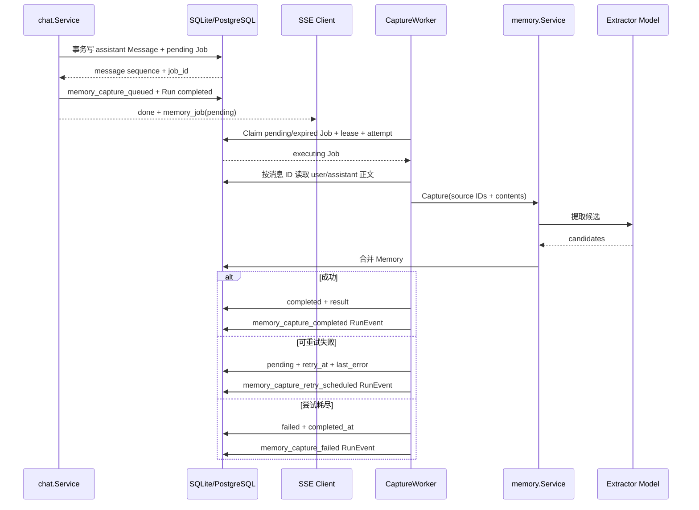
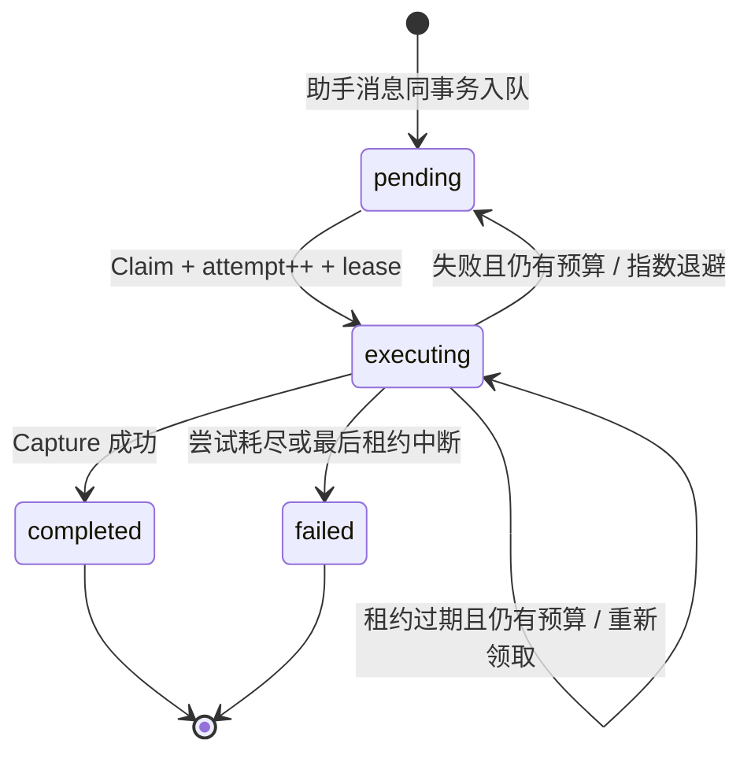

# 第三阶段：Memory Capture 事务 Outbox 与 Worker

本阶段把“回答后提取长期记忆”从 HTTP 请求内的同步增强，改为可恢复的事务 Outbox + 后台 Worker。目标是让 `done` 不再等待第二次模型调用，并且进程在回答落库后退出，也不会静默丢失待提取任务。

## 1. 阶段结果

- 助手消息和 `memory_capture_jobs` 在同一个 SQLite/PostgreSQL 事务中提交；
- Outbox 只保存 Run、会话和消息 ID，不复制用户/助手正文；
- 每个 Run 最多一个捕获任务，重复提交返回原任务；PostgreSQL 用事务 advisory lock 串行化同 Run 并发入队；
- Worker 使用数据库租约领取，PostgreSQL 使用 `FOR UPDATE SKIP LOCKED` 支持多实例不重复领取同一任务；
- 模型失败按指数退避重试，耗尽最大次数进入 `failed`；
- 进程退出遗留的过期 `executing` 任务可重新领取；最后一次尝试中断则恢复为终态失败；
- SSE `done.memory_job` 返回任务 ID 和当前状态；REST 可查询任务列表和详情；
- RunEvent 记录 queued、retry、completed、failed；Prometheus 和 OTel 记录后台任务；
- 持久化 `traceparent` 只用于上下文传播，后台 `memory.capture` Span 会接回原 Agent Run。

## 2. 为什么不是 `go func()`

直接在请求末尾启动 goroutine 虽然能快速返回，但没有交付保证：进程退出、发布重启或 goroutine panic 都会丢任务；多实例也无法判断任务由谁处理。事务 Outbox 把“回答已保存”和“必须执行记忆捕获”变成同一个数据库提交事实，Worker 只负责消费和推进状态。

这仍是数据库 Outbox，不是 Kafka/RabbitMQ。当前规模下它复用现有数据库、部署成本最低，同时已经覆盖幂等、租约、重试和恢复。吞吐或隔离要求增长后，可以保留 `CaptureJobStore` 契约，将通知层替换为消息中间件。

## 3. 核心流程



进程内通知 Channel 只用于缩短等待；通知丢失时，定时轮询仍会从数据库发现任务，因此数据库才是唯一真实来源。

## 4. 数据模型与状态机

`memory_capture_jobs` 的关键字段：

| 字段 | 作用 |
|---|---|
| `run_id` | 幂等键；唯一约束保证一轮回答只创建一个任务 |
| `user_message_id` / `assistant_message_id` | 延迟读取正文，避免 Outbox 再保存敏感内容 |
| `status` | `pending / executing / completed / failed` |
| `attempt / max_attempts` | 包含首次处理在内的尝试预算 |
| `available_at` | 失败后下次允许领取的时间 |
| `lease_owner / lease_until` | 防止多个 Worker 同时处理同一任务 |
| `result` | 只保存候选、创建、更新、跳过数量，不保存候选正文 |
| `trace_parent` | W3C Trace 上下文；API JSON 不暴露 |
| `last_error` | 截断后的最近错误，用于排障 |



## 5. 关键代码位置

- `internal/memory/capture_queue.go`：任务创建、查询和进程内 Wake 通知；
- `internal/memory/capture_worker.go`：领取、读取消息、超时、指数退避、终态和优雅停止；
- `internal/memory/types.go`：`CaptureJob`、状态和 `CaptureJobStore` 契约；
- `internal/store/sqlite/memory_capture_jobs.go`：单连接事务、租约与恢复；
- `internal/store/postgres/memory_capture_jobs.go`：事务入队与 `FOR UPDATE SKIP LOCKED`；
- `internal/chat/service.go`：回答保存时使用 Queue，并在 SSE `done` 返回 Job；
- `internal/observability/spans.go`：`traceparent` 持久化传播和 `memory.capture` Consumer Span；
- `cmd/zora/main.go`：Worker 装配、RunEvent Observer 与优雅关闭。

## 6. 配置

```dotenv
ZORA_MEMORY_AUTO_CAPTURE=true
ZORA_MEMORY_WORKER_POLL_INTERVAL=1s
ZORA_MEMORY_WORKER_TASK_TIMEOUT=90s
ZORA_MEMORY_WORKER_LEASE_DURATION=2m
ZORA_MEMORY_WORKER_RETRY_BASE=2s
ZORA_MEMORY_WORKER_MAX_ATTEMPTS=5
```

约束：租约必须严格大于任务超时；最大尝试次数为 1–20。第 N 次失败后的退避为 `retry_base * 2^(N-1)`，上限 1 分钟。

## 7. 状态查询

```http
GET /api/memory-capture/jobs?status=pending&limit=100
GET /api/memory-capture/jobs/{jobID}
```

任务成功示例：

```json
{
  "id": "memory_job_xxx",
  "run_id": "run_xxx",
  "status": "completed",
  "attempt": 1,
  "max_attempts": 5,
  "result": {
    "enabled": true,
    "candidates": 1,
    "created": 1,
    "updated": 0,
    "skipped": 0
  }
}
```

`trace_parent` 和 `lease_owner` 不通过 API 返回。不存在的任务返回 404，非法状态过滤返回 400。

## 8. 可观察性

新增 Span：`memory.capture`，属性仅包含 Job ID、Run ID、attempt 和 status，不包含消息或候选正文。

新增 Prometheus 指标：

- `zora_memory_capture_jobs_total{zora_memory_job_status=...}`；
- `zora_memory_capture_duration_seconds`；
- `zora_memory_capture_queue_delay_seconds`。

RunEvent 与 Trace 的职责仍分离：Job 状态和 RunEvent 是不采样的业务事实，OTel 是可采样的跨层时序。

## 9. 验证

自动化测试覆盖：

- 助手消息与 Job 同事务提交，外键失败时两者一起回滚；
- 相同 Run 重试入队不产生第二个 Job/助手消息；
- `available_at`、租约所有者和 attempt 校验；
- 临时失败后退避重试并成功完成；
- 进程中断后的过期租约恢复；
- SSE 返回 pending Job，列表/详情 API 可查询；
- 后台 Span 通过持久化 TraceContext 接回原 Run。

运行：

```bash
go test ./internal/memory ./internal/store/sqlite ./internal/store/postgres ./internal/chat ./internal/httpapi ./internal/observability
go test -race ./internal/memory ./internal/chat ./internal/httpapi
```

## 10. 当前边界

- 摘要更新和文档摄取仍在 HTTP 请求内同步执行；
- 没有人工“重新投递 failed Job”的管理接口，当前由修复原因后重新发起对话或直接运维处理；
- 多实例可以避免重复领取同一 Job，但不同 Job 同时更新相同 `kind + memory_key` 仍缺数据库唯一约束和冲突重试；
- `last_error` 用于开发排障，生产多租户前应进一步做错误分类、访问控制和保留策略；
- 当前 Queue 与主库耦合，尚未拆成独立 Worker 进程或通用任务平台。
