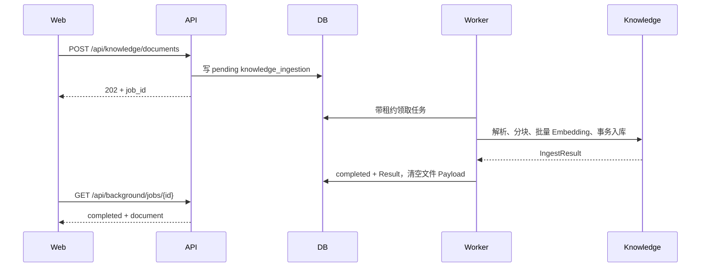

# 第四阶段：文档摄取与会话摘要异步任务

本阶段把两个会占用 HTTP 尾延迟的增强流程迁移到持久化后台任务：文档解析/Embedding/入库和长会话增量摘要。实现目标不是简单启动 goroutine，而是让任务在重启、临时限流和多实例部署下可恢复、可查询、可重试。

## 1. 任务模型

`background_jobs` 统一保存任务状态，但用 `kind` 强制区分：

- `knowledge_ingestion`：Payload 保存上传元数据和文件内容，完成后清空 Payload；Result 保存 `knowledge.IngestResult`；
- `conversation_summary`：Payload 只保存会话 ID 和目标消息序号，正文由 Worker 从消息表读取；Result 保存 `summary.UpdateResult`。

两类任务由独立 Worker 领取，避免大文档 Embedding 阻塞摘要。状态机均为：

```text
pending -> executing -> completed
                     -> pending（指数退避重试）
                     -> failed（耗尽尝试，可人工重投）
```

每条任务包含幂等键、attempt/max_attempts、available_at、lease_owner/lease_until、错误摘要和可选 TraceContext。PostgreSQL 使用 `FOR UPDATE SKIP LOCKED`，SQLite 单连接事务保证本地模式的一致性。

## 2. 文档摄取流程



内容 SHA-256 作为任务幂等键；重复上传不会产生第二个排队任务。知识库 Service 原有 `content_hash` 去重仍保留，任务幂等与业务去重是两层不同保护。

## 3. 会话摘要流程

Chat 保存助手消息后，以 Run ID 作为幂等键创建 `conversation_summary` 任务，并在 SSE `done.summary_job` 返回任务快照。Worker 根据目标 sequence 调用原有 `summary.Service.Update`；不足触发阈值时任务正常 completed，但 `updated=false`。摘要失败只影响增强链路，不会把已经完成的回答改为失败。

完成或失败会追加 `conversation_summary_completed/failed` RunEvent。任务 Payload 不复制聊天正文，降低隐私面和存储膨胀。

## 4. 运维接口

```http
GET /api/background/jobs?kind=knowledge_ingestion&status=failed&limit=100
GET /api/background/jobs/{jobID}
POST /api/background/jobs/{jobID}/retry
```

只有 `failed` 任务可以人工重投；重投会清空旧错误、重置 attempt 并立即唤醒对应 Worker。completed 文档任务已经清空原始文件 Payload，不能误重放。

## 5. 配置

```dotenv
ZORA_BACKGROUND_WORKER_POLL_INTERVAL=1s
ZORA_BACKGROUND_WORKER_TASK_TIMEOUT=90s
ZORA_BACKGROUND_WORKER_LEASE_DURATION=120s
ZORA_BACKGROUND_WORKER_RETRY_BASE=2s
ZORA_BACKGROUND_WORKER_MAX_ATTEMPTS=5
```

租约必须大于任务超时。真实大文档或限速 Embedding 场景应同步增大二者；不要只增大租约而保留过短的任务 Context。

## 6. 关键代码

- `internal/background/types.go`：任务、状态和 Store 契约；
- `internal/background/queue.go`：类型化入队、幂等和人工重投；
- `internal/background/worker.go`：租约、超时、退避、恢复和优雅停止；
- `internal/background/handlers.go`：Knowledge/Summary 类型化 Handler；
- `internal/store/{sqlite,postgres}/background_jobs.go`：双数据库实现；
- `internal/httpapi/server.go`：202 上传和任务管理 API；
- `internal/chat/service.go`：摘要入队和 SSE `summary_job`。
