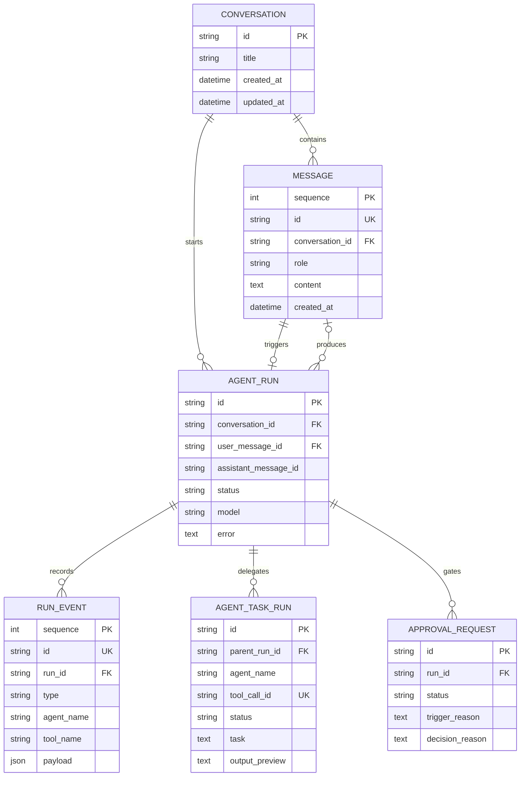
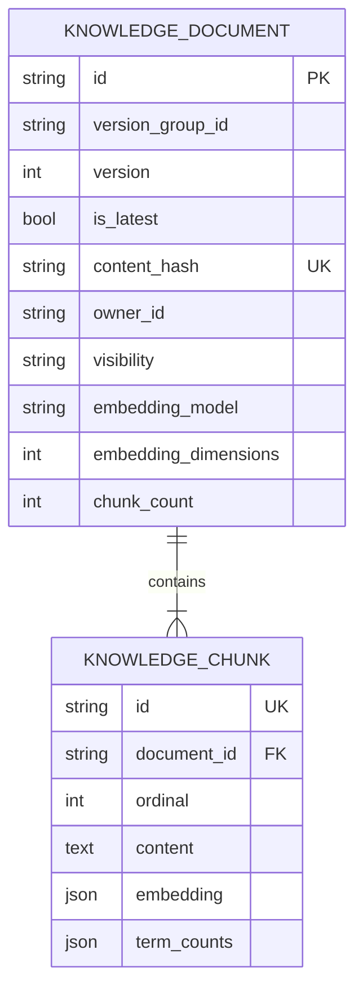
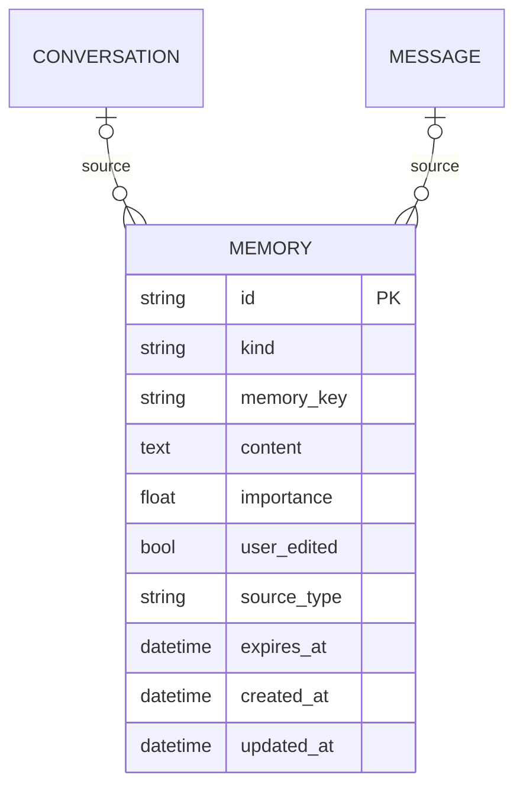
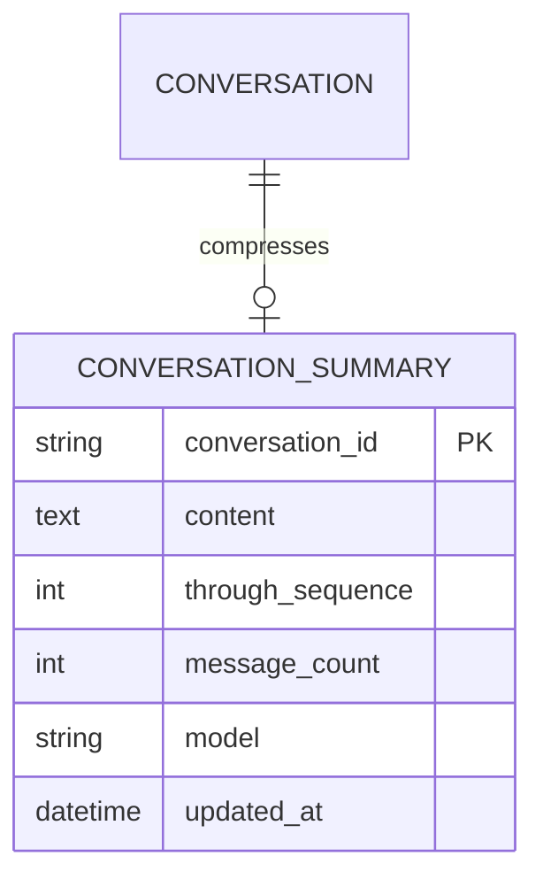
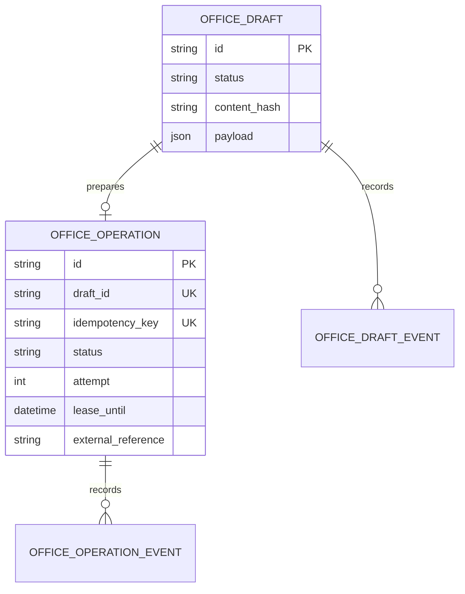
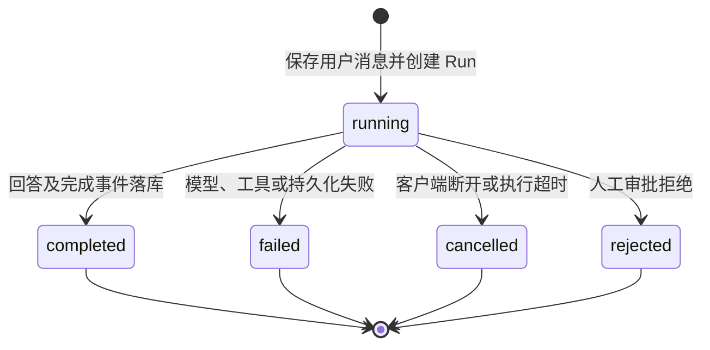
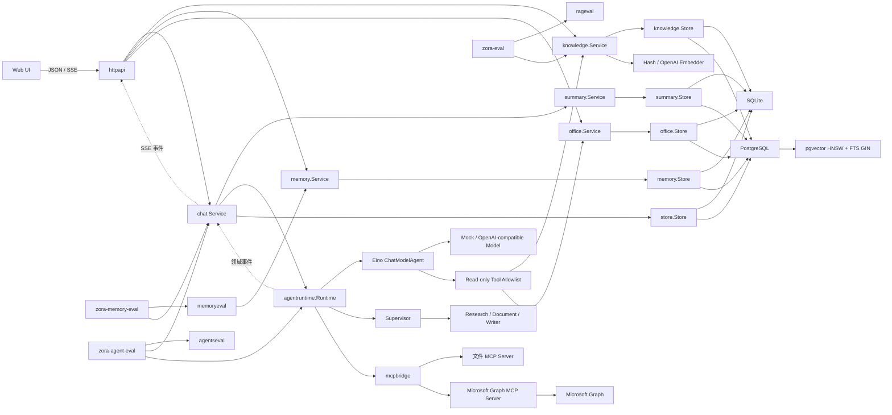

# Zora 项目分析文档

> 文档基线：V0.5 Office Agent 上线准备阶段（OAuth/Secret 与最小权限）
> 最后更新：2026-08-18
> 文档定位：用于需求讨论、架构评审、项目复盘和 Agent 开发岗位面试介绍。

## 1. 项目概述

Zora 是一个以 Go 为主语言、基于 Eino ADK 构建的可观察 Agent 产品。项目不以“接入大模型并提供聊天页面”为终点，而是围绕 Agent 产品真正需要解决的问题逐步演进：

- 模型如何可靠调用工具并获得反馈；
- 会话和每次 Agent 执行如何持久化、追踪和恢复；
- 知识库如何提供有引用、可评估的答案；
- 长期记忆如何提取、更新、遗忘并由用户控制；
- 多 Agent 如何分工、控制预算并证明其收益；
- 办公写操作如何经过授权、审批和审计。

当前 V0.1 单 Agent 核心链路已完成；V0.2 已打通知识库、固定检索/答案评测及 SQLite/PostgreSQL 双存储闭环，并补齐版本链、PDF 文本层、递归字符切块和文档级 ACL。V0.3 已建立可控制、可追溯、可 A/B 评测的长期记忆。V0.4 已实现可配置 Supervisor、专业 Agent、隔离交接、执行保险丝、父子 Run、Human-in-the-loop 和对照门禁。V0.5 已在只读连接器、结构化草稿、一次性人工确认和可恢复 Operation 之上，实现 Microsoft Graph 写执行器、邮件检查点、日程幂等、client credentials OAuth、Secret 文件和 reader/writer 双身份最小权限边界。协议与故障注入测试已完成，当前只缺真实租户在线验收。

## 2. 背景与问题

普通聊天壳通常只有三层：聊天页面、模型 API、历史消息列表。这类实现可以展示模型调用，却无法回答 Agent 岗位经常关注的问题：

- 工具如何声明、选择、执行和防止越权；
- Agent 为什么停止，如何避免无限循环；
- 流式输出、取消、超时和失败如何处理；
- 一次复杂任务经过了哪些步骤，如何审计；
- RAG、Memory 和 Multi-Agent 是否真的提高效果；
- 如何在能力、成本、延迟和安全之间做取舍。

Zora 将这些问题作为项目主线。V0.1 建立可运行、可测试、可观察的执行骨架；V0.2 通过端到端知识库来验证这套骨架能够承载真实 Agent 能力。

## 3. 项目目标与非目标

### 3.1 目标

1. 用 Go 验证 Agent Runtime、工具调用、流式传输和持久化的完整工程闭环。
2. 支持通义千问等 OpenAI-compatible 模型，同时避免业务层绑定单一厂商。
3. 把 Conversation、AgentRun、RunEvent 分离，使用户历史和内部轨迹分别演进。
4. 默认提供零密钥、零外部数据库的本地体验，降低项目运行门槛。
5. 为 RAG、Memory、Multi-Agent、MCP 和 Human-in-the-loop 保留清晰扩展边界。
6. 用自动化评估和运行数据证明能力收益，而不是只展示功能清单。

### 3.2 当前非目标

- 当前不提供公网多租户服务和用户登录系统。
- 当前不执行 Shell、代码或任意外部写操作。
- 当前的 Hash Embedding 只用于本地链路验证，不宣称具有生产语义检索质量。
- 不把全部聊天历史直接向量化并称为长期记忆。
- 不为了展示多 Agent 而堆叠多个 Prompt。
- 不承担本地大模型推理，模型能力通过 API 接入。

## 4. 用户与使用场景

### 4.1 目标用户

| 用户 | 核心需求 | Zora 的价值 |
|---|---|---|
| 项目开发者 | 学习 Agent 的核心实现 | 能直接阅读和调试 Runtime、工具、事件和持久化代码 |
| Agent 岗位面试官 | 判断候选人的工程深度 | 能讨论取舍、失败语义、评估方案与扩展设计 |
| 个人用户 | 使用可靠的对话助手 | 获得流式回复、精确工具结果和持久化历史 |
| 后续办公用户 | 处理文档、邮件和日历 | 通过知识库、MCP 和审批机制逐步实现 |

### 4.2 当前典型场景

1. 用户创建或选择一个对话。
2. 用户输入问题，服务保存消息并创建一次 AgentRun。
3. Eino ChatModelAgent 判断直接回答还是调用工具。
4. 工具调用和结果实时展示，同时写入审计事件。
5. 模型基于工具结果生成最终回答。
6. 回答落库，Run 进入 completed、failed 或 cancelled 状态。

知识库场景增加两条业务链：

1. 用户上传文档，系统验证大小和 UTF-8，按内容哈希去重，分块并批量生成向量，最后事务入库。
2. 对话涉及上传资料时，Agent 调用 `knowledge_search`，系统独立计算向量相似度与 BM25，用 RRF 融合后返回带文档名和分块序号的证据。

长期记忆写入场景增加一条回答后增强链：

1. 回答成功落库后，真实模型结构化提取最多 N 个候选；Mock 使用保守确定性规则。
2. Memory Service 校验候选并按 `kind + memory_key` 查找同一事实槽位。
3. 新事实创建、重复内容跳过、冲突值更新；用户手动修正后的记录禁止自动覆盖。
4. 来源会话/消息写入 Memory，处理计数进入 RunEvent 和 SSE；提取失败不影响已经成功的回答。

长期记忆召回场景增加一条回答前增强链：

1. 用本轮问题检索未过期 Memory，计算词项相关性、重要性和时效性联合分数。
2. 过滤低分项并选择 Top-K，总正文不超过 6,000 字符。
3. 以不可信 JSON 背景数据注入独立 System Message；本轮输入与旧记忆冲突时优先本轮。
4. RunEvent 只保存 Memory ID 与分数组件；召回失败退化为无记忆回答。

长对话增加一条跨轮上下文压缩链：

1. 回答保存后按当前会话实际统计尚未摘要的消息数量，达到阈值才触发摘要。
2. 最近消息保留原文，较早消息与已有摘要增量合并，并持久化覆盖到的 sequence。
3. 下一轮只向模型发送会话摘要、相关长期记忆和最近原始消息；全部 Message 仍保留在数据库中。
4. 历史内容按不可信 JSON 数据处理；摘要读取或生成失败时退化为最近原始消息，不影响正常回答。

多 Agent 模式增加一条可选协作链：

1. 用户通过 `ZORA_MULTI_AGENT_ENABLED=true` 显式开启，避免真实模型默认增加调用成本。
2. Supervisor 判断直接回答或调用 Research、Document、Writer AgentTool；专业 Agent 只收到最小 `request`，不默认共享主会话完整历史。
3. Research 只能调用时间、计算器和项目状态，Document 只能调用知识库，Writer 没有底层工具；复合文档写作按 Document → Writer 串行交接。
4. 协作开始、专家输出和协作完成进入 SSE 与 RunEvent；专家草稿不拼进最终回答，只由 Supervisor 输出一次定稿。
5. 彼此独立的子任务可在同一轮并行；每个根 Run 拥有独立交接次数、最大并行度、专家超时和重试预算，取消信号贯穿全部子任务。
6. 每次交接创建 `AgentTaskRun`；高影响请求先创建 `ApprovalRequest` 并暂停，批准后恢复，拒绝或超时进入终态。

办公只读场景增加一条 MCP 取证链：

1. 部署者显式启用 MCP，并为每个 Server 配置命令、工具白名单和可透传环境变量。
2. Zora 启动独立 stdio 子进程，只注册同时命中本地白名单且声明只读的工具。
3. 文件请求由目录沙箱处理；邮件和日历请求由 Microsoft Graph 子进程使用 reader OAuth 身份查询。
4. 连接器只返回元数据和正文摘要，并标记为不可信外部内容；Agent 忽略内容内嵌的指令、链接与权限请求。
5. ToolCall/ToolResult 继续进入现有 RunEvent，不把令牌、命令或连接器环境写入模型上下文和公开接口。

## 5. 业务能力模型

| 能力域 | 当前状态 | 说明 |
|---|---|---|
| 对话管理 | 已实现 | 创建、列表、重命名、删除和历史查询 |
| 流式交互 | 已实现 | SSE 增量文本、工具轨迹、停止生成 |
| Agent Runtime | 已实现 | Eino ReAct、最大迭代、上下文传递 |
| 模型接入 | 已实现 | Mock 与 OpenAI-compatible Provider |
| 工具系统 | 已实现 | 三个内置只读工具、知识库工具；MCP 工具使用 Server 名称空间、显式 allowlist 和 Schema 转换 |
| 执行审计 | 已实现 | AgentRun 与 append-only RunEvent |
| 本地持久化 | 已实现 | SQLite、WAL、事务与级联删除 |
| 知识库本地 MVP | 已实现 | TXT/Markdown/PDF 文本层、版本化去重、递归重叠分块、Embedding、向量 + BM25/RRF、引用 |
| RAG 检索与答案评测 | 已实现 | 三种召回指标，以及 Agent 答案的事实覆盖、有效引用覆盖、引用忠实度和联合门禁 |
| PostgreSQL 知识库 | 已实现 | pgxpool、完整 Store、pgvector HNSW、FTS/GIN、RRF 候选融合 |
| 知识库权限与版本 | 已实现 | owner/private/public、最新版检索、版本历史和删除最新版回退；完整登录与 tenant 隔离仍属平台层能力 |
| 长期记忆底座 | 已实现 | Semantic/Episodic Schema、来源/重要性/过期字段、双存储和用户 CRUD |
| 自动记忆写入 | 已实现 | 结构化/规则提取、Memory Key 去重与冲突更新、来源追踪、人工修正保护和审计 |
| 记忆召回与注入 | 已实现 | 相关性/重要性/时效性联合评分、Top-K 安全注入、调试 API 和 Run 审计 |
| 会话摘要与上下文压缩 | 已实现 | 阈值触发、增量合并、最近窗口、双存储、安全注入和审计 |
| 记忆 A/B 评估 | 已实现 | 隔离数据集、完整 Chat Control/Treatment、预期/错误召回、事实增益、污染和延迟报告 |
| 多 Agent 路由与协作 | 已实现 | Supervisor、三个专业 Agent、上下文/工具隔离、串行依赖、并行独立任务和协作审计 |
| 多 Agent 生产治理 | 已实现 | 执行预算、并行限流、超时、有限重试、取消、父子 Run 和审批等待/恢复 |
| 多 Agent 对照评测 | 已实现 | 路由闭环及单/多 Agent 的质量、调用次数代理、耗时比例门禁 |
| MCP 办公底座 | 已实现 | 官方 Go SDK、stdio 生命周期、只读双门禁、子进程环境隔离和 RunEvent 审计 |
| 文件连接器 | 已实现 | 目录沙箱、列表和 UTF-8 读取；拒绝隐藏路径、越界与符号链接逃逸 |
| Microsoft 邮件/日历连接器 | 已实现 | Graph 邮件搜索/详情、日历窗口查询/详情；只返回摘要和元数据 |
| 邮件/日程草稿预览 | 已实现 | 结构化校验、双数据库、可信 Run 来源、内容哈希幂等、REST 与 Web 草稿箱 |
| 草稿级人工确认 | 已实现 | CAS 状态迁移、一次性批准/拒绝、不可变事件、REST/Web 与无外部副作用提示 |
| Office Operation 执行内核 | 已实现 | 草稿唯一任务、稳定幂等键、租约/attempt、失败重试、启动恢复、SQLite/PostgreSQL 双审计 |
| Graph 外部写适配 | 已实现、默认关闭 | 邮件两段式执行、日程 transactionId、远端引用检查点和失败恢复已通过本地测试 |
| OAuth/Secret 上线准备 | 已实现 | `/.default` client credentials、Secret 文件、令牌刷新/失效、读写服务主体隔离和 Exchange RBAC Runbook |
| 真实租户上线 | V0.5 待验收 | 缺少测试租户/邮箱和管理员授权，在线读写与范围外拒绝尚未执行 |

## 6. 业务模型

### 6.1 核心业务对象

| 对象 | 含义 | 生命周期 |
|---|---|---|
| Conversation | 一个持续的用户对话空间 | 创建后持续存在，可重命名或删除 |
| Message | 用户可见的对话消息 | 追加写入，随 Conversation 删除 |
| AgentRun | 一次用户请求对应的一次根 Agent 执行 | running → completed/failed/cancelled/rejected |
| AgentTaskRun | 根 Run 下的一次专业 Agent 交接 | running → completed/failed/cancelled；保存任务与输出摘要 |
| RunEvent | Run 内部发生的可观察事实 | append-only，随 AgentRun 删除 |
| Tool | Agent 可选择的受控能力 | 启动时注册；外部系统工具只读，草稿工具只写 Zora 内部预览 |
| MCPServer | 独立运行的办公连接器进程 | 启动握手 → 工具发现/调用 → 应用退出时关闭 |
| MCPToolAdapter | MCP Tool 到 Eino Tool 的命名空间与 Schema 适配 | 启动时创建，只允许白名单且声明只读的工具 |
| MicrosoftConnector | Graph 邮件和日历适配器 | 子进程独占 Secret/TokenSource；reader 默认只读，writer 仅供 OfficeExecutor |
| MicrosoftTokenSource | Microsoft 子进程内的鉴权边界 | 短期令牌/文件/OAuth 三选一；缓存、提前刷新、401 失效，不持久化 Token |
| OfficeDraft | 邮件或日程参数快照 | draft → pending_confirmation → approved/rejected；执行时再进入 executing/completed/failed |
| OfficeDraftEvent | 草稿状态迁移的不可变审计记录 | 每次提交、决定和执行迁移追加一条，随草稿级联删除 |
| OfficeOperation | approved 草稿对应的唯一持久化外部写任务 | pending/failed → executing → completed/failed；重试复用幂等键 |
| OfficeOperationEvent | 执行任务状态与 attempt 的追加式审计 | 创建、领取、失败、重试和完成各追加一条 |
| OfficeExecutor | 审批后专用外部写权限边界 | 默认关闭；只接受固定 MCP 写协议，不向模型公开工具 |
| Specialist Agent | Research/Document/Writer 专业执行单元 | 启动时组装，通过 AgentTool 接收 request，执行后返回交付物 |
| Agent Handoff | Supervisor 与专业 Agent 的一次结构化交接 | started → agent output → completed；关联 AgentTaskRun 与顶层 RunEvent |
| ApprovalRequest | 高影响请求的人工审批记录 | pending → approved/rejected/expired；决定可恢复等待中的 Run |
| Model Provider | 生成回答和工具决策的模型来源 | 由环境配置选择 |
| KnowledgeDocument | 一份完成索引的不可变文档版本 | 同 owner + name 形成版本链；仅最新版参与默认列表/检索，删除最新版恢复上一版 |
| KnowledgeChunk | 可检索、可引用的原文片段 | 与文档在同一事务创建，随文档级联删除 |
| Memory | 经筛选的长期事实、偏好或事件 | 可由对话提取或手动创建、编辑、过期和删除；同 Key 候选执行合并 |
| ConversationSummary | 一段对话较早历史的增量压缩结果 | 达到阈值后 Upsert，随 Conversation 级联删除；不删除原始 Message |

### 6.2 对象关系

知识库对象独立于对话，因此同一文档能够被多个 Conversation 复用：

长期记忆不是 Message 的别名。Memory 可以引用来源会话/消息，但删除来源时只清空引用，不删除用户已经确认的长期记忆：

会话摘要与对话一一对应，只记录压缩结果和覆盖边界；原始 Message 继续作为审计与重新生成来源：

办公写链路把草稿、执行任务和两类审计分开；确认成功不会直接触发外部副作用：

### 6.3 AgentRun 状态模型

终态不会重新回到 running。浏览器断开时，服务使用一个短时独立 Context 补写终态，避免产生永久运行中的脏数据。

## 7. 数据模型

### 7.1 conversations

| 字段 | 类型 | 约束 | 说明 |
|---|---|---|---|
| `id` | TEXT | PK | `conv_` 前缀的随机 ID |
| `title` | TEXT | NOT NULL | 默认“新对话”，首条消息后自动命名 |
| `created_at` | TEXT | NOT NULL | UTC RFC3339Nano |
| `updated_at` | TEXT | NOT NULL | 新消息或重命名时更新，用于列表排序 |

### 7.2 messages

| 字段 | 类型 | 约束 | 说明 |
|---|---|---|---|
| `sequence` | INTEGER | PK AUTOINCREMENT | 保证稳定的消息顺序 |
| `id` | TEXT | UNIQUE | `msg_` 前缀 ID |
| `conversation_id` | TEXT | FK | 删除 Conversation 时级联删除 |
| `role` | TEXT | CHECK | `user`、`assistant` 或 `tool` |
| `content` | TEXT | NOT NULL | 用户可见正文 |
| `tool_name` | TEXT | NOT NULL | Tool 消息预留字段 |
| `tool_call_id` | TEXT | NOT NULL | ToolCall 关联 ID |
| `created_at` | TEXT | NOT NULL | 创建时间 |

V0.1 的主消息历史只写 user 和最终 assistant 消息。中间工具轨迹写入 RunEvent，避免对话上下文被内部事件快速撑大。

### 7.3 agent_runs

| 字段 | 类型 | 约束 | 说明 |
|---|---|---|---|
| `id` | TEXT | PK | `run_` 前缀 ID |
| `conversation_id` | TEXT | FK | 所属对话 |
| `user_message_id` | TEXT | FK | 触发该 Run 的消息 |
| `assistant_message_id` | TEXT | Nullable | 成功后生成的回答 |
| `status` | TEXT | NOT NULL | running/completed/failed/cancelled/rejected |
| `model` | TEXT | NOT NULL | 本次执行使用的模型 |
| `error` | TEXT | NOT NULL | 失败原因，成功时为空 |
| `started_at` | TEXT | NOT NULL | 开始时间 |
| `completed_at` | TEXT | Nullable | 进入终态的时间 |

### 7.3.1 agent_task_runs

| 字段 | 类型 | 约束 | 说明 |
|---|---|---|---|
| `id` | TEXT | PK | `task_` 前缀的子 Run ID |
| `parent_run_id` | TEXT | FK | 所属根 Run，删除根 Run 时级联删除 |
| `agent_name` / `tool_call_id` | TEXT | NOT NULL / UNIQUE(parent, call) | 专业 Agent 与交接关联 |
| `task` | TEXT | NOT NULL | 从结构化 request 提取的任务，最多持久化 2,000 字符 |
| `status` / `attempt` | TEXT / INTEGER | NOT NULL | 终态与当前实现的执行轮次 |
| `output_preview` / `error` | TEXT | NOT NULL | 最多 1,000 字符交付物摘要或失败原因 |
| `started_at` / `completed_at` | TEXT | NOT NULL / Nullable | 用于计算子任务耗时 |

### 7.3.2 approval_requests

| 字段 | 类型 | 约束 | 说明 |
|---|---|---|---|
| `id` | TEXT | PK | `approval_` 前缀 ID |
| `run_id` / `conversation_id` / `user_message_id` | TEXT | FK | 审批与请求事实的关联 |
| `status` | TEXT | CHECK | pending/approved/rejected/expired |
| `trigger_reason` / `decision_reason` | TEXT | NOT NULL | 触发策略和人工决定说明 |
| `requested_at` / `decided_at` | TEXT | NOT NULL / Nullable | 等待和决策时间 |

### 7.4 run_events

| 字段 | 类型 | 约束 | 说明 |
|---|---|---|---|
| `sequence` | INTEGER | PK AUTOINCREMENT | 全局事件落库顺序 |
| `id` | TEXT | UNIQUE | `evt_` 前缀 ID |
| `run_id` | TEXT | FK | 所属执行 |
| `type` | TEXT | NOT NULL | 事件类型 |
| `agent_name` | TEXT | NOT NULL | 当前产生事件的 Agent |
| `tool_name` | TEXT | NOT NULL | 工具事件对应名称 |
| `payload` | TEXT | JSON 内容 | 事件扩展数据 |
| `created_at` | TEXT | NOT NULL | 事件发生时间 |

持久事件包括：`run_started`、审批状态、工具/交接、`model_output` 和各类根 Run 终态。交接开始/完成 payload 包含 `child_run_id`；token 级 `delta` 只通过 SSE 发送，不逐条落库。

### 7.5 knowledge_documents

| 字段 | 类型 | 约束 | 说明 |
|---|---|---|---|
| `id` | TEXT | PK | `doc_` 前缀 ID |
| `name` | TEXT | NOT NULL | 显示文档名 |
| `source_type` | TEXT | NOT NULL | 当前为 `upload` |
| `mime_type` | TEXT | NOT NULL | `text/plain` 或 `text/markdown` |
| `content_hash` | TEXT | UNIQUE | SHA-256，用于内容去重 |
| `embedding_model` | TEXT | NOT NULL | 索引使用的向量空间标识 |
| `embedding_dimensions` | INTEGER | NOT NULL | 索引向量维度，用于变更检测 |
| `chunk_count` | INTEGER | NOT NULL | 分块数 |
| `created_at` / `updated_at` | TEXT | NOT NULL | UTC RFC3339Nano |

### 7.6 knowledge_chunks

| 字段 | 类型 | 约束 | 说明 |
|---|---|---|---|
| `sequence` | INTEGER | PK AUTOINCREMENT | 稳定扫描顺序 |
| `id` | TEXT | UNIQUE | `chunk_` 前缀 ID |
| `document_id` | TEXT | FK | 删除 Document 时级联删除 |
| `ordinal` | INTEGER | UNIQUE(document, ordinal) | 文档内从 0 开始的片段序号 |
| `content` | TEXT | NOT NULL | 可引用原文 |
| `start_rune` / `end_rune` | INTEGER | NOT NULL | 归一化文本中的 Unicode 字符区间 |
| `embedding_model` | TEXT | NOT NULL | 用于防止向量空间混用 |
| `embedding` | TEXT | JSON 数组 | 本地 MVP 的稠密向量 |
| `term_counts` | TEXT | JSON 对象 | BM25 词频；中文使用单字 + 双字特征 |
| `token_count` | INTEGER | NOT NULL | BM25 文档长度 |

SQLite 中向量和词频使用 JSON，以保持零运维；PostgreSQL 中 `embedding` 使用 `vector(N)`，并增加 `search_terms`、stored generated `search_vector`、HNSW 与 GIN 索引。两个实现共享同一 Document/Chunk 领域模型。

### 7.7 memories

| 字段 | 类型 | 约束 | 说明 |
|---|---|---|---|
| `id` | TEXT | PK | `mem_` 前缀 ID |
| `kind` | TEXT | CHECK | `semantic` 或 `episodic` |
| `memory_key` | TEXT | NOT NULL | 自动合并的稳定事实槽位；手动创建可为空 |
| `content` | TEXT | NOT NULL | 经筛选的记忆正文，最多 2,000 字符 |
| `importance` | REAL/DOUBLE | CHECK 0–1 | 联合召回 20% 权重的重要性信号 |
| `user_edited` | BOOLEAN/INTEGER | NOT NULL | 人工修正保护；为真时自动候选不得覆盖 |
| `source_type` | TEXT | CHECK | 手动创建为 `manual`，自动提取使用 `conversation` |
| `source_conversation_id` | TEXT | Nullable FK | 来源会话，删除会话时置空 |
| `source_message_id` | TEXT | Nullable FK | 来源消息，删除消息时置空 |
| `created_at` / `updated_at` | 时间 | NOT NULL | 生命周期与时效性信号 |
| `expires_at` | 时间 | Nullable | 可选过期时间；普通列表默认排除过期项 |

来源字段在用户编辑时保持不可变，防止手动记忆伪造为模型自动提取结果；编辑会设置 `user_edited=true`，后续自动 Consolidation 必须跳过。当前没有向量列：在真正确定召回算法、Embedding 迁移和评估方案前，不提前把聊天历史变成不可控的向量副本。

### 7.8 conversation_summaries

| 字段 | 类型 | 约束 | 说明 |
|---|---|---|---|
| `conversation_id` | TEXT | PK/FK | 每个对话最多一份摘要；删除对话时级联删除 |
| `content` | TEXT | NOT NULL | 增量合并后的会话摘要 |
| `through_sequence` | INTEGER/BIGINT | >= 0 | 已被摘要覆盖的最后一条 Message sequence |
| `message_count` | INTEGER | >= 0 | 累计进入摘要的消息数 |
| `model` | TEXT | NOT NULL | 生成当前摘要的模型标识 |
| `updated_at` | 时间 | NOT NULL | 最近成功更新摘要的时间 |

该表不替代 `messages`。上下文加载时仅用 `through_sequence` 过滤重复发送给模型的早期消息，查询消息历史仍可获得完整原文。

### 7.9 office_drafts

| 字段 | 类型 | 约束 | 说明 |
|---|---|---|---|
| `id` | TEXT | PK | `draft_` 前缀 ID |
| `kind` | TEXT | CHECK | `email` 或 `calendar` |
| `status` | TEXT | CHECK | `draft/pending_confirmation/approved/executing/completed/rejected/failed/cancelled` |
| `conversation_id` | TEXT | Nullable FK | 来源会话，删除会话时置空而不删除用户草稿 |
| `source_run_id` | TEXT | Nullable FK | 创建草稿的可信根 Run，由 Chat Context 注入 |
| `title` | TEXT | NOT NULL | 邮件主题或日程主题 |
| `payload` | TEXT/JSONB | 合法 JSON | 规范化收件人、正文、时间窗、参与人等参数 |
| `content_hash` | TEXT | NOT NULL | Kind + 规范化 Payload 的 SHA-256 |
| `created_at` / `updated_at` | 时间 | NOT NULL | 创建和最近更新时间 |

`UNIQUE(source_run_id, content_hash)` 使同一 Agent Run 的工具重试返回已有草稿。Store 使用 compare-and-swap 推进状态，删除 SQL 再次限制 `status='draft'`；`approved` 只表示人工决定已记录，只有 Operation 成功提交后才进入 `completed`。

### 7.10 office_draft_events

| 字段 | 类型 | 约束 | 说明 |
|---|---|---|---|
| `id` | TEXT | PK | `draft_event_` 前缀事件 ID |
| `draft_id` | TEXT | FK | 归属草稿；删除草稿时级联删除 |
| `from_status` / `to_status` | TEXT | NOT NULL | 迁移前后状态 |
| `actor` | TEXT | NOT NULL | 当前为 `user`；接入鉴权后替换为主体 ID |
| `reason` | TEXT | NOT NULL | 提交或人工决定原因，最多 500 字符 |
| `created_at` | 时间 | NOT NULL | 决定时间 |

状态更新与事件插入在同一 SQLite/PostgreSQL 事务提交；状态不匹配返回 409。因此两个并发决定不会同时成功，也不会出现“状态已变但审计事件丢失”的半完成结果。

### 7.11 office_operations

| 字段 | 类型 | 约束 | 说明 |
|---|---|---|---|
| `id` | TEXT | PK | `office_operation_` 前缀任务 ID |
| `draft_id` | TEXT | UNIQUE/FK | 每份草稿最多一个执行任务 |
| `kind` / `status` | TEXT | CHECK | 邮件/日程；pending、executing、completed、failed |
| `idempotency_key` | TEXT | UNIQUE | 草稿 ID + 内容哈希生成的 SHA-256，所有重试保持不变 |
| `executor_name` / `attempt` | TEXT/INTEGER | NOT NULL | 最近执行器与领取次数 |
| `lease_owner` / `lease_until` | TEXT/时间 | 内部字段 | 防止并发重复领取，API 不暴露 owner |
| `external_reference` | TEXT | NOT NULL | 成功后的远端邮件/日程引用 |
| `last_error` | TEXT | NOT NULL | 最近一次失败原因，最多保存 2,000 字符 |
| `created_at` / `updated_at` / `completed_at` | 时间 |  | 生命周期时间 |

创建使用 `draft_id` 唯一约束吸收并发请求。领取时 Operation 与 Draft 同时进入 executing；完成或失败时两者和两类事件同事务提交。执行器未配置时不会领取任务，pending 与 attempt=0 保持不变。

### 7.12 office_operation_events

| 字段 | 类型 | 约束 | 说明 |
|---|---|---|---|
| `id` | TEXT | PK | `operation_event_` 前缀事件 ID |
| `operation_id` | TEXT | FK | 归属执行任务 |
| `from_status` / `to_status` | TEXT | NOT NULL | 任务状态迁移 |
| `attempt` | INTEGER | >= 0 | 对应领取次数；创建事件为 0 |
| `actor` / `reason` / `created_at` | TEXT/时间 | NOT NULL | 操作者、中文原因和时间 |

## 8. 技术架构

### 8.1 分层职责

| 层 | 包 | 职责 |
|---|---|---|
| 启动层 | `cmd/zora` | 依赖组装、HTTP Server、信号和优雅关闭 |
| 传输层 | `internal/httpapi` | REST、SSE、输入限制、安全头、静态 UI |
| 应用层 | `internal/chat` | 用例编排、执行顺序、状态落库、会话锁 |
| Agent 适配层 | `internal/agentruntime` | Eino 组装、模型选择、事件归一化 |
| 能力层 | `internal/agenttools` | 工具 Schema、校验和安全执行 |
| 知识库应用层 | `internal/knowledge` | 分块、Embedding 适配、混合召回、引用与 Agent Tool |
| RAG 评测层 | `internal/rageval` | 固定集校验、检索指标、答案引用/忠实度和联合门禁 |
| 记忆应用层 | `internal/memory` | Semantic/Episodic 模型、候选提取、Consolidation、联合召回、输入校验和用户 CRUD |
| Memory 评测层 | `internal/memoryeval` | Control/Treatment 编排、召回/事实/污染指标、报告和门禁 |
| Multi-Agent 评测层 | `internal/agentseval` | 路由序列、答案质量、调用次数代理、耗时对照、报告和门禁 |
| 人工审批层 | `internal/approval` | 高影响策略、持久请求、等待/恢复和一次性决策 |
| 摘要应用层 | `internal/summary` | 触发窗口、增量摘要、Model/Rule Summarizer 和持久化边界 |
| MCP 适配层 | `internal/mcpbridge` | stdio 生命周期、工具发现、只读白名单、Schema 与 Eino 适配 |
| MCP 连接器层 | `internal/mcpfiles`、`internal/mcpmicrosoft` | 文件目录沙箱；Graph 邮件/日历只读查询、Token 隔离与外部内容标记 |
| 办公应用层 | `internal/office` | 草稿校验、确认状态机、Operation 幂等键、执行器门禁、租约恢复与双审计 |
| 领域层 | `internal/domain` | Conversation、Message、Run、Event |
| 持久化抽象 | `internal/store` | Store 接口和统一错误 |
| 基础设施层 | `internal/store/sqlite` | SQLite DDL、查询、事务和映射 |
| 基础设施层 | `internal/store/postgres` | pgxpool、迁移、业务 Store、HNSW/FTS 候选召回 |

### 8.2 关键技术选型

| 选型 | 当前方案 | 原因 |
|---|---|---|
| 主语言 | Go | 并发、网络服务、部署和类型约束能力强 |
| Agent 框架 | Eino ADK | Go 原生、ReAct、Tool、流式事件及后续多 Agent 能力 |
| 模型协议 | OpenAI-compatible | 可连接通义千问及其他兼容模型 |
| 本地数据库 | SQLite | 零运维，便于演示、测试和 RAG 纵向切片 |
| 生产数据库 | PostgreSQL + pgvector | 多连接持久化、HNSW 向量索引和 GIN 全文索引 |
| 检索 | SQLite 精确扫描 / PostgreSQL 候选下推 + RRF | 两后端共享融合规则，能用固定集做迁移回归 |
| Embedding | Hash / OpenAI-compatible | 本地零密钥与生产语义模型共用接口 |
| RAG 评测 | 版本化 JSON + 隔离 SQLite | 同一语料可在 Hash、真实 Embedding 和 PostgreSQL 候选链路上重复对比 |
| 多 Agent 模式 | Eino AgentTool + 显式工具分组 | 避免完整上下文共享；让交接、权限和专家输出可独立审计 |
| Multi-Agent 评测 | 版本化 JSON + 隔离 Chat/RunEvent | 核对真实协作闭环，并运行单 Agent Control / 多 Agent Treatment |
| 办公连接协议 | 官方 MCP Go SDK + stdio | 连接器独立进程、工具发现标准化、主进程无需绑定具体 SaaS SDK |
| Microsoft 办公 API | Graph REST | reader/writer 两个受控连接器覆盖邮件与日历，分别管理最小权限、Token、超时和错误 |
| 前端传输 | SSE | 单向模型流简单、代理支持广、易于调试 |
| UI 发布 | `go:embed` | 单二进制运行，无 Node.js 部署依赖 |
| ID | `crypto/rand` | 不依赖数据库自增 ID，不暴露业务规模 |

## 9. 项目亮点

### 9.1 Mock 也走真实 Agent 链路

Mock 模型实现 Eino 的 `BaseChatModel` 和工具调用语义。无密钥模式依然经过 ChatModelAgent、ToolNode、ToolCall 和 AgentEvent，因此测试的不是另一套简化业务代码。

### 9.2 用户历史与执行轨迹分离

Message 面向下一轮对话上下文，RunEvent 面向调试、审计和可观测性。两者分离后，可以独立控制上下文长度、审计粒度和保留策略。

### 9.3 明确的失败与取消语义

请求 Context 从 HTTP 一路传递到 Runtime 和模型。用户停止生成或连接断开时，Run 会落为 cancelled；普通错误落为 failed，避免状态含糊。

### 9.4 安全工具边界

工具由代码显式注册。计算器采用递归下降解析器，不使用 `eval`、Shell 或代码解释器，能展示 Agent 工具安全不是只依靠 Prompt。

### 9.5 框架隔离

HTTP 和 Store 不依赖 Eino 事件类型。`agentruntime.Event` 作为防腐层，降低框架升级或更换对产品层的影响。

### 9.6 面向评估演进

RAG 已把语料、问题、相关文档、预期事实/证据锚点和阈值作为版本化资产：对 vector、keyword、hybrid 分别计算 Recall@K、MRR、命中率和延迟，并让真实 Agent Runtime 生成答案，检查事实覆盖、引用能否解析到本次工具证据、所引原文是否包含支持锚点。Memory 已建立 Control/Treatment 对照指标；Multi-Agent 也把期望专家序列、答案锚点和阈值版本化，从真实 RunEvent 核对协作闭环，并在相同问题上对比单/多 Agent 的质量、调用次数代理和耗时。当前仍默认关闭，避免“功能数量等于技术深度”的误区。

### 9.7 可交换的 RAG 边界

`knowledge.Service` 不依赖数据库细节，`Embedder` 也不依赖具体厂商。SQLite 负责教学友好的精确向量/BM25；PostgreSQL 通过可选 `CandidateStore` 下推 HNSW/FTS 候选，RRF、HTTP 与 Agent Tool 契约保持不变。

### 9.8 证据引用不是 Prompt 幻觉

每个 SearchResult 都带 `document_id`、`document_name`、`chunk_id`、`ordinal`、`start_rune` 和 `end_rune`。引用信息来自持久化原文坐标，而不是让模型临时编造来源。

### 9.9 长期记忆先控制、再自动写入

V0.3 没有直接把最近 40 条消息写入向量库，而是先建立独立 Memory 生命周期和用户控制面，再接入自动写入。类型、稳定 Key、来源、重要性、人工修正和过期时间均为一等字段；自动提取通过 `source_type=conversation` 关联原始事实。真实模型 Prompt 只允许提取用户明确表达的稳定信息，Service 负责二次校验和同 Key 合并。错误记忆能够被定位、修正和删除，人工修正后不会被下一轮模型覆盖。

召回也先采用可解释基线：中文双字/西文词项相关性占 65%，重要性占 20%，90 天半衰期时效性占 15%。无相关词项默认不注入，非总览问题还需达到 0.20 最低主题相关性；记忆正文被标记为不可信背景数据且有 6,000 字符硬上限。线上可通过 `ZORA_MEMORY_RECALL_ENABLED` 独立关闭注入，离线 A/B 命令则显式组装 Control/Treatment 两个 Chat Service。

### 9.10 A/B 门禁真实经过产品链路

Memory 评测不是直接调用 `Recall` 后检查返回数量。Control 和 Treatment 使用相同 Runtime/Store，分别关闭和开启 `MemoryRecaller`，完整经过 `chat.Send`、Eino、消息持久化和 RunEvent；评测器再从实际 Run 审计读取注入 ID。固定集包含相似主题硬负例，第一次运行确实发现通用 Go 问题被个人记忆污染，并推动召回器加入 0.20 最低主题相关性。这能作为“评估驱动实现演进”的面试案例。

### 9.11 会话摘要保留原文与失败隔离

摘要以 `through_sequence` 精确标记覆盖边界，而不是删除或覆盖 Message；因此可以回放、审计或更换模型后重新生成。触发判断按当前会话实际消息条数计算，避免全库自增 sequence 在多会话下产生误判。摘要正文和历史消息都作为不可信数据注入，RunEvent 只保存覆盖序号和统计值；生成失败不会让已成功回答变为失败。

### 9.12 多 Agent 先隔离、治理与评测，再谈自治

V0.4 没有让多个角色共享全部历史自由对话，而是把专业 Agent 包装为 AgentTool：Supervisor 只交付最小 request，工具能力按职责隔离，子 Agent 输出作为审计事实但不直接进入用户最终答案。受控 AgentTool 在每个根 Run 上限制交接、并行、超时和重试；子 Run 与审批状态分别持久化。`make eval-agents` 通过完整 Chat/Eino/RunEvent 链路校验交接顺序和闭环；当前 7 题路由准确率 1、意外专家调用率 0、答案完成率 1。相同问题的单 Agent Control 质量 0.785714，多 Agent Treatment 为 1，增益 0.214286，调用次数代理比 2。这是可讨论的上下文工程、最小权限、执行治理与评估驱动设计；Mock 小样本不能替代真实 Token Usage 和人工业务验收。

### 9.13 MCP 连接器把协议、授权和外部内容隔离

V0.5 把“办公能力”落成独立 MCP 进程，而不是把文件系统或 SaaS 调用直接塞进 Agent 主进程。Zora 只负责协议、工具门禁、超时、输出上限和审计；文件 Server 负责目录授权，Microsoft Server 负责 Graph 与 OAuth。reader/writer 使用两个 Entra 身份和两套 Secret 文件，主进程只知道路径；连接器新增或替换时不改 Chat/Runtime/HTTP 契约，模型凭据也不会默认进入连接器环境。

Microsoft 邮件与日历只返回完成问答所需的元数据和正文摘要，不下载 HTML/附件。内容同时由工具结果警告和系统 Prompt 标记为不可信数据，避免邮件正文中的“忽略规则、调用工具、打开链接”等文本被当成 Agent 指令。这个实现同时体现协议落地、最小数据暴露和 Prompt Injection 防线分层。

### 9.14 草稿与外部执行显式分层

邮件/日程草稿不是 Writer 输出的一段不可追踪文本，而是独立 `OfficeDraft`。Chat 在创建根 Run 后通过 Context 注入可信来源，工具参数中不允许模型填写 Conversation/Run ID；Service 对邮箱、正文长度、RFC3339 时间窗和 IANA 时区二次校验。规范化 Payload 与 Kind 计算 SHA-256，同一 Run 重试相同工具参数不会制造重复草稿。

草稿工具固定返回 `external_effect=false`，Web 使用“仅预览”标记。独立 REST/Web 操作把草稿从 draft 提交到 pending_confirmation，再以数据库 CAS 一次性批准或拒绝；迁移和事件原子落库。approved 在页面和 API 中仍明确标注“尚未执行”，因此不会把“生成预览”“人工确认”和“执行外部操作”混为一谈。

第五阶段再把 approved 与执行拆成唯一 `OfficeOperation`。任务持有稳定幂等键、租约、attempt、执行器名称、错误和远端引用；失败重试和重启恢复不生成第二个业务任务。Executor 若未声明幂等安全会在组装时被拒绝，若未返回真实副作用标记和可核验引用则只能落为 failed。

第六阶段实现 Graph Executor，但仍不把写能力交给模型。邮件先创建 Graph 远端草稿，拿到不可变 ID 后必须在当前数据库租约下写入检查点和审计事件，检查点成功后才允许发送；重试先核对 `isDraft`，从而区分继续发送与恢复已完成状态。日程用稳定幂等键派生固定 `transactionId`。这使“远端调用成功但本地进程退出”成为可解释、可恢复的工程路径，而不是仅靠接口名称声称幂等。

## 10. 当前限制与风险

| 限制/风险 | 当前影响 | 后续处理 |
|---|---|---|
| SQLite 单连接 | 适合单机和作品演示，不适合高并发多实例 | 生产配置切换 PostgreSQL Store |
| 本地向量精确扫描 | 最多读取 10,000 个 chunk，内存和延迟随数据增长 | PostgreSQL 模式使用 pgvector HNSW + FTS |
| PostgreSQL 容器验收未在当前环境执行 | 代码、单测和可选集成测试已完成，但缺少本机 Docker 实测记录 | 在有 Docker 的环境运行 `make postgres-up && make test-postgres` |
| Hash Embedding 无深度语义 | 适合关键词相关性和链路测试，不适合生产问答 | 生产切换 text-embedding-v4 等语义模型 |
| 固定评测集仅 4 题 | 能做冒烟回归，无法证明复杂语义场景或融合收益 | 增加语义改写、难负例、多相关文档和真实业务问题 |
| 答案评测使用确定性锚点 | 零密钥且稳定，但无法识别未标注幻觉或复杂同义改写 | 增加真实模型人工集与经校准的 LLM Judge，对确定性门禁形成补充 |
| 同步文档索引 | 大文件会占用 HTTP 请求 | 异步 Ingestion Job、重试和状态机 |
| 进程内会话锁 | 多实例之间不能互斥 | advisory lock 或带租约分布式锁 |
| 摘要模型可能遗漏早期细节 | 长对话成本降低，但压缩是有损的 | 保留完整原始消息和最近窗口；增加摘要信息保留率评测与重新生成能力 |
| 自动记忆仍同步执行 | 真实模型会增加一次调用延迟；多副本仅有进程内合并锁 | 后续改为任务队列，并在数据库增加唯一约束/版本号 |
| 轻量召回缺少深层语义 | 可解释且零额外调用，但同义改写可能漏召回 | 用现有 A/B 门禁评估 Memory Embedding 或 Rerank 的真实增益 |
| Memory A/B 固定集仅 5 题 | 能发现弱相关污染并做零密钥回归，但不能代表真实用户分布 | 扩充同义改写、冲突记忆、多轮更新和真实模型人工集 |
| Multi-Agent 默认会增加模型调用 | 固定集质量增益 0.214286，但调用次数代理为单 Agent 的 2 倍 | 默认关闭；接入真实 Provider Usage 后按业务集重新决定 |
| Multi-Agent 固定集仅 7 题 | 能验证串/并行、路由、审计和确定性质量增益，不能代表复杂业务 | 扩充对抗提示、失败恢复和真实模型人工集 |
| 子 Run 暂不支持恢复 | 可独立查询状态和耗时，但进程重启后不能从单个子任务继续 | 引入 Checkpoint、租约任务队列和幂等 Resume |
| 审批等待器在进程内 | 决定已持久化，但重启会丢失等待中的 SSE 恢复通道 | V0.5 将审批与异步任务状态机结合 |
| MCP Server 属于受信部署组件 | 白名单和只读声明不能证明第三方实现绝对无副作用 | 只部署审核过的连接器；文件 Server 再用 OS 目录权限和进程隔离限制影响面 |
| Graph 只完成模拟集成验收 | 代码和协议测试已通过，但没有真实 Microsoft 租户凭据的在线验收记录 | 建立最小权限 Entra 测试应用和专用测试账号，执行真实邮件/日历冒烟 |
| 邮件/日历仅支持 Microsoft | Google Workspace 等来源尚不能接入 | 保持 MCP 工具语义稳定，新增独立 Provider 连接器而不修改 Chat 主链路 |
| Secret 生命周期依赖部署平台 | 子进程已支持 Secret/Token 文件和轮换，但不内置 Vault/KMS SDK | 生产由容器 Secret、Vault Agent 或云平台挂载文件，后续增加证书/Workload Identity |
| Graph 写执行器默认关闭 | 默认运行只能把 approved 草稿准备为 pending，避免开发环境误发邮件 | 仅在 writer 独立身份、Secret 文件、邮箱 RBAC scope 和双写开关下启用 |
| Graph 真实租户尚未验收 | 适配器与故障恢复测试通过，但不能证明真实权限、租户策略与投递结果 | 建立专用 Entra 应用/测试账号，完成最小权限与在线冒烟 |
| 执行器幂等契约依赖实现正确性 | 内核拒绝未声明幂等的执行器，但无法仅靠接口证明远端绝不重复 | Graph 适配使用可重放资源 ID/transactionId，并增加故障注入与真实租户测试 |
| 邮件远端创建与本地检查点无法跨系统原子提交 | Graph 已返回草稿 ID、但进程在检查点前被强杀时可能留下未发送的孤立草稿；正常错误/取消会尽力无取消落库 | 增加远端幂等标记与对账任务；当前保证检查点成功前绝不发送，因此不会把该窗口放大为重复投递 |
| 草稿 Payload 尚未加密 | 本地数据库读取者可以看到邮件正文和日程内容 | 生产环境增加磁盘/列加密、数据保留策略和 Tenant ACL |
| 无鉴权和租户隔离 | 不适合直接公网开放 | 增加 User/Tenant、鉴权、ACL |
| 模型错误分类有限 | API 可能返回过于笼统或过于底层的信息 | 统一错误码和 Provider 错误映射 |
| 尚无 token/cost 指标 | 无法比较模型成本 | 从 ResponseMeta 采集 Usage |
| 无恢复运行 | 中断后只能重新发起 | 引入 Eino Checkpoint/Resume |
| Eino 尚未 1.0 | API 存在演进风险 | 固定版本、适配层隔离、升级回归测试 |

## 11. 成功指标

### V0.1 工程指标

- 普通对话和工具对话端到端成功；
- SSE 事件顺序稳定；
- Run 不遗留永久 running 状态；
- 单元、集成、竞态、静态分析和无 CGO 构建通过；
- 默认模式无需外部密钥和数据库即可运行。

### 后续产品指标

| 能力 | 建议指标 |
|---|---|
| RAG | Recall@K、MRR、引用覆盖率、答案忠实度 |
| Memory | Recall@K、意外召回率、事实覆盖增益、答案污染率、用户删除成功率 |
| Multi-Agent | 任务成功率、P95 延迟、token 成本、人工干预率 |
| 办公 Agent | 审批覆盖率、越权操作数、操作成功率、可恢复率 |

### V0.2 本地 MVP 工程指标

- 同一文档内容可被 SHA-256 稳定去重；
- 所有分块都能用 Unicode 偏移恢复原文；
- 向量召回和 BM25 召回分别计分，RRF 不依赖两类分数量纲；
- 知识库工具结果必须包含文档名、分块序号和原文；
- 默认无密钥可运行，同时有真实 Embedding 适配器的契约测试。
- 固定评测命令在隔离数据库中复现语料，并输出 vector、keyword、hybrid 的 Recall@K、MRR、命中率和延迟；
- 同一命令经过 Eino Runtime 与 `knowledge_search` 生成答案，输出事实覆盖率、有效引用覆盖率和引用忠实度；
- 默认 `zora-rag-smoke-v1` 的实际基线为 Recall@3=1、MRR=1，三种模式打平，尚不能证明融合收益。
- PostgreSQL 与 SQLite 实现相同 Store 契约，数据库侧只下推 Top 50 单路候选，RRF 仍由应用层统一计算；
- PostgreSQL 启动校验 `vector(N)` 维度，多实例 DDL 使用 advisory transaction lock。
- private 文档只对 owner 可见，public 可跨主体读取；删除始终要求 owner，HTTP 把越权映射为 403；当前单用户主体来自服务端 `ZORA_KNOWLEDGE_PRINCIPAL_ID`。
- 同 owner + 文档名形成版本组，写入时原子切换 latest；列表和两类检索候选只读取最新版，删除最新版自动回退。
- PDF 仅解析已有文本层，不做 OCR；递归切块优先 Markdown 标题、段落、换行、句末和空格，最后才硬切。

## 12. 演进路线

1. **V0.1 Agent Core**：建立当前可运行基线。
2. **V0.2 Knowledge Base（工程项完成）**：SQLite/PostgreSQL 双 Store、pgvector/FTS、引用、版本/PDF/递归切块/ACL 和固定评测已实现；继续以真实语义样本验证融合收益。
3. **V0.3 Long-term Memory（主链路完成）**：Schema、双存储、用户 CRUD、候选提取、Consolidation、召回注入、会话增量摘要和 A/B 门禁已实现。
4. **V0.4 Multi-Agent（已完成）**：Supervisor、三个专业 Agent、隔离交接、串/并行执行治理、父子 Run、人工审批和单/多 Agent 对照门禁已实现。
5. **V0.5 Office Agent（待真实租户验收）**：只读连接器、草稿确认、可恢复 Operation、Graph 写适配、OAuth/Secret 和最小权限 Runbook 已完成；剩余在线读写与负向范围验证。

详细任务与验收条件见 [Roadmap](roadmap.md)。
