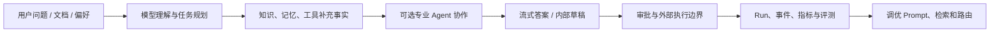
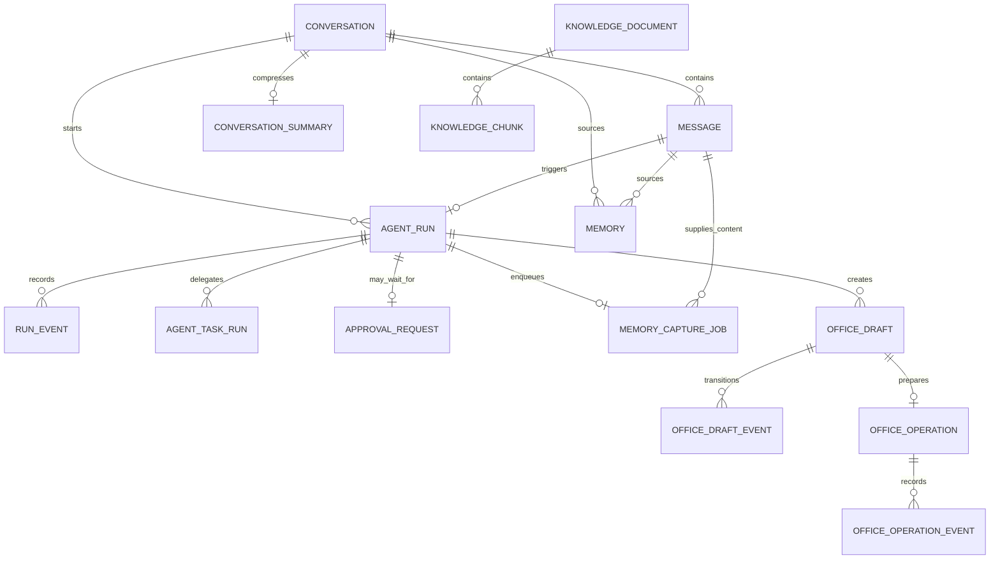
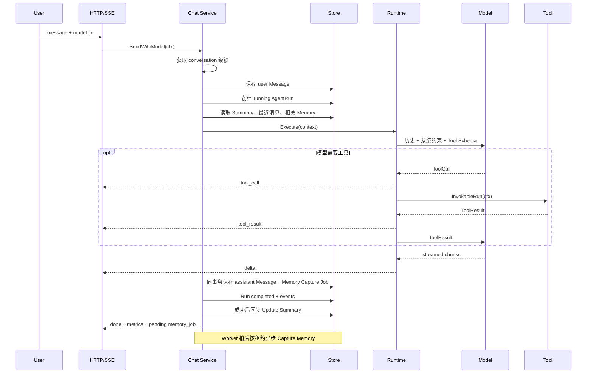
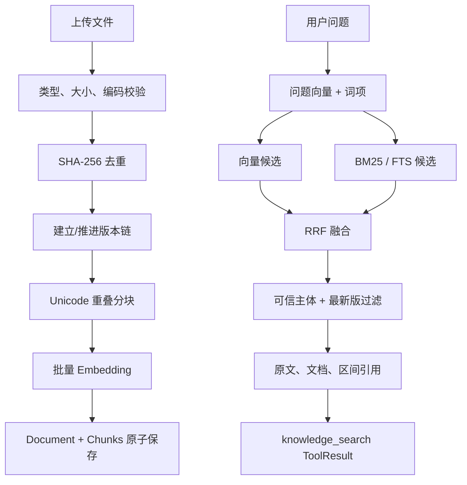
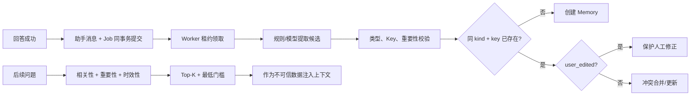
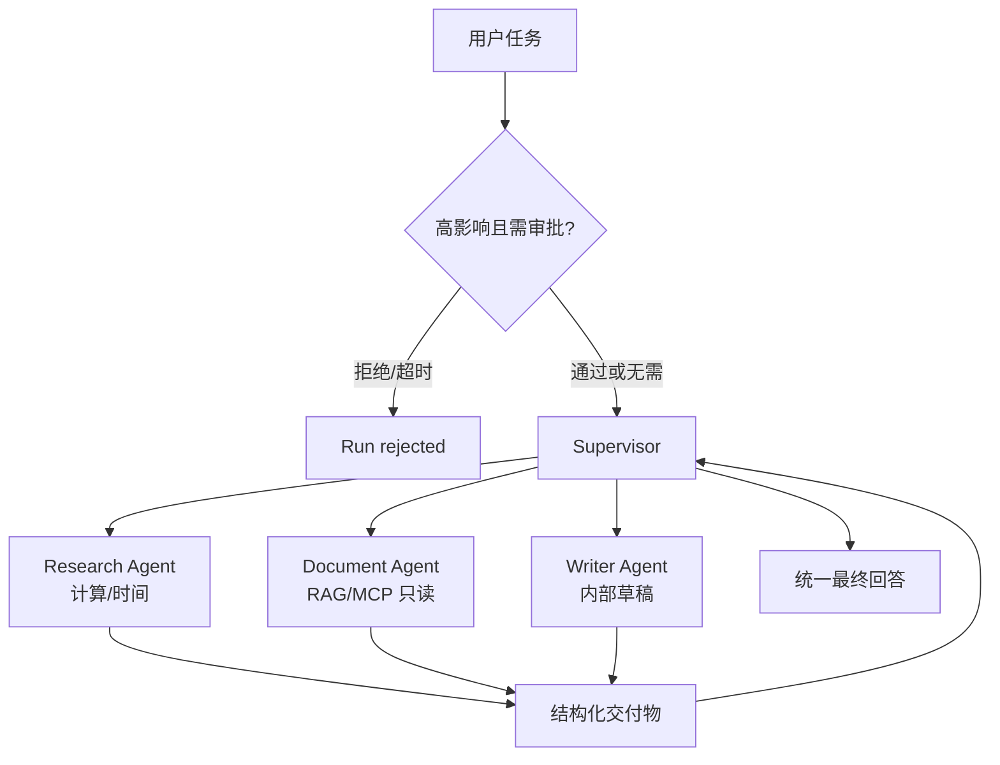
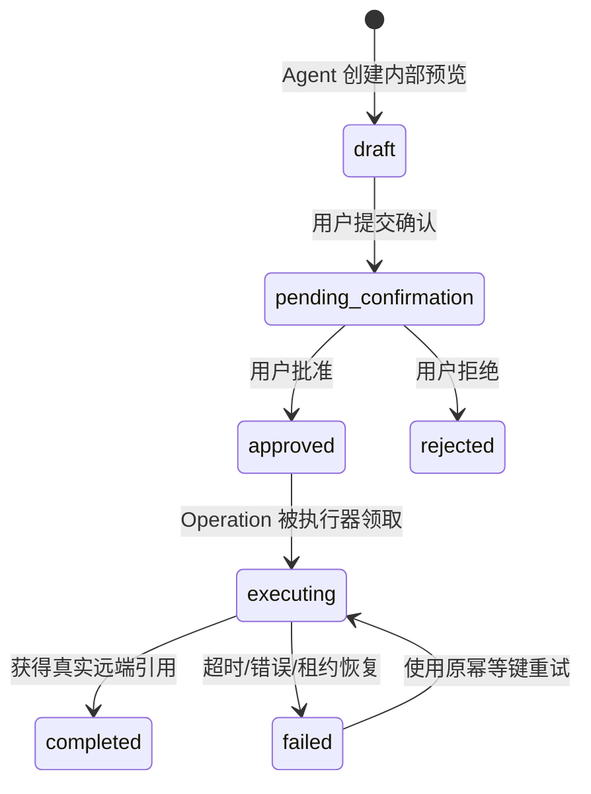
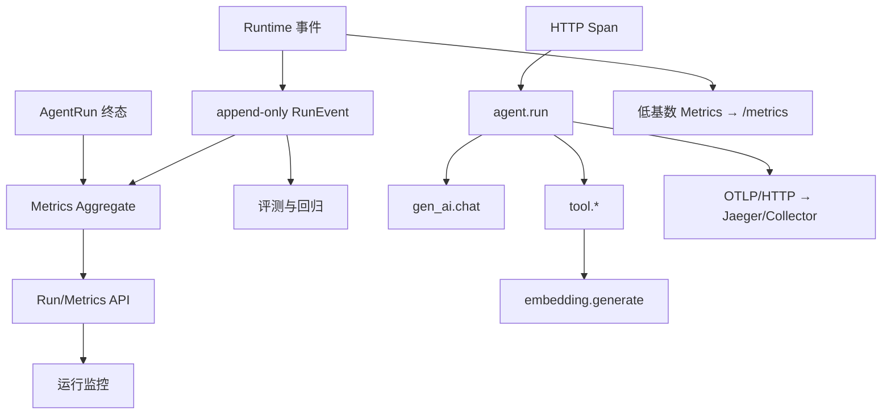
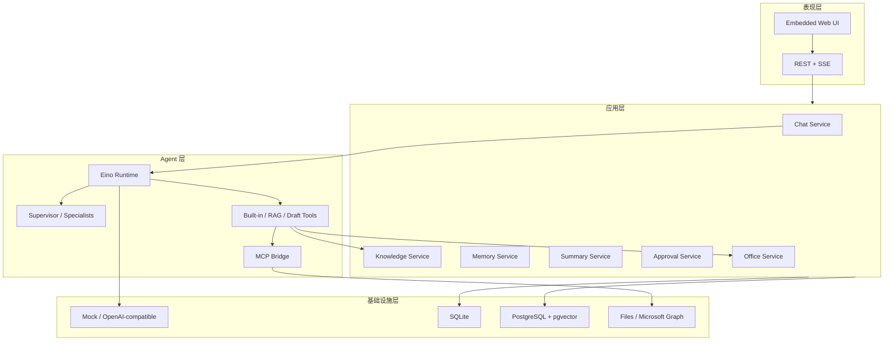

# Zora 项目分析文档

本文用于深入理解 Zora，并为 Agent 开发岗位的简历与面试做准备。

阅读顺序建议：

1. 先用 [README](../README.md) 启动并完成[手工测试](manual-test-guide.md)；
2. 用本文建立业务、数据和架构全貌；
3. 结合[项目亮点全面分析](project-highlights.md)阅读关键源码；
4. 最后查阅[项目技术文档](technical-design.md)确认接口与实现细节。

## 1. 项目一句话定位

**Zora 是一个用 Go 和 Eino 构建的可观察 Agent 工作台，通过受控工具、RAG、长期记忆、多 Agent、人工审批和可恢复办公任务，把普通 LLM 对话升级为可执行、可审计、可评估的 Agent 系统。**

面试中的更短版本：

> 我用 Go 实现了一个 Agent 工作台，重点解决模型工具调用、知识与记忆、多 Agent 治理、外部副作用安全和运行可观察性，而不只是封装一次模型 API。

## 2. 项目边界与当前状态

### 2.1 已完成

- OpenAI-compatible 与本地 Mock 模型；
- 多模型服务端注册和请求级选择；
- Eino ReAct、流式 SSE、工具调用、停止生成；
- SQLite/PostgreSQL 对话、Run 和事件持久化；
- TXT/Markdown/PDF 知识摄取、版本、ACL、混合检索和引用；
- Semantic/Episodic 长期记忆、自动提取、合并、召回与用户 CRUD；
- 增量会话摘要和最近消息窗口；
- Supervisor + Research/Document/Writer 多 Agent；
- 交接预算、并行限制、专家超时、重试、父子 Run 与人工审批；
- MCP stdio Client、文件连接器、Microsoft Graph 只读连接器；
- 邮件/日程草稿、确认状态机、Operation、幂等和专用写执行器；
- Token Usage、TTFT、工具/交接耗时和 Web 运行监控；
- HTTP、Run、模型、Tool、Embedding 的 OTel Trace 与 Prometheus 指标；
- RAG、Memory、Multi-Agent 固定数据集评测。


### 2.2 尚未完成或没有宣称完成

- 完整登录、组织、租户和 RBAC；
- 面向大规模生产环境的分布式锁、任务队列和多实例调度；
- OCR、异步文档摄取、向量化批处理任务；
- 消息/长期记忆语义召回已具备独立向量索引；仍缺少专门离线评测和学习型重排；
- OTel Collector 生产管道、Grafana 仪表盘与告警规则；
- Microsoft 365 真实租户在线写入验收；
- 面向公网部署的完整限流、配额、WAF 和合规体系。

项目的可信表达应是“主链路和工程边界已实现，部分生产基础设施与真实外部资源验收仍待完成”，而不是“已经是生产级通用 Agent 平台”。

## 3. 背景与核心问题


### 3.1 为什么普通聊天应用不够

普通聊天应用通常只有：用户输入 → 模型请求 → 文本回答。它无法稳定处理以下需求：

- 根据私有文档回答并给出证据；
- 跨会话记住稳定偏好；
- 调用计算器、时间、文件、邮件和日历工具；
- 将复合问题拆给多个专业 Agent；
- 阻止高风险请求自动产生外部副作用；
- 回答失败后解释失败在哪一层；
- 比较两个模型、两种检索算法或单/多 Agent 的真实收益。


### 3.2 Zora 解决的工程问题


| 问题             | Zora 的回答                      |
| -------------- | ----------------------------- |
| 模型如何执行动作       | 使用结构化 ToolCall 和最小工具集         |
| 模型如何获得私有知识     | 文档摄取、混合检索、证据引用                |
| 如何跨会话保留信息      | 独立 Memory 模型、提取、合并、召回         |
| 长对话如何控制上下文     | 增量摘要 + 最近原文窗口                 |
| 多 Agent 如何避免失控 | 专业权限、预算、并行度、超时、重试             |
| 高风险动作如何拦截      | 持久化 Human-in-the-loop 审批      |
| 外部写操作如何可靠      | Draft、确认、Operation、幂等执行器      |
| 如何观察 Agent     | Run、RunEvent、Metrics 和 Web 监控 |
| 如何证明架构有效       | 固定数据集、Control/Treatment、质量门禁  |


## 4. 用户、场景与业务模型


### 4.1 目标用户

当前最适合三类用户：

1. 希望学习 Agent 工程实现的 Go 开发者；
2. 需要小型私有知识助手的个人或小团队；
3. 希望验证办公 Agent 安全边界的技术团队。


### 4.2 核心业务场景


#### 场景 A：通用问题解决

用户通过对话提问。Agent 可以直接回答，或调用时间、计算器等工具。回答以 SSE 流式返回，执行全过程可查询。

#### 场景 B：基于文档回答

用户上传设计文档，询问发布日期、门禁或接口约束。Document Agent 检索最新可见版本，回答携带证据引用。

#### 场景 C：个性化长期助手

用户表达“主要语言是 Go”“希望中文回答”。系统在成功回答后提取稳定事实，后续会话按问题相关性召回。

#### 场景 D：复合任务协作

用户要求“核对发布文档并起草邮件”。Supervisor 先交给 Document Agent 取证，再交给 Writer Agent 生成结构化草稿。

#### 场景 E：安全办公自动化

Agent 只能生成内部草稿。用户在草稿箱确认后创建 Operation，专用写执行器才可能产生真实外部副作用。

### 4.3 业务价值链




### 4.4 输入、处理、输出与安全边界


| 类别     | 内容                                                                 |
| ------ | ------------------------------------------------------------------ |
| 输入     | 用户消息、上传文档、手工记忆、模型选择、审批决定                                           |
| 处理     | 上下文构建、模型调用、ToolCall、检索、记忆召回、Agent 交接                               |
| 内部输出   | 对话答案、RunEvent、知识索引、Memory、Summary、Draft                            |
| 外部输出   | 仅专用 Executor 在显式启用并确认后发送邮件或创建日程                                    |
| 默认安全边界 | Mock、SQLite、Office Executor disabled、MCP disabled、多 Agent disabled |


### 4.5 核心业务规则

1. 用户消息先持久化，再启动 AgentRun；
2. 同一会话同一时刻只执行一个发送请求；
3. 请求只能选择服务端注册的模型 ID；
4. 知识检索只能访问可信主体可见的最新版文档；
5. 记忆只在本轮回答成功后自动提取；
6. 用户手工编辑的 Memory 不被自动流程覆盖；
7. 专业 Agent 只能使用职责内工具；
8. 高影响多 Agent 请求可在执行前等待人工审批；
9. Agent 只能创建 Draft，不能直接调用 Graph 写工具；
10. 外部 Operation 只有获得可核验远端引用后才能完成；
11. Token 只记录 Provider 返回值，缺失时不伪造估算；
12. 规划能力不以空接口冒充已完成。


## 5. 领域模型


### 5.1 聚合划分


| 聚合           | 核心实体                                      | 职责                  |
| ------------ | ----------------------------------------- | ------------------- |
| Conversation | Conversation、Message、Summary              | 用户可见对话与长上下文         |
| Execution    | AgentRun、AgentTaskRun、RunEvent、Approval   | 一次 Agent 执行、专业交接和审计 |
| Knowledge    | Document、Chunk                            | 文档版本、权限、向量与引用       |
| Memory       | Memory                                    | 跨会话稳定事实与事件          |
| Office       | Draft、DraftEvent、Operation、OperationEvent | 草稿确认和外部写任务          |


### 5.2 为什么要拆分这些聚合

- Conversation 的生命周期由用户管理；Run 的生命周期由一次请求管理；
- Knowledge 是外部事实来源，Memory 是与用户相关的长期信息，不能混成同一向量库；
- Draft 是可编辑/可确认内容，Operation 是可重试的外部副作用任务，两者状态语义不同；
- Event 是追加审计，实体表保存当前状态，二者查询模式不同。


### 5.3 关系图




## 6. 数据模型

数据定义可在 `[internal/store/sqlite/sqlite.go](../internal/store/sqlite/sqlite.go)` 和 `[internal/store/postgres/schema.go](../internal/store/postgres/schema.go)` 查看。

### 6.1 对话与执行数据


#### conversations


| 字段                      | 含义        |
| ----------------------- | --------- |
| id                      | 对话 ID     |
| title                   | 展示标题      |
| created_at / updated_at | 创建与最后更新时间 |


#### messages


| 字段                       | 含义                      |
| ------------------------ | ----------------------- |
| sequence                 | 单调递增序号，用于历史顺序和摘要覆盖范围    |
| id                       | 消息 ID                   |
| conversation_id          | 所属对话                    |
| role                     | user / assistant / tool |
| content                  | 用户可见内容                  |
| tool_name / tool_call_id | 可选工具关联                  |
| created_at               | 创建时间                    |


#### agent_runs


| 字段                        | 含义                                                  |
| ------------------------- | --------------------------------------------------- |
| id                        | 根 Run ID                                            |
| conversation_id           | 所属对话                                                |
| user_message_id           | 触发消息                                                |
| assistant_message_id      | 成功后对应回答                                             |
| status                    | running / completed / failed / cancelled / rejected |
| model                     | 实际使用模型                                              |
| error                     | 失败原因                                                |
| started_at / completed_at | 执行时间范围                                              |


#### agent_task_runs

保存专业 Agent 子任务：父 Run、Agent 名称、ToolCall ID、任务、attempt、状态、输出摘要和错误。`parent_run_id + tool_call_id` 唯一，避免同一次交接重复建子 Run。

#### run_events

保存追加式执行事实：Run、event type、agent/tool name、JSON payload、sequence 和时间。它是工具轨迹、模型 Usage、首字延迟和交接耗时的基础。

#### approval_requests

保存根 Run 级审批：触发原因、pending/approved/rejected/expired 状态、决定说明和时间。状态迁移使用条件更新阻止重复决定。

#### api_usage_daily

以 `usage_date + principal_id + resource` 为主键，保存请求数、Agent Run 数和知识上传字节的 UTC 日累计值。扣减使用数据库条件 Upsert 原子完成，超过上限时不修改已用额度；因此并发请求和服务重启不会绕过日配额。

### 6.2 上下文数据


#### conversation_summaries


| 字段               | 含义          |
| ---------------- | ----------- |
| conversation_id  | 每个会话一份当前摘要  |
| content          | 压缩后的历史事实与约束 |
| through_sequence | 已覆盖到的消息序号   |
| message_count    | 本次累计覆盖数量    |
| model            | 摘要模型        |
| updated_at       | 最后更新时间      |


#### memories


| 字段                                         | 含义                    |
| ------------------------------------------ | --------------------- |
| kind                                       | semantic 或 episodic   |
| memory_key                                 | 稳定事实槽位，用于合并冲突         |
| content                                    | 记忆正文                  |
| importance                                 | 0–1 重要性               |
| user_edited                                | 是否被用户手动修改             |
| source_type                                | manual 或 conversation |
| source_conversation_id / source_message_id | 来源追踪                  |
| expires_at                                 | 可选过期时间                |

#### memory_capture_jobs

| 字段组 | 含义 |
|---|---|
| run_id、conversation_id | 原 Run 与会话关联；run_id 唯一保证幂等入队 |
| user_message_id、assistant_message_id | Worker 延迟读取正文，Outbox 不复制消息内容 |
| status、attempt、max_attempts | pending/executing/completed/failed 状态与尝试预算 |
| available_at | 失败指数退避后的下次可领取时间 |
| lease_owner、lease_until | 多 Worker 并发领取和崩溃恢复 |
| result、last_error | 捕获计数结果和最近错误，不保存候选正文 |
| trace_parent | 把后台 Span 接回原 Agent Run；API 不暴露 |


### 6.3 知识数据


#### knowledge_documents


| 字段组                                  | 含义                |
| ------------------------------------ | ----------------- |
| id、name、source_type、mime_type        | 文档身份与来源           |
| version_group_id、version、is_latest   | 版本链               |
| content_hash                         | 内容去重              |
| owner_id、visibility                  | private/public 权限 |
| embedding_model、embedding_dimensions | 索引兼容性             |
| chunk_count                          | 分块数量              |


#### knowledge_chunks


| 字段组                                        | 含义               |
| ------------------------------------------ | ---------------- |
| document_id、ordinal                        | 所属文档和顺序          |
| content、start_rune、end_rune                | 原文与 Unicode 引用范围 |
| embedding                                  | 向量               |
| term_counts / search_terms / search_vector | 关键词检索特征          |
| token_count                                | 分块规模             |


PostgreSQL 为 embedding 建 HNSW，为 search_vector 建 GIN。SQLite 保存向量与词频并在进程内精确计算。

### 6.4 Office 数据


#### office_drafts / office_draft_events

Draft 保存邮件或日程的规范化 JSON、来源 Run、内容哈希和状态。`source_run_id + content_hash` 唯一，用于吸收模型重试。DraftEvent 保存每次不可变迁移。

#### office_operations / office_operation_events

Operation 与 Draft 一对一，保存稳定幂等键、executor、attempt、lease、远端引用和错误。OperationEvent 记录每次领取、检查点、成功和失败。

### 6.5 为什么当前不建立统一 JSON 大表

Agent 系统容易把所有状态塞进一张 `runs(metadata JSON)`。Zora 保留 JSON payload 作为扩展字段，但对 Conversation、Memory、Document、Draft 和 Operation 使用明确列与约束，原因是：

- 关键状态可以由数据库 CHECK/UNIQUE 保护；
- 更容易查询过期记忆、待执行 Operation 和最新版文档；
- 领域对象的生命周期更清晰；
- 面试和维护时可以解释一致性边界。


## 7. 关键功能与核心流程


### 7.1 核心对话流程




关键点：

- 用户消息先保存，失败请求也有可追踪输入；
- Context 从 HTTP 传到模型与工具；
- Run 必须进入明确终态；
- Memory Capture 通过 Outbox 异步执行，Summary 当前仍同步；两类增强失败都不推翻已成功回答；
- 内部 ToolCall 不反复写进下一轮用户历史。


### 7.2 RAG 摄取与查询




### 7.3 长期记忆生命周期




### 7.4 多 Agent 路由




独立任务可以在最大并行度内并发；有依赖的“先检索再写作”保持串行。每个根 Run 维护交接预算，专家拥有单独超时和有限重试。

### 7.5 办公草稿与外部执行




实际实现中 Draft 状态与 Operation 状态分别保存；图中合并展示业务体验。四层边界是：

1. Draft：模型产生的内部内容；
2. Confirmation：用户对内容负责；
3. Operation：可持久化、可重试的外部任务；
4. Executor：唯一持有写权限的组件。


### 7.6 可观察性流程



RunEvent 是不可采样的产品审计，指标包括总耗时、TTFT、模型调用、工具次数与耗时、Agent 交接次数与耗时、Provider Token Usage 完整性。OTel/Prometheus 是可采样、可按保留策略清理的基础设施观测，两者通过 Run ID 与 Trace ID 关联而不是互相替代。

## 8. 技术架构


### 8.1 分层架构




### 8.2 包职责


| 包            | 职责                 | 不应该承担的职责      |
| ------------ | ------------------ | ------------- |
| config       | 环境变量解析与启动校验        | 业务执行          |
| agentruntime | Eino、模型、事件、多 Agent | 数据库事务与 HTTP   |
| chat         | 核心用例和 Run 生命周期     | Provider 具体协议 |
| knowledge    | 摄取与检索              | 会话状态          |
| memory       | 长期记忆生命周期           | 全量消息持久化       |
| summary      | 会话压缩               | Memory 冲突合并   |
| approval     | 根 Run 审批           | Office 草稿确认   |
| office       | 草稿与外部任务状态机         | 普通只读工具发现      |
| mcpbridge    | MCP Client 与工具安全适配 | 用户业务状态        |
| store        | 持久化契约与实现           | Agent 决策      |
| httpapi      | API、SSE、Web        | 核心领域规则        |
| observability | Run 聚合、Trace、Metric | Prompt/正文持久化与业务决策 |


### 8.3 依赖方向

HTTP 依赖 Application Service；Application 依赖 Runtime 和 Store 接口；基础设施实现接口。领域包不会反向依赖 Web。`cmd/zora` 是 Composition Root，负责选择具体实现。

## 9. 技术选型与取舍


| 选型                    | 选择原因                      | 放弃或暂缓的方案                | 代价与限制             |
| --------------------- | ------------------------- | ----------------------- | ----------------- |
| Go                    | 熟悉、并发/Context/HTTP 强、单二进制 | Python Agent 生态         | AI 组件和示例相对少       |
| Eino                  | Go 原生 ReAct、Tool、流式事件     | 完全手写循环、LangChain Python | 需要适配框架事件和版本变化     |
| SSE                   | 响应单向流简单、HTTP 友好           | WebSocket               | 不适合双向实时协同         |
| SQLite 默认             | 零依赖、纯 Go、便于演示             | 一开始强制 PostgreSQL        | 大规模检索和多实例有限       |
| PostgreSQL + pgvector | 统一事务、向量、FTS、连接池           | 专用向量数据库                 | 超大规模向量能力不如专用系统    |
| HNSW                  | 查询快、pgvector 成熟           | IVFFlat、精确全扫            | 索引占空间，更新成本更高      |
| RRF                   | 不需校准异构分数，稳定简单             | 学习排序、手工线性加权             | 没有 query-aware 权重 |
| Hash Embedding 默认     | 无 Key、可复现、测试链路            | 本地大模型默认下载               | 不具备真实语义能力         |
| 环境变量配置                | 12-factor、部署简单            | 配置中心、后台动态配置             | 修改需要重启，不适合大规模租户   |
| MCP stdio             | 进程隔离、官方 SDK、部署直观          | 远程 HTTP MCP             | 跨机器治理能力有限         |
| 自包含 Web               | 无 Node 构建和独立部署            | React/Vue SPA           | 复杂 UI 可维护性有限      |
| 追加式 RunEvent          | 可审计、可重算指标                 | 只打日志、只存最终 JSON          | 事件量增长，需要归档策略      |
| OTel + Prometheus       | 标准协议、跨层 Trace、低基数聚合       | 自定义埋点平台                    | 生产还需 Collector/告警治理 |
| 规则 + 模型双实现            | Mock 可测、真实模型可用            | 所有增强都调用 LLM             | 两种路径需要保持语义一致      |
| 持久化文档摄取 Job          | HTTP 快速返回、失败可重投、重启可恢复 | 比同步流程多一套状态与运维 API | 适合真实 Embedding 延迟     |
| 多 Agent 默认关闭          | 避免意外成本，先评测收益              | 始终开启                    | 使用者需要显式配置         |


## 10. 项目亮点结论

完整 22 项分析见[项目亮点全面分析](project-highlights.md)。最值得面试展开的七项是：

1. **执行模型清晰**：Message、Run、RunEvent 分离；
2. **RAG 有治理和评测**：版本、ACL、引用、混合检索和回归指标；
3. **Memory 可控**：独立模型、同 Key 合并、人工修正保护；
4. **多 Agent 有治理**：权限、预算、并发、超时、父子 Run 和对照评测；
5. **副作用安全**：Draft、确认、Operation、幂等、租约和远端检查点。
6. **异步可靠性**：助手消息与 Memory Job 原子入队、租约领取、退避重试和崩溃恢复。
7. **部署安全边界**：可信 IP 限流、持久化日配额、CSRF/CORS 与文件 Secret。

这些能力能体现 Go 后端、安全工程与 Agent 工程能力的结合。

## 11. 项目缺陷与待改进项


### 11.1 P0：对外部署前必须解决


| 缺陷                      | 风险                        | 建议方案                                       |
| ----------------------- | ------------------------- | ------------------------------------------ |
| 没有认证与租户体系               | 任意访问者可读取对话、记忆、文档和草稿       | OIDC/JWT、中间件注入 principal、全表 tenant_id、RBAC |
| 尚无 JWT/OIDC 与按模型成本预算       | 当前配额按单用户主体、IP 和资源计数，不能代表真实租户计费 | 认证主体、tenant_id、按模型 Token/费用预算与 RBAC             |
| Secret 尚未接入托管轮换平台          | 已有严格 `_FILE` 注入，但轮换和访问审计依赖部署平台 | Vault/KMS/Secret Manager、自动轮换和审计                     |
| Microsoft 写链路未真实租户验收    | 代码测试通过不代表 Graph 权限与幂等真实有效 | 测试租户端到端、失败注入、重复执行验收                        |


### 11.2 P1：从个人项目走向可靠服务


| 缺陷                 | 当前影响               | 建议方案                                  |
| ------------------ | ------------------ | ------------------------------------- |
| 会话锁只在单进程内          | 多实例可能并发处理同一会话      | PostgreSQL advisory lock 或 Redis 分布式锁 |
| 通用任务平台尚无优先级/死信面板 | 文档摄取和摘要已共享 Worker，但 Memory/Office 仍保留专用状态机 | 统一运维视图、优先级、死信告警与任务取消协议              |
| 迁移方式偏内嵌            | Schema 演进与回滚能力有限   | golang-migrate/Atlas，版本化 SQL 和回滚策略    |
| RunEvent 无归档策略     | 长期数据量持续增长          | 分区、TTL、冷热分层和聚合表                       |
| 可观察性仍是开发环境直连 | 尚无 Collector、Dashboard 和告警 | Collector 管道、Grafana、SLO 和告警规则           |
| 模型容错有限             | Provider 超时或限流直接失败 | 模型级熔断、指数退避、fallback 策略与预算             |


### 11.3 P2：提升 Agent 效果


| 缺陷                 | 当前影响              | 建议方案                                 |
| ------------------ | ----------------- | ------------------------------------ |
| Hash Embedding 无语义 | 默认知识库只能验证链路       | 开发环境支持 Ollama/本地 Embedding           |
| 轻量中文分词             | 专有词与长词匹配有限        | jieba/自定义词典，或 PostgreSQL 中文扩展        |
| RRF 固定参数           | 不同 query 类型不能自适应  | Query 分类、动态权重、Cross-Encoder reranker |
| 消息/Memory 向量召回缺少专项评测 | 可能扩大上下文污染与 Embedding 成本 | 固定数据集、负例、阈值调优与可选重排 |
| 自动 Memory 提取依赖单次模型 | 可能错误写入            | 置信度、二次校验、候选确认队列                      |
| Summary 可能累积失真     | 很长会话中早期事实逐步漂移     | 周期性从原始消息重建、事实槽位校验                    |
| Multi-Agent 样本较小   | 无法证明真实业务普适收益      | 扩充真实任务集，按复杂度/领域分桶                    |
| PDF 无 OCR          | 扫描件无法使用           | OCR Worker、页码与版面位置引用                 |
| 有限 Markdown 渲染器    | 不支持复杂表格、任务列表和链接策略 | 引入受审计 Markdown 库和 HTML sanitizer     |


### 11.4 P3：产品体验

- 工具名仍有英文，应增加友好显示名；
- Agent 不知道所有 Web UI 入口，系统 Prompt 或 ToolResult 可注入产品能力说明；
- 知识引用可以做成可点击侧栏并定位原文；
- 草稿箱需要更明显的创建成功提示和直接跳转；
- 模型列表可显示能力、上下文长度与费用提示；
- 运行监控可增加状态筛选、趋势图与失败聚类；
- 缺少移动端导航、键盘可访问性和主题切换的系统测试。


### 11.5 最推荐的下一阶段

如果目标是找 Agent 开发岗位，优先级建议不是继续堆功能，而是：

1. 基于现有 64 题真实 Embedding 结果分析失败 Case，调整混合检索；
2. 为已经接通的 OTel/Prometheus 增加 Collector、Dashboard、SLO 与告警；
3. 完成 JWT + principal + tenant_id 的最小多用户闭环；
4. 写一篇真实故障复盘：例如流式闪烁、模型误选工具或引用不忠实；
5. 为 Memory 多实例同 Key 合并增加数据库唯一约束与冲突重试，并补后台任务积压告警。

这几项比再增加一个“角色 Agent”更能体现后端和 Agent 工程深度。

## 12. 测试与质量策略


### 12.1 测试金字塔


| 层级         | 示例                                         |
| ---------- | ------------------------------------------ |
| 纯函数单测      | 计算器、分块、Tokenizer、RRF、评分、参数校验               |
| Service 单测 | Memory 合并、Summary 增量、Approval、Office 状态机   |
| Store 契约   | SQLite 生命周期、PostgreSQL Schema/集成测试         |
| Runtime 测试 | Mock ToolCall、多 Agent 路由、Usage 事件          |
| HTTP 集成    | SSE、上传、Memory CRUD、草稿、审批、指标                |
| 固定评测       | RAG、Memory A/B、单/多 Agent Control/Treatment |
| 手工验收       | 真实模型、UI 流式体验、文档问答和草稿箱                      |


### 12.2 为什么 Agent 项目需要 Eval

普通单测验证“代码是否按预期执行”；Agent Eval 还要验证“模型输出的效果是否达到业务阈值”。两者不能互相替代：

- 单测适合确定性逻辑、状态机和安全边界；
- Eval 适合检索召回、答案覆盖、路由和质量/成本权衡；
- 真实模型手工测试适合发现流式 UI、Provider 兼容和非确定性问题。


## 13. 三分钟口述稿

下面的稿子约三分钟，不需要逐字背诵。面试时根据岗位删减。

### 0:00–0:30：定位与动机

> 我有两年 Go 后端经验，为了系统学习 Agent 开发，我做了 Zora。它不是一个只调用模型 API 的聊天壳，而是一个可观察 Agent 工作台，重点实现工具调用、RAG、长期记忆、多 Agent、人工审批和办公任务的可靠执行。


### 0:30–1:10：主链路

> 整体使用 Go 和 Eino。HTTP 层通过 SSE 返回模型增量、工具调用和 Agent 交接事件。Chat Service 会先保存用户消息和 running Run，再组装会话摘要、最近消息和相关记忆，交给 Runtime 执行。最终回答、Run 终态和追加式 RunEvent 都会持久化。Message 只保存用户可见历史，RunEvent 保存内部轨迹，这样既不污染下一轮上下文，又能完整审计。


### 1:10–1:45：RAG 与 Memory

> RAG 支持文档去重、版本、private/public 权限、Unicode 重叠分块和引用。检索同时使用向量和关键词，PostgreSQL 下推到 pgvector HNSW 与 FTS，再通过 RRF 融合。长期记忆是独立的 Semantic/Episodic 模型，有稳定 Key、重要性、来源和过期时间；自动提取通过事务 Outbox 异步执行，助手消息和 Job 原子提交，Worker 用租约和指数退避处理失败。


### 1:45–2:20：多 Agent 与安全

> 多 Agent 使用 Supervisor 加 Research、Document、Writer 三个真实 AgentTool，工具按职责隔离，并设置交接次数、并行度、超时和重试。高影响请求可以进入持久化审批。办公能力进一步把模型能做的事限制为创建内部草稿；真正外部写入必须经过确认、Operation 和专用执行器，使用稳定幂等键、租约和远端检查点处理重试与进程恢复。


### 2:20–2:45：可观察性与评测

> 每次执行会记录模型调用、首字、工具和交接事件，再从事件聚合 TTFT、Token 和各阶段耗时。Token 只使用 Provider 返回值，不做伪精确估算。同时通过 OpenTelemetry 把 HTTP、Run、模型、工具与 Embedding 串成 Trace，通过 Prometheus 暴露低基数指标。项目还提供 RAG、Memory 和单/多 Agent 的固定评测，使用 Control/Treatment 观察质量、错误注入、延迟和调用成本。


### 2:45–3:00：取舍与下一步

> 项目默认 Mock 加 SQLite，保证无 Key 可运行，同时提供 PostgreSQL、真实模型和真实 Embedding 路径。Memory Capture、文档摄取和摘要都已异步化；不足是缺少完整认证、跨实例会话锁、任务积压告警、生产 Collector 和真实 Microsoft 租户验收。下一步我会优先做检索失败归因和多用户闭环，而不是继续堆角色数量。


## 14. 面试追问预判


### 14.1 为什么选择 Go，而不是 Python？

回答要点：

- 自己有 Go 后端积累，可以把精力放在 Agent 架构；
- Go 的 Context、并发、HTTP、单二进制适合流式与工具服务；
- Eino 和 MCP 官方 Go SDK 已能覆盖核心需求；
- 承认 Python AI 生态更丰富，离线模型、Reranker 或数据处理可通过独立服务集成。


### 14.2 为什么用 Eino，不自己写 ReAct？

回答要点：

- ToolCall 拼接、模型流和 Agent 循环属于通用机制；
- 项目价值在业务状态、安全和评测；
- 用 `agentruntime` 隔离 Eino，Chat/Store 不直接依赖大量框架类型；
- 可以说明如果换框架，主要替换 Runtime 和模型适配层。


### 14.3 一次消息为什么需要 Message、Run、Event 三种数据？

回答要点：用户历史、执行终态、内部审计职责不同；Event 追加写可重建时间线和指标；工具轨迹不进入长期对话上下文。

### 14.4 同一会话为什么加锁？锁粒度是什么？

回答要点：防止并发请求基于同一历史生成并交错写入；按 conversation ID 加锁，不同会话并行；当前只在单进程有效，多实例需数据库或 Redis 锁。

### 14.5 客户端断开后如何停止模型和工具？

回答要点：HTTP Context 传入 Chat、Runtime、Tool 和 Store；Abort/连接断开会触发取消；Run 根据错误映射到 cancelled；还要说明第三方 SDK 是否真正尊重 Context。

### 14.6 为什么选择 SSE，不选 WebSocket？

回答要点：当前主要是服务器向客户端单向推送；SSE 基于 HTTP、代理友好、实现简单；审批决定使用独立 POST；若未来需要双向实时语音或协同，再考虑 WebSocket。

### 14.7 RAG 为什么要混合检索？

回答要点：向量覆盖语义，关键词覆盖代码、日期、专有名词；RRF 只依赖名次，避免不同分数量纲校准；保留单路分数用于解释和评测。

### 14.8 PostgreSQL 与专用向量数据库如何取舍？

回答要点：当前规模下 PostgreSQL 统一事务、ACL、版本与向量更简单；pgvector 足够；达到亿级或需要复杂 ANN/多模态时才评估 Qdrant/Milvus/Weaviate，并保留 Service/Store 边界。

### 14.9 切换 Embedding 维度会发生什么？

回答要点：Document/Chunk 记录模型和维度；PostgreSQL `vector(N)` 固定；启动时校验不一致并失败，防止静默混用；需要迁移或重建索引。

### 14.10 如何防止 RAG Prompt Injection？

回答要点：外部内容作为不可信数据注入，不能提升指令优先级；工具集与权限不由文档内容决定；ACL 在检索层过滤；仍需承认模型层无法绝对防御，可增加内容分类、引用约束和输出策略。

### 14.11 Memory 与 RAG 有什么区别？

回答要点：RAG 是外部知识与文档证据；Memory 是与用户相关、经过筛选的长期事实/事件；生命周期、权限、合并和召回策略不同，不能只做两个向量集合。

### 14.12 如何处理 Memory 冲突？

回答要点：用 kind + memory_key 表示事实槽位；新候选更新旧值；人工编辑设置 user_edited，自动流程跳过；未来可保留历史版本和置信度，而不是简单覆盖。

### 14.13 为什么摘要不能替代 Memory？

回答要点：摘要服务于单个会话的上下文压缩；Memory 跨会话、可编辑、可过期并按当前问题召回；摘要是历史压缩，Memory 是长期用户模型。

### 14.14 多 Agent 为什么不默认开启？

回答要点：模型调用、延迟和错误面都会增加；项目提供 Control/Treatment 评测，只有质量收益超过成本才启用；复杂度不是目标。

### 14.15 专业 Agent 如何做权限隔离？

回答要点：在构建 Runtime 时分别注入工具集合，而不是只靠 Prompt 说“不要调用”；Supervisor 只拿 AgentTool；Writer 才拿草稿工具，Document 才拿 RAG/MCP 只读工具。

### 14.16 多 Agent 如何防止无限交接？

回答要点：每个根 Run 隔离最大 handoff、最大并行；专家有 timeout 和 retry；Context 取消传播；子 Run 持久化终态；当前不允许 Specialist 再递归持有 Supervisor。

### 14.17 为什么审批要持久化？

回答要点：UI 弹窗不是后端安全边界；数据库记录便于审计和条件更新；等待中的 Run 可以明确 approved/rejected/expired；当前重启后不能恢复原模型流，但状态不会丢，未来可转持久化工作流。

### 14.18 如何保证不会重复发邮件？

回答要点：模型只能建 Draft；Draft 经人工确认；每 Draft 唯一 Operation；稳定幂等键；邮件先建远端草稿并 checkpoint ID，再发送；重试复用远端 ID 并检查状态；只有远端引用存在才能 completed。

### 14.19 为什么批准后不直接发送？

回答要点：批准是业务决定，执行是可能失败、重试和恢复的外部任务；Operation 解耦短 HTTP 请求与长副作用，并提供租约、attempt 和审计。

### 14.20 Token 为什么不自己估算？

回答要点：不同 Provider/模型 tokenizer 不同，估算不能作为费用事实；项目只聚合 Provider Usage，缺失就标记不完整；如果用于容量预测，可以另加明确命名的 estimated token 指标。

### 14.21 如何计算 TTFT？

回答要点：记录 Run start 和首次非空 delta 的 first_token 事件，聚合时间差；工具执行前可能尚未进入生成，因此 TTFT 表示用户感知首字，不等于纯模型 prefill。

### 14.22 如果模型输出了一半后失败怎么办？

回答要点：SSE 返回 error，Run 进入 failed/cancelled；当前只有完成后的 Assistant Message 作为正式历史，避免下轮误用半截答案；产品可选择显示临时内容但标记未完成。

### 14.23 SQLite 与 PostgreSQL 如何保持行为一致？

回答要点：共享 Store 契约和领域 Service；双实现测试；检索候选路径不同但统一在 Service 做结果契约/RRF；真实 PostgreSQL 使用可选集成测试。

### 14.24 你遇到过什么真实问题？

可以讲流式闪烁：

> 真实模型 token 返回很密，前端原实现每个 delta 都删除并重建全部消息，再触发 smooth scroll，所以页面频繁闪烁。定位后改成 requestAnimationFrame 合并更新，只刷新当前回答，并在流式阶段关闭平滑滚动。同时补全安全 Markdown 渲染。这体现了真实 Provider 验收能发现 Mock 不容易暴露的性能问题。


### 14.25 如果重做一次，会先做什么？

回答要点：先定义 Run/Event、工具安全和 Eval，再扩展 RAG/Memory/Multi-Agent；更早引入 OTel 和异步 Job；减少早期 README 重复；先用真实小数据集验证复杂功能收益。

## 15. 简历表达


### 15.1 项目名称

**Zora：Go Agent 工作台与可靠执行系统**

### 15.2 一句话精简版

使用 Go、Eino、PostgreSQL/pgvector 实现可观察 Agent 工作台，覆盖 RAG、长期记忆、多 Agent、MCP、安全审批和幂等办公任务。

### 15.3 三条项目描述

- 基于 Go + Eino 实现流式 ReAct Agent，设计 Message/AgentRun/RunEvent 分层模型，支持多模型请求级路由、Context 取消、会话并发控制，并从持久事件聚合 TTFT、Provider Token 与工具耗时。
- 实现带版本和 ACL 的 RAG：Unicode 重叠分块、可替换 Embedding、pgvector HNSW + PostgreSQL FTS 双路召回与 RRF 融合，并建立 Recall@K/MRR、事实覆盖和引用忠实度评测。
- 构建长期记忆与多 Agent 治理：Semantic/Episodic 提取合并、事务 Outbox 与租约 Worker、增量摘要、Supervisor 专业工具隔离、预算/超时/重试、人工审批，以及 Draft → Operation → 幂等 Executor 的外部副作用安全链路。


### 15.4 五条详细版

1. 使用 Eino ChatModelAgent 统一 Mock 与 OpenAI-compatible 模型，Mock 仍经过真实 ToolCall 链路，使无外部 Key 的单元与集成测试可稳定复现；
2. 使用 SQLite 提供零依赖运行，并基于 pgx、pgvector HNSW 和 FTS GIN 实现 PostgreSQL 生产检索路径，通过 Store 接口保持上层无感；
3. 设计可编辑、可过期、可追溯的长期记忆模型，支持稳定 Key 冲突合并、人工修正保护、事务 Outbox 异步捕获、租约/退避恢复、联合召回及 Control/Treatment A/B；
4. 实现 Supervisor、Research/Document/Writer AgentTool 的职责隔离与串并行调度，并对交接次数、并发、超时、重试、取消和父子 Run 进行治理；
5. 将办公写入拆分为内部草稿、人工确认、持久化 Operation 和专用 Executor，使用内容哈希、幂等键、租约、远端检查点与恢复机制控制重复副作用。


### 15.5 STAR 表达示例

**S/T：** 为了从传统 Go 后端转向 Agent 开发，需要实现一个不止能聊天、还能安全使用知识和工具的完整项目。

**A：** 使用 Eino 建立 ReAct Runtime，自研 Chat/Run/Event、RAG、Memory、Multi-Agent 治理和 Office 状态机；引入 pgvector + FTS 混合检索、Context 取消、审批、幂等执行与固定评测集。

**R：** 完成从本地 Mock 到真实模型的可运行闭环，能够对工具轨迹、TTFT、Token、RAG 引用和多 Agent 交接进行审计；通过自动测试和手工用例发现并修复真实模型流式重绘问题。

注意：简历不要编造线上用户数、QPS、准确率或成本下降。没有真实数据时，应写“实现”“建立”“通过固定数据集验证”，不要写“提升 80%”。

## 16. 针对两年 Go 后端经验的复习路线


### 第一阶段：先讲清 Go 工程能力

- `context.Context` 如何跨 HTTP、模型和工具取消；
- conversation 级锁为什么存在，如何演进到多实例；
- SQLite/PostgreSQL 事务、唯一约束和 CAS；
- SSE 生命周期、客户端断开和优雅关闭；
- interface 如何隔离 Runtime、Store、Embedder 和 Executor。


### 第二阶段：理解 Agent 核心

- ReAct 的 Thought/Action/Observation 如何映射 ToolCall；
- Tool Schema 为什么比解析自然语言可靠；
- System/User/Tool 消息的信任等级；
- 为什么工具权限必须由代码注入，而不是 Prompt 声明；
- Agent Run 与普通 HTTP 请求有什么不同。


### 第三阶段：理解 RAG 与 Memory

- Chunk Size/Overlap 的影响；
- Embedding、余弦相似度、BM25、HNSW、RRF；
- Recall@K、MRR、引用忠实度；
- Memory 提取、Consolidation、Recall、遗忘；
- Summary 与 Memory 的边界。


### 第四阶段：理解可靠性与评测

- 幂等键、租约、检查点、Outbox；
- Human-in-the-loop 与持久化工作流；
- TTFT、Token、工具耗时和 Trace；
- Agent 的非确定性为什么需要 Eval；
- Control/Treatment 如何避免“功能存在即有效”的误区。


## 17. 面试时不要过度承诺

以下表述要避免：

- “这是生产级通用 Agent 平台”；
- “Hash Embedding 也能做语义检索”；
- “多 Agent 一定比单 Agent 好”；
- “已经完整支持 Microsoft 365 自动办公”；
- “有审批就绝对安全”；
- “所有模型都完全兼容 OpenAI 协议”；
- “Token 指标等于真实账单”；
- “SQLite 和 PostgreSQL 性能一样”。

更可信的表达方式是明确当前实现、验证范围、已知限制和下一步方案。对于两年经验的候选人，能准确说明边界通常比堆砌术语更加分。

## 18. 总结

Zora 的核心价值不在功能数量，而在以下完整闭环：

```text
用户需求
  → 模型规划
  → 受控工具与知识补充
  → 可选专业 Agent 协作
  → 流式答案或内部草稿
  → 审批与可靠副作用边界
  → Run/Event/Metrics 审计
  → 固定 Eval 回归
  → 基于证据继续优化
```

如果你能结合代码讲清这条闭环，并坦诚说明认证、跨实例同 Key 一致性、消息/记忆向量评测、任务积压告警、生产观测管道和外部租户验收仍是改进项，这个项目就不再是“Agent 空壳”，而是一个能够体现 Go 后端基本功、Agent 系统理解和工程判断力的作品。
