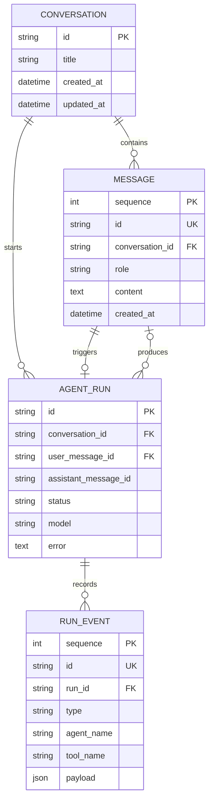
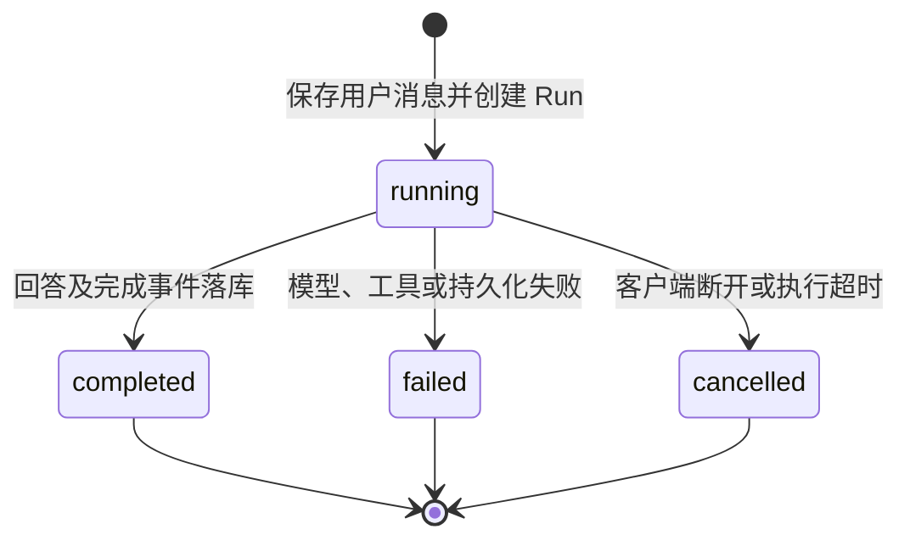
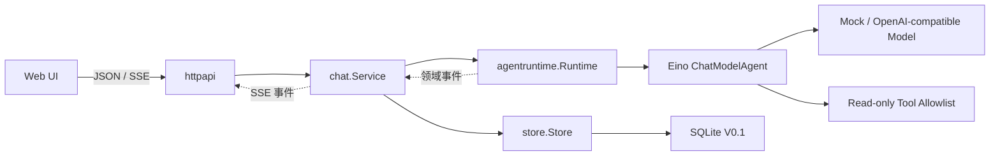

# Zora 项目分析文档

> 文档基线：V0.1 Agent Core  
> 最后更新：2026-08-14  
> 文档定位：用于需求讨论、架构评审、项目复盘和 Agent 开发岗位面试介绍。

## 1. 项目概述

Zora 是一个以 Go 为主语言、基于 Eino ADK 构建的可观察 Agent 产品。项目不以“接入大模型并提供聊天页面”为终点，而是围绕 Agent 产品真正需要解决的问题逐步演进：

- 模型如何可靠调用工具并获得反馈；
- 会话和每次 Agent 执行如何持久化、追踪和恢复；
- 知识库如何提供有引用、可评估的答案；
- 长期记忆如何提取、更新、遗忘并由用户控制；
- 多 Agent 如何分工、控制预算并证明其收益；
- 办公写操作如何经过授权、审批和审计。

当前 V0.1 已完成单 Agent 核心链路，知识库、长期记忆、多 Agent 和办公连接器属于后续里程碑。

## 2. 背景与问题

普通聊天壳通常只有三层：聊天页面、模型 API、历史消息列表。这类实现可以展示模型调用，却无法回答 Agent 岗位经常关注的问题：

- 工具如何声明、选择、执行和防止越权；
- Agent 为什么停止，如何避免无限循环；
- 流式输出、取消、超时和失败如何处理；
- 一次复杂任务经过了哪些步骤，如何审计；
- RAG、Memory 和 Multi-Agent 是否真的提高效果；
- 如何在能力、成本、延迟和安全之间做取舍。

Zora 将这些问题作为项目主线。V0.1 先建立一条可运行、可测试、可观察的执行骨架，再在同一骨架上增加高级能力。

## 3. 项目目标与非目标

### 3.1 目标

1. 用 Go 验证 Agent Runtime、工具调用、流式传输和持久化的完整工程闭环。
2. 支持通义千问等 OpenAI-compatible 模型，同时避免业务层绑定单一厂商。
3. 把 Conversation、AgentRun、RunEvent 分离，使用户历史和内部轨迹分别演进。
4. 默认提供零密钥、零外部数据库的本地体验，降低项目运行门槛。
5. 为 RAG、Memory、Multi-Agent、MCP 和 Human-in-the-loop 保留清晰扩展边界。
6. 用自动化评估和运行数据证明能力收益，而不是只展示功能清单。

### 3.2 当前非目标

- V0.1 不提供公网多租户服务和用户登录系统。
- V0.1 不执行 Shell、代码或任意外部写操作。
- V0.1 不把全部聊天历史直接向量化并称为长期记忆。
- V0.1 不为了展示多 Agent 而堆叠多个 Prompt。
- V0.1 不承担本地大模型推理，模型能力通过 API 接入。

## 4. 用户与使用场景

### 4.1 目标用户

| 用户 | 核心需求 | Zora 的价值 |
|---|---|---|
| 项目开发者 | 学习 Agent 的核心实现 | 能直接阅读和调试 Runtime、工具、事件和持久化代码 |
| Agent 岗位面试官 | 判断候选人的工程深度 | 能讨论取舍、失败语义、评估方案与扩展设计 |
| 个人用户 | 使用可靠的对话助手 | 获得流式回复、精确工具结果和持久化历史 |
| 后续办公用户 | 处理文档、邮件和日历 | 通过知识库、MCP 和审批机制逐步实现 |

### 4.2 当前典型场景

1. 用户创建或选择一个对话。
2. 用户输入问题，服务保存消息并创建一次 AgentRun。
3. Eino ChatModelAgent 判断直接回答还是调用工具。
4. 工具调用和结果实时展示，同时写入审计事件。
5. 模型基于工具结果生成最终回答。
6. 回答落库，Run 进入 completed、failed 或 cancelled 状态。

## 5. 业务能力模型

| 能力域 | V0.1 状态 | 说明 |
|---|---|---|
| 对话管理 | 已实现 | 创建、列表、重命名、删除和历史查询 |
| 流式交互 | 已实现 | SSE 增量文本、工具轨迹、停止生成 |
| Agent Runtime | 已实现 | Eino ReAct、最大迭代、上下文传递 |
| 模型接入 | 已实现 | Mock 与 OpenAI-compatible Provider |
| 工具系统 | 已实现 | 显式 allowlist、Schema 推断、三个只读工具 |
| 执行审计 | 已实现 | AgentRun 与 append-only RunEvent |
| 本地持久化 | 已实现 | SQLite、WAL、事务与级联删除 |
| 向量知识库 | 规划 V0.2 | PostgreSQL + pgvector、混合检索、引用、评估 |
| 长期记忆 | 规划 V0.3 | Semantic/Episodic Memory 与 Consolidation |
| 多 Agent | 规划 V0.4 | Supervisor、专业 Agent、预算和效果对比 |
| 办公能力 | 规划 V0.5 | MCP、邮件/日历/文件、人工审批和审计 |

## 6. 业务模型

### 6.1 核心业务对象

| 对象 | 含义 | 生命周期 |
|---|---|---|
| Conversation | 一个持续的用户对话空间 | 创建后持续存在，可重命名或删除 |
| Message | 用户可见的对话消息 | 追加写入，随 Conversation 删除 |
| AgentRun | 一次用户请求对应的一次 Agent 执行 | running → completed/failed/cancelled |
| RunEvent | Run 内部发生的可观察事实 | append-only，随 AgentRun 删除 |
| Tool | Agent 可选择的受控能力 | 启动时注册，当前均为只读 |
| Model Provider | 生成回答和工具决策的模型来源 | 由环境配置选择 |

### 6.2 对象关系

### 6.3 AgentRun 状态模型

终态不会重新回到 running。浏览器断开时，服务使用一个短时独立 Context 补写终态，避免产生永久运行中的脏数据。

## 7. 数据模型

### 7.1 conversations

| 字段 | 类型 | 约束 | 说明 |
|---|---|---|---|
| `id` | TEXT | PK | `conv_` 前缀的随机 ID |
| `title` | TEXT | NOT NULL | 默认“新对话”，首条消息后自动命名 |
| `created_at` | TEXT | NOT NULL | UTC RFC3339Nano |
| `updated_at` | TEXT | NOT NULL | 新消息或重命名时更新，用于列表排序 |

### 7.2 messages

| 字段 | 类型 | 约束 | 说明 |
|---|---|---|---|
| `sequence` | INTEGER | PK AUTOINCREMENT | 保证稳定的消息顺序 |
| `id` | TEXT | UNIQUE | `msg_` 前缀 ID |
| `conversation_id` | TEXT | FK | 删除 Conversation 时级联删除 |
| `role` | TEXT | CHECK | `user`、`assistant` 或 `tool` |
| `content` | TEXT | NOT NULL | 用户可见正文 |
| `tool_name` | TEXT | NOT NULL | Tool 消息预留字段 |
| `tool_call_id` | TEXT | NOT NULL | ToolCall 关联 ID |
| `created_at` | TEXT | NOT NULL | 创建时间 |

V0.1 的主消息历史只写 user 和最终 assistant 消息。中间工具轨迹写入 RunEvent，避免对话上下文被内部事件快速撑大。

### 7.3 agent_runs

| 字段 | 类型 | 约束 | 说明 |
|---|---|---|---|
| `id` | TEXT | PK | `run_` 前缀 ID |
| `conversation_id` | TEXT | FK | 所属对话 |
| `user_message_id` | TEXT | FK | 触发该 Run 的消息 |
| `assistant_message_id` | TEXT | Nullable | 成功后生成的回答 |
| `status` | TEXT | NOT NULL | running/completed/failed/cancelled |
| `model` | TEXT | NOT NULL | 本次执行使用的模型 |
| `error` | TEXT | NOT NULL | 失败原因，成功时为空 |
| `started_at` | TEXT | NOT NULL | 开始时间 |
| `completed_at` | TEXT | Nullable | 进入终态的时间 |

### 7.4 run_events

| 字段 | 类型 | 约束 | 说明 |
|---|---|---|---|
| `sequence` | INTEGER | PK AUTOINCREMENT | 全局事件落库顺序 |
| `id` | TEXT | UNIQUE | `evt_` 前缀 ID |
| `run_id` | TEXT | FK | 所属执行 |
| `type` | TEXT | NOT NULL | 事件类型 |
| `agent_name` | TEXT | NOT NULL | 当前产生事件的 Agent |
| `tool_name` | TEXT | NOT NULL | 工具事件对应名称 |
| `payload` | TEXT | JSON 内容 | 事件扩展数据 |
| `created_at` | TEXT | NOT NULL | 事件发生时间 |

持久事件包括：`run_started`、`tool_call`、`tool_result`、`model_output`、`run_completed`、`run_failed`、`run_cancelled`。token 级 `delta` 只通过 SSE 发送，不逐条落库。

## 8. 技术架构

### 8.1 分层职责

| 层 | 包 | 职责 |
|---|---|---|
| 启动层 | `cmd/zora` | 依赖组装、HTTP Server、信号和优雅关闭 |
| 传输层 | `internal/httpapi` | REST、SSE、输入限制、安全头、静态 UI |
| 应用层 | `internal/chat` | 用例编排、执行顺序、状态落库、会话锁 |
| Agent 适配层 | `internal/agentruntime` | Eino 组装、模型选择、事件归一化 |
| 能力层 | `internal/agenttools` | 工具 Schema、校验和安全执行 |
| 领域层 | `internal/domain` | Conversation、Message、Run、Event |
| 持久化抽象 | `internal/store` | Store 接口和统一错误 |
| 基础设施层 | `internal/store/sqlite` | SQLite DDL、查询、事务和映射 |

### 8.2 关键技术选型

| 选型 | 当前方案 | 原因 |
|---|---|---|
| 主语言 | Go | 并发、网络服务、部署和类型约束能力强 |
| Agent 框架 | Eino ADK | Go 原生、ReAct、Tool、流式事件及后续多 Agent 能力 |
| 模型协议 | OpenAI-compatible | 可连接通义千问及其他兼容模型 |
| 本地数据库 | SQLite | V0.1 零运维，便于演示和测试 |
| 前端传输 | SSE | 单向模型流简单、代理支持广、易于调试 |
| UI 发布 | `go:embed` | 单二进制运行，无 Node.js 部署依赖 |
| ID | `crypto/rand` | 不依赖数据库自增 ID，不暴露业务规模 |

## 9. 项目亮点

### 9.1 Mock 也走真实 Agent 链路

Mock 模型实现 Eino 的 `BaseChatModel` 和工具调用语义。无密钥模式依然经过 ChatModelAgent、ToolNode、ToolCall 和 AgentEvent，因此测试的不是另一套简化业务代码。

### 9.2 用户历史与执行轨迹分离

Message 面向下一轮对话上下文，RunEvent 面向调试、审计和可观测性。两者分离后，可以独立控制上下文长度、审计粒度和保留策略。

### 9.3 明确的失败与取消语义

请求 Context 从 HTTP 一路传递到 Runtime 和模型。用户停止生成或连接断开时，Run 会落为 cancelled；普通错误落为 failed，避免状态含糊。

### 9.4 安全工具边界

工具由代码显式注册。计算器采用递归下降解析器，不使用 `eval`、Shell 或代码解释器，能展示 Agent 工具安全不是只依靠 Prompt。

### 9.5 框架隔离

HTTP 和 Store 不依赖 Eino 事件类型。`agentruntime.Event` 作为防腐层，降低框架升级或更换对产品层的影响。

### 9.6 面向评估演进

后续 RAG、Memory 和 Multi-Agent 都设置验收指标。多 Agent 只有在质量收益能够覆盖成本和延迟时才保留，避免“功能数量等于技术深度”的误区。

## 10. 当前限制与风险

| 限制/风险 | 当前影响 | 后续处理 |
|---|---|---|
| SQLite 单连接 | 适合单机和作品演示，不适合高并发多实例 | V0.2 增加 PostgreSQL Store |
| 进程内会话锁 | 多实例之间不能互斥 | advisory lock 或带租约分布式锁 |
| 最近 40 条上下文 | 长对话会丢失早期信息 | 摘要 + 长期记忆召回 |
| 无鉴权和租户隔离 | 不适合直接公网开放 | 增加 User/Tenant、鉴权、ACL |
| 模型错误分类有限 | API 可能返回过于笼统或过于底层的信息 | 统一错误码和 Provider 错误映射 |
| 尚无 token/cost 指标 | 无法比较模型成本 | 从 ResponseMeta 采集 Usage |
| 无恢复运行 | 中断后只能重新发起 | 引入 Eino Checkpoint/Resume |
| Eino 尚未 1.0 | API 存在演进风险 | 固定版本、适配层隔离、升级回归测试 |

## 11. 成功指标

### V0.1 工程指标

- 普通对话和工具对话端到端成功；
- SSE 事件顺序稳定；
- Run 不遗留永久 running 状态；
- 单元、集成、竞态、静态分析和无 CGO 构建通过；
- 默认模式无需外部密钥和数据库即可运行。

### 后续产品指标

| 能力 | 建议指标 |
|---|---|
| RAG | Recall@K、MRR、引用覆盖率、答案忠实度 |
| Memory | 正确记忆率、错误记忆率、召回命中率、用户删除成功率 |
| Multi-Agent | 任务成功率、P95 延迟、token 成本、人工干预率 |
| 办公 Agent | 审批覆盖率、越权操作数、操作成功率、可恢复率 |

## 12. 演进路线

1. **V0.1 Agent Core**：建立当前可运行基线。
2. **V0.2 Knowledge Base**：PostgreSQL + pgvector、摄取、混合检索、引用和评估。
3. **V0.3 Long-term Memory**：记忆提取、合并、过期、召回和用户控制。
4. **V0.4 Multi-Agent**：Supervisor、专业 Agent、预算和对照评估。
5. **V0.5 Office Agent**：MCP、办公连接器、审批、权限和审计。

详细任务与验收条件见 [Roadmap](roadmap.md)。

