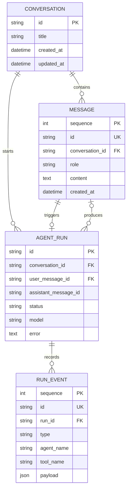
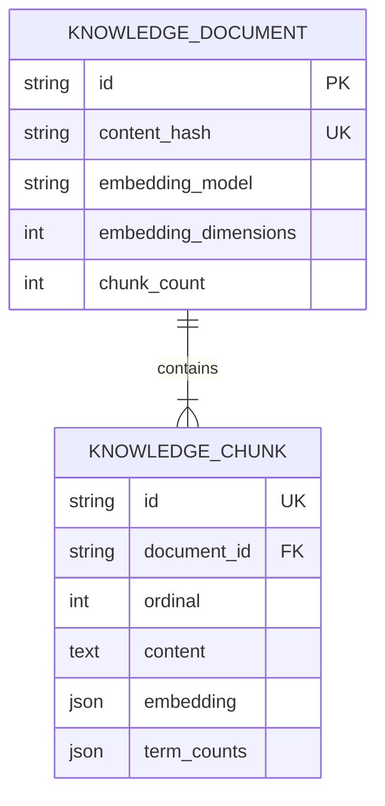
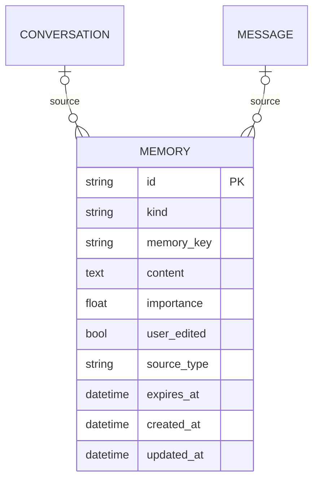
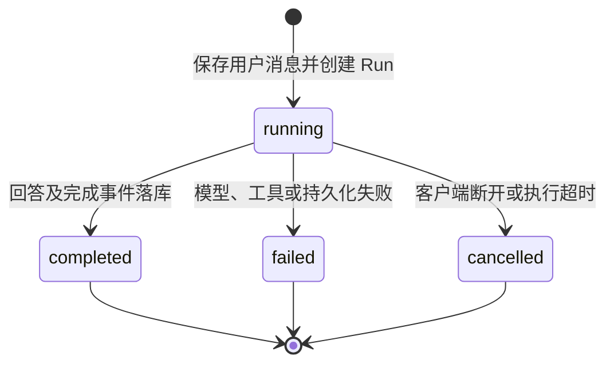
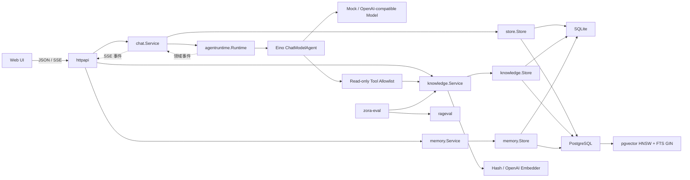

# Zora 项目分析文档

> 文档基线：V0.3 Long-term Memory（自动写入、Consolidation 与召回注入）
> 最后更新：2026-08-17
> 文档定位：用于需求讨论、架构评审、项目复盘和 Agent 开发岗位面试介绍。

## 1. 项目概述

Zora 是一个以 Go 为主语言、基于 Eino ADK 构建的可观察 Agent 产品。项目不以“接入大模型并提供聊天页面”为终点，而是围绕 Agent 产品真正需要解决的问题逐步演进：

- 模型如何可靠调用工具并获得反馈；
- 会话和每次 Agent 执行如何持久化、追踪和恢复；
- 知识库如何提供有引用、可评估的答案；
- 长期记忆如何提取、更新、遗忘并由用户控制；
- 多 Agent 如何分工、控制预算并证明其收益；
- 办公写操作如何经过授权、审批和审计。

当前 V0.1 单 Agent 核心链路已完成；V0.2 已打通知识库、固定检索/答案评测及 SQLite/PostgreSQL 双存储闭环。V0.3 已建立 Semantic/Episodic Memory Schema、双数据库持久化、REST/Web 用户控制面、回答后的候选提取/Consolidation，以及回答前的联合召回和上下文注入；短期摘要和 A/B 评估仍是后续子阶段。

## 2. 背景与问题

普通聊天壳通常只有三层：聊天页面、模型 API、历史消息列表。这类实现可以展示模型调用，却无法回答 Agent 岗位经常关注的问题：

- 工具如何声明、选择、执行和防止越权；
- Agent 为什么停止，如何避免无限循环；
- 流式输出、取消、超时和失败如何处理；
- 一次复杂任务经过了哪些步骤，如何审计；
- RAG、Memory 和 Multi-Agent 是否真的提高效果；
- 如何在能力、成本、延迟和安全之间做取舍。

Zora 将这些问题作为项目主线。V0.1 建立可运行、可测试、可观察的执行骨架；V0.2 通过端到端知识库来验证这套骨架能够承载真实 Agent 能力。

## 3. 项目目标与非目标

### 3.1 目标

1. 用 Go 验证 Agent Runtime、工具调用、流式传输和持久化的完整工程闭环。
2. 支持通义千问等 OpenAI-compatible 模型，同时避免业务层绑定单一厂商。
3. 把 Conversation、AgentRun、RunEvent 分离，使用户历史和内部轨迹分别演进。
4. 默认提供零密钥、零外部数据库的本地体验，降低项目运行门槛。
5. 为 RAG、Memory、Multi-Agent、MCP 和 Human-in-the-loop 保留清晰扩展边界。
6. 用自动化评估和运行数据证明能力收益，而不是只展示功能清单。

### 3.2 当前非目标

- 当前不提供公网多租户服务和用户登录系统。
- 当前不执行 Shell、代码或任意外部写操作。
- 当前的 Hash Embedding 只用于本地链路验证，不宣称具有生产语义检索质量。
- 不把全部聊天历史直接向量化并称为长期记忆。
- 不为了展示多 Agent 而堆叠多个 Prompt。
- 不承担本地大模型推理，模型能力通过 API 接入。

## 4. 用户与使用场景

### 4.1 目标用户

| 用户 | 核心需求 | Zora 的价值 |
|---|---|---|
| 项目开发者 | 学习 Agent 的核心实现 | 能直接阅读和调试 Runtime、工具、事件和持久化代码 |
| Agent 岗位面试官 | 判断候选人的工程深度 | 能讨论取舍、失败语义、评估方案与扩展设计 |
| 个人用户 | 使用可靠的对话助手 | 获得流式回复、精确工具结果和持久化历史 |
| 后续办公用户 | 处理文档、邮件和日历 | 通过知识库、MCP 和审批机制逐步实现 |

### 4.2 当前典型场景

1. 用户创建或选择一个对话。
2. 用户输入问题，服务保存消息并创建一次 AgentRun。
3. Eino ChatModelAgent 判断直接回答还是调用工具。
4. 工具调用和结果实时展示，同时写入审计事件。
5. 模型基于工具结果生成最终回答。
6. 回答落库，Run 进入 completed、failed 或 cancelled 状态。

知识库场景增加两条业务链：

1. 用户上传文档，系统验证大小和 UTF-8，按内容哈希去重，分块并批量生成向量，最后事务入库。
2. 对话涉及上传资料时，Agent 调用 `knowledge_search`，系统独立计算向量相似度与 BM25，用 RRF 融合后返回带文档名和分块序号的证据。

长期记忆写入场景增加一条回答后增强链：

1. 回答成功落库后，真实模型结构化提取最多 N 个候选；Mock 使用保守确定性规则。
2. Memory Service 校验候选并按 `kind + memory_key` 查找同一事实槽位。
3. 新事实创建、重复内容跳过、冲突值更新；用户手动修正后的记录禁止自动覆盖。
4. 来源会话/消息写入 Memory，处理计数进入 RunEvent 和 SSE；提取失败不影响已经成功的回答。

长期记忆召回场景增加一条回答前增强链：

1. 用本轮问题检索未过期 Memory，计算词项相关性、重要性和时效性联合分数。
2. 过滤低分项并选择 Top-K，总正文不超过 6,000 字符。
3. 以不可信 JSON 背景数据注入独立 System Message；本轮输入与旧记忆冲突时优先本轮。
4. RunEvent 只保存 Memory ID 与分数组件；召回失败退化为无记忆回答。

## 5. 业务能力模型

| 能力域 | 当前状态 | 说明 |
|---|---|---|
| 对话管理 | 已实现 | 创建、列表、重命名、删除和历史查询 |
| 流式交互 | 已实现 | SSE 增量文本、工具轨迹、停止生成 |
| Agent Runtime | 已实现 | Eino ReAct、最大迭代、上下文传递 |
| 模型接入 | 已实现 | Mock 与 OpenAI-compatible Provider |
| 工具系统 | 已实现 | 显式 allowlist、Schema 推断、四个只读工具 |
| 执行审计 | 已实现 | AgentRun 与 append-only RunEvent |
| 本地持久化 | 已实现 | SQLite、WAL、事务与级联删除 |
| 知识库本地 MVP | 已实现 | TXT/Markdown、哈希去重、重叠分块、Embedding 抽象、向量 + BM25/RRF、引用 |
| RAG 检索与答案评测 | 已实现 | 三种召回指标，以及 Agent 答案的事实覆盖、有效引用覆盖、引用忠实度和联合门禁 |
| PostgreSQL 知识库 | 已实现 | pgxpool、完整 Store、pgvector HNSW、FTS/GIN、RRF 候选融合 |
| 生产知识库剩余项 | V0.2 进行中 | 权限、文档版本/PDF、更强语义评测和生产验收 |
| 长期记忆底座 | 已实现 | Semantic/Episodic Schema、来源/重要性/过期字段、双存储和用户 CRUD |
| 自动记忆写入 | 已实现 | 结构化/规则提取、Memory Key 去重与冲突更新、来源追踪、人工修正保护和审计 |
| 记忆召回与注入 | 已实现 | 相关性/重要性/时效性联合评分、Top-K 安全注入、调试 API 和 Run 审计 |
| 记忆评估与摘要 | V0.3 进行中 | 短期历史摘要、有/无记忆 A/B 和质量门禁 |
| 多 Agent | 规划 V0.4 | Supervisor、专业 Agent、预算和效果对比 |
| 办公能力 | 规划 V0.5 | MCP、邮件/日历/文件、人工审批和审计 |

## 6. 业务模型

### 6.1 核心业务对象

| 对象 | 含义 | 生命周期 |
|---|---|---|
| Conversation | 一个持续的用户对话空间 | 创建后持续存在，可重命名或删除 |
| Message | 用户可见的对话消息 | 追加写入，随 Conversation 删除 |
| AgentRun | 一次用户请求对应的一次 Agent 执行 | running → completed/failed/cancelled |
| RunEvent | Run 内部发生的可观察事实 | append-only，随 AgentRun 删除 |
| Tool | Agent 可选择的受控能力 | 启动时注册，当前均为只读 |
| Model Provider | 生成回答和工具决策的模型来源 | 由环境配置选择 |
| KnowledgeDocument | 一份已完成索引的用户文档 | 上传后持续存在，可删除 |
| KnowledgeChunk | 可检索、可引用的原文片段 | 与文档在同一事务创建，随文档级联删除 |
| Memory | 经筛选的长期事实、偏好或事件 | 可由对话提取或手动创建、编辑、过期和删除；同 Key 候选执行合并 |

### 6.2 对象关系

知识库对象独立于对话，因此同一文档能够被多个 Conversation 复用：

长期记忆不是 Message 的别名。Memory 可以引用来源会话/消息，但删除来源时只清空引用，不删除用户已经确认的长期记忆：

### 6.3 AgentRun 状态模型

终态不会重新回到 running。浏览器断开时，服务使用一个短时独立 Context 补写终态，避免产生永久运行中的脏数据。

## 7. 数据模型

### 7.1 conversations

| 字段 | 类型 | 约束 | 说明 |
|---|---|---|---|
| `id` | TEXT | PK | `conv_` 前缀的随机 ID |
| `title` | TEXT | NOT NULL | 默认“新对话”，首条消息后自动命名 |
| `created_at` | TEXT | NOT NULL | UTC RFC3339Nano |
| `updated_at` | TEXT | NOT NULL | 新消息或重命名时更新，用于列表排序 |

### 7.2 messages

| 字段 | 类型 | 约束 | 说明 |
|---|---|---|---|
| `sequence` | INTEGER | PK AUTOINCREMENT | 保证稳定的消息顺序 |
| `id` | TEXT | UNIQUE | `msg_` 前缀 ID |
| `conversation_id` | TEXT | FK | 删除 Conversation 时级联删除 |
| `role` | TEXT | CHECK | `user`、`assistant` 或 `tool` |
| `content` | TEXT | NOT NULL | 用户可见正文 |
| `tool_name` | TEXT | NOT NULL | Tool 消息预留字段 |
| `tool_call_id` | TEXT | NOT NULL | ToolCall 关联 ID |
| `created_at` | TEXT | NOT NULL | 创建时间 |

V0.1 的主消息历史只写 user 和最终 assistant 消息。中间工具轨迹写入 RunEvent，避免对话上下文被内部事件快速撑大。

### 7.3 agent_runs

| 字段 | 类型 | 约束 | 说明 |
|---|---|---|---|
| `id` | TEXT | PK | `run_` 前缀 ID |
| `conversation_id` | TEXT | FK | 所属对话 |
| `user_message_id` | TEXT | FK | 触发该 Run 的消息 |
| `assistant_message_id` | TEXT | Nullable | 成功后生成的回答 |
| `status` | TEXT | NOT NULL | running/completed/failed/cancelled |
| `model` | TEXT | NOT NULL | 本次执行使用的模型 |
| `error` | TEXT | NOT NULL | 失败原因，成功时为空 |
| `started_at` | TEXT | NOT NULL | 开始时间 |
| `completed_at` | TEXT | Nullable | 进入终态的时间 |

### 7.4 run_events

| 字段 | 类型 | 约束 | 说明 |
|---|---|---|---|
| `sequence` | INTEGER | PK AUTOINCREMENT | 全局事件落库顺序 |
| `id` | TEXT | UNIQUE | `evt_` 前缀 ID |
| `run_id` | TEXT | FK | 所属执行 |
| `type` | TEXT | NOT NULL | 事件类型 |
| `agent_name` | TEXT | NOT NULL | 当前产生事件的 Agent |
| `tool_name` | TEXT | NOT NULL | 工具事件对应名称 |
| `payload` | TEXT | JSON 内容 | 事件扩展数据 |
| `created_at` | TEXT | NOT NULL | 事件发生时间 |

持久事件包括：`run_started`、`tool_call`、`tool_result`、`model_output`、`run_completed`、`run_failed`、`run_cancelled`。token 级 `delta` 只通过 SSE 发送，不逐条落库。

### 7.5 knowledge_documents

| 字段 | 类型 | 约束 | 说明 |
|---|---|---|---|
| `id` | TEXT | PK | `doc_` 前缀 ID |
| `name` | TEXT | NOT NULL | 显示文档名 |
| `source_type` | TEXT | NOT NULL | 当前为 `upload` |
| `mime_type` | TEXT | NOT NULL | `text/plain` 或 `text/markdown` |
| `content_hash` | TEXT | UNIQUE | SHA-256，用于内容去重 |
| `embedding_model` | TEXT | NOT NULL | 索引使用的向量空间标识 |
| `embedding_dimensions` | INTEGER | NOT NULL | 索引向量维度，用于变更检测 |
| `chunk_count` | INTEGER | NOT NULL | 分块数 |
| `created_at` / `updated_at` | TEXT | NOT NULL | UTC RFC3339Nano |

### 7.6 knowledge_chunks

| 字段 | 类型 | 约束 | 说明 |
|---|---|---|---|
| `sequence` | INTEGER | PK AUTOINCREMENT | 稳定扫描顺序 |
| `id` | TEXT | UNIQUE | `chunk_` 前缀 ID |
| `document_id` | TEXT | FK | 删除 Document 时级联删除 |
| `ordinal` | INTEGER | UNIQUE(document, ordinal) | 文档内从 0 开始的片段序号 |
| `content` | TEXT | NOT NULL | 可引用原文 |
| `start_rune` / `end_rune` | INTEGER | NOT NULL | 归一化文本中的 Unicode 字符区间 |
| `embedding_model` | TEXT | NOT NULL | 用于防止向量空间混用 |
| `embedding` | TEXT | JSON 数组 | 本地 MVP 的稠密向量 |
| `term_counts` | TEXT | JSON 对象 | BM25 词频；中文使用单字 + 双字特征 |
| `token_count` | INTEGER | NOT NULL | BM25 文档长度 |

SQLite 中向量和词频使用 JSON，以保持零运维；PostgreSQL 中 `embedding` 使用 `vector(N)`，并增加 `search_terms`、stored generated `search_vector`、HNSW 与 GIN 索引。两个实现共享同一 Document/Chunk 领域模型。

### 7.7 memories

| 字段 | 类型 | 约束 | 说明 |
|---|---|---|---|
| `id` | TEXT | PK | `mem_` 前缀 ID |
| `kind` | TEXT | CHECK | `semantic` 或 `episodic` |
| `memory_key` | TEXT | NOT NULL | 自动合并的稳定事实槽位；手动创建可为空 |
| `content` | TEXT | NOT NULL | 经筛选的记忆正文，最多 2,000 字符 |
| `importance` | REAL/DOUBLE | CHECK 0–1 | 联合召回 20% 权重的重要性信号 |
| `user_edited` | BOOLEAN/INTEGER | NOT NULL | 人工修正保护；为真时自动候选不得覆盖 |
| `source_type` | TEXT | CHECK | 手动创建为 `manual`，自动提取使用 `conversation` |
| `source_conversation_id` | TEXT | Nullable FK | 来源会话，删除会话时置空 |
| `source_message_id` | TEXT | Nullable FK | 来源消息，删除消息时置空 |
| `created_at` / `updated_at` | 时间 | NOT NULL | 生命周期与时效性信号 |
| `expires_at` | 时间 | Nullable | 可选过期时间；普通列表默认排除过期项 |

来源字段在用户编辑时保持不可变，防止手动记忆伪造为模型自动提取结果；编辑会设置 `user_edited=true`，后续自动 Consolidation 必须跳过。当前没有向量列：在真正确定召回算法、Embedding 迁移和评估方案前，不提前把聊天历史变成不可控的向量副本。

## 8. 技术架构

### 8.1 分层职责

| 层 | 包 | 职责 |
|---|---|---|
| 启动层 | `cmd/zora` | 依赖组装、HTTP Server、信号和优雅关闭 |
| 传输层 | `internal/httpapi` | REST、SSE、输入限制、安全头、静态 UI |
| 应用层 | `internal/chat` | 用例编排、执行顺序、状态落库、会话锁 |
| Agent 适配层 | `internal/agentruntime` | Eino 组装、模型选择、事件归一化 |
| 能力层 | `internal/agenttools` | 工具 Schema、校验和安全执行 |
| 知识库应用层 | `internal/knowledge` | 分块、Embedding 适配、混合召回、引用与 Agent Tool |
| RAG 评测层 | `internal/rageval` | 固定集校验、检索指标、答案引用/忠实度和联合门禁 |
| 记忆应用层 | `internal/memory` | Semantic/Episodic 模型、候选提取、Consolidation、联合召回、输入校验和用户 CRUD |
| 领域层 | `internal/domain` | Conversation、Message、Run、Event |
| 持久化抽象 | `internal/store` | Store 接口和统一错误 |
| 基础设施层 | `internal/store/sqlite` | SQLite DDL、查询、事务和映射 |
| 基础设施层 | `internal/store/postgres` | pgxpool、迁移、业务 Store、HNSW/FTS 候选召回 |

### 8.2 关键技术选型

| 选型 | 当前方案 | 原因 |
|---|---|---|
| 主语言 | Go | 并发、网络服务、部署和类型约束能力强 |
| Agent 框架 | Eino ADK | Go 原生、ReAct、Tool、流式事件及后续多 Agent 能力 |
| 模型协议 | OpenAI-compatible | 可连接通义千问及其他兼容模型 |
| 本地数据库 | SQLite | 零运维，便于演示、测试和 RAG 纵向切片 |
| 生产数据库 | PostgreSQL + pgvector | 多连接持久化、HNSW 向量索引和 GIN 全文索引 |
| 检索 | SQLite 精确扫描 / PostgreSQL 候选下推 + RRF | 两后端共享融合规则，能用固定集做迁移回归 |
| Embedding | Hash / OpenAI-compatible | 本地零密钥与生产语义模型共用接口 |
| RAG 评测 | 版本化 JSON + 隔离 SQLite | 同一语料可在 Hash、真实 Embedding 和 PostgreSQL 候选链路上重复对比 |
| 前端传输 | SSE | 单向模型流简单、代理支持广、易于调试 |
| UI 发布 | `go:embed` | 单二进制运行，无 Node.js 部署依赖 |
| ID | `crypto/rand` | 不依赖数据库自增 ID，不暴露业务规模 |

## 9. 项目亮点

### 9.1 Mock 也走真实 Agent 链路

Mock 模型实现 Eino 的 `BaseChatModel` 和工具调用语义。无密钥模式依然经过 ChatModelAgent、ToolNode、ToolCall 和 AgentEvent，因此测试的不是另一套简化业务代码。

### 9.2 用户历史与执行轨迹分离

Message 面向下一轮对话上下文，RunEvent 面向调试、审计和可观测性。两者分离后，可以独立控制上下文长度、审计粒度和保留策略。

### 9.3 明确的失败与取消语义

请求 Context 从 HTTP 一路传递到 Runtime 和模型。用户停止生成或连接断开时，Run 会落为 cancelled；普通错误落为 failed，避免状态含糊。

### 9.4 安全工具边界

工具由代码显式注册。计算器采用递归下降解析器，不使用 `eval`、Shell 或代码解释器，能展示 Agent 工具安全不是只依靠 Prompt。

### 9.5 框架隔离

HTTP 和 Store 不依赖 Eino 事件类型。`agentruntime.Event` 作为防腐层，降低框架升级或更换对产品层的影响。

### 9.6 面向评估演进

RAG 已把语料、问题、相关文档、预期事实/证据锚点和阈值作为版本化资产：对 vector、keyword、hybrid 分别计算 Recall@K、MRR、命中率和延迟，并让真实 Agent Runtime 生成答案，检查事实覆盖、引用能否解析到本次工具证据、所引原文是否包含支持锚点。后续 Memory 和 Multi-Agent 同样设置对照指标；多 Agent 只有在质量收益能够覆盖成本和延迟时才保留，避免“功能数量等于技术深度”的误区。

### 9.7 可交换的 RAG 边界

`knowledge.Service` 不依赖数据库细节，`Embedder` 也不依赖具体厂商。SQLite 负责教学友好的精确向量/BM25；PostgreSQL 通过可选 `CandidateStore` 下推 HNSW/FTS 候选，RRF、HTTP 与 Agent Tool 契约保持不变。

### 9.8 证据引用不是 Prompt 幻觉

每个 SearchResult 都带 `document_id`、`document_name`、`chunk_id`、`ordinal`、`start_rune` 和 `end_rune`。引用信息来自持久化原文坐标，而不是让模型临时编造来源。

### 9.9 长期记忆先控制、再自动写入

V0.3 没有直接把最近 40 条消息写入向量库，而是先建立独立 Memory 生命周期和用户控制面，再接入自动写入。类型、稳定 Key、来源、重要性、人工修正和过期时间均为一等字段；自动提取通过 `source_type=conversation` 关联原始事实。真实模型 Prompt 只允许提取用户明确表达的稳定信息，Service 负责二次校验和同 Key 合并。错误记忆能够被定位、修正和删除，人工修正后不会被下一轮模型覆盖。

召回也先采用可解释基线：中文双字/西文词项相关性占 65%，重要性占 20%，90 天半衰期时效性占 15%。无相关词项默认不注入，记忆正文被标记为不可信背景数据且有 6,000 字符硬上限。通过 `ZORA_MEMORY_RECALL_ENABLED` 可独立关闭注入，为后续有/无记忆 A/B 提供天然对照组。

## 10. 当前限制与风险

| 限制/风险 | 当前影响 | 后续处理 |
|---|---|---|
| SQLite 单连接 | 适合单机和作品演示，不适合高并发多实例 | 生产配置切换 PostgreSQL Store |
| 本地向量精确扫描 | 最多读取 10,000 个 chunk，内存和延迟随数据增长 | PostgreSQL 模式使用 pgvector HNSW + FTS |
| PostgreSQL 容器验收未在当前环境执行 | 代码、单测和可选集成测试已完成，但缺少本机 Docker 实测记录 | 在有 Docker 的环境运行 `make postgres-up && make test-postgres` |
| Hash Embedding 无深度语义 | 适合关键词相关性和链路测试，不适合生产问答 | 生产切换 text-embedding-v4 等语义模型 |
| 固定评测集仅 4 题 | 能做冒烟回归，无法证明复杂语义场景或融合收益 | 增加语义改写、难负例、多相关文档和真实业务问题 |
| 答案评测使用确定性锚点 | 零密钥且稳定，但无法识别未标注幻觉或复杂同义改写 | 增加真实模型人工集与经校准的 LLM Judge，对确定性门禁形成补充 |
| 同步文档索引 | 大文件会占用 HTTP 请求 | 异步 Ingestion Job、重试和状态机 |
| 进程内会话锁 | 多实例之间不能互斥 | advisory lock 或带租约分布式锁 |
| 最近 40 条上下文 | 长对话会丢失早期信息 | 摘要 + 长期记忆召回 |
| 自动记忆仍同步执行 | 真实模型会增加一次调用延迟；多副本仅有进程内合并锁 | 后续改为任务队列，并在数据库增加唯一约束/版本号 |
| 轻量召回缺少深层语义 | 可解释且零额外调用，但同义改写可能漏召回 | 先建立 A/B 门禁，再评估 Memory Embedding 或 Rerank |
| Memory 已进入回答上下文但尚无 A/B 门禁 | 相关回答可使用历史事实，也可能受错误记忆影响 | 建立正确记忆率、错误注入率和回答质量对照评测 |
| 无鉴权和租户隔离 | 不适合直接公网开放 | 增加 User/Tenant、鉴权、ACL |
| 模型错误分类有限 | API 可能返回过于笼统或过于底层的信息 | 统一错误码和 Provider 错误映射 |
| 尚无 token/cost 指标 | 无法比较模型成本 | 从 ResponseMeta 采集 Usage |
| 无恢复运行 | 中断后只能重新发起 | 引入 Eino Checkpoint/Resume |
| Eino 尚未 1.0 | API 存在演进风险 | 固定版本、适配层隔离、升级回归测试 |

## 11. 成功指标

### V0.1 工程指标

- 普通对话和工具对话端到端成功；
- SSE 事件顺序稳定；
- Run 不遗留永久 running 状态；
- 单元、集成、竞态、静态分析和无 CGO 构建通过；
- 默认模式无需外部密钥和数据库即可运行。

### 后续产品指标

| 能力 | 建议指标 |
|---|---|
| RAG | Recall@K、MRR、引用覆盖率、答案忠实度 |
| Memory | 正确记忆率、错误记忆率、召回命中率、用户删除成功率 |
| Multi-Agent | 任务成功率、P95 延迟、token 成本、人工干预率 |
| 办公 Agent | 审批覆盖率、越权操作数、操作成功率、可恢复率 |

### V0.2 本地 MVP 工程指标

- 同一文档内容可被 SHA-256 稳定去重；
- 所有分块都能用 Unicode 偏移恢复原文；
- 向量召回和 BM25 召回分别计分，RRF 不依赖两类分数量纲；
- 知识库工具结果必须包含文档名、分块序号和原文；
- 默认无密钥可运行，同时有真实 Embedding 适配器的契约测试。
- 固定评测命令在隔离数据库中复现语料，并输出 vector、keyword、hybrid 的 Recall@K、MRR、命中率和延迟；
- 同一命令经过 Eino Runtime 与 `knowledge_search` 生成答案，输出事实覆盖率、有效引用覆盖率和引用忠实度；
- 默认 `zora-rag-smoke-v1` 的实际基线为 Recall@3=1、MRR=1，三种模式打平，尚不能证明融合收益。
- PostgreSQL 与 SQLite 实现相同 Store 契约，数据库侧只下推 Top 50 单路候选，RRF 仍由应用层统一计算；
- PostgreSQL 启动校验 `vector(N)` 维度，多实例 DDL 使用 advisory transaction lock。

## 12. 演进路线

1. **V0.1 Agent Core**：建立当前可运行基线。
2. **V0.2 Knowledge Base（进行中）**：SQLite/PostgreSQL 双 Store、pgvector/FTS、引用和固定检索评测已实现；继续完成权限、文档能力和答案质量评估。
3. **V0.3 Long-term Memory（进行中）**：Schema、双存储、用户 CRUD、候选提取、Consolidation 和召回注入已实现；继续完成短期摘要与 A/B 评估。
4. **V0.4 Multi-Agent**：Supervisor、专业 Agent、预算和对照评估。
5. **V0.5 Office Agent**：MCP、办公连接器、审批、权限和审计。

详细任务与验收条件见 [Roadmap](roadmap.md)。
