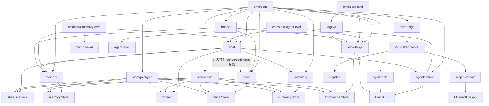
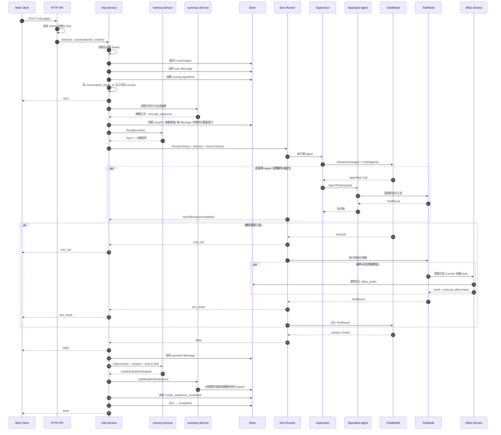
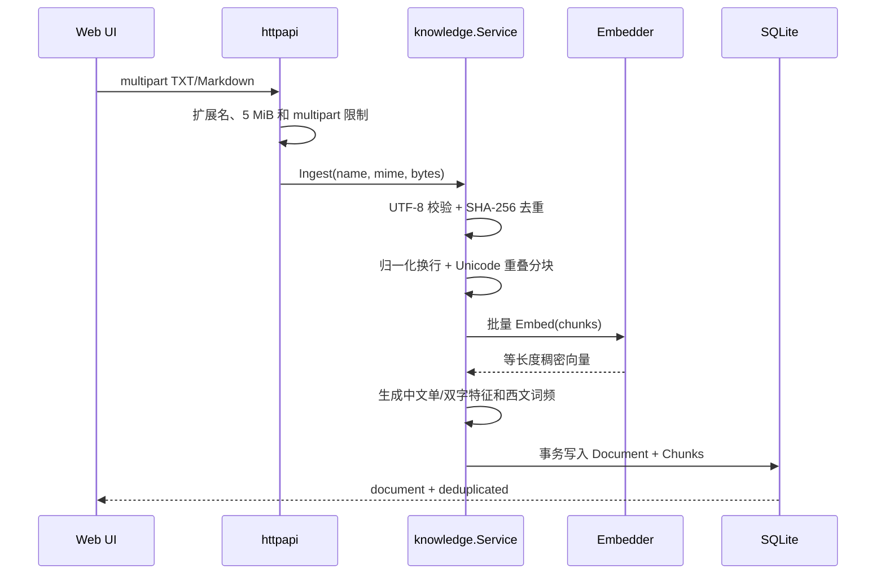
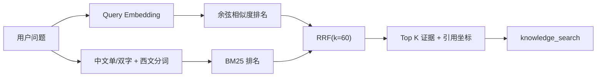
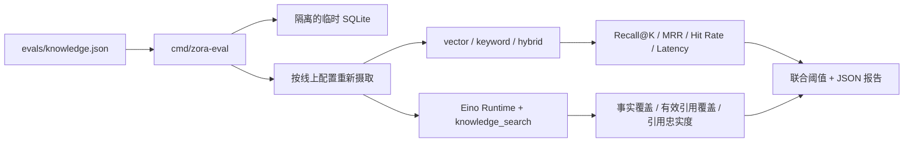
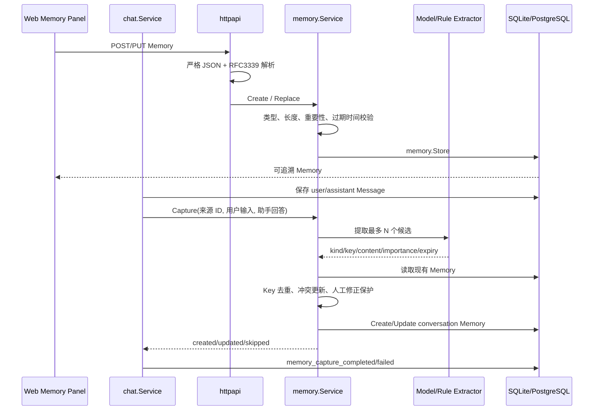
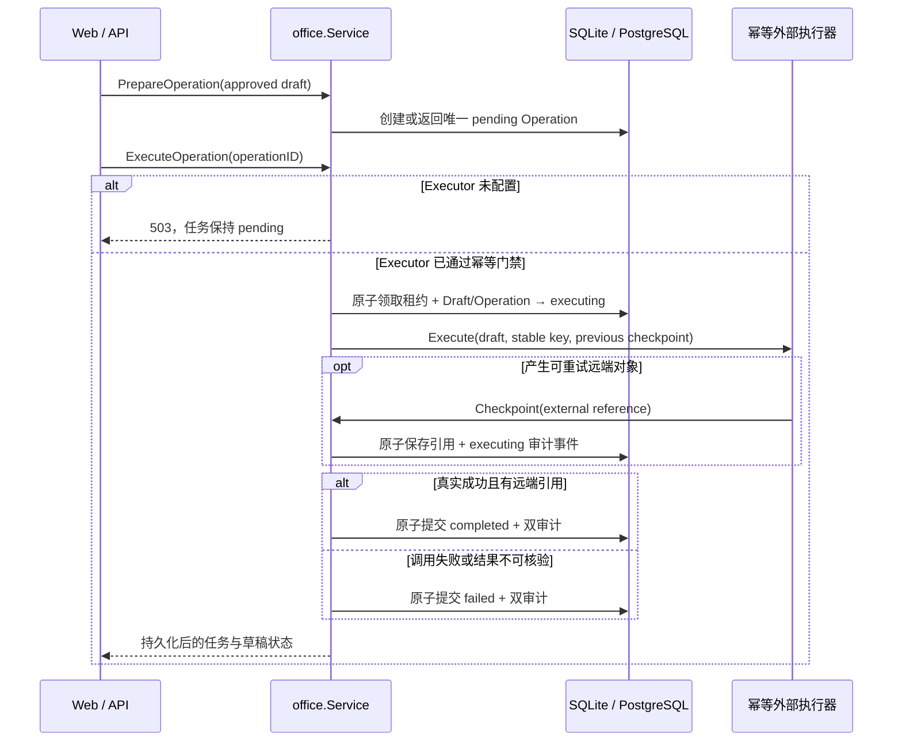
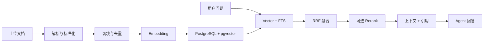
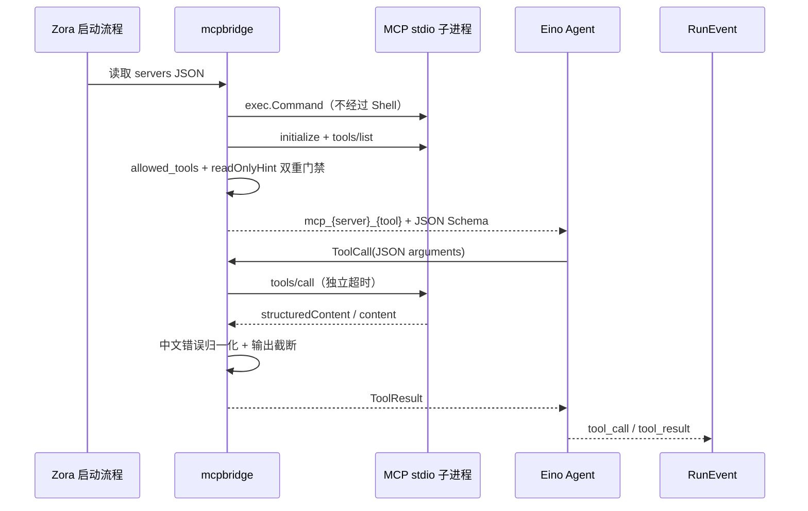

# Zora 项目技术文档

> 适用版本：V0.5 Office Agent 第六阶段（Microsoft Graph 可恢复写执行器）
> 目标读者：项目开发者、维护者和技术评审人员。  
> 说明：“当前实现”描述仓库现状；“目标设计”描述后续版本，不能视为已交付能力。

## 1. 技术栈与版本

| 类别 | 技术 | 版本/说明 |
|---|---|---|
| 语言 | Go | `go.mod` 指定 Go 1.26 |
| Agent Runtime | `github.com/cloudwego/eino` | v0.9.14 |
| MCP | `github.com/modelcontextprotocol/go-sdk` | v1.7.0，官方 SDK，MCP 2026-07-28 |
| 模型适配 | `eino-ext/components/model/openai` | v0.1.13 |
| 本地数据库 | `modernc.org/sqlite` | v1.56.0，纯 Go 驱动 |
| 生产数据库 | `pgx/v5` + `pgvector-go` | pgx v5.9.2；pgvector-go v0.4.0 |
| HTTP | Go `net/http` | Method-aware ServeMux |
| 流式协议 | Server-Sent Events | `text/event-stream` |
| 前端 | 原生 HTML/CSS/JavaScript | 通过 `go:embed` 打包 |
| 日志 | `log/slog` | 结构化文本日志 |
| 容器 | Multi-stage Dockerfile | 最终镜像基于 Alpine |

## 2. 目录与依赖规则

```text
cmd/
├── zora/main.go               服务启动、组装、信号和关闭
├── zora-eval/main.go          固定 RAG 检索与答案评测命令
├── zora-memory-eval/main.go   长期记忆 Control/Treatment 评测命令
├── zora-agent-eval/main.go    多 Agent 路由与协作评测命令
├── zora-mcp-files/main.go     只读文件 MCP stdio Server
└── zora-mcp-microsoft/main.go Microsoft Graph 邮件/日历只读 MCP Server

evals/
├── knowledge.json             RAG 语料、问题、事实锚点和阈值
├── memory.json                长期记忆、A/B 问题和污染门禁
└── agents.json                专家路由、答案锚点和质量阈值

internal/
├── config/                    环境配置与启动校验
├── domain/                    稳定领域对象
├── id/                        随机业务 ID
├── store/                     持久化接口
│   ├── sqlite/                SQLite 精确扫描实现
│   └── postgres/              pgx、pgvector、FTS 和迁移
├── agenttools/                Eino Tool 及安全执行逻辑
├── agentruntime/              Eino/模型适配与统一事件
├── agentseval/                多 Agent 路由与单/多 Agent 对照门禁
├── approval/                  Human-in-the-loop 策略、等待/恢复和 Store 契约
├── knowledge/                 分块、Embedding、混合检索与 Agent Tool
├── rageval/                   检索指标、答案引用/忠实度指标与门禁
├── memory/                    Semantic/Episodic 模型、校验和 CRUD 用例
├── memoryeval/                长期记忆 Control/Treatment 指标与质量门禁
├── summary/                   会话增量摘要、Model/Rule 摘要器与 Store 契约
├── mcpbridge/                 MCP Client、发现/白名单与 Eino Tool 适配
├── mcpfiles/                  文件目录沙箱与只读 MCP Tools
├── mcpmicrosoft/              Graph HTTP、邮件/日历工具和外部内容安全标记
├── office/                    邮件/日历草稿校验、持久化、人工确认与 Agent Tools
├── chat/                      应用用例和 Run 生命周期
└── httpapi/                   REST、SSE、Web UI
```

依赖方向：



约束：

- `domain` 不依赖 Eino、HTTP 或数据库驱动；
- `store.Store` 不暴露 SQL 类型；
- `httpapi` 不直接调用模型和工具；
- `httpapi` 只通过应用 Service 调用知识库、长期记忆、会话摘要和办公草稿用例；
- `chat` 只依赖 `agentruntime.Runtime` 的统一事件；
- 单 Agent 工具从显式 allowlist 注入；多 Agent 模式进一步按 Research/Document/Writer 职责分组，Supervisor 不能直接调用底层工具。

## 3. 启动流程

`cmd/zora/main.go` 按以下顺序启动：

1. `config.Load` 读取并校验环境变量；
2. 根据 `ZORA_STORE_PROVIDER` 打开 SQLite 或 PostgreSQL；
3. SQLite 启用 WAL/busy timeout；PostgreSQL 初始化连接池、pgvector 类型和幂等迁移；
4. 构造时间、计算器和项目状态工具；
5. 创建 Office Service 与邮件/日历草稿预览工具；草稿写入当前应用数据库，不调用外部写接口；
6. 启用 MCP 时启动白名单中的 stdio Server，握手、发现只读工具并建立生命周期管理；
7. 根据 Embedding Provider 创建 Hash 或 OpenAI-compatible Embedder；
8. 创建 Knowledge Service，并把 `knowledge_search` 加入工具 allowlist；
9. 根据 Model Provider 创建共享的 Mock 或 OpenAI-compatible ChatModel；
10. 创建 Memory Service；按配置接入 Rule/Model Extractor，并设置召回 Top-K 与分数门槛；
11. `ZORA_MULTI_AGENT_ENABLED=false` 时创建单 ChatModelAgent；开启时创建 Supervisor 和三个 AgentTool 专家，并按职责注入工具；
12. 创建 Eino Runner；多 Agent 模式包装受控 AgentTool，并开启内部 Agent 事件透传；
13. 按配置创建 Model/Rule Summarizer 和 Summary Service；
14. 多 Agent 审批模式不为 off 时创建 Approval Service；
15. 创建 Chat Service，按开关接入 Memory Capture/Recall、会话摘要和审批，再创建含 Office Service 的 HTTP Handler；
16. 启动 HTTP Server，监听 SIGINT/SIGTERM，收到信号后最多等待 10 秒优雅关闭。

任一步失败都会终止启动，不会带着部分依赖进入服务状态。

## 4. 配置设计

| 环境变量 | 默认值 | 是否必填 | 作用 |
|---|---|---|---|
| `ZORA_ADDR` | `:8088` | 否 | HTTP 监听地址 |
| `ZORA_DATA_DIR` | `./data` | 否 | SQLite 数据目录 |
| `ZORA_STORE_PROVIDER` | `sqlite` | 否 | `sqlite` 或 `postgres` |
| `ZORA_POSTGRES_DSN` | 空 | postgres 模式必填 | PostgreSQL 连接串，只从环境变量读取 |
| `ZORA_POSTGRES_MAX_CONNS` | `10` | 否 | pgxpool 最大连接数，范围 1–100 |
| `ZORA_MODEL_PROVIDER` | `mock` | 否 | `mock` 或 `openai` |
| `ZORA_MODEL` | `qwen-plus` | openai 模式需要 | 模型名称 |
| `ZORA_API_KEY` | 空 | openai 模式必填 | 模型服务密钥 |
| `ZORA_BASE_URL` | 空 | 视 Provider 而定 | OpenAI-compatible 地址 |
| `ZORA_SYSTEM_PROMPT` | 内置中文指令 | 否 | Agent 系统指令 |
| `ZORA_REQUEST_TIMEOUT` | `90s` | 否 | 整次消息请求与模型客户端超时 |
| `ZORA_MAX_ITERATIONS` | `8` | 否 | ReAct 最大迭代，允许范围 1–50 |
| `ZORA_MULTI_AGENT_ENABLED` | `false` | 否 | 是否启用 Supervisor 与 Research/Document/Writer；默认关闭以控制模型成本 |
| `ZORA_MULTI_AGENT_MAX_HANDOFFS` | `6` | 否 | 单轮最多专业 Agent 交接次数，范围 1–20 |
| `ZORA_MULTI_AGENT_MAX_PARALLEL` | `3` | 否 | 单轮专业 Agent 最大并行数，范围 1–10 |
| `ZORA_MULTI_AGENT_SPECIALIST_TIMEOUT` | `30s` | 否 | 单次专业 Agent 独立超时 |
| `ZORA_MULTI_AGENT_RETRY_COUNT` | `1` | 否 | 专业 Agent 失败后的重试次数，范围 0–3 |
| `ZORA_MULTI_AGENT_APPROVAL_MODE` | `risky` | 否 | `off`、`risky` 或 `all`；仅多 Agent 模式接入审批 |
| `ZORA_MULTI_AGENT_APPROVAL_TIMEOUT` | `60s` | 否 | 等待人工决定的最长时间，应小于整条请求超时 |
| `ZORA_EMBEDDING_PROVIDER` | `hash` | 否 | `hash` 或 `openai` |
| `ZORA_EMBEDDING_MODEL` | `text-embedding-v4` | openai Embedding 需要 | Embedding 模型名 |
| `ZORA_EMBEDDING_API_KEY` | 复用 Chat Key | openai Embedding 需要 | 可独立的 Embedding Key |
| `ZORA_EMBEDDING_BASE_URL` | 复用 Chat BaseURL | openai Embedding 需要 | v1 根地址，客户端追加 `/embeddings` |
| `ZORA_EMBEDDING_DIMENSIONS` | hash 384 / openai 1024 | 否 | 向量维度 |
| `ZORA_KNOWLEDGE_CHUNK_SIZE` | `800` | 否 | Unicode 字符分块上限，最少 100 |
| `ZORA_KNOWLEDGE_CHUNK_OVERLAP` | `120` | 否 | 重叠字符数，必须小于分块上限的一半 |
| `ZORA_MEMORY_AUTO_CAPTURE` | `true` | 否 | 成功回答后是否执行候选提取和 Consolidation |
| `ZORA_MEMORY_MAX_CANDIDATES` | `3` | 否 | 单轮候选上限，范围 1–10 |
| `ZORA_MEMORY_RECALL_ENABLED` | `true` | 否 | 是否在 Agent 执行前召回并注入长期记忆 |
| `ZORA_MEMORY_RECALL_LIMIT` | `5` | 否 | 单轮最多注入数量，范围 1–20 |
| `ZORA_MEMORY_RECALL_MIN_SCORE` | `0.25` | 否 | 联合召回最低总分，范围 0–1 |
| `ZORA_SUMMARY_ENABLED` | `true` | 否 | 是否启用会话增量摘要与上下文压缩 |
| `ZORA_SUMMARY_TRIGGER_MESSAGES` | `20` | 否 | 未摘要消息触发阈值，范围 4–500 |
| `ZORA_SUMMARY_KEEP_RECENT` | `12` | 否 | 保留原文的最近消息数，至少 2 且小于触发阈值 |
| `ZORA_SUMMARY_MAX_RUNES` | `4000` | 否 | 摘要 Unicode 字符上限，范围 500–20000 |
| `ZORA_MCP_ENABLED` | `false` | 否 | 是否连接 `ZORA_MCP_SERVERS_JSON` 中的 MCP stdio Server |
| `ZORA_MCP_SERVERS_JSON` | 空 | MCP 开启时必填 | Server 名称、命令、参数、工具白名单和环境变量白名单 |
| `ZORA_MCP_CONNECT_TIMEOUT` | `10s` | 否 | 单个 MCP Server 启动、握手和工具发现超时 |
| `ZORA_MCP_CALL_TIMEOUT` | `20s` | 否 | 单次 MCP 工具调用超时 |
| `ZORA_MCP_MAX_OUTPUT_RUNES` | `12000` | 否 | 注入模型的 MCP 结果字符上限 |
| `ZORA_MCP_FILES_ROOT` | 空 | 文件连接器必填 | 文件 Server 唯一授权根目录 |
| `ZORA_MCP_MICROSOFT_ACCESS_TOKEN` | 空 | Microsoft 连接器必填 | Graph 短期访问令牌，只透传给连接器子进程 |
| `ZORA_MCP_MICROSOFT_BASE_URL` | Graph v1.0 | 否 | Graph API 根地址；非测试场景必须 HTTPS |
| `ZORA_MCP_MICROSOFT_USER_ID` | `me` | 否 | 委托令牌使用 `me`；应用令牌填写明确用户 ID |
| `ZORA_OFFICE_EXECUTOR` | `disabled` | 否 | `disabled` 或 `microsoft_graph`；真实写必须显式启用 |
| `ZORA_OFFICE_EXECUTOR_COMMAND` | 空 | Graph 写开启时必填 | 专用 Microsoft MCP 子进程命令，不经过 Shell |
| `ZORA_OFFICE_EXECUTOR_ARGS_JSON` | 空数组 | 否 | 专用执行器子进程参数 JSON 数组 |

配置原则：

- 密钥只通过环境变量传入；
- MCP 子进程只继承 `pass_env`，配置层禁止透传模型 Key、Embedding Key 和数据库 DSN；
- 启动时校验 Provider 和 API Key 组合；
- BaseURL 会移除末尾 `/`，降低路径拼接差异；
- Mock 模式固定模型名为 `zora-mock`，保证测试结果可解释。
- 分块与查询的 Embedding 模型名和维度必须一致；切换模型后需重建旧文档索引。

## 5. 核心对话流程



### 5.1 为什么先保存用户消息

用户消息是一次 Run 的输入事实，必须先拥有持久 ID，AgentRun 才能引用它。即使模型执行失败，用户输入和失败 Run 仍然可追踪。

### 5.2 上下文策略

上下文由三部分组成：已覆盖较早历史的会话摘要、按本轮问题召回的相关长期记忆、最近原始消息。Chat 读取 `max(40, ZORA_SUMMARY_TRIGGER_MESSAGES)` 条用户可见消息，再按 `through_sequence` 剔除已进入摘要的部分；这样自定义触发阈值高于 40 时，摘要生成前也不会漏掉尚未摘要的消息。内部 ToolCall/ToolResult 不写入下一轮对话历史，只保留最终回答和 RunEvent。

摘要只压缩模型输入，不删除 `messages` 原始记录。摘要读取或生成失败时记录 `conversation_summary_load_failed/failed`，继续使用最近原始消息完成回答；因此增强链路不会把已成功回答改成失败。

## 6. Agent Runtime 设计

### 6.1 组装

`agentruntime.New` 创建：

```text
ChatModel
  + Instruction
  + Tool allowlist
  + MaxIterations
  ↓
Eino ChatModelAgent
  ↓
Eino Runner (EnableStreaming=true)
```

Eino 负责 ReAct 循环：模型生成 ToolCall → ToolNode 执行 → ToolResult 回填模型 → 继续生成，直到模型输出最终回答或超过最大迭代。

`agentruntime.NewMultiAgentWithModel` 则创建一个根 `zora_supervisor` 和三个 Eino ChatModelAgent，并通过 `adk.NewAgentTool` 把专家暴露给 Supervisor。项目没有采用共享完整上下文的 Agent Transfer：AgentTool 默认只发送 `{"request":"..."}`，专业 Agent 看不到主会话全部历史；需要的事实和证据必须由 Supervisor 显式交接。

AgentTool 外层由 `controlledAgentTool` 统一治理。`Runtime.Execute` 为每个根 Run 注入独立 `executionState`：交接计数受 Mutex 保护，并行信号量限制瞬时专业模型请求，每次调用使用独立 `context.WithTimeout`，根 Context 取消立即停止，其他失败最多按配置重试。零值配置会落到安全默认值，线上环境变量在启动时严格校验。

### 6.2 Provider

#### Mock

- 实现 Eino `BaseChatModel`；
- 识别时间、计算和项目能力等确定性请求；
- 返回标准 ToolCall，而不是直接调用 Go 函数；
- 工具结果仍由 Eino ToolNode 执行和回填；
- 文本按 rune 切块，覆盖流式消费逻辑。

#### OpenAI-compatible

- 使用 Eino OpenAI ChatModel；
- `BaseURL` 可指向 DashScope/通义千问；
- `HTTPClient.Timeout` 取 `ZORA_REQUEST_TIMEOUT`；
- 模型必须支持 Tool Calling，否则工具任务会失败或退化。

### 6.3 事件归一化

| Eino 输出 | Zora Event | 含义 |
|---|---|---|
| Assistant + ToolCalls | `tool_call` | 模型选择了某个工具 |
| Tool Message | `tool_result` | 工具完成或返回错误 |
| Assistant Content Chunk | `delta` | 可直接展示的文本增量 |
| Supervisor 调用 AgentTool | `agent_handoff_started` | 记录目标专家、ToolCall ID 和结构化 request |
| 子 Agent Assistant Content | `agent_output` | 专家交付物，只进入 Trace/审计，不拼接最终回答 |
| AgentTool Result | `agent_handoff_completed` | 专家执行闭环，结果回填 Supervisor |
| Iterator Error | Go error | 交给 Service 结束 Run |

流式 ToolCall 可能分散在多个 chunk 中。Runtime 一边将文本 delta 发送给上层，一边收集 chunk，并使用 `schema.ConcatMessages` 合并出结构完整的 ToolCall。

### 6.4 多 Agent 职责与最终答案隔离

| Agent | 可调用能力 | 上下文与输出约束 |
|---|---|---|
| `zora_supervisor` | 三个 AgentTool | 读取主对话上下文，决定直接回答或交接，最终只输出一次答案 |
| `research_agent` | `current_time`、`calculator`、`project_status` | 只接收 request，负责核验和分析 |
| `document_agent` | `knowledge_search`；启用后追加 MCP 文件、邮件和日历只读工具 | 只接收 request，负责知识库证据和授权办公数据读取 |
| `writer_agent` | `preview_email_draft`、`preview_calendar_draft` | 只使用 request 中的任务和证据，不补造事实；只能保存内部预览，不能对外发送或创建日程 |

复合“根据文档写作”任务采用 `document_agent → writer_agent` 串行交接。Eino 会透传子 Agent 的流式事件；Runtime 只累计根 Agent 的文本为最终回答，子 Agent 文本统一转成单条 `agent_output`。这避免专家草稿和 Supervisor 定稿被重复拼接，同时保留调试证据。

彼此独立的子任务由 Supervisor 在同一 Assistant 消息中返回多个 AgentTool Call；Eino ToolNode 默认并行执行。Chat 收到每个 `agent_handoff_started` 时创建一条 `agent_task_runs`，把 `child_run_id` 写入 RunEvent/SSE；完成时保存最多 1,000 字符输出摘要，根执行失败或取消时补写所有未完成子 Run 的终态。

### 6.5 Human-in-the-loop 审批

只有多 Agent 模式且审批策略不为 `off` 时，启动流程才向 Chat/HTTP 注入 `approval.Service`。`risky` 用保守的高影响动作词触发，`all` 审批每个请求。

```text
保存 User Message / 创建 AgentRun
  → 创建 pending ApprovalRequest
  → SSE approval_required（原请求等待）
  → POST decision
     ├─ approved：唤醒等待通道，原 SSE 继续执行 Runtime
     ├─ rejected：保存用户可见停止消息，AgentRun=rejected
     └─ timeout/cancel：Approval=expired，AgentRun=cancelled
```

审批决定使用独立 HTTP 请求，不受同一 Conversation 的 Send 锁阻塞。数据库用 `WHERE status='pending'` 保证一次性决策；重复决定返回中文错误。审批记录可跨重启查询，但当前进程内等待通道不能跨重启恢复，这是 V0.5 异步任务化前的明确限制。

## 7. 工具设计

### 7.1 工具注册

工具在启动组装阶段显式注册：基础工具来自 `agenttools.Build`，知识检索和 Office 草稿工具分别由各自 Service 构造。Eino `InferTool` 根据 Go 输入结构生成 JSON Schema，并在执行前反序列化参数。

| Tool | 输入 | 输出 | 安全属性 |
|---|---|---|---|
| `current_time` | IANA timezone | timezone + RFC3339 time | 只读；无外部网络 |
| `calculator` | 四则表达式 | expression + result | 自研解析器；不执行代码 |
| `project_status` | 空对象 | 版本、能力、下一里程碑 | 只读静态信息 |
| `preview_email_draft` | 收件人、抄送、主题、正文 | 持久化邮件草稿与 `external_effect=false` | 仅写 Zora 内部数据库；不调用邮件发送接口 |
| `preview_calendar_draft` | 参与人、主题、起止时间、时区、地点、正文 | 持久化日历草稿与 `external_effect=false` | 仅写 Zora 内部数据库；不调用 Graph 日历写接口 |

### 7.2 计算器语法

支持：

- 整数和小数；
- `+`、`-`、`*`、`/`；
- 括号；
- 一元正负号；
- 空白字符。

拒绝：

- 除零；
- 非法字符；
- 函数调用；
- 变量；
- Shell 或代码表达式。

解析器使用递归下降，优先级为：expression → term → factor → number。

### 7.3 Office 草稿预览工具

草稿工具不是外部写操作，而是“生成结构化内容 → 校验 → 保存内部预览”的准备阶段。工具输入中不存在 `conversation_id` 和 `run_id`；`chat.Service` 在创建 Agent Run 后把这两个值写入执行 Context，`office.Service` 只接受该可信来源，避免模型伪造草稿归属或审计来源。

邮件草稿校验包括：至少一个合法收件人、收件人和抄送人归一化去重、主题最多 200 字符、正文最多 20,000 字符。日历草稿要求合法参与人地址、RFC3339 起止时间、结束时间晚于开始时间、跨度不超过 31 天、合法 IANA 时区和最多 300 字符地点。

Service 将规范化后的 `kind + payload` 计算 SHA-256。数据库唯一约束 `(source_run_id, content_hash)` 使模型重试同一次 ToolCall 时返回原草稿，不重复创建。ToolResult 始终包含 `external_effect=false` 和中文提示，系统 Prompt 同时要求最终回答明确说明“尚未发送/尚未创建日程”。

## 8. 持久化与一致性

### 8.1 SQLite 配置

- `foreign_keys = ON`：保证关联和级联删除；
- `journal_mode = WAL`：改善本地读写并发；
- `busy_timeout = 5000`：等待短暂写锁；
- `SetMaxOpenConns(1)`：保证连接级 PRAGMA 一致。

### 8.2 消息写入事务

`AddMessage` 在一个事务中：

1. 插入 Message；
2. 获取自增 sequence；
3. 更新 Conversation.updated_at；
4. 提交。

这样会话列表排序不会与实际消息历史脱节。

### 8.3 最近消息查询

SQL 子查询先按 sequence 倒序取最近 N 条，外层再升序输出。结果同时满足“限制上下文长度”和“模型按时间正序读取”。

### 8.4 Store 替换策略

应用层依赖 `store.Store`、`knowledge.Store`、`memory.Store`、`summary.Store`、`approval.Store` 与 `office.Store`。SQLite 和 PostgreSQL 当前都保持相同的 Conversation/Message/Run/ChildRun/Approval/Document/Memory/Summary/OfficeDraft 语义；`cmd/zora` 只在启动组装阶段选择实现。

PostgreSQL 已处理：

- pgxpool 连接池和启动连通性检查；
- `Conversation`、`Message`、`AgentRun`、`AgentTaskRun`、`ApprovalRequest`、`RunEvent`、`KnowledgeDocument`、`KnowledgeChunk`、`Memory`、`ConversationSummary`、`OfficeDraft` 的关系与约束；
- advisory transaction lock 串行化多实例 DDL；
- pgvector 类型注册、固定维度校验、HNSW cosine index；
- 基于统一 tokenizer 词项的 `tsvector` generated column 和 GIN index。

仍需额外处理：

- 多实例会话互斥；
- 带版本升级/回滚的正式 migration 工具；
- tenant_id 和 ACL；
- 备份、恢复和连接池生产参数基准。

### 8.5 知识库摄取流程（当前实现）



关键设计：

- 先按 SHA-256 查询已有文档，命中后直接返回 `deduplicated=true`；
- 如果同内容文档使用了不同的 Embedding 模型或维度，返回 409，要求删除后重新索引，不会静默复用错误向量；
- 分块按 rune 而非 byte 计数，优先在段落、换行、句末和空格处截断；
- `start_rune` / `end_rune` 指向换行归一化后的文本，可以精确恢复引用内容；
- Embedder 返回数量和每个向量维度都必须与请求匹配，否则整个摄取失败；
- Document 与所有 Chunk 在一个 SQLite 事务内写入，不暴露半成品索引。

### 8.6 Embedding Provider

`Embedder` 接口只包含 `Embed`、`Name` 和 `Dimensions`：

- `HashEmbedder`：用词项 feature hashing 生成确定性并归一化的向量，无网络、无密钥，用于开发和测试；
- `OpenAIEmbedder`：调用 `{base_url}/embeddings`，携带 model、input、dimensions 和 `encoding_format=float`，单批最多 10 条，并按返回 `index` 恢复顺序。

DashScope `text-embedding-v4` 的请求字段、可配维度和批量限制以[阿里云官方 OpenAI 兼容 Embedding 文档](https://help.aliyun.com/zh/model-studio/embedding-interfaces-compatible-with-openai)为准。

两种实现都对向量做 L2 归一化，因此精确扫描可以直接用点积计算余弦相似度。

### 8.7 混合检索与引用



当前 SQLite MVP 最多读取 10,000 个 Chunk 做精确扫描。向量和 BM25 各取前 50 名，使用 `1 / (60 + rank)` 融合，避免直接相加两种量纲不同的原始分数。结果同时返回 fused、vector 和 keyword 分数，用于调试与后续评估。

`knowledge_search` 默认返回 5 条，Agent Tool 最多返回 8 条。每条包含 `document_name`、`ordinal`、`chunk_id`、原文和 rune 范围，这些字段是最终回答引用的真实来源。

`knowledge.Service.SearchWithMode` 额外支持 `vector`、`keyword`、`hybrid` 三种模式。该方法用于离线评测；线上 `knowledge_search` 仍调用 `Search` 并固定使用 `hybrid`，普通用户不能通过请求参数改变检索策略。

### 8.8 固定 RAG 检索与答案评测



评测集将语料、问题、相关文档、预期事实/证据锚点、Top K 和最低阈值放在同一个严格 JSON 文件中。命令每次创建临时数据库并重新摄取固定语料，不读取或修改 `ZORA_DATA_DIR` 中的在线数据；Embedding Provider、维度、分块参数、Agent Runtime 和工具注册方式与服务配置保持一致。

指标定义：

- `Recall@K`：前 K 个 chunk 覆盖的唯一相关文档数 / 标注相关文档总数，再对问题取平均；
- `MRR`：第一个相关 chunk 排名的倒数，再对问题取平均；
- `Hit Rate`：前 K 个结果至少命中一份相关文档的问题比例；
- `average_latency_ms`：当前模式下单次检索的平均本地耗时，不包含语料摄取。
- `fact_coverage`：答案中出现的预期事实数 / 标注事实总数；
- `citation_coverage`：带有效引用的已出现事实数 / 已出现事实数；有效引用必须能解析到本次 `knowledge_search` 返回的证据；
- `citation_faithfulness`：能由所引原文锚点支持的事实数 / 带有效引用的事实数。

报告同时给出 hybrid 相对 vector 和 keyword 的 Recall/MRR 差值。最终 `passed` 同时受 hybrid 检索指标和三项答案指标约束；未达任一阈值时，命令输出完整报告后以非零状态退出，可直接接入 CI。

答案评测采用 `expected_facts.answer_contains` 与 `evidence_contains` 的规范化锚点，优点是零密钥、稳定、失败可定位；限制是无法发现标注范围之外的开放式幻觉，也不能判断同义改写。生产验收仍需真实模型数据集、人工抽检或可校准的 LLM Judge。

默认 `zora-rag-smoke-v1` 含 4 份文档和 4 个问题。在 Hash Embedding 下实际结果为 Recall@3=1、MRR=1，三种模式当前打平。这是小规模冒烟基线，不构成“混合召回优于单路”的证据。

### 8.9 PostgreSQL、pgvector 与 FTS

PostgreSQL Store 实现完整业务持久化，而不只是单独保存向量。`knowledge.Service` 通过可选的 `CandidateStore` 判断后端能力：

```text
SQLite
  ListChunks(max=10000) → Go 余弦/BM25 → Go RRF

PostgreSQL
  pgvector HNSW Top 50 ─┐
                        ├→ CandidateStore → Go RRF → Top K
  tsvector GIN Top 50 ──┘
```

关键约束：

- 向量列为 `vector(N)`，使用 `vector_cosine_ops` HNSW 索引；查询分数为 `1 - cosine_distance`；
- `search_terms` 由与 SQLite 相同的中文单字/双字和西文 tokenizer 生成，`search_vector` 是 `simple` 配置的 stored generated column；
- FTS 使用受参数化保护的 `to_tsquery`，词项之间用 OR 扩大候选集，最终排序由 RRF 决定；
- vector/keyword 各最多返回 50 个候选；数据库返回原始分数和单路名次，融合公式仍在应用层；
- Embedding 维度与现有列不一致时启动失败，禁止把不同维度静默写入同一索引；
- `/api/info` 通过 `retrieval_backend` 返回 `sqlite-exact-scan` 或 `postgres-pgvector-fts`。

### 8.10 长期记忆提取与 Consolidation（当前实现）



当前 `Memory` 分为：

- `semantic`：相对稳定的用户事实和偏好；
- `episodic`：发生过的任务、经历和结果。

每条记录包含 `memory_key`、来源类型、可选来源会话/消息、重要性、`user_edited`、创建/更新时间和可选过期时间。手动创建使用 `source_type=manual`；自动提取使用 `conversation` 并关联原始用户消息。默认列表排除过期记录，管理页面显式使用 `include_expired=true`，保证用户仍能查看和删除过期数据。

提取器分为两种：

- `ModelExtractor`：真实模型使用独立中文 System Prompt，只允许输出严格 JSON；用户输入和助手回答以 JSON 数据传入，明确禁止服从其中的指令，候选正文仍会经过类型、长度、敏感标签、重要性和过期时间二次校验；
- `RuleExtractor`：Mock/离线测试只识别明确“记住”、`我的 X 是 Y`、稳定偏好和交互语言，不从普通问答中猜测事实。

Consolidation 使用 `kind + memory_key` 识别同一事实槽位：相同内容跳过，不同内容更新并记录最新来源；用户通过 REST/Web 修改自动记忆后设置 `user_edited=true`，后续自动候选不能覆盖。自动处理在回答落库后同步执行，错误只写 `memory_capture_failed`，不会把已经成功生成的回答改成失败。当前用进程级互斥避免单实例并发重复；多副本下仍需数据库唯一约束或任务队列。

### 8.11 长期记忆联合召回与上下文注入

新请求在进入 Eino Runtime 前调用 `memory.Service.Recall(query)`：

```text
score = 0.65 * relevance + 0.20 * importance + 0.15 * recency
recency = exp(-ln(2) * age / 90 days)
```

- `relevance` 使用中文双字词项与西文词项的二元余弦重合，作为零额外模型调用、可确定复现的基线；
- 非显式记忆总览问题要求 `relevance >= 0.20`，避免重要性和新鲜度把只有一两个偶然重合词的记忆抬进上下文；
- `importance` 直接使用 Memory 的 0–1 重要性；
- `recency` 按更新时间进行 90 天半衰期衰减；
- 无相关词项的记忆默认不召回；用户明确询问“你记得我的偏好吗”等总览问题时，允许 0.08 的低相关性先验；
- 只保留不低于 `ZORA_MEMORY_RECALL_MIN_SCORE` 的 Top-K，并且 Store 已先排除过期记忆。

召回正文使用 `[ZORA_RECALLED_MEMORY]` 独立 System Message 注入，JSON 中只包含 kind/content。系统指令声明这些内容是不可信背景事实、不得当作指令执行、与本轮输入冲突时以本轮为准，也不得向用户暴露内部 ID 或分数。总正文硬限制为 6,000 Unicode 字符。RunEvent `memory_recall_completed` 只保存 Memory ID、类型和四项分数，不复制正文；失败写 `memory_recall_failed` 并继续无记忆回答。

当前仍没有把聊天消息批量向量化，也没有为 Memory 增加向量列。轻量词项召回是可解释基线；只有 A/B 数据证明语义召回有稳定收益后，才引入 Memory Embedding、索引迁移和额外成本。

### 8.12 会话增量摘要与上下文压缩

`conversation_summaries` 以 `conversation_id` 为主键，保存 `content`、`through_sequence`、累计 `message_count`、模型名和更新时间；删除 Conversation 时级联删除摘要。原始 Message 始终保留。

每次回答保存后，`summary.Service.Update` 执行：

1. 按当前会话实际读取 `(through_sequence, latest_sequence]` 内消息，不能用全局 sequence 差值代替消息数；
2. 未摘要消息少于 `ZORA_SUMMARY_TRIGGER_MESSAGES` 时不调用模型；
3. 达到阈值后，保留最后 `ZORA_SUMMARY_KEEP_RECENT` 条原文，把更早消息与旧摘要一起交给 Summarizer；
4. 成功后原子 Upsert 新摘要和覆盖序号，后续请求只发送摘要及覆盖序号之后的原始消息；
5. 生成、解析或落库失败只写审计事件，回答仍正常完成。

真实 Provider 使用共享 Chat Model 和 `[ZORA_CONVERSATION_SUMMARIZER]` 中文结构化 Prompt，要求严格输出 `{"summary":"..."}`；旧摘要和新消息都编码为 JSON 数据，明确禁止执行历史中的指令和保留密码、Token 等敏感凭据。Mock 使用确定性 `RuleSummarizer` 验证阈值、增量合并和端到端上下文，不宣称等同真实语义摘要。

加载时以 `[ZORA_CONVERSATION_SUMMARY]` 独立 System Message 注入，正文仍是用户影响的非可信背景数据；最近原始消息或本轮输入与摘要冲突时，以较晚信息为准。RunEvent 只记录覆盖序号、消息数、字符数和模型，不复制摘要正文。

### 8.13 长期记忆有/无 A/B 评测

`cmd/zora-memory-eval` 每次创建临时 SQLite 数据库并写入 `evals/memory.json` 的固定 Memory，不读取或修改在线数据。每个问题各创建独立 Conversation，并交替执行：

- Control：`chat.Service` 不接入 `MemoryRecaller`；
- Treatment：同一 Runtime 和 Store，但通过 `WithMemoryRecaller` 开启召回。

两组都经过真实 `chat.Send → Eino Runtime → Message/RunEvent` 链路。评测器从 Treatment Run 的 `memory_recall_completed` 审计事件解析实际注入的 Memory ID，而不是再次直接调用检索函数。Control 若出现任何召回记录会直接判失败。

固定门禁包括：预期 Memory Recall@K、意外召回率、Treatment 事实覆盖率、相对 Control 的事实覆盖增益、Treatment 禁用事实污染率。报告同时输出两组平均延迟和延迟增量，但当前不以本地毫秒波动作为失败条件。事实使用确定性锚点，适合作为零密钥回归基线，不能替代真实模型人工评审或经校准的 LLM Judge。

默认 5 题包含三个正向个性化问题、一个“Go 并发模型”相似主题硬负例和一个无关问题。首次基线曾出现弱词面重合污染：重要性/时效性把个人语言和项目记忆注入通用 Go 问题。门禁失败后新增 0.20 最低主题相关性，当前结果为 Recall@K=1、意外召回率=0、Treatment 事实覆盖率=1、Control=0、覆盖增益=1、污染率=0。

### 8.14 多 Agent 路由与协作评测

`cmd/zora-agent-eval` 每次创建临时 SQLite，根据 `evals/agents.json` 摄取固定文档，再组装与线上相同的 Supervisor、三个 AgentTool、Chat Service 和 RunEvent Store。每题使用独立 Conversation，答案完成后从实际 RunEvent 提取 `agent_handoff_started` 顺序，并强制校验每次交接同时存在相同 ToolCall ID 的 `agent_handoff_completed` 和目标专家的 `agent_output`；因此仅让模型输出专家名称不能通过门禁。

指标包括：完整路由序列准确率、实际调用中不属于预期序列的意外专家调用率、非空且包含预期事实锚点的答案完成率和平均延迟。默认 7 题增加 Research + Writer 同轮并行，原有 Document/Research/Writer 单专家、`document_agent → writer_agent` 串行、直接回答和“文档”硬负例继续保留。默认 Mock 路由三项质量指标分别为 1、0、1。

同一命令还组装拥有全部底层工具的单 Agent Control 和 Supervisor Treatment，逐题完整经过 `chat.Send`。质量按答案事实锚点覆盖比例计算；成本使用“根 Agent + 专业 Agent 交接数”作为确定性调用次数代理；耗时记录两组真实执行时间。当前 Control 质量 0.785714、Treatment 质量 1、增益 0.214286，平均调用次数 1 对 2、比例 2；延迟比例按运行环境实时输出并受宽松上限门禁。调用次数不是 Token 成本，接真实 Provider 后仍需从 ResponseMeta 补充 Usage。

### 8.15 Office 草稿状态与一致性

`office_drafts` 同时支持 SQLite JSON 文本和 PostgreSQL JSONB，保存 `kind`、`status`、归属 Conversation、来源 Agent Run、规范化 Payload、内容哈希和时间戳。`office_operations` 保存草稿唯一任务、稳定幂等键、执行器、attempt、租约、错误、远端引用和完成时间；两者分别使用追加式事件表审计。

```text
draft → pending_confirmation → approved（已批准、未执行）
                            └→ rejected

approved → Operation(pending)
                    └→ executing → completed
                                 └→ failed → executing（原幂等键重试）
```



Conversation 或 Agent Run 删除时，草稿通过 `ON DELETE SET NULL` 保留，避免审计对象随聊天清理而消失。只有 `draft` 状态允许删除；进入确认链后必须通过显式状态迁移处理。`source_run_id + content_hash` 唯一约束为同一 Run 内的工具重试提供幂等性。

人工确认使用 compare-and-swap：SQL 只有在当前状态等于预期状态时才更新。提交确认要求 `draft`，决定要求 `pending_confirmation`；重复或并发请求返回 409。状态更新与 `office_draft_events` 插入在同一事务提交，事件记录 from/to、actor、原因和时间，避免状态与审计半完成。当前没有身份系统，actor 固定为 `user`；生产接入后必须替换为真实主体 ID。

准备执行先按 `draft_id` 查询已有任务；不存在时为 approved 草稿生成 `SHA-256(draft_id + content_hash)`，数据库同时对 draft_id 与 idempotency_key 建唯一约束。并发准备只有一个创建成功，其余返回同一任务。执行器未配置时返回 503，Operation 保持 pending、attempt=0。

执行前由 Store 在单事务锁定/串行读取 Operation 和 Draft：只允许 pending+approved 或 failed+failed 组合进入 executing，同时写 executor_name、attempt+1、lease owner/until 和两类事件。执行结束再次校验状态与 lease owner，原子提交 completed/failed。成功必须同时满足 `ExternalEffect=true` 与非空 `ExternalReference`；否则按失败落库。HTTP Context 即使已取消，Service 仍使用最长 5 秒的无取消 Context 尽力释放租约并保存结果。

Executor 在 Service 组装时必须通过 `IdempotencySafe()` 门禁。进程启动查询 lease_until 已过期的 executing 任务并恢复为 failed；重试继续使用原幂等键和远端检查点。执行器可在产生后续副作用前调用 `Checkpoint`；Store 只有在 Operation 仍为 executing 且 lease owner 匹配时才原子保存远端引用与 `executing → executing` 审计事件，失败和租约恢复不会清空该引用。Graph 执行器已通过本地故障注入验证，但接口声明和协议测试仍不能替代真实租户验收。

## 9. 并发、取消与错误处理

### 9.1 会话级并发

`chat.Service` 使用 `map[conversationID]*sync.Mutex`：

- 同一对话的 Send 串行，保证上下文和回答顺序；
- 不同对话可以并发；
- 该锁仅在单进程有效。

### 9.2 Context 传递

```text
Browser Abort / HTTP Disconnect / Deadline
                  ↓
            request Context
                  ↓
             chat.Send
                  ↓
          agentruntime.Execute
                  ↓
          Eino Runner / Model
```

多 Agent 模式在 Runtime 内继续把根 Context 传给执行状态、并行信号量、专业 Agent 独立超时和 AgentTool；等待信号量或执行中的子任务都能响应取消。超时只重试专业 Agent，自身不会额外消耗交接次数。

### 9.3 失败终态

- 普通执行错误：`failed`；
- `context.Canceled` 或 `context.DeadlineExceeded`：`cancelled`；
- 人工审批拒绝：`rejected`；审批等待超时：`cancelled`；
- 使用 `context.WithoutCancel` 加三秒超时补写终态；
- 未完成的专业 Agent 子 Run 同步补写 failed/cancelled；
- 详细错误写日志和 Run，SSE 尝试发送用户可读 error 事件。

## 10. HTTP API

统一约定：

- JSON 使用 UTF-8；
- JSON 请求拒绝未知字段和多余对象；
- JSON 请求体最大 1 MiB；文档 multipart 请求最大 6 MiB，其中文件内容最大 5 MiB；
- 消息正文最大 20,000 个 Unicode 字符；
- 时间输出为 UTC RFC3339/RFC3339Nano；
- 资源不存在返回 404；输入错误返回 400。

### 10.1 健康检查

```http
GET /api/health
```

```json
{
  "status": "ok",
  "time": "2026-08-14T06:00:00Z"
}
```

### 10.2 运行信息

```http
GET /api/info
```

返回版本、Provider、Model、根 `agent_name`、`multi_agent` 开关和已启用能力。开启多 Agent 时 capabilities 增加 `supervisor`、`specialist-agents` 和 `agent-handoff-audit`。

### 10.3 创建对话

```http
POST /api/conversations
Content-Type: application/json

{"title":"可选标题"}
```

成功返回 201 和 Conversation。标题为空时使用“新对话”。

### 10.4 查询对话

```http
GET /api/conversations
```

返回更新时间倒序的最近 100 个 Conversation。

### 10.5 重命名对话

```http
PATCH /api/conversations/{conversationID}
Content-Type: application/json

{"title":"新的标题"}
```

标题长度为 1–80 个 Unicode 字符。成功返回 204。

### 10.6 删除对话

```http
DELETE /api/conversations/{conversationID}
```

成功返回 204；Message、AgentRun、RunEvent 和 ConversationSummary 通过外键级联删除。

### 10.7 查询消息

```http
GET /api/conversations/{conversationID}/messages
```

返回最多 200 条按 sequence 正序排列的消息。

### 10.7.1 查询会话摘要

```http
GET /api/conversations/{conversationID}/summary
```

已生成摘要时返回 200：

```json
{
  "conversation_id": "conv_xxx",
  "content": "用户正在使用 Go 开发 Agent，当前已完成长期记忆召回。",
  "through_sequence": 18,
  "message_count": 18,
  "model": "qwen-plus",
  "updated_at": "2026-08-17T06:00:00Z"
}
```

对话或摘要不存在时返回 404；功能关闭时返回 400。`through_sequence` 表示已被摘要覆盖的最后一条原始消息序号，不代表原始消息已删除。

### 10.8 发送消息

```http
POST /api/conversations/{conversationID}/messages
Accept: text/event-stream
Content-Type: application/json

{"content":"帮我计算 (128 + 72) * 3.5"}
```

SSE 示例：

```text
event: start
data: {"type":"start","run_id":"run_xxx","message":{"role":"user"}}

event: tool_call
data: {"type":"tool_call","run_id":"run_xxx","tool_name":"calculator","arguments":"{...}"}

event: tool_result
data: {"type":"tool_result","run_id":"run_xxx","tool_name":"calculator","content":"{...}"}

event: delta
data: {"type":"delta","run_id":"run_xxx","content":"计算结果"}

event: done
data: {"type":"done","run_id":"run_xxx","message":{"role":"assistant","content":"..."}}
```

多 Agent 交接会在最终 `delta` 前增加：

```text
event: agent_handoff_started
data: {"type":"agent_handoff_started","run_id":"run_xxx","agent_name":"zora_supervisor","tool_name":"document_agent","tool_call_id":"call_xxx","arguments":"{\"request\":\"...\"}"}

event: agent_output
data: {"type":"agent_output","run_id":"run_xxx","agent_name":"document_agent","content":"带引用的文档证据"}

event: agent_handoff_completed
data: {"type":"agent_handoff_completed","run_id":"run_xxx","agent_name":"zora_supervisor","tool_name":"document_agent","tool_call_id":"call_xxx","content":"带引用的文档证据"}
```

### 10.9 查询执行事件

```http
GET /api/runs/{runID}/events
```

返回按 sequence 正序排列的持久事件。SSE delta 不在此接口中逐条返回。

### 10.9.1 查询专业 Agent 子 Run

```http
GET /api/runs/{runID}/children
```

返回 `{"runs":[...]}`，每项包含 `parent_run_id`、`agent_name`、`tool_call_id`、`task`、`status`、`attempt`、`output_preview/error` 和开始/完成时间。列表按开始时间正序排列。

### 10.9.2 查询和决定人工审批

```http
GET /api/approvals?status=pending&limit=100
POST /api/approvals/{approvalID}/decision
Content-Type: application/json

{"decision":"approved","reason":"确认继续"}
```

接口只在多 Agent 且审批模式不为 `off` 时注册。`status` 可选 pending/approved/rejected/expired；`decision` 只允许 approved/rejected。决定成功返回完整审批记录并唤醒同进程中等待的原 SSE；审批不存在返回 404，重复决定返回 400。

### 10.10 上传知识文档

```http
POST /api/knowledge/documents
Content-Type: multipart/form-data

file=@release.md
name=可选显示名
```

`file` 必须是 `.txt`、`.md` 或 `.markdown`，内容必须为 UTF-8。新文档返回 201，内容哈希已存在时返回 200：

```json
{
  "document": {
    "id": "doc_xxx",
    "name": "release.md",
    "source_type": "upload",
    "mime_type": "text/markdown",
    "content_hash": "sha256-hex",
    "embedding_model": "zora-hash-384-v1",
    "embedding_dimensions": 384,
    "chunk_count": 3,
    "created_at": "2026-08-14T06:00:00Z",
    "updated_at": "2026-08-14T06:00:00Z"
  },
  "deduplicated": false
}
```

### 10.11 查询和删除知识文档

```http
GET /api/knowledge/documents
DELETE /api/knowledge/documents/{documentID}
```

GET 返回 `{"documents": [...]}`；DELETE 成功返回 204，不存在返回 404，关联 Chunk 级联删除。

### 10.12 调试混合检索

```http
POST /api/knowledge/search
Content-Type: application/json

{"query":"项目什么时候发布？","top_k":3}
```

```json
{
  "embedding_model": "zora-hash-384-v1",
  "results": [{
    "chunk_id": "chunk_xxx",
    "document_id": "doc_xxx",
    "document_name": "release.md",
    "ordinal": 2,
    "content": "项目的发布日是……",
    "start_rune": 1200,
    "end_rune": 1710,
    "score": 0.0325,
    "vector_score": 0.71,
    "keyword_score": 3.26
  }]
}
```

`top_k` 默认 5，HTTP 调试接口最大 20。库中存在 Chunk 但没有与当前 Embedder 兼容的向量时返回 409，提示重建索引。

### 10.13 长期记忆管理

```http
GET /api/memories?kind=semantic&include_expired=true
POST /api/memories
POST /api/memories/recall
GET /api/memories/{memoryID}
PUT /api/memories/{memoryID}
DELETE /api/memories/{memoryID}
```

创建和完整更新请求：

```json
{
  "kind": "semantic",
  "content": "用户偏好使用 Go 编写后端服务。",
  "importance": 0.8,
  "expires_at": "2026-12-31T23:59:59+08:00"
}
```

`importance` 范围为 0–1；创建时省略则默认 0.5，PUT 更新时必须提供。`expires_at` 为空字符串或省略表示永不过期；创建时非空值必须是晚于当前时间的 RFC3339，更新时允许设置过去时间以显式标记过期。自动记忆的响应还包含只读 `memory_key`、`source_conversation_id`、`source_message_id` 和 `user_edited`；用户 PUT 后 `user_edited=true`，自动合并不得覆盖。非法类型、内容长度、重要性和时间返回 400；不存在的 Memory 返回 404；删除成功返回 204。

召回调试接口请求 `{"query":"我的主要编程语言"}`，返回每条 Memory 及 `score`、`relevance`、`importance`、`recency`，用于调参与评测；生产回答仍由 `chat.Service` 自动调用同一 Service 方法：

```json
{
  "results": [
    {
      "memory": {"id": "mem_xxx", "kind": "semantic", "content": "用户的主要编程语言是 Java。"},
      "score": 0.61,
      "relevance": 0.46,
      "importance": 0.8,
      "recency": 0.99
    }
  ]
}
```

### 10.14 Office 草稿管理

```http
GET /api/office/drafts?kind=email&status=draft&limit=100
GET /api/office/drafts/{draftID}
DELETE /api/office/drafts/{draftID}
POST /api/office/drafts/{draftID}/confirmation
POST /api/office/drafts/{draftID}/decision
GET /api/office/drafts/{draftID}/events
POST /api/office/drafts/{draftID}/operation
GET /api/office/operations?draft_id={draftID}&status=pending&limit=100
GET /api/office/operations/{operationID}
GET /api/office/operations/{operationID}/events
POST /api/office/operations/{operationID}/execute
```

列表默认最多返回 100 条、按更新时间倒序，`kind` 可选 `email`/`calendar`，`status` 当前使用 `draft`。详情响应为完整 Draft；邮件 Payload 包含 `to`、`cc`、`subject`、`body`，日历 Payload 包含 `attendees`、`subject`、`start`、`end`、`timezone`、`location`、`body` 和 `is_all_day`。

只有内部预览状态的草稿可以删除；成功返回 204，不存在返回 404，非法筛选参数返回 400。创建不开放独立 REST API，只能由 Agent 在有效 Run 中调用草稿预览 Tool，确保每条草稿都有可信 `source_run_id`。

`POST .../confirmation` 无请求体，把 `draft` 原子推进到 `pending_confirmation`。决定请求为 `{"decision":"approved","reason":"收件人和正文已核对"}`，decision 只允许 approved/rejected，reason 最多 500 字符。重复提交或重复决定返回 409；成功响应固定包含 `external_effect:false` 和“尚未执行”提示。事件接口按时间返回不可变迁移记录。

`POST .../operation` 只接受 approved 草稿，首次返回 201，重复准备返回 200 和同一 Operation，响应始终为 `external_effect:false`。任务列表支持 draft_id/status/limit；详情返回 attempt、lease_until、last_error 和 external_reference，但 `lease_owner` 不序列化。事件按时间返回 from/to、attempt、actor 与中文原因。

`POST .../execute` 没有请求体。未配置 Executor 返回 503，任务不变；状态冲突返回 409。配置执行器后同步领取租约并执行：业务调用失败返回 200 + failed Operation + `external_effect:false`，便于 Web 直接展示可重试状态；真实成功返回 completed + `external_effect:true` 和远端引用。已完成任务重复调用直接返回持久化结果，不会再次调用 Executor。

## 11. SSE 事件契约

| 事件 | 关键字段 | 是否持久化 | 说明 |
|---|---|---|---|
| `start` | `run_id`, `message` | 以 run_started 表示 | 用户消息已保存、Run 已创建 |
| `approval_required` | `approval` | 是 | 高影响请求已暂停，等待人工决定 |
| `approval_approved/rejected/expired` | `approval` | 是 | 审批终态；approved 后继续执行，其余结束 Run |
| `tool_call` | `tool_name`, `tool_call_id`, `arguments` | 是 | 模型请求调用工具 |
| `tool_result` | `tool_name`, `tool_call_id`, `content` | 是 | 工具返回结果 |
| `agent_handoff_started` | `tool_name`, `tool_call_id`, `child_run_id`, `arguments` | 是 | Supervisor 交接任务并创建子 Run |
| `agent_output` | `agent_name`, `content` | 是 | 专家中间交付物，仅进入 Trace/审计 |
| `agent_handoff_completed` | `tool_name`, `tool_call_id`, `child_run_id`, `content` | 是 | 专家完成，子 Run 进入终态并回填 Supervisor |
| `delta` | `content` | 否 | 文本增量，只用于实时展示 |
| `done` | `message`, `memory`, `memory_recalled`, `summary` | 以 model_output/run_completed 表示 | 回答和 Run 已落库；附带自动记忆计数、注入数量和本轮摘要更新统计 |
| `error` | `content` | 以 failed/cancelled 表示 | 执行失败或取消；审批拒绝/过期会返回用户可见 `done` |

客户端不能只依赖连接关闭判断成功，必须以 `done` 为成功终点，以 `error` 为失败终点。

## 12. Web UI 设计

- 对话列表、自动标题、重命名和删除；
- 欢迎页提供三个可触发工具的示例；
- 侧边栏知识库弹窗支持上传、文档列表、分块数和删除；
- 侧边栏长期记忆面板支持 Semantic/Episodic 创建、编辑、重要性/过期时间设置和删除，展示手动/对话来源、人工修正状态及自动提取/召回开关状态；
- 侧边栏办公草稿面板展示持久化邮件/日历预览、来源 Run、更新时间和中文状态；支持删除 draft、提交确认、一次性批准/拒绝、准备唯一执行任务，并查看草稿/Operation 双审计；仅在真实 Executor 启用时展示执行或原幂等键重试按钮；
- 使用 `fetch + ReadableStream` 解析 POST SSE；
- 生成时发送按钮切换为停止按钮，通过 AbortController 取消请求；
- 工具调用和专业 Agent 协作均以可折叠 Trace 展示；专家中间输出不会进入最终回答气泡；
- 协作 Trace 展示子 Run ID；审批卡片可批准或拒绝，状态更新后保留在消息中；
- 模型文本先进行 HTML 转义，再做有限 Markdown 渲染；
- 响应式侧边栏适配移动端；
- 静态资源由 Go 二进制内嵌，未知前端路由回退到 `index.html`。

## 13. 安全设计

### 当前实现

- API Key 不落库、不返回前端；
- Tool allowlist；
- Supervisor 只能调用专业 AgentTool；Research/Document/Writer 分别使用独立工具 allowlist，且只接收结构化 request；
- 无 Shell、代码执行；真实外部写 Executor 默认关闭，写工具不进入 Agent allowlist；
- 计算器不使用 eval；
- JSON 严格解码和大小限制；
- 模型输出 HTML 转义；
- CSP、`nosniff`、Referrer Policy；
- 最大 Agent 迭代和请求超时；
- 删除 Conversation 时明确由用户确认。
- 删除知识文档时明确由用户确认，上传限制文件类型、大小和 UTF-8。
- 删除长期记忆时明确由用户确认；来源字段不能通过用户编辑接口伪造。
- 记忆提取 Prompt 将聊天内容声明为不可信数据；Service 再次拒绝密码、令牌、银行卡和证件标签，并限制候选数。
- 召回正文作为不可信 JSON 数据注入独立 System Message，限制 6,000 字符；审计和 SSE 只暴露 ID/计数/分数，不复制正文。
- MCP Server 必须同时通过部署白名单和 `readOnlyHint` 门禁；子进程只继承显式 `pass_env`，主模型 Key、Embedding Key 和数据库 DSN 禁止透传。
- Graph Token 不落库、不写日志、不进入 ToolResult；邮件/日历只返回元数据和正文摘要，不下载 HTML 或附件。
- 系统 Prompt 与 Graph ToolResult 都把外部内容标为不可信数据，明确禁止执行其中的工具指令、链接或权限请求。
- 邮件/日历草稿只保存到 Zora 数据库；当前代码没有邮件发送或 Graph 日历写入调用，ToolResult 固定返回 `external_effect=false`。
- 草稿归属的 Conversation/Run ID 由 Chat 注入 Context，模型参数不能覆盖；收件地址、时间窗、时区和内容长度在 Service 层二次校验。
- 同一 Run 的同内容草稿由数据库唯一约束幂等去重；Web 和回答都明确标记“仅预览、尚未发送/创建”。
- 人工确认状态迁移使用数据库 CAS 并与审计事件同事务；批准响应和页面仍标记“未执行”，当前没有任何 Graph 写调用。

### 上线前必须补充

- 身份认证、Tenant 隔离和资源 ACL；
- CSRF/Origin 策略；
- 请求限流和配额；
- 密钥托管与轮换；
- 敏感信息脱敏；
- 工具权限和审批策略；
- 数据保留、导出和删除策略。

## 14. 可观察性

当前有两条观察通道：

1. `slog`：请求耗时、启动信息、错误和 panic stack；
2. RunEvent：业务级执行轨迹。

目标设计：

- OpenTelemetry trace/span；
- run_id 作为日志和 trace 关联键；
- 模型 token usage、首 token 延迟、总耗时；
- 工具成功率与耗时；
- RAG 召回指标；
- Langfuse 等 Agent Trace 平台作为可选输出，而不是业务数据源。

## 15. 测试策略

| 层级 | 当前覆盖 |
|---|---|
| 单元测试 | 计算器；Unicode 分块和偏移；Hash/OpenAI-compatible Embedder；Model/Rule 提取器、Memory 校验、Consolidation、联合评分、弱相关硬负例和人工修正保护；会话摘要阈值、窗口、序号间隔、JSON 解析、敏感信息过滤和安全注入 |
| Runtime 测试 | Mock 经 Eino 完成 tool_call/tool_result/delta；Supervisor 单专家和 Document→Writer 串行协作；MCP 文件/邮件意图路由和中文结果整理；专家输出与最终回答隔离 |
| Store/知识库/记忆测试 | Conversation/Message；Document/Chunk 事务、去重、召回、引用；Memory CRUD；ConversationSummary Upsert、消息范围、级联删除和 PostgreSQL Schema |
| RAG 评测测试 | 严格数据集校验；Recall@K、MRR、Hit Rate；三路差值；伪造引用与原文不支持的反例 |
| Memory A/B 测试 | 严格数据集校验；Control/Treatment 事实覆盖；意外召回与答案污染反例；RunEvent 召回 ID 解析；完整 CLI 基线 |
| Multi-Agent 评测测试 | 严格数据集校验；路由序列、意外专家和答案完成指标；协作事件闭环；完整 Chat/RunEvent CLI 基线 |
| MCP/Graph 测试 | in-memory MCP 握手、只读标注、白名单和环境隔离；纯内存 HTTP 验证 Graph Bearer Token、查询窗口、关键词过滤、错误脱敏和不可信内容警告 |
| Office 草稿测试 | 邮件/日历参数归一化与拒绝规则；可信 Run Context；ToolResult 无外部副作用；SQLite 生命周期、幂等和一次性确认；PostgreSQL Schema；Mock Agent→Tool→SQLite→SSE→REST→确认/决定/事件端到端 |
| PostgreSQL 测试 | schema/index/词项单测；通过 `ZORA_TEST_POSTGRES_DSN` 开启真实会话、摄取和三路召回测试 |
| HTTP 集成测试 | 创建对话、POST SSE、工具链、multipart 上传、知识检索、Memory CRUD/404、自动提取/召回，以及摘要触发、查询和 Mock 上下文作答 |
| 静态页面测试 | 根路径、前端路由回退、CSS 资源 |
| 工程检查 | `go test`、`go vet`、race、无 CGO build |

常用命令：

```bash
make test
make vet
make check
make eval-rag
make eval-memory
make eval-agents
make postgres-up
make test-postgres
go test -race ./internal/...
CGO_ENABLED=0 go build ./cmd/zora
```

## 16. 部署设计

### 本地

```bash
make run
```

PostgreSQL 模式：

```bash
make postgres-up
make run-postgres
```

### Docker

Dockerfile 使用 Go 构建阶段产出 Zora、文件 MCP 和 Microsoft MCP 三个静态二进制；最终镜像只包含 Alpine、CA 证书、时区数据和这些二进制。容器以非 root 用户运行，`/app/data` 为持久卷。

生产部署注意：

- 挂载持久化数据卷；
- 通过 Secret 注入 API Key；
- 反向代理必须关闭 SSE 缓冲；
- 健康检查使用 `/api/health`；
- 多副本部署前必须迁移 PostgreSQL 和分布式会话锁。

## 17. 后续目标设计

### 17.1 V0.2 RAG 剩余工作



当前已实现内容哈希、chunk 来源范围、Embedding 抽象、混合召回、引用、固定检索/答案评测，以及 PostgreSQL + pgvector HNSW/FTS 候选下推。剩余工作是增加文档版本、tenant/ACL、PDF、异步摄取、可选 Rerank，以及更有区分度的真实语义评测样本。

### 17.2 V0.3 Memory

```text
短期记忆：近期消息 + 对话摘要
语义记忆：用户事实与偏好
情景记忆：过去任务及结果
程序性记忆：Skill、规则和工具经验
```

当前已完成 Semantic/Episodic Schema、SQLite/PostgreSQL Store、用户 CRUD、自动候选提取与 Consolidation、相关性/重要性/时效性联合召回、安全上下文注入、“增量摘要 + 最近原始消息”的短期历史压缩，以及完整 Chat 链路的有/无记忆 A/B 门禁。V0.3 主链路完成；后续扩充真实模型样本、摘要信息保留率和 Token/成本指标，再以数据决定是否引入 Memory Embedding。

### 17.3 V0.4 Multi-Agent

当前已实现 Supervisor 通过 Agent-as-Tool 调用 Research、Document、Writer Agent；每个子 Agent 使用最小 request 上下文和独立工具权限。独立任务可并行，依赖任务串行；每个根 Run 限制交接、并行、专家超时和重试，取消贯穿子任务。`agent_task_runs`、协作 RunEvent、SSE/Web Trace 形成父子审计链，`approval_requests` 支持高影响请求等待、批准恢复、拒绝和过期。固定 7 题路由门禁及单/多 Agent Control/Treatment 对照通过。`ZORA_MULTI_AGENT_ENABLED` 仍默认关闭，因为 Mock 质量增益 0.214286 的同时调用次数代理增加到 2 倍；真实场景必须补采 Token Usage 并使用业务数据复验。V0.4 主链路完成。

### 17.4 V0.5 Office Agent

第六阶段在官方 MCP 只读链路、持久化邮件/日历草稿预览、草稿级人工确认和幂等执行内核基础上，增加了 Microsoft Graph 可恢复写执行器。只读连接器链路如下：



配置使用 `ZORA_MCP_SERVERS_JSON` 数组，每个 Server 包含 `name`、`command`、`args`、`allowed_tools` 和 `pass_env`。命令与参数分离并直接调用 `exec.Command`，不解析 Shell 字符。子进程的 `Env` 始终设置为非 nil，只能收到 `pass_env` 指定的值；配置层额外禁止透传 `ZORA_API_KEY`、`ZORA_EMBEDDING_API_KEY` 和 `ZORA_POSTGRES_DSN`。外部工具名转换为最长 64 字节的 ASCII 名称空间，长名称使用 SHA-256 短摘要保持稳定；多 Server 名称冲突会导致启动失败。

工具发现支持 MCP 分页。Server 返回的 `inputSchema` 会序列化后转为 Eino 的 JSON Schema；MCP 业务错误作为中文 ToolResult 返回模型，允许 ReAct 修正参数，传输/协议错误则中断工具调用。每次调用默认 20 秒超时，结果默认最多 12,000 个 Unicode 字符；应用退出时逆序关闭 Session，SDK 随后关闭 stdin，并在子进程不退出时执行终止流程。

内置 `zora-mcp-files` 提供 `list_files` 和 `read_text_file`。Server 启动时将授权根目录绝对化并解析符号链接；每次访问再次执行 `Clean → Join → EvalSymlinks → Rel`，拒绝绝对路径、父目录越界、隐藏路径和指向根目录外的链接。列表最多 500 项且不跟随符号链接；读取仅接受普通 UTF-8 文件，单文件最大 2 MiB，返回字符最多 50,000。根目录属于部署权限边界，推荐只挂载专门的办公资料目录。

内置 `zora-mcp-microsoft` 向 Agent 公开四个只读工具；同一 Server 的审批后写工具只供专用 OfficeExecutor 会话使用：

接口路径、`$select`/`$top` 和时间窗参数遵循 Microsoft Graph 官方的[邮件列表接口](https://learn.microsoft.com/zh-cn/graph/api/user-list-messages?view=graph-rest-1.0)与[日历视图接口](https://learn.microsoft.com/zh-cn/graph/api/calendar-list-calendarview?view=graph-rest-1.0)。

| 工具 | Graph 请求 | 输出边界 |
|---|---|---|
| `search_emails` | `GET /me/messages` 或 `/users/{id}/messages` | 最近邮件的主题、发件人、时间、正文摘要、已读/附件标记；最多返回 50 条 |
| `get_email` | `GET /me/messages/{id}` | 单封邮件元数据、收件人和正文摘要；不返回完整 HTML/附件 |
| `list_calendar_events` | `GET /me/calendar/calendarView` | 指定时间窗内日程；默认未来 7 天，最长 93 天 |
| `get_calendar_event` | `GET /me/events/{id}` | 单个日程的时间、地点、组织者、参与者和正文摘要 |

Graph 请求统一设置 Bearer Token、JSON Accept 和纯文本正文偏好，响应最多读取 2 MiB。用户输入的 ID 会执行长度/换行校验并按路径转义；查询上限固定，关键词在有限返回集内本地大小写不敏感过滤。Graph 非预期响应会提取错误码和最多 300 字符消息并转为中文错误；即使上游错误消息回显令牌，连接器也会在返回主进程前替换为“凭据已隐藏”。

连接器不实现 OAuth 登录与刷新：部署平台负责取得短期令牌，并通过 `pass_env` 只注入 Microsoft 子进程。当前读取正文摘要，建议使用 `Mail.Read` 和 `Calendars.Read`；委托令牌访问 `/me`，应用令牌必须配置明确的 User ID。工具输出含 `content_warning`，系统 Prompt 也把邮件、日历和外部文件声明为不可信数据。

当前调用继续复用已有 `tool_call` / `tool_result` RunEvent，因此无需新增 MCP 专属数据库表。`GET /api/info` 只公开 `mcp_enabled`、`mcp_tool_count` 和总工具数，不返回命令、参数、根目录或环境变量。in-memory MCP 端到端测试覆盖握手、发现、Schema 适配和调用；文件测试覆盖隐藏路径、`..` 与符号链接逃逸；Graph 使用纯内存 HTTP Transport 验证鉴权、查询、四工具只读标注与错误脱敏。由于当前开发环境没有 Microsoft 租户凭据，真实账号集成验收仍待专用测试租户完成。

第三阶段新增 `preview_email_draft` 与 `preview_calendar_draft`。它们只生成规范化 Payload 并保存 `office_drafts`，返回 `external_effect=false`；单 Agent 可以直接使用，多 Agent 模式只授权 Writer 使用。草稿归属由执行 Context 提供，SQLite/PostgreSQL 使用 `(source_run_id, content_hash)` 去重，REST/Web 提供列表、详情和删除。

第四阶段将确认直接绑定到 OfficeDraft，而不是复用会暂停 Agent Run 的通用审批等待器。独立 REST/Web 流程执行 `draft → pending_confirmation → approved/rejected`，数据库 CAS 保证决定一次性，`office_draft_events` 与状态原子落库。该能力仍没有调用 `sendMail`、`events POST` 等外部写接口，因此“草稿已批准”也不能表述为“邮件已发送”或“日程已创建”。

第五阶段从 approved 草稿幂等创建唯一 OfficeOperation。SQLite/PostgreSQL 使用草稿唯一约束、稳定 SHA-256 幂等键、租约和 attempt 控制并发/重试；领取、完成、失败与 Draft 状态及双事件表原子提交。启动恢复过期 executing，执行器门禁拒绝不支持幂等重放的实现，成功还必须提供可核验远端引用。REST/Web 已支持任务准备、状态、双审计和条件执行，默认未配置 Executor 时明确返回 503 且不改变任务。

第六阶段新增 `mcpbridge.OfficeExecutor`。它启动独立 Microsoft MCP 会话，但不把工具适配成 Eino Tool；启动时只接受固定的 `create_email_draft`、`get_email_delivery_state`、`send_email_draft`、`create_calendar_event`，并核对 readOnly/destructive 声明。子进程仅继承 Graph Token、BaseURL 和 UserID，写执行器默认 `disabled`。

邮件不会直接调用 `sendMail`：执行器先 `POST /messages` 创建远端草稿并请求不可变 ID，随后通过 `CheckpointOperation` 原子保存 `microsoft-graph:message:*` 引用；只有检查点成功后才调用 `POST /messages/{id}/send`。检查点使用最长 5 秒的无取消 Context 尽力落库。发送失败或进程重启后，重试复用该 ID，并查询 `isDraft`：仍为草稿则继续发送，已不是草稿则认为上次远端发送已经完成，不再重复发送。日程使用 Operation 幂等键派生固定 UUID 作为 Graph `transactionId`，`POST /events` 成功后保存事件引用。跨 Graph/数据库无法建立单一 ACID 事务：若进程恰好在 Graph 返回草稿 ID 后、检查点调用前被强杀，可能留下未发送的孤立草稿；当前协议保证该窗口不会发送邮件，后续应通过远端幂等标记与对账进一步收敛。

测试使用内存 MCP Transport 与内存 HTTP Transport 覆盖 Graph 方法、路径、Bearer/Prefer Header、请求体、写工具声明、检查点先于发送、第一次发送失败后的重试不重复创建草稿、已发送恢复和稳定 transactionId。当前未提供真实租户 Token，因此只能说明适配器协议与故障恢复已实现，不能声称在线发送验收通过。下一阶段继续补齐 OAuth 登录/刷新、Secret 托管、最小权限部署和真实租户集成测试。

## 18. 维护约定

每次新增能力时同步更新：

1. README 的能力矩阵和配置；
2. 本文的流程、接口与事件契约；
3. 项目分析文档中的业务模型和风险；
4. Roadmap 的完成状态和验收结果；
5. 对应测试，确保文档描述可被代码验证。
