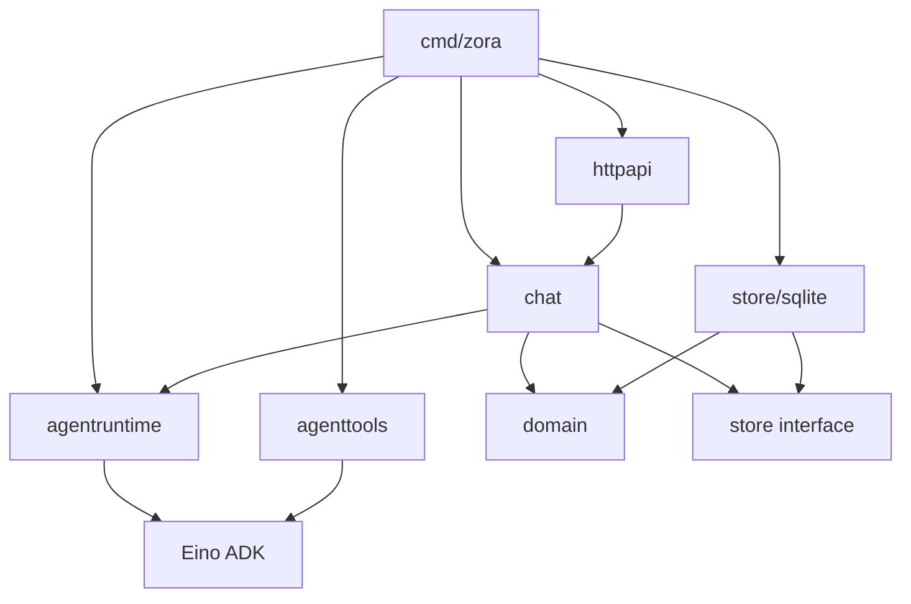
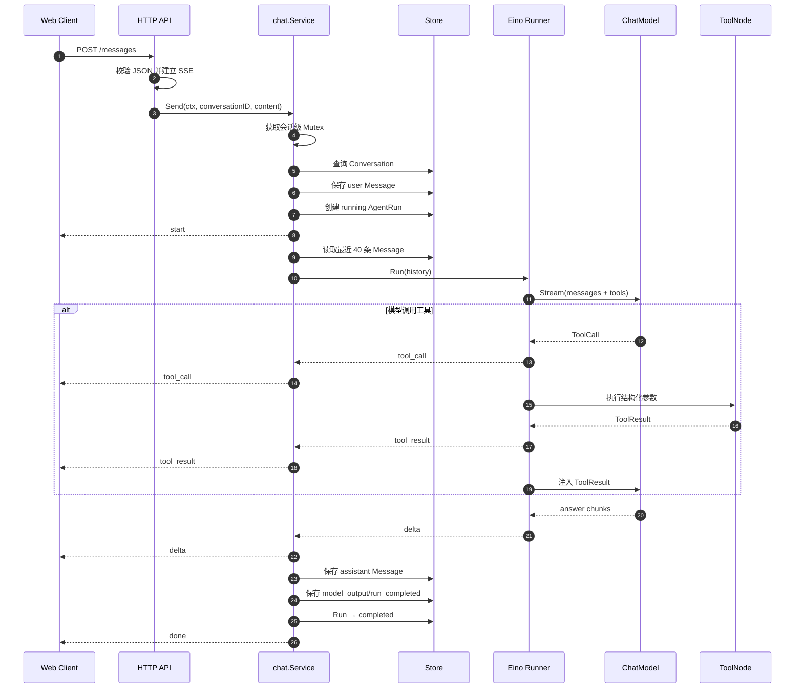
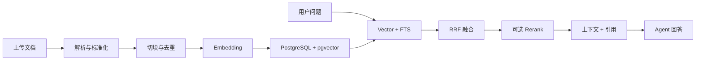

# Zora 项目技术文档

> 适用版本：V0.1 Agent Core  
> 目标读者：项目开发者、维护者和技术评审人员。  
> 说明：“当前实现”描述仓库现状；“目标设计”描述后续版本，不能视为已交付能力。

## 1. 技术栈与版本

| 类别 | 技术 | 版本/说明 |
|---|---|---|
| 语言 | Go | `go.mod` 指定 Go 1.26 |
| Agent Runtime | `github.com/cloudwego/eino` | v0.9.14 |
| 模型适配 | `eino-ext/components/model/openai` | v0.1.13 |
| 数据库 | `modernc.org/sqlite` | v1.56.0，纯 Go 驱动 |
| HTTP | Go `net/http` | Method-aware ServeMux |
| 流式协议 | Server-Sent Events | `text/event-stream` |
| 前端 | 原生 HTML/CSS/JavaScript | 通过 `go:embed` 打包 |
| 日志 | `log/slog` | 结构化文本日志 |
| 容器 | Multi-stage Dockerfile | 最终镜像基于 Alpine |

## 2. 目录与依赖规则

```text
cmd/zora/
└── main.go                    启动、组装、信号和关闭

internal/
├── config/                    环境配置与启动校验
├── domain/                    稳定领域对象
├── id/                        随机业务 ID
├── store/                     持久化接口
│   └── sqlite/                SQLite 实现
├── agenttools/                Eino Tool 及安全执行逻辑
├── agentruntime/              Eino/模型适配与统一事件
├── chat/                      应用用例和 Run 生命周期
└── httpapi/                   REST、SSE、Web UI
```

依赖方向：



约束：

- `domain` 不依赖 Eino、HTTP 或数据库驱动；
- `store.Store` 不暴露 SQL 类型；
- `httpapi` 不直接调用模型和工具；
- `chat` 只依赖 `agentruntime.Runtime` 的统一事件；
- 工具只能从 `agenttools.Build` 的 allowlist 注入。

## 3. 启动流程

`cmd/zora/main.go` 按以下顺序启动：

1. `config.Load` 读取并校验环境变量；
2. 在 `ZORA_DATA_DIR` 中打开 `zora.db`；
3. 执行幂等 DDL，启用 WAL 和 busy timeout；
4. 构造三个只读工具；
5. 根据 Provider 创建 Mock 或 OpenAI-compatible ChatModel；
6. 创建 Eino ChatModelAgent 和 Runner；
7. 创建 Chat Service 与 HTTP Handler；
8. 启动 HTTP Server；
9. 监听 SIGINT/SIGTERM，收到信号后最多等待 10 秒优雅关闭。

任一步失败都会终止启动，不会带着部分依赖进入服务状态。

## 4. 配置设计

| 环境变量 | 默认值 | 是否必填 | 作用 |
|---|---|---|---|
| `ZORA_ADDR` | `:8080` | 否 | HTTP 监听地址 |
| `ZORA_DATA_DIR` | `./data` | 否 | SQLite 数据目录 |
| `ZORA_MODEL_PROVIDER` | `mock` | 否 | `mock` 或 `openai` |
| `ZORA_MODEL` | `qwen-plus` | openai 模式需要 | 模型名称 |
| `ZORA_API_KEY` | 空 | openai 模式必填 | 模型服务密钥 |
| `ZORA_BASE_URL` | 空 | 视 Provider 而定 | OpenAI-compatible 地址 |
| `ZORA_SYSTEM_PROMPT` | 内置中文指令 | 否 | Agent 系统指令 |
| `ZORA_REQUEST_TIMEOUT` | `90s` | 否 | 整次消息请求与模型客户端超时 |
| `ZORA_MAX_ITERATIONS` | `8` | 否 | ReAct 最大迭代，允许范围 1–50 |

配置原则：

- 密钥只通过环境变量传入；
- 启动时校验 Provider 和 API Key 组合；
- BaseURL 会移除末尾 `/`，降低路径拼接差异；
- Mock 模式固定模型名为 `zora-mock`，保证测试结果可解释。

## 5. 核心对话流程



### 5.1 为什么先保存用户消息

用户消息是一次 Run 的输入事实，必须先拥有持久 ID，AgentRun 才能引用它。即使模型执行失败，用户输入和失败 Run 仍然可追踪。

### 5.2 上下文策略

V0.1 读取最近 40 条用户可见消息，并按 sequence 正序转换为 Eino Message。内部 ToolCall/ToolResult 不写入下一轮对话历史，只保留最终回答和 RunEvent。

这是明确的临时上限。V0.3 将改为：近期原始消息 + 会话摘要 + 相关长期记忆。

## 6. Agent Runtime 设计

### 6.1 组装

`agentruntime.New` 创建：

```text
ChatModel
  + Instruction
  + Tool allowlist
  + MaxIterations
  ↓
Eino ChatModelAgent
  ↓
Eino Runner (EnableStreaming=true)
```

Eino 负责 ReAct 循环：模型生成 ToolCall → ToolNode 执行 → ToolResult 回填模型 → 继续生成，直到模型输出最终回答或超过最大迭代。

### 6.2 Provider

#### Mock

- 实现 Eino `BaseChatModel`；
- 识别时间、计算和项目能力等确定性请求；
- 返回标准 ToolCall，而不是直接调用 Go 函数；
- 工具结果仍由 Eino ToolNode 执行和回填；
- 文本按 rune 切块，覆盖流式消费逻辑。

#### OpenAI-compatible

- 使用 Eino OpenAI ChatModel；
- `BaseURL` 可指向 DashScope/通义千问；
- `HTTPClient.Timeout` 取 `ZORA_REQUEST_TIMEOUT`；
- 模型必须支持 Tool Calling，否则工具任务会失败或退化。

### 6.3 事件归一化

| Eino 输出 | Zora Event | 含义 |
|---|---|---|
| Assistant + ToolCalls | `tool_call` | 模型选择了某个工具 |
| Tool Message | `tool_result` | 工具完成或返回错误 |
| Assistant Content Chunk | `delta` | 可直接展示的文本增量 |
| Iterator Error | Go error | 交给 Service 结束 Run |

流式 ToolCall 可能分散在多个 chunk 中。Runtime 一边将文本 delta 发送给上层，一边收集 chunk，并使用 `schema.ConcatMessages` 合并出结构完整的 ToolCall。

## 7. 工具设计

### 7.1 工具注册

所有工具在 `agenttools.Build` 中显式注册。Eino `InferTool` 根据 Go 输入结构生成 JSON Schema，并在执行前反序列化参数。

| Tool | 输入 | 输出 | 安全属性 |
|---|---|---|---|
| `current_time` | IANA timezone | timezone + RFC3339 time | 只读；无外部网络 |
| `calculator` | 四则表达式 | expression + result | 自研解析器；不执行代码 |
| `project_status` | 空对象 | 版本、能力、下一里程碑 | 只读静态信息 |

### 7.2 计算器语法

支持：

- 整数和小数；
- `+`、`-`、`*`、`/`；
- 括号；
- 一元正负号；
- 空白字符。

拒绝：

- 除零；
- 非法字符；
- 函数调用；
- 变量；
- Shell 或代码表达式。

解析器使用递归下降，优先级为：expression → term → factor → number。

## 8. 持久化与一致性

### 8.1 SQLite 配置

- `foreign_keys = ON`：保证关联和级联删除；
- `journal_mode = WAL`：改善本地读写并发；
- `busy_timeout = 5000`：等待短暂写锁；
- `SetMaxOpenConns(1)`：保证连接级 PRAGMA 一致。

### 8.2 消息写入事务

`AddMessage` 在一个事务中：

1. 插入 Message；
2. 获取自增 sequence；
3. 更新 Conversation.updated_at；
4. 提交。

这样会话列表排序不会与实际消息历史脱节。

### 8.3 最近消息查询

SQL 子查询先按 sequence 倒序取最近 N 条，外层再升序输出。结果同时满足“限制上下文长度”和“模型按时间正序读取”。

### 8.4 Store 替换策略

应用层依赖 `store.Store`，后续 PostgreSQL 版本需保持相同 Conversation/Message/Run 语义。迁移时需要额外处理：

- 多实例会话互斥；
- schema migration 工具；
- tenant_id 和 ACL；
- pgvector、全文索引及其事务边界。

## 9. 并发、取消与错误处理

### 9.1 会话级并发

`chat.Service` 使用 `map[conversationID]*sync.Mutex`：

- 同一对话的 Send 串行，保证上下文和回答顺序；
- 不同对话可以并发；
- 该锁仅在单进程有效。

### 9.2 Context 传递

```text
Browser Abort / HTTP Disconnect / Deadline
                  ↓
            request Context
                  ↓
             chat.Send
                  ↓
          agentruntime.Execute
                  ↓
          Eino Runner / Model
```

### 9.3 失败终态

- 普通执行错误：`failed`；
- `context.Canceled` 或 `context.DeadlineExceeded`：`cancelled`；
- 使用 `context.WithoutCancel` 加三秒超时补写终态；
- 详细错误写日志和 Run，SSE 尝试发送用户可读 error 事件。

## 10. HTTP API

统一约定：

- JSON 使用 UTF-8；
- JSON 请求拒绝未知字段和多余对象；
- 请求体最大 1 MiB；
- 消息正文最大 20,000 个 Unicode 字符；
- 时间输出为 UTC RFC3339/RFC3339Nano；
- 资源不存在返回 404；输入错误返回 400。

### 10.1 健康检查

```http
GET /api/health
```

```json
{
  "status": "ok",
  "time": "2026-08-14T06:00:00Z"
}
```

### 10.2 运行信息

```http
GET /api/info
```

返回版本、Provider、Model 和已启用能力。

### 10.3 创建对话

```http
POST /api/conversations
Content-Type: application/json

{"title":"可选标题"}
```

成功返回 201 和 Conversation。标题为空时使用“新对话”。

### 10.4 查询对话

```http
GET /api/conversations
```

返回更新时间倒序的最近 100 个 Conversation。

### 10.5 重命名对话

```http
PATCH /api/conversations/{conversationID}
Content-Type: application/json

{"title":"新的标题"}
```

标题长度为 1–80 个 Unicode 字符。成功返回 204。

### 10.6 删除对话

```http
DELETE /api/conversations/{conversationID}
```

成功返回 204；Message、AgentRun 和 RunEvent 通过外键级联删除。

### 10.7 查询消息

```http
GET /api/conversations/{conversationID}/messages
```

返回最多 200 条按 sequence 正序排列的消息。

### 10.8 发送消息

```http
POST /api/conversations/{conversationID}/messages
Accept: text/event-stream
Content-Type: application/json

{"content":"帮我计算 (128 + 72) * 3.5"}
```

SSE 示例：

```text
event: start
data: {"type":"start","run_id":"run_xxx","message":{"role":"user"}}

event: tool_call
data: {"type":"tool_call","run_id":"run_xxx","tool_name":"calculator","arguments":"{...}"}

event: tool_result
data: {"type":"tool_result","run_id":"run_xxx","tool_name":"calculator","content":"{...}"}

event: delta
data: {"type":"delta","run_id":"run_xxx","content":"计算结果"}

event: done
data: {"type":"done","run_id":"run_xxx","message":{"role":"assistant","content":"..."}}
```

### 10.9 查询执行事件

```http
GET /api/runs/{runID}/events
```

返回按 sequence 正序排列的持久事件。SSE delta 不在此接口中逐条返回。

## 11. SSE 事件契约

| 事件 | 关键字段 | 是否持久化 | 说明 |
|---|---|---|---|
| `start` | `run_id`, `message` | 以 run_started 表示 | 用户消息已保存、Run 已创建 |
| `tool_call` | `tool_name`, `tool_call_id`, `arguments` | 是 | 模型请求调用工具 |
| `tool_result` | `tool_name`, `tool_call_id`, `content` | 是 | 工具返回结果 |
| `delta` | `content` | 否 | 文本增量，只用于实时展示 |
| `done` | `message` | 以 model_output/run_completed 表示 | 回答和 Run 已落库 |
| `error` | `content` | 以 failed/cancelled 表示 | 执行失败或取消 |

客户端不能只依赖连接关闭判断成功，必须以 `done` 为成功终点，以 `error` 为失败终点。

## 12. Web UI 设计

- 对话列表、自动标题、重命名和删除；
- 欢迎页提供三个可触发工具的示例；
- 使用 `fetch + ReadableStream` 解析 POST SSE；
- 生成时发送按钮切换为停止按钮，通过 AbortController 取消请求；
- 工具调用以可折叠 Trace 展示；
- 模型文本先进行 HTML 转义，再做有限 Markdown 渲染；
- 响应式侧边栏适配移动端；
- 静态资源由 Go 二进制内嵌，未知前端路由回退到 `index.html`。

## 13. 安全设计

### 当前实现

- API Key 不落库、不返回前端；
- Tool allowlist；
- 无 Shell、代码执行和外部写操作；
- 计算器不使用 eval；
- JSON 严格解码和大小限制；
- 模型输出 HTML 转义；
- CSP、`nosniff`、Referrer Policy；
- 最大 Agent 迭代和请求超时；
- 删除 Conversation 时明确由用户确认。

### 上线前必须补充

- 身份认证、Tenant 隔离和资源 ACL；
- CSRF/Origin 策略；
- 请求限流和配额；
- 密钥托管与轮换；
- 敏感信息脱敏；
- 工具权限和审批策略；
- 数据保留、导出和删除策略。

## 14. 可观察性

当前有两条观察通道：

1. `slog`：请求耗时、启动信息、错误和 panic stack；
2. RunEvent：业务级执行轨迹。

目标设计：

- OpenTelemetry trace/span；
- run_id 作为日志和 trace 关联键；
- 模型 token usage、首 token 延迟、总耗时；
- 工具成功率与耗时；
- RAG 召回指标；
- Langfuse 等 Agent Trace 平台作为可选输出，而不是业务数据源。

## 15. 测试策略

| 层级 | 当前覆盖 |
|---|---|
| 单元测试 | 计算器优先级、括号、一元运算、非法输入和除零 |
| Runtime 测试 | Mock 经 Eino 完成 tool_call/tool_result/delta |
| Store 测试 | Conversation、Message、计数和级联删除 |
| HTTP 集成测试 | 创建对话、POST SSE、工具链和 JSON 帧 |
| 静态页面测试 | 根路径、前端路由回退、CSS 资源 |
| 工程检查 | `go test`、`go vet`、race、无 CGO build |

常用命令：

```bash
make test
make vet
make check
go test -race ./internal/...
CGO_ENABLED=0 go build ./cmd/zora
```

## 16. 部署设计

### 本地

```bash
make run
```

### Docker

Dockerfile 使用 Go 构建阶段产出静态二进制，最终镜像只包含 Alpine、CA 证书、时区数据和 Zora。容器以非 root 用户运行，`/app/data` 为持久卷。

生产部署注意：

- 挂载持久化数据卷；
- 通过 Secret 注入 API Key；
- 反向代理必须关闭 SSE 缓冲；
- 健康检查使用 `/api/health`；
- 多副本部署前必须迁移 PostgreSQL 和分布式会话锁。

## 17. 后续目标设计

### 17.1 V0.2 RAG



必须包含文档版本、内容哈希、chunk 来源范围、tenant/ACL 和离线评估集。

### 17.2 V0.3 Memory

```text
短期记忆：近期消息 + 对话摘要
语义记忆：用户事实与偏好
情景记忆：过去任务及结果
程序性记忆：Skill、规则和工具经验
```

一次对话结束后执行候选提取、置信度判断、去重/合并和过期设置。召回按相关性、时效性和重要性联合排序，用户必须能查看、修改和删除。

### 17.3 V0.4 Multi-Agent

Supervisor 通过 Agent-as-Tool 调用 Research、Document、Writer Agent。每个子 Agent 使用独立上下文和结构化交付物，并记录 parent_run_id、预算、超时、重试和审批事件。

### 17.4 V0.5 Office Agent

使用官方 MCP Go SDK 接入文件、邮件和日历。默认只读；写操作先生成草稿，必须经过用户确认后执行，并记录请求、审批人、参数摘要和最终结果。

## 18. 维护约定

每次新增能力时同步更新：

1. README 的能力矩阵和配置；
2. 本文的流程、接口与事件契约；
3. 项目分析文档中的业务模型和风险；
4. Roadmap 的完成状态和验收结果；
5. 对应测试，确保文档描述可被代码验证。

